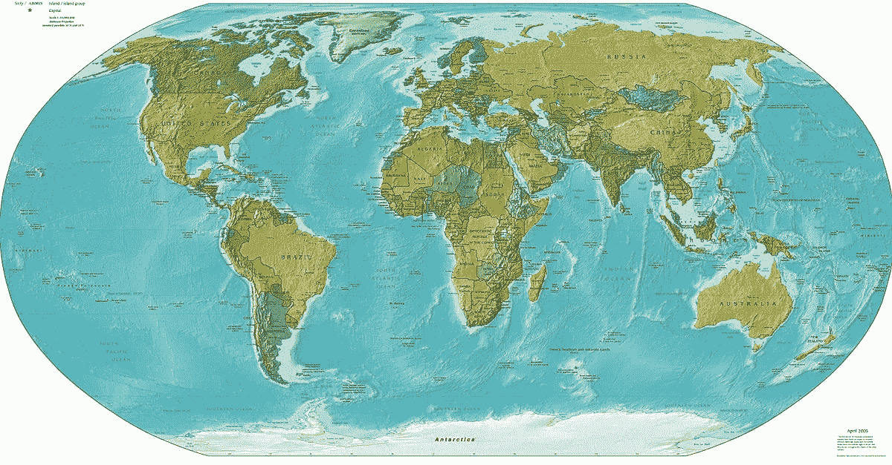
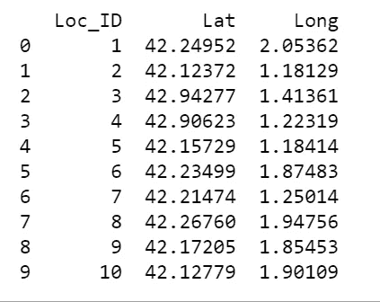
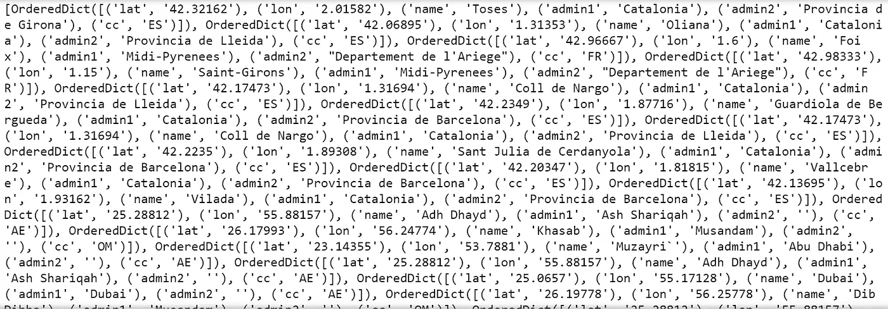
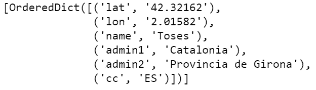
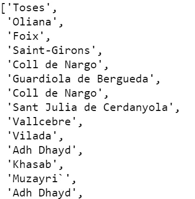
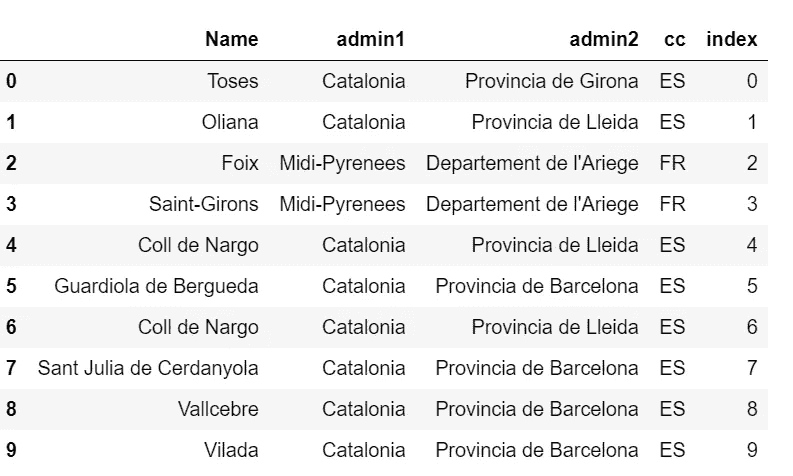
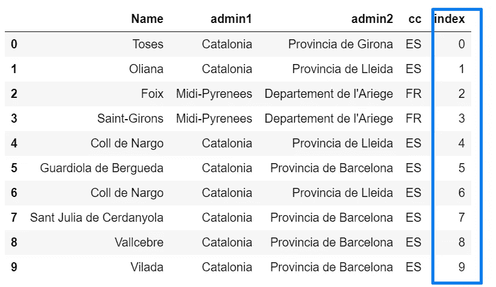
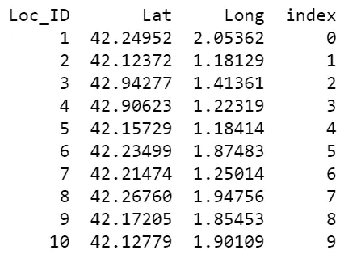
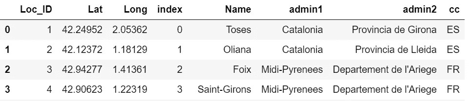
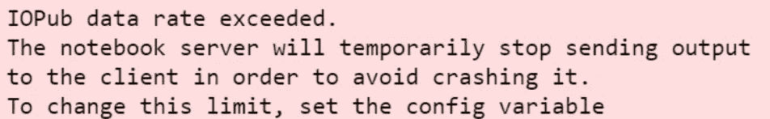

# 使用 K 维树的反向地理编码

> 原文：<https://levelup.gitconnected.com/reverse-geo-coding-using-k-dimensional-trees-adc542c524b4>



## 你需要什么

对于这个项目，我们将使用`reverse_geocoder` [库](https://github.com/thampiman/reverse-geocoder)(由 Ajay Thampi 开发)，它是由(Richard Penman)开发的`reverse_geocode` [库](https://bitbucket.org/richardpenman/reverse_geocode/src/default/)的改进。

## 它是如何工作的

这两种方法都使用 K 维树来查找最近的邻居。`reverse_geocode` [库](https://bitbucket.org/richardpenman/reverse_geocode/src/default/)仅使用单线程搜索，而`reverse_geocoder`使用多线程 K 维树。

为什么两者都用 K-D 树？k 是树的维数。k 维树有助于划分空间，就像二分搜索法树有助于划分直线一样。K-D 树递归地划分空间区域，在树的每一层创建二进制空间划分。K-D 树在涉及多维搜索关键字的搜索中是有用的(例如，范围搜索和最近邻搜索等)。)

## 装置

`pip install reverse_geocoder`

## 导入先决条件

```
import pandas as pd
import io
import reverse_geocoder as rg
```

这里的自定义数据源是。

查看默认值，您可能想要使用您的自定义文件。根据我与不同组织合作的经验，大多数公司将形成自己的“区域”,这与行政区(即县、省、选区等)有很大不同。好的一面是，您可以将自定义数据源添加为 CSV 格式，并且具有以下标题:

*   纬度
*   经度
*   名称(地点的名称)—地点的名称。
*   admin1 (Admin 1 区域)—您可以随意使用，例如国家、县、省
*   管理 2(管理 2 区域)—例如，选区或更大的区域，如东非、沙无然非洲等。
*   cc(ISO 3166-1 alpha-2 国家代码，例如，对于肯尼亚，它是 KE)。

```
#Load File with Geocodes and regions
geo = rg.RGeocoder(mode=2, verbose=True, stream=io.StringIO(open(‘rg_cities1000.csv’, encoding=’utf-8').read()))
```

接下来，我们加载包含 GPS 坐标的文件，并希望获得它们的区域。

```
data = pd.read_csv(‘my_data.csv’)
```

快速浏览一下数据:

```
# Preview Data
print(data.head(10))
```



预览数据

让我们把我们需要的放入一个新的变量中，并传递给`geo.query()`函数。您可以跳过这一部分，只在传递数据帧时对其进行切片。

```
coordinates = data[[‘Lat’,’Long’]]
results = geo.query(coordinates)
```

或者

```
results = geo.query(data[['Lat','Long']])
```

这是结果的样子。这是非常不可读的，对不对？



反向 _ 地理编码器结果

让我们看看字典列表中的第一行，了解数据是如何排列的。

```
Row1 = (results[0:1])
Row1[0:1]Row1
```

它看起来是这样的:



我们需要提取我们需要的变量。即名称、管理员 1 等。

让我们得到它！

```
Name = [d[‘name’] for d in results]
Name
```

这将打印出一个大列表，如下所示



我们如何把这个和其他的放入一个数据框架？这很简单，我们只需要提取值，并把它们放入如下所示的数据框中

```
regions = pd.DataFrame(columns=[‘Name’], data=Name)
regions[‘admin1’] = pd.DataFrame(columns=[‘admin1’], data=admin1)
regions[‘admin2’] = pd.DataFrame(columns=[‘admin2’], data=admin2)
regions[‘cc’] = pd.DataFrame(columns=[‘cc’], data=cc)
regions[‘index’] = regions.indexregions.head(10)
```

这是它看起来的样子。很整洁，是吧？



就是这样！

# 奖励:将结果加入我们的数据

让我们为我们的结果添加一个索引:

```
# Add index column to our results
region['index'] = region.index
region.head(10)
```



让我们也为我们的数据添加一个索引列(有纬度和经度的那个)。

```
data['index'] = data.index
print(data.head(10))
```



我们将使用索引列来合并两个数据框。

```
region_and_data = data.merge(region, left_on='index', right_on='index')
region_and_data.head(5)
```



合并数据

# 奖励:导出到 CSV

```
# Export data to CSV
region_and_data.to_csv ('region_and_data.csv', index=None, header = True)
```

# 奖励:超过 IOPub 数据速率。

如果您正在使用 Jupyter Notebook，并且在打印结果时出现以下错误:



Jupyter 笔记本— IOPub 数据速率超出错误。

在命令行上运行这个命令，重启 Jupyter 并运行您的代码:

```
jupyter notebook — NotebookApp.iopub_data_rate_limit=1.0e10
```

然后使用将显示的 URL 类似于。

```
h[ttp://localhost:8889/?token=1930859f498ad9f1e6b1cf7214916316571df0813eb22e](http://localhost:8889/?token=1930859f498ad9f1e6b1cf72e714916316571df0813eb22e)
```

这一切都在我的 [GitHub repo](https://github.com/JosephMagiya/Reverse-Geo-coding-using-K-Dimensional-Trees) 上。看看这个。