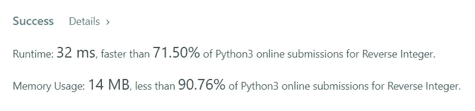

# 解决方案:反向整数(Python)

> 原文：<https://levelup.gitconnected.com/reverse-integer-python-5d4fb52ab3cd>


给定一个带符号的 32 位整数`x`，返回`x` *，其位数反转*。如果反转`x`导致值超出带符号的 32 位整数范围`[-231, 231 - 1]`，则返回`0`。

*假设我们处理的环境只能存储 32 位有符号整数范围内的整数:【231，231 1】。为了解决这个问题，假设当反向整数溢出时，函数返回 0。*

来看看:[https://leetcode.com/problems/reverse-integer/](https://leetcode.com/problems/reverse-integer/)

**例 1:**

```
Input: x = 123
Output: 321
```

**例 2:**

```
Input: x = -123
Output: -321
```

**例 3:**

```
Input: x = 120
Output: 21
```

**例 4:**

```
Input: x = 0
Output: 0
```

**约束:**

```
-2^31 <= x <= 2^31 - 1
```

**解决方案:**

```
class Solution:
def isValid(self, s: str) -> bool:
reversedNumber=0
if x>0: 
   while x>0: 
     reversedNumber = reversedNumber * 10 + x % 10 
     x //= 10 
     if reversedNumber >= 2 ** 31 - 1 or reversedNumber <= -2 ** 31:     
        return 0 
     else: return reversedNumber 
elif x==0: 
   return 0 
elif x<0: x = abs(x) 
   while x>0: 
     reversedNumber = reversedNumber * 10 + x % 10 
     x //= 10 
     if reversedNumber >= 2 ** 31 - 1 or reversedNumber <= -2 ** 31:      
        return 0 
     else: 
        return **-**reversedNumber
```



## **解释**

方法很简单:

1.  首先，我们检查数字是正数、负数还是零。
2.  如果是零，我们返回零。
3.  如果它大于零，我们运行一个循环，在这个循环中，我们将这个数反复除以 10，直到它变为零，这时循环中断并返回相反的数。
4.  如果它小于零，我们使用 absolute 函数将其转换为正数，并再次运行一个循环，在该循环中，我们将该数重复除以 10，直到它变为零，当循环中断时，在返回时，请确保添加负号，以便反转后的数为负。
5.  在循环检查之后，还要确保检查输出是否大于约束中指定的范围(-2^31 <= x <= 2^31–1), and if it is, return 0.

[GitHub](https://github.com/ritchiepulikottil)

[领英](https://www.linkedin.com/in/ritchie-pulikottil-6876341aa)

[推特](https://twitter.com/itsritchie1005)

[Instagram](https://instagram.com/ritchiepulikottil)