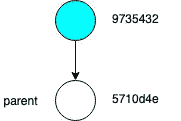
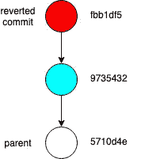
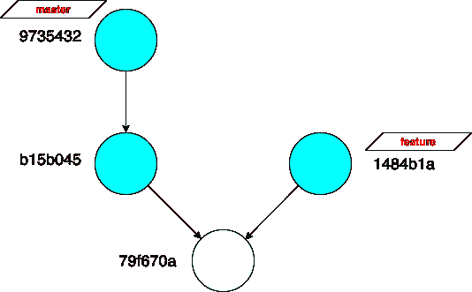
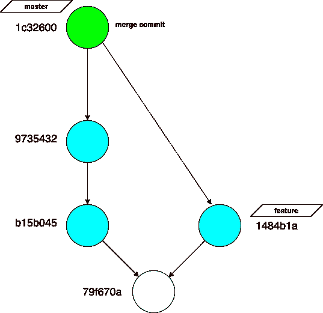
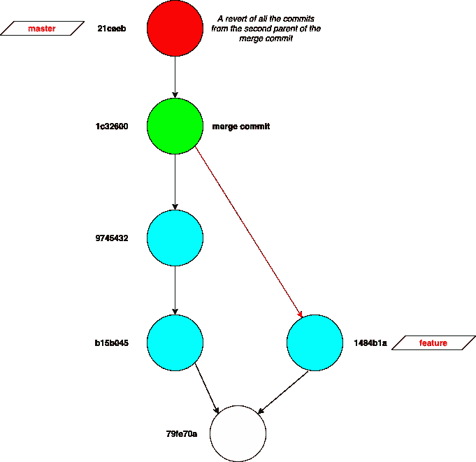
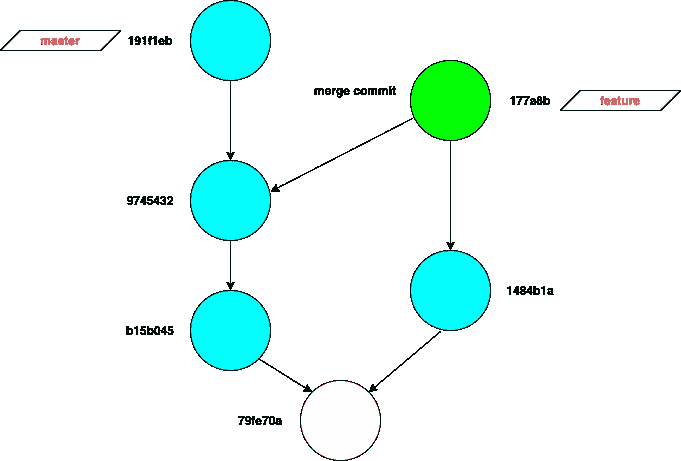
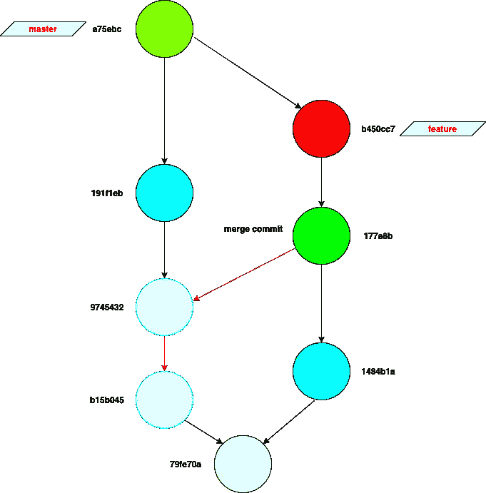

# 恢复合并提交

> 原文：<https://levelup.gitconnected.com/reverting-a-merge-commit-7de2e9114c7d>

## 使用 revert 返回到 Git 中较旧的提交

# 恢复提交

首先，让我们看看 revert 命令的作用:

> git 回复<commit-sha></commit-sha>

git 中的 revert 命令接收一个提交 id，并将更改与父项进行比较。计算 delta 或 *diff* ,并将其取反作为新的提交。如果未指定 commit-sha，则默认为头提交的 commit-sha。

还原前

> $ git 还原 9735432

该命令在**头**上创建一个提交 **fbb1df5** ，否定 **9735432** 所做的更改。新的**头**将指向 **fbb1df5** 。结果树将表现得好像提交 **9735432** 不存在一样。

还原后

# 合并提交

到目前为止，我们一直在恢复只有一个父级的常规提交。

然而，与其他提交不同，合并提交是一个具有多个(通常是两个)父提交的提交。

例如，当名为 *feature* 的分支与 *master* 合并时，在分支 *master* 上创建一个新的提交，该分支有两个父级，即 *master* 的前一个头和 *feature 的头。*

合并前的分支

将特征合并到母版上。

> $ git 结账大师
> 
> $ git 合并功能

这些命令创建一个新的合并提交。

合并后的分支

合并提交 **1c32600** 有两个父提交

1.  **9735432** 从*主*合并前
2.  **1484b1a** 来自分支*特征*

在运行 git show 时，新的提交显示两个父对象

> $ git 显示
> 
> commit 1c 32600 da 72208 f 8964 da 85 fddb 80 e 7 DD 43 b 15 c 9(HEAD-> master)
> Merge:9735432 1484 B1 a

# 恢复合并提交

在恢复合并提交时，应该指定需要与之进行比较的父代。可以用 git revert 中的 **-m** 标志，后跟*父编号*来指定父。

父编号从左开始分配。要恢复由*功能*分支带来的更改，请恢复关于第二个父级的提交( **1484b1a** )。

> $ git 恢复头-m 1

这将恢复第二个分支(*特征)*在*主控上所做的所有更改。*生成的树将表现为分支*特征*从未合并到*主特征。*

git revert -m 2

类似地，从合并提交运行的第一个父级中的提交中恢复更改

> $ git 恢复头-m 1

这将恢复在*特征*分支被创建后在主服务器上进行的所有提交，只留下在*主服务器*的*特征*分支中的提交。

git 恢复头-m 1

在上面的示例中， **9745432** 和 **b15b045** 将从*主*分支中移除，只留下提交 **1484b1a** 和 **79fe70a** 以及*功能中的旧提交。*

另外，**主**分支可能会合并到**特征**分支。

> $ git 结帐功能
> $ git 合并主控

将主分支合并到特征分支

**主**分支中的 **9745432** 和 **b15b045** 中的提交更改将包含在**特征**分支中。这一次对于合并提交，第一个父级是原始分支，它是提交 **1484b1a** 本身，而主分支**中的提交是第二个父级。**

# 警告

如果**主**合并到**特征**分支是无意的。撤销的正确方法是重置分支。这可以通过在**特征**分支中运行以下程序来完成。

> $ git 重置头~1

另一方面，恢复合并提交会否定指定父级的分支所做的所有更改。

例如，如果在恢复了**特征**分支中的**合并提交(177a8b)** 之后，它被合并回**主** *，*它将清除在**主**分支中做出的更改( **9745432 和 b15b045** )。

还原后合并会清除更改

现在，指向提交 **a75ebc** 的主分支将不会在提交 **9745432 和 b15b045** 中进行更改。

感谢阅读。希望这对你有帮助。如果你有任何问题或者你觉得有更多的东西需要补充，请留下你的评论。

 [## Git 内部

### 藏在引擎盖下

levelup.gitconnected.com](/git-internals-c219521d9f6) 

也一定要看看这个博客👆🏽更深入地解释 git 对象是如何构造的。