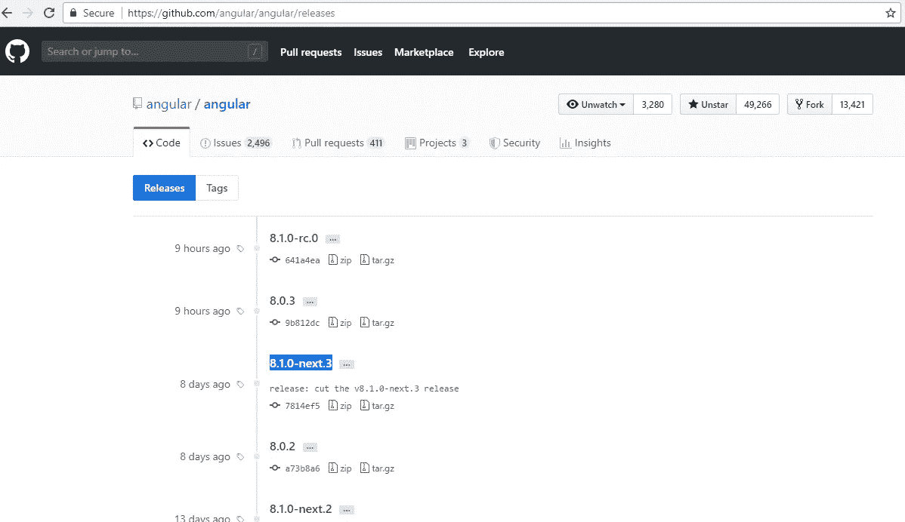
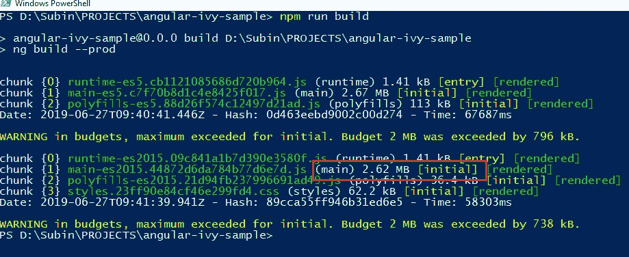
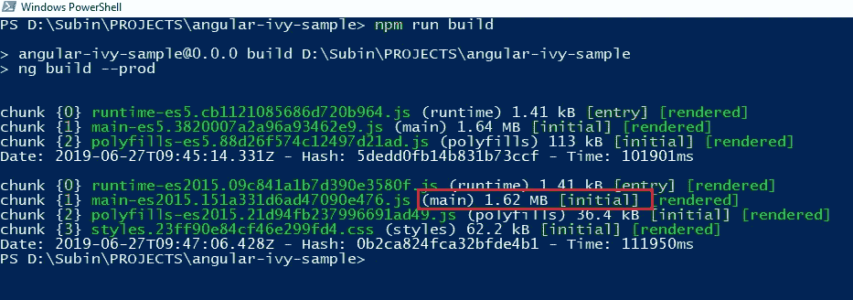

# 角藤综述

> 原文：<https://levelup.gitconnected.com/review-angular-ivy-49e280cfdaca>

## 回顾 Angular 8 上的 Ivy 功能—如何设置、性能改进和其他优势

由[格雷格·拉科齐](https://unsplash.com/@grakozy)在 [Unsplash](https://unsplash.com/photos/B3l0g6HLxr8) 上拍摄的照片

Angular 8 发布了许多优秀的特性，比如差异加载、新的构建器 API、对网络工作者的更好支持、Ivy 等等。

这篇文章是关于回顾 Angular 8 的 [**Ivy** 特性](https://angular.io/guide/ivy)，以便了解它是如何工作的，以及它能给我们作为 Angular 开发者带来什么好处。棱角分明的主页并没有详细介绍常春藤，所以我的希望是填充这些知识。

*更多类似的内容，请查看*[https://betterfullstack.com](https://betterfullstack.com/stories/)

# 那么什么是有棱角的常春藤呢？

Ivy 是 Angular 的[下一代编译和渲染管道](https://blog.angular.io/a-plan-for-version-8-0-and-ivy-b3318dfc19f7)的代号。从 Angular 版本 8 开始，您可以选择加入，开始使用 Ivy 的预览版，并帮助其继续开发和调整。

> 要预览 Ivy，请使用 Angular 的`*@angular/core@next*`版本(8.1.x)，而不是`*@angular/core@latest*` (8.0.x)，因为它包含了所有最新的错误修复和改进。

这意味着 Ivy 在下一个版本[上是活动的，这对应于最近的发布。](https://github.com/angular/angular/releases/tag/8.1.0-next.3)

[角度释放](https://github.com/angular/angular/releases)页

点击查看更多信息和设置指南[。](https://angular.io/guide/ivy)

# 减少包的大小

Ivy 的一个优点是有助于减少包的大小。

在这个例子中，我将建立一个包含大约 1.5 MB 代码的示例项目，并在启用 Ivy 模式之前和之后查看这个包。

这是我启用 Ivy 模式之前的包大小。

npm 运行没有 Ivy 的构建

您可以看到，当我在没有 Ivy 模式的情况下构建主包时，它的重量是 2.62MB。

这是常春藤模式

npm 使用 Ivy 运行构建

主包现在只有 1.62 MB。它缩小了近 1 MB，大约是包大小的 38%。这是什么意思？这意味着你的网站加载时间将比没有 Ivy 模式时快 38%。

38%的提高是一个了不起的成绩。仅仅因为这个原因，我认为将我的项目迁移到 Ivy 模式是值得的。此外，我认为 Angular 团队将在不久的将来对 Ivy 模式进行更改，并推出一种新的方法来引导应用程序以提高性能，正如 Stephen Fluin 所说:

> 我们仍在努力改进包的大小和运行时性能。当您今天更新时，您还不会看到所有这些好处。
> 
> 我们现在正致力于减小框架的大小，因此在将 Ivy 作为默认应用之前，我们已经在几乎所有情况下减小了实际应用的包大小。额外的好处也将是可能的，因为我们提供了新的引导方式，将从您的主包中省去更多的 Angular。

# 其他好处

我从这篇[给常春藤写的伟大文章](https://blog.angular.io/its-time-for-the-compatibility-opt-in-preview-of-ivy-38f3542a282f)中读到了其他益处。

1.  **更好的重编译性能**:增量编译，AOT 模式下的重编译速度快 40%。
2.  **更好的测试性能**:在 Angular 中，我们已经看到[框架](https://github.com/angular/angular)单元测试快了 1.5 倍，[材料](https://github.com/angular/components)单元测试快了 2.7 倍，材料单元测试中的内存使用率下降了 81%。
3.  **更多可调试的指令**:在 HTML 中添加断点，单步执行模板的渲染，更轻松地调试更改检测，因为您可以在堆栈跟踪中单步执行模板函数，并查看您的位置。

# 摘要

Ivy 的主要好处之一是减少了应用程序的包大小。此外，还有其他好处，如更好的重新编译性能、更好的测试性能和更多可调试的指令。

**您可以在** **这里查看来源样本** [**。**](https://github.com/hoangtranson/angular-ivy-sample.git)

 [## 学习角度-最佳角度教程(2019) | gitconnected

### 50 大角度教程-免费学习角度。课程由开发人员提交和投票，使您能够…

gitconnected.com](https://gitconnected.com/learn/angular)  [## 故事-更好的全栈

### 所有的故事故事为我们写指南提交故事到更好的编程博客 1。故事指南避免什么…

betterfullstack.com](https://betterfullstack.com/stories/)