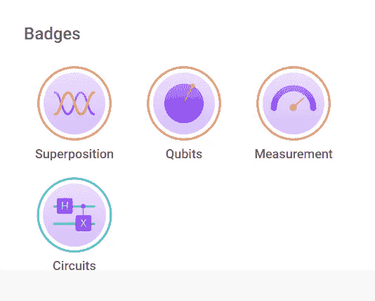
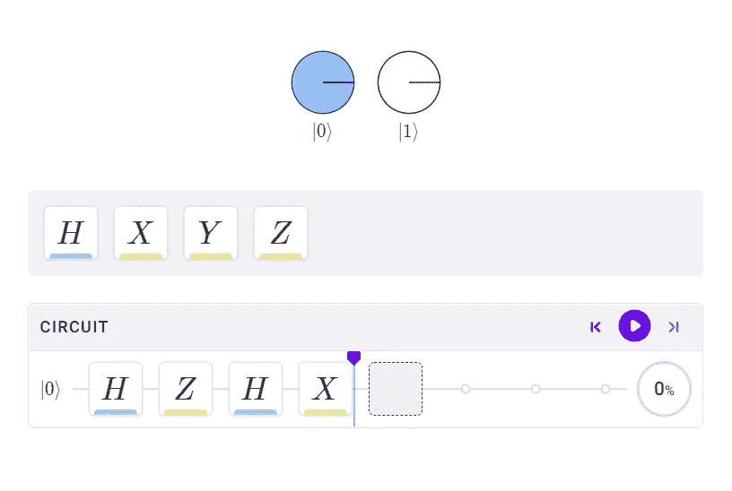
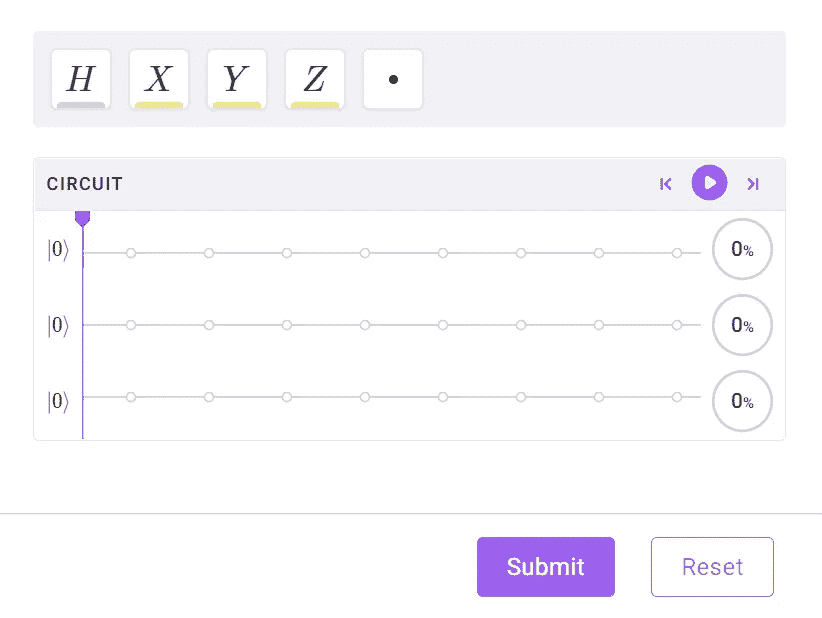
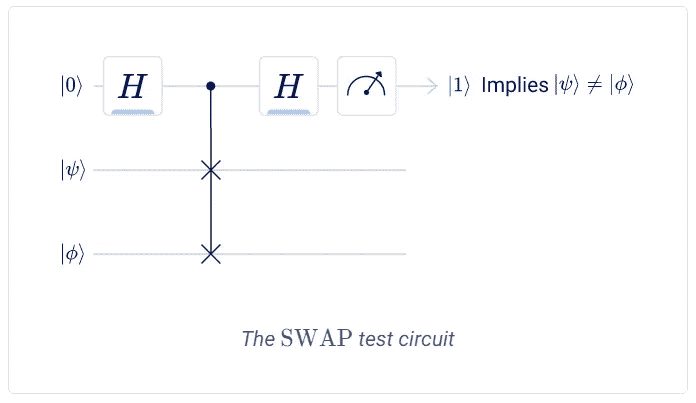

# 审查:黑色蛋白石电路的 Q-Ctrl

> 原文：<https://levelup.gitconnected.com/review-black-opal-circuits-by-q-ctrl-beaf01a7b5ce>

[https://black.q-ctrl.com/skills](https://black.q-ctrl.com/skills)

# 标准提高了。

[Q-Ctrl 的黑猫眼石教程](https://black.q-ctrl.com/skills)已经更新，包括一个中级“电路”模块，这是令人兴奋的三个原因。首先，正如我在我的文章《[回顾:Q-Ctrl 的黑蛋白石教程](/review-q-ctrls-black-opal-tutorials-3e888ac76f84)》中所写的，随着它的最初发布，Q-Ctrl 已经达到了这个水平，甚至更高了一点。第二，知道我不用查就能回答中级水平的测验问题让我很放心。第三，我对推特上的大声喊出来深感荣幸:

所以，不要浪费更多的数字墨水，让我们开始吧…

布洛赫球

## 动画 Bloch 球体

布洛赫球不仅仅显示你旋转的结果。其他人都这么做。不，它一步一步地通过你的电路，一个门一个门地，并激活转换。上图从|0 >开始，浅蓝色的线是量子态在每个操作被应用时的路径。

值得注意的是，这显示了哈达玛门绕 x 和 z 轴的迂回路径。许多教程只是将 Hadamard 变换显示为| ^ 0 >到|+>和|1 >到|->，然后您必须在以后忘掉它。黑欧泊给你真相。你能面对事实。

圆形符号

## 动画圆圈符号

其实我之前没见过圈注法，但是很容易上手。圆圈的填充是振幅，刻度盘是相位。重要的是，这些圆和前面提到的 Bloch 球体一样是动态的。这对你来说还不够酷吗？没问题。您可以在转场中前进和后退。之前的门是做什么的？哦，是的，现在我想起来了…

个性

## 个性

值得注意的是，黑欧泊很有个性。有多少书和教程用同样枯燥的数学方式解释一切。我不知道你，但我从来没有读过以线性代数矩阵为笑点的笑话。就我个人而言，我总是说量子计算非常有趣，不会无聊。这就是为什么[我的书](https://cb.run/mIVg)封面上有一条龙，并被称为龙的地下城&冒险。因此，黑蛋白石采取了一种令人耳目一新的方法。有了黑欧泊，学习量子计算就像应该的那样愉快。

多量子位电路

## 电路

顾名思义，这个模块引入了多量子位电路。这本身没什么大不了的，但如果你通过前三个模块想知道你只用一个量子位能做多少，现在你可以看到黑蛋白石用四个量子位能做什么。

互动中级模块熟练程度挑战

## 互动中级模块熟练程度挑战

我记住了我刚刚读到的关于量子电路的所有内容了吗？

是的。是的，我做到了。你会吗？

规范互换测试

## 交换测试！！！

交换测试，又名核方法，又名内积，又名距离度量，是我最喜欢的量子算法。用于[比较量子态](/review-q-ctrls-black-opal-tutorials-3e888ac76f84)，对[分类](https://medium.com/swlh/quantum-classification-cecbc7831be)、[聚类](/quantum-clustering-c498b089b88e)等量子机器学习(QML)任务有用。我从没在任何地方的任何教程里看到过。我也没有在任何书籍、博客文章或 YouTube 视频中看到过。我是从看科学论文中了解到的，然后我就用它做了大量的实验。我写的比我读到的还多。因此，它在黑蛋白石中的存在使它成为量子计算教程中卫冕、捍卫、无可争议的重量级冠军。任何相反的论点都是无效的。

## 安西拉量子比特！

我从没见过安西拉量子位在教程里解释过。最终，你只是开始遇到安西拉量子比特，并弄清楚他们在做什么。因此，在入门教程中介绍它们当然是有意义的。不幸的是，我不能在这里包括一个截图，而不透露 Q-Ctrl 正在出售什么。

## 不计算！

我也没见过教程里解释的非计算，但那可能是因为我没见过教程里解释的安西拉量子位。你可能会想，为什么电路的一部分是它自身的镜像，随着时间的推移，你会发现这一点。所以，再一次，它是一个有价值的入门教程。

## 相位反冲！

我也没见过教程里解释的相位反冲。是的，我看到有人提到过它，但它总是被一脚踢开，原谅我的双关语，永远不会再被提起。这个模块实际上比我所见过的更深入地研究相位，相位反冲只是其中的一部分。

## 练习格罗弗算法

每套教程都包括格罗弗算法的标准解释。而且，虽然黑蛋白石的解释是相对标准的，但交互性肯定不是。如果添加第二个 oracle 和 diffusion 运算符，会发生什么情况？好吧，你必须这样做才能继续下去。而且，这个电路工作不正常，你得排除故障？当然啦！什么样的“计算”不涉及故障排除？这是一项必要的技能，否则你不会走得很远。

## 结论

因为包括交换测试，我现在把黑蛋白石列为最好的量子计算教程中的最好的。早期的 IBMQ 教程，也就是那些演变成 Qiskit 教科书的教程，现在排在第二位。并且，我将把 Q 社区教程排在第三位，因为它们是由高中生创作的。

黑蛋白石，在所有的严重性，是如此良好的解释和互动，它真的很难被击败。而且，Q-Ctrl 甚至还没有完成…