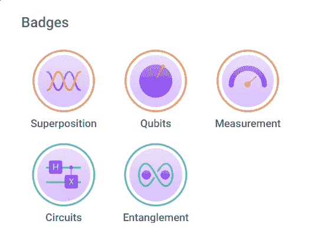
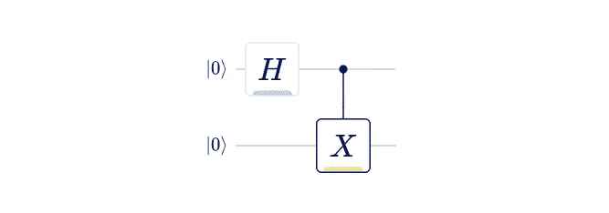

# 回顾:Q-Ctrl 的黑蛋白石“纠缠”

> 原文：<https://levelup.gitconnected.com/review-black-opal-entanglement-by-q-ctrl-fb913447535c>

[https://black.q-ctrl.com/skills](https://black.q-ctrl.com/skills)

# 帝国反击战

如果说《星球大战第五集》包含了一点启示，那将是电影史上最保守的说法。剧透警报。不过，按照这种情节结构，《黑蛋白石第五集》包含了一点自己的启示。

如果你想赶上，我以前的黑蛋白石评论，按顺序，是:

1.  [点评:Q-Ctrl 的黑猫眼石教程](/review-q-ctrls-black-opal-tutorials-3e888ac76f84)(前传三部曲)
2.  [点评:Q-Ctrl 的黑欧泊电路](/review-black-opal-circuits-by-q-ctrl-beaf01a7b5ce)(新希望)

## 展览会

像《星球大战前传》一样，这个模块包含了很多阐述。虽然这意味着与之前的评论相比，截图更少了，但为了更好地理解整个故事，这种阐述是必要的。

在本模块中，您将获得对 ket 符号的详细解释。你不仅会读到相关性，这在某种程度上是标准的课程，还会读到反相关性，这我以前在教程中没见过。还将向您介绍 GHZ 州和 W 州，这两个州往往会被忽略。

最重要的是，本模块不仅仅是定义响铃状态，这在某种程度上是标准课程，它要求您创建四个响铃状态中的每一个。因为这是一个关于纠缠的模块，你将学习如何区分纠缠态和非纠缠态。

你好，量子世界！

## 你好，量子世界！

我的第一个教程是早期的 IBMQ“你好，量子世界”教程。有一个简短的叠加解释和一个简短的纠缠解释，然后嘭！！！在量子处理器上运行。非常刺激，从那以后我就迷上了。

但是，这是我之前提到的启示:这是模块 5。

我在一次实验中真正学到了多少关于叠加和纠缠的知识？从那以后，我通过无数的书籍、论文和文章又学到了多少呢？

相比之下，Q-Ctrl 在一套教程中汇集了多少信息，需要五个模块才能到达“你好，量子世界”实验？如果你是量子计算的新手，你会比我学到多少？我不得不花相当长的时间在几十个地方找到这些信息，然后 Q-Ctrl 突然说，“给你；都在这里了。”

## 什么是量子位？

当我开始我的量子计算冒险时，我以为我在玩单个电子。我错了。而且，虽然如果你只是设计算法，知道细节并不重要，但你只需要知道你可以用它们做什么，细节肯定是有趣的。这个模块深入到量子位架构，具体来说:离子阱，中性原子，光子，氮空位(NV)中心，量子点，然后是超导量子位。

## 结论

请继续关注我对《第六集:绝地归来》的评论。它是关于噪音的，就像 NISQ 中的“N ”:嘈杂的中间尺度量子。

值得注意的是，我的第一篇教程也提到了在 NISQ 处理器上运行时，我会在结果中看到的噪声。这意味着我的第一个教程已经扩展到至少六个黑欧泊模块，而不是五个。如果你真的想学习量子计算，你是真的想像我一样，一点一点地到处追逐它，还是宁愿只遵循一套教程，获得所有你需要的介绍性信息，然后明智地进入你旅程的下一阶段？

哦，愿原力与你同在。