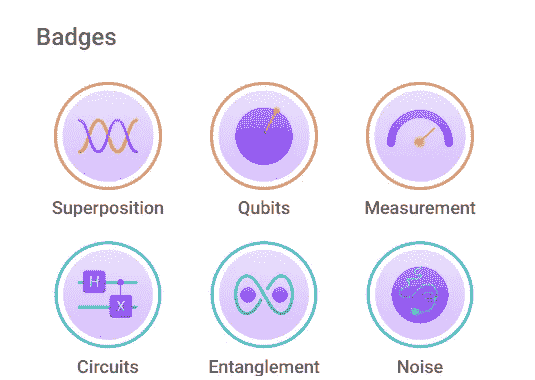
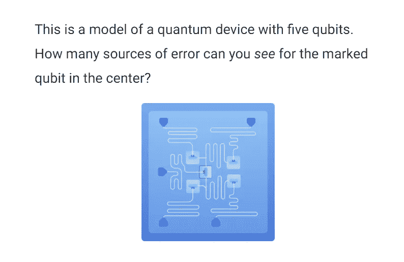
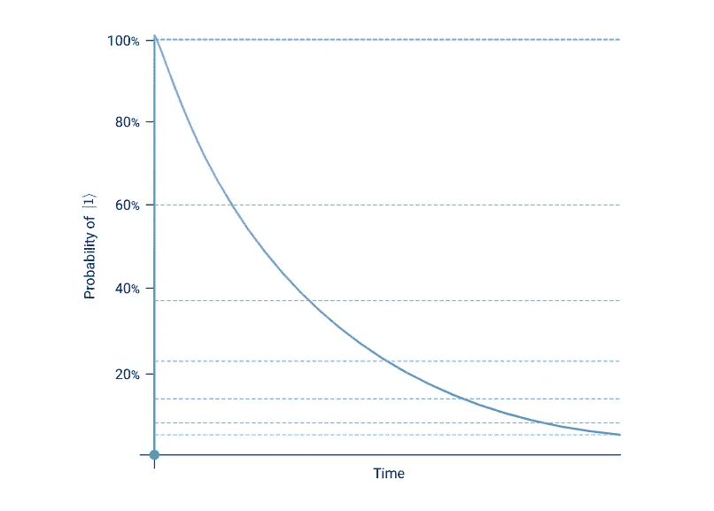
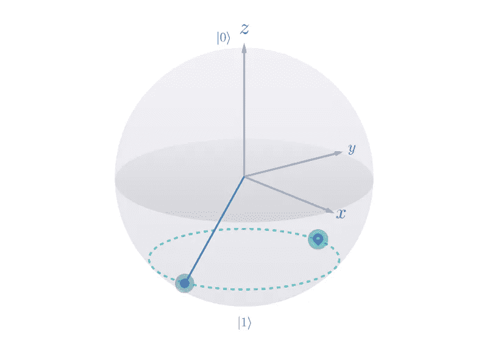
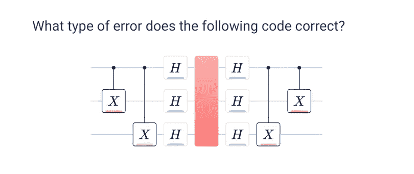

# 审查:黑色蛋白石“噪音”的 Q-Ctrl

> 原文：<https://levelup.gitconnected.com/review-black-opal-noise-by-q-ctrl-71439dad348b>

[https://black.q-ctrl.com/skills](https://black.q-ctrl.com/skills)

# 我以为我知道那是什么…

一旦你开始了量子计算的冒险，用不了多久你就会被引入噪声的概念:你的结果理想地应该是这个和那个，那么所有这些其他的数字是什么？嗯，那是噪音造成的。

在高层次上，噪声是一个容易理解的概念。你甚至可以说这是“环境问题”,就此打住。环境并不完美，这会导致错误。现在，回到你定期安排的线性代数…

Q-Ctrl 将整个模块专门用于噪声的事实应该是我们的第一个线索，也许“噪声”不仅仅是简单的表征。而且，我们将会发现这是一个保守的说法…

顺便说一下，这是我正在进行的系列第四次黑蛋白石审查。要了解最新情况，请查看以下文章:

1.  [复习:Q-Ctrl 的黑蛋白石教程](/review-q-ctrls-black-opal-tutorials-3e888ac76f84)(技能 1-3)
2.  [复习:Q-Ctrl](/review-black-opal-circuits-by-q-ctrl-beaf01a7b5ce) (技能 4)黑猫眼石电路
3.  [回顾:Q-Ctrl](https://bsiegelwax.medium.com/review-black-opal-entanglement-by-q-ctrl-fb913447535c) (技能 5)黑蛋白石“纠缠”

[https://black.q-ctrl.com/skill/noise](https://black.q-ctrl.com/skill/noise)

## 概述？？？

本模块的第一部分将概述噪声因子和量子体积。它将向你介绍最优化问题、变分算法、量子模拟、振幅编码和量子随机存取存储器(QRAM)的概念。

注意这是一个列表。对量子噪声的介绍大多止步于噪声因子，而不是黑蛋白石。你会被所有这些概念击中，然后你会意识到还剩下三个部分。还能有什么呢？！？！？

T1 练习

## 让我们来谈谈技术

Q-Ctrl 要牵着你的手，打开布洛赫球体的外壳，把你带进去；换句话说:你好，混合状态。您将了解松弛、幅度阻尼、相位阻尼(去相位)和去耦。T1 和 T2 是什么？正如你在上面看到的，你必须完成这方面的练习。

控制

## 量子耳塞

那么，现在我们知道了噪音，我们能做些什么呢？第三部分深入研究控制理论，脉冲和回声。如果你已经试验过 Qiskit Pulse，有些应该看起来很熟悉。而且，如果你不知道为什么 Q-Ctrl 的名字听起来像“control”，你应该很好地掌握这一点来完成这一部分。当你在他们的网站上时，点击[博尔德蛋白石](https://q-ctrl.com/products/boulder-opal/)就会很明显了。

纠错

## 不对不对！

最后一节是关于纠错。您将了解奇偶校验、位翻转纠正和容错的概念。

这一部分很有意思，因为在量子纠错(QEC)方面找到涵盖这一材料的论文和文章并非不可能。相比之下，这一部分的突出之处在于:1)交互性，更重要的是，2)这只是一个更大的噪声模块的一部分。一整本关于 QEC 的教程可以省去我在其他三个部分提到的所有内容。

## 结论

本模块深入探讨了什么是噪声，为什么它是一个问题，以及对此正在采取什么措施。虽然我没有给你看这幅画，但我希望我已经给了你一个相当准确的指示，告诉你这幅画有多大。