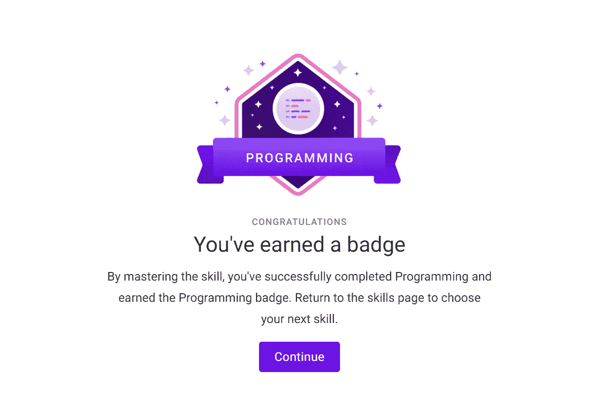
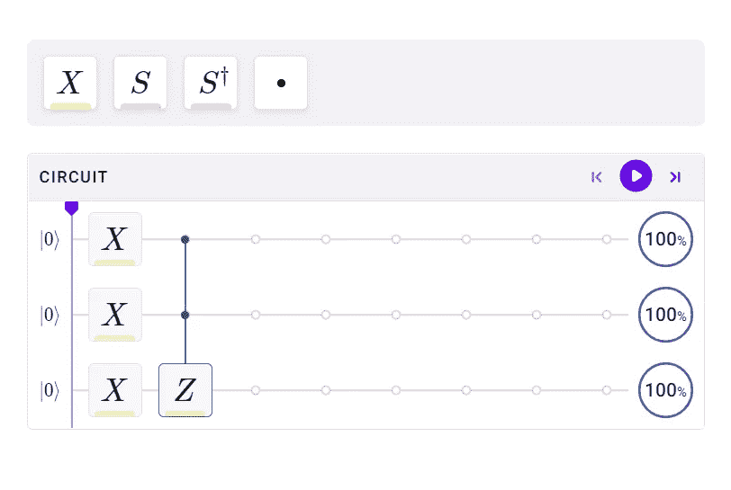
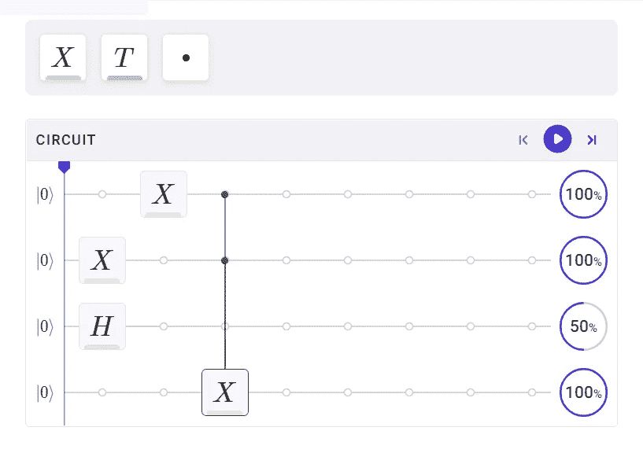
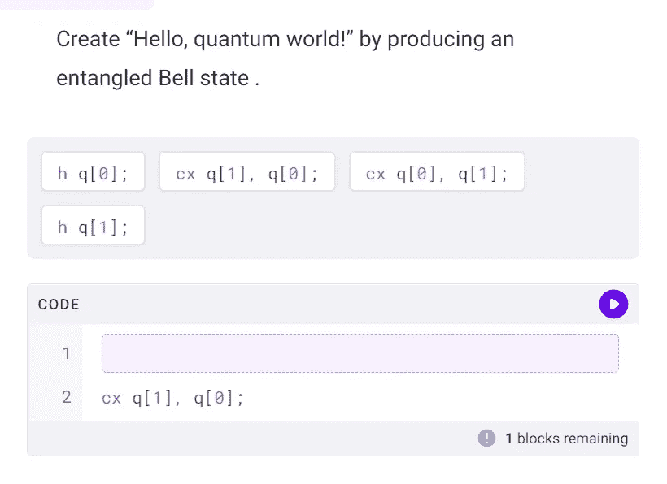
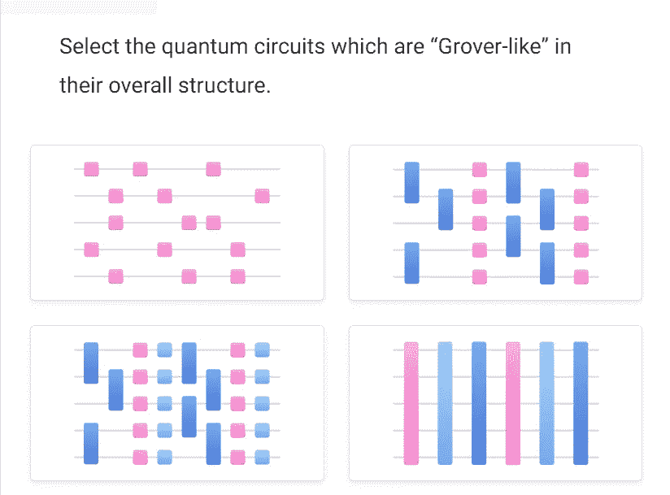

# 点评:Q-CTRL 的黑欧泊“编程”

> 原文：<https://levelup.gitconnected.com/review-black-opals-programming-by-q-ctrl-ad7206fded92>

[https://black.q-ctrl.com/skills](https://black.q-ctrl.com/skills)

# 从拖动到编码的平稳过渡

Black Opal 量子计算教程的第 9 个模块是橡胶遇到道路的地方。这就是你埋头苦干的地方。这就是你想知道为什么我用英语写每一个习语的地方。对此我没有答案。不管怎样，让我们开始编程，好吗？

门，设置，匹配

## 门，设置，匹配

你已经在早期的模块中拖放了量子门，但它们是简单的。在本模块中，您将学到更多实用的知识。事实上，你将学习如何构造新的。

收集

## 收集

你的笔记本电脑不懂 Python。它甚至不理解 c 语言。你的操作系统和你为了阅读这篇文章而运行的所有东西最终都被“编译”成机器代码，这是你的计算机真正理解的东西。同理，你的 Python，你的拖放式电路构建器，甚至你的 OpenQASM，对量子位都是没有意义的。你设计的电路必须被“编译”成你选择的量子计算机可以实际执行的操作。

密码

## 密码

OpenQASM 是我几十年来涉猎的十几种语言中最喜欢的一种。谁在数？这种语言是如此的简单和优雅，然而我们可以用它来设计算法，也许有一天它会被证明做一些令人敬畏的事情。我希望在这一部分结束时，它也会成为你最喜欢的语言。如果不是，那只是意味着你需要更多地使用它。

量子优化

## 量子优化

“优化”可能意味着两件事。一个含义是优化电路，以最大限度地减少噪声和提高结果。另一个意义是解决最优化(旅行商，背包)问题。您将了解到实现后者的几种方法。

## 结论

我是 IBM 第一个也是唯一一个非官方的 OpenQASM 倡导者。我打算重复这句话直到他们正式宣布。无论如何，以任何人都没有赋予我的权力，我宣布，凭借包括 OpenQASM，这是黑欧泊系列中最好的模块。顺便说一下，Black Opal 仍然是我推荐的唯一一套量子计算入门教程。

## 关于黑蛋白石的更多信息

本文是不断增长的系列文章中的最新一篇。如果您想了解其他黑蛋白石模块，请按以下顺序阅读:

1.  [复习:Q-Ctrl 的黑蛋白石教程](/review-q-ctrls-black-opal-tutorials-3e888ac76f84)(技能 1-3)
2.  [复习:Q-Ctrl](/review-black-opal-circuits-by-q-ctrl-beaf01a7b5ce) (技能 4)黑猫眼石电路
3.  [回顾:Q-Ctrl](https://bsiegelwax.medium.com/review-black-opal-entanglement-by-q-ctrl-fb913447535c) (技能 5)黑蛋白石“纠缠”
4.  [回顾:Q-Ctrl](https://bsiegelwax.medium.com/review-black-opal-noise-by-q-ctrl-71439dad348b) (技能 6)产生的黑色蛋白石“噪音”
5.  [用 Q-Ctrl 的黑欧泊练习](/practicing-with-q-ctrls-black-opal-9d819ea71558)
6.  [回顾:黑欧泊通过 Q-CTRL](https://bsiegelwax.medium.com/review-black-opal-speedup-by-q-ctrl-5067bf4b864d) (技能 7)加速
7.  [回顾:Q-CTRL](https://bsiegelwax.medium.com/review-black-opals-control-by-q-ctrl-378e1437d16c) (技能 8)对黑欧泊的“控制”

如果你已经超越了教程，感谢阅读。您可能有兴趣了解 Q-CTRL 的 Fire Opal 如何将真实硬件上的嘈杂结果转化为有用的结果:

[Q-CTRL 的火猫眼石很牛逼](/fire-opal-is-awesome-c642347ec89d)

## 关于黑蛋白石的更多信息

2022 年 4 月 14 日至 2022 年 4 月 20 日，Q-CTRL 有[买一送一](https://shop.blackopal.store/worldquantumday/?utm_content=buffer215a3&utm_medium=social&utm_source=linkedin.com&utm_campaign=buffer)促销活动。不，我不会因为分享这个而收到任何佣金或其他报酬。我只是认为这种简单的英语互动方式是学习量子计算入门的最佳方式。