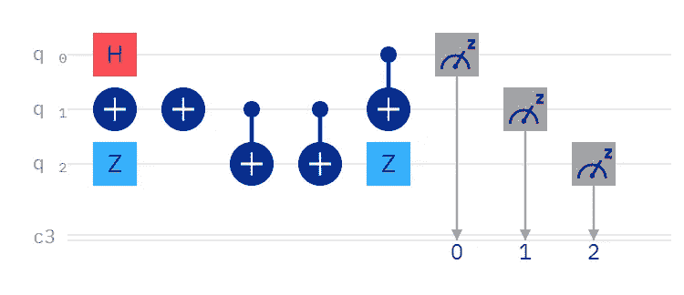
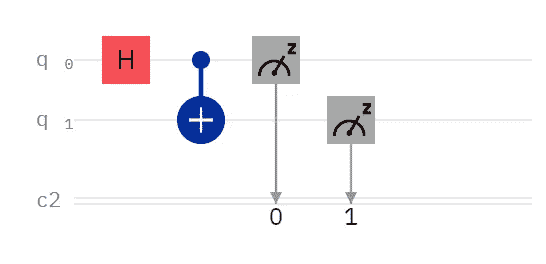
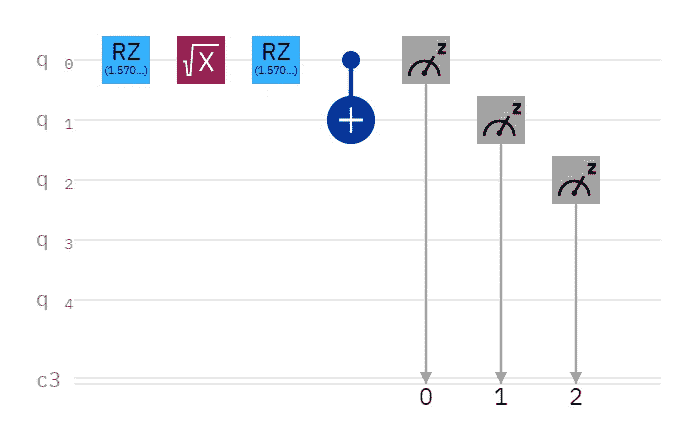

# 回顾:剑桥量子的 TKET

> 原文：<https://levelup.gitconnected.com/review-cambridge-quantums-tket-2e0a837e3210>

在分享了我对 [Classiq 的量子算法设计(QAD)平台](/review-classiqs-quantum-algorithm-design-qad-platform-796ed3511ef6)的评论后，一位红人建议我去看看剑桥量子的 TKET。在我有机会这么做之前，牛津量子电路(OQC)发表了一篇文章，标题是，“ [OQC 集成 TKET，演示 4x 优化](https://oxfordquantumcircuits.com/oqc-integrates-tket)”

我重新创建了 OQC 优化的电路，因为我有预感。使用 TKET，OQC 将上述电路优化为一个电路，其中 q0 上只有一个 Hadamard 门，q0 上有一个 CNOT 门，Q0 上有其控制，q1 上有其目标。

换句话说，这是“你好，量子世界”电路，用于教量子计算的新参与者关于叠加和纠缠。OQC 决定使用这个高识别度的电路来展示 TKET 的优化能力。不幸的是，因为我使用 IBM Quantum 的 OpenQASM 编辑器，所以我习惯于检查 transpiler 电路，并且我观察到 trans piler 优化了电路。

以上是两种翻译的结果。无论您重新创建 OQC 电路还是“hello，quantum world”电路，IBM Quantum 都会将它们传输到同一个电路中，而不使用 TKET。

换句话说，至少如果使用 IBM Quantum 后端，OQC 不需要使用 TKET。就此而言，这可能只是目测，但 IBM Quantum 确实在运行时优化了电路。

## 那么，为什么要费心使用 TKET 呢？

也许你想在排队等待真正的硬件之前看到推荐的优化。或者，也许你想优化一个电路，它需要比你所能获得的更多的真实量子位(模拟器不能传送)。或者，您可能只是想将您的电路与 TKET 的电路进行比较，以了解有关优化的更多信息。

无论您的理由是什么，开始使用 TKET 的简单方法如下:

## 安装 TKET

*pip 安装 pytket*

## 从 TKET 导入

*从 pytket 导入电路，OpType
从 pytket.passes 导入删除冗余
从 pytket.circuit.display 导入 render_circuit_jupyter*

## 修改 Qiskit

我们不使用 Qiskit 的 QuantumRegister、ClassicalRegister 和 QuantumCircuit，而是使用 TKET 的 Circuit。为此，请移除

*q = QuantumRegister(3，' q ')
c = classic register(3，' c ')
circuit = quantum circuit(q，c)*

并插入区分大小写的行:

*电路=电路(3，3)*

## TKET 区分大小写

TKET 不识别

*circuit.h(q[0])*

以至

*circuit.h(0)*

所以我们必须大写 gate，例如:

*电路。H(0)*

## 优化很容易

如果你读了 [TKET 的文档](https://cqcl.github.io/pytket/manual/manual_compiler.html#optimisations)，优化乍一看有点复杂。但是，要开始使用它，您只需要一行代码:

*删除冗余()。*应用(电路)

## 最后，画出优化电路

Qiskit 的 matplotlib 方法不起作用，所以我用:

*render_circuit_jupyter(电路)*

## 运行电路？

我没有。但是，如果您想运行您的电路，请准备更改更多代码。然而，我建议使用 TKET 绘图来清理您的代码，然后正常运行您的工作。为什么要让未优化的代码保持原样？

## 最后的想法

也许你可以设计一些复杂的电路，TKET 比 IBM Quantum transpiler 优化得更好，尽管这真的应该由 Cambridge Quantum 来演示。或者，也许您使用的提供商不会自动优化您的电路。或者，正如前面提到的，也许你有几个量子位，你正在为一个模拟器设计一个电路。我曾在许多场合感叹书籍和教程没有解决优化问题，TKET 看起来像是一个潜在有用的工具，直到这种情况发生变化。