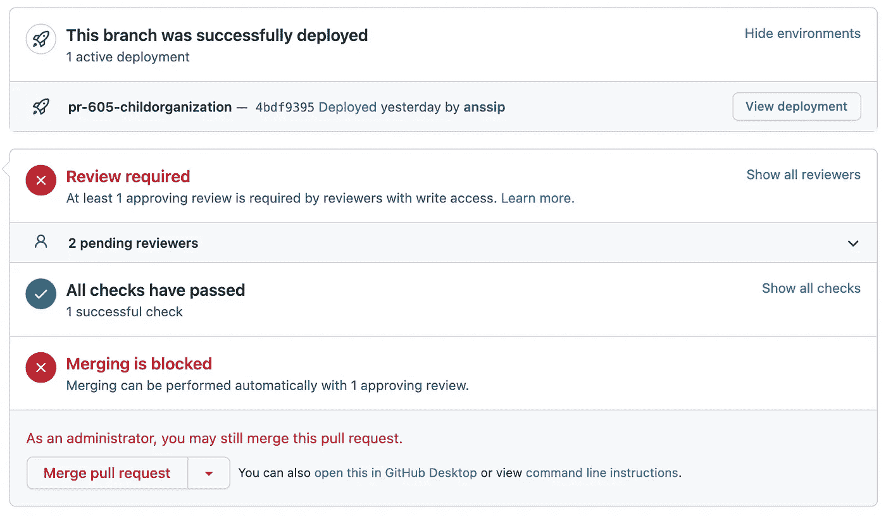

# 复习环境太棒了

> 原文：<https://levelup.gitconnected.com/review-environments-are-awesome-ea6e0f6d268b>

Ashim D'Silva 在 [Unsplash](https://unsplash.com/?utm_source=unsplash&utm_medium=referral&utm_content=creditCopyText) 上拍摄的照片

# 什么是复习环境？

让我们从一些背景信息开始，描述一下我不再推荐的“传统”做法。传统的开发模式是这样的:

*   在版本控制中有两个分支:一个*开发*分支和*主*分支。
*   有两个不同的环境:一个用于开发，一个用于生产。
*   所有的开发工作首先进行到*开发*分支。
*   开发分支被部署到*开发*环境中。
*   测试发生在开发环境中。
*   当一些特性集在开发环境中准备好并经过测试时，偶尔会部署到生产环境中(以随机的时间间隔)。
*   生产部署由*开发*分支到*主*分支的边界触发。

现在，镇上出现了一个新人，所有的事情都围绕着拉请求发生。它改变了游戏(变得更好)。新模型依赖于临时的审查环境，这些环境存在于每个 PR 的生命周期中。

*   该团队将工作分成小任务，每个任务一旦实现，就将被部署到生产中。
*   当一个开发人员开始处理一个任务时，他会创建一个新的分支，从主*分支出来。*
*   当开发人员完成任务编码时，她会创建一个新的*pull request* (PR)到 *main* 。
*   新的 PR 触发 CI 引擎构建新的评审环境，并将 PR 代码库部署到这个新环境中。
*   另一个开发人员在评审环境中评审和测试变更。
*   一旦评审者接受了 PR，PR 的作者就合并它，然后触发 CI 来构建和部署对生产的任务变更。

Github 中的 pull 请求，带有 PR 特定部署

这个截图显示了 Github 中的一个拉请求。有一个“查看部署”按钮，可在 PR 特定的临时审核环境中打开应用程序。审核人员需要在这种环境下测试应用程序，然后公关作者才可以合并它。Github 允许阻塞合并，直到预定数量的审核者接受了变更。

# 工作流程

审查构建支持连续无缝地交付给生产。工作流允许团队逐步地发布。在专用的开发和测试环境中，不需要对测试进行任何编排，也不需要对产品发布进行任何协调。

所有的开发工作都需要分解成小任务，这些小任务可以单独发布。每个任务/PR 应该产生一个可以推向生产的变化，而不会使产品不一致或损坏。任务应该是小的，这样就可以用合理的努力来检查和测试它们。理想情况下，每项任务应该在一两天内编码，然后在另外一两天内审查、修正和细化。不建议将较大的块作为任务，因为大规模的更改更难管理和审查，并且更容易破坏生产系统。我们的目标是每天都有多次持续的微小释放流。

实施一个大的变更集，即所谓的**史诗**，需要完成几个小任务和 PRs。这些 PRs 中的每一个都以一些小的方式修改了产品，并且因为展示半成品的特性通常是没有意义的，所以我们需要延迟让这些修改对最终用户可见的时刻。实现这种延迟可见性控制的一种方法是在产品中内置一个**特征门**。

特性门是这样工作的:当特性在特性门后面时，它们只对测试人员、开发人员和其他可信用户可见。当我们打开门时，藏在门后的一切都变得清晰可见。当所有与史诗相关的 PRs 都准备好，整个史诗变得完整时，通常就到了提升特性门的时刻。

> 这就是你所拥有的:一个连续的产品发布流:当开发人员使用拉式请求推动他们前进时，这一切都是自动发生的。

# 复习

拉动式请求审查是工作流程的核心。他们充当质量卫士，确保只有经过检查的代码变更流入产品。

审查由两个主要部分组成:代码审查和功能测试。

所有测试都是公关审查的一部分。一些组织可能有 QA 人员(测试人员)作为开发团队的一部分，但是许多团队和组织没有他们也能做得很好。开发人员可以像任何专业测试人员一样准备好进行评审。

请注意，自动化测试也可以作为 PR 构建的一部分。最佳实践是在这一点上运行一个全面的单元测试套件，以确保只有在自动化测试通过后才进行部署。

# 如何实现自动审查部署？

许多云托管平台，如 [Heroku](https://www.heroku.com/) 和 [Vercel](https://vercel.com/) 提供基于 PR 的构建和部署。Heroku 称之为*回顾应用*，Vercel 称之为*预览环境*。

使用 Github 动作实现它们也相当简单。我最近启用了他们的一个 React 应用，使用 [AWS CDK](https://aws.amazon.com/cdk/) 将应用部署到 S3 和 Cloudfront。朱利安·古克斯在这篇文章的开发中很好地记录了这种方法[。](https://dev.to/jgoux/preview-environments-per-pull-request-using-aws-cdk-and-github-actions-bfi)

*原载于 2021 年 8 月 26 日 https://anssipiirainen.com***。**