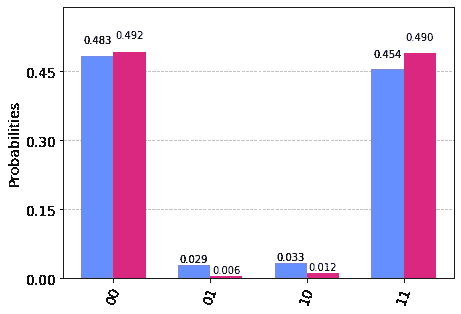
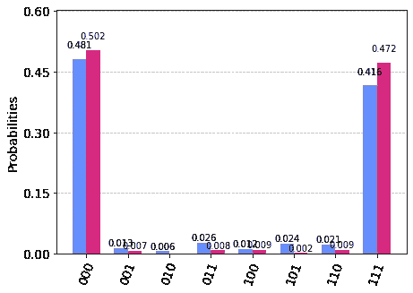
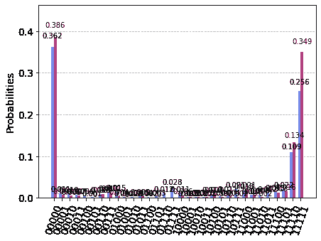
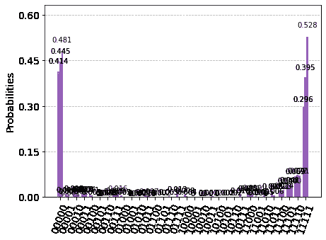

# 审查:三年

> 原文：<https://levelup.gitconnected.com/review-mthree-5597eebcaeed>



[https://github.com/Qiskit-Partners/mthree](https://github.com/Qiskit-Partners/mthree)

# 测量误差缓解库

您是否正在寻找一种极其简单的方法来减少测量误差？好了，不要再看了！ ***四行代码*** 听起来怎么样？

我第一次了解 mthree 是从[Paul Nation](https://www.linkedin.com/in/paul-nation-3189ba63/)博士那里，当时我正在为“[教量子比特唱歌:不可能的任务”研究减少测量误差的方法？“然而，我们在一套工具中使用了 mthree，所以直到最近我开始将它作为一个独立的库进行试验，我才完全欣赏它。](https://www.oldcitypublishing.com/journals/ijuc-home/ijuc-issue-contents/ijuc-volume-17-number-4-2022/ijuc-17-4-p-303-331/)

## 那很容易。

四行代码。

就是这样。

不相信我？来，看一看:

```
import mthree
mit = mthree.M3Mitigation(backend)
mit.cals_from_system(qubits, shots)
m3_quasi = mit.apply_correction(raw_counts, qubits)
```

并且只有四个唯一的参数:1) ***后端*** 是您的后端，2) ***量子位*** 是分配的量子位，例如本文顶部的示例中的[0，1]，3) ***shots*** 是要运行的快照数，以及 4)***raw _ counts***是您在您选择的在 https://github.com/Qiskit-Partners/mthree 有额外的解释，但是，说真的，没有比这更简单的了。

本文顶部的直方图显示了在 ibmq_belem 上运行“hello，quantum world”的结果(蓝色)，以及在运行上面的四行代码(粉色)后再次运行的结果。很容易看到误差(01，10)已经下降，并且预期的测量值(00，11)更加均匀。成本只有四行代码，为什么不使用 mthree 呢？

## 没印象？

好吧，是的，我也不知道。只有两个量子位，电路深度为 2。让我们更进一步，好吗？



ibmq_belem 上的 3 量子位 GHZ，不带(蓝色)和带(粉色)mthree

## q 剧

好吧，好吧，一个 3 量子比特的 GHZ 态不应该算作“Q 剧”尽管如此，我们可以看到 mthree 仍然在做它的事情。每个误差(001，010，011，100，101，110)已经下降，并且预期的测量值(000，111)更高且更均匀。

## 结论

我想进一步推动这件事，但我的后端是不合作的。他们要么预计排队时间为几个小时，要么校准有问题。请放心，一旦我的后端恢复正常，还有更多工作要做，但至少您可以看到，mthree 是一个值得包含在您的工具包中的东西。



ibmq_lima 上的 5 量子位 GHZ，不带(蓝色)和带(粉色)m3

## 更新 1

我最终得到了 5 量子比特 GHZ 状态的结果，m3(正如 Nation 博士所写的)继续执行。误差的总概率已经下降，并且预期的测量值(00000，11111)更高且更均匀。需要澄清的是:使用“finally”是后端队列和校准的问题，而不是 m3 库的问题。



ibmq_lima 上的 5 量子位 GHZ，不带 m3(蓝色)，带 m3(粉色)，带 m3 两次(紫色)

## 更新 2

看到 m3 应用一次的结果会引出一个问题，如果我们多次应用它会发生什么。第一个好消息是，一旦 m3 获得了后端信息，它就不必再回去获取它了。因此，您在一个队列中等待获得第一个结果，然后在第二个队列中等待获得 m3 的后端信息，然后您可以将 m3 应用到您的核心内容。在 5 量子位 GHZ 状态的情况下，两个应用就足够了。所以，第二个好消息是多个应用程序可以工作。你可以在上面看到，正确测量的概率——00000 和 11111——实际上略高于 1.0；那是因为负振幅，这超出了本文的范围。

从技术上来说，测量误差只能减轻一次。重新应用 M3 有放大的效果，但这是无效的，因为我们只是在重复同样的修正。尽管如此，重复应用 M3 将产生这种放大效应。

## 更新 3

通过 *async_cal=True* 允许您同时提交校准作业和您的实际实验，将您必须等待的队列数量从两个减少到一个。

```
import mthree
mit = mthree.M3Mitigation(backend)
mit.cals_from_system(qubits, shots, async_cal=True)
...
job = execute(...)
...
m3_quasi = mit.apply_correction(raw_counts, qubits)
```