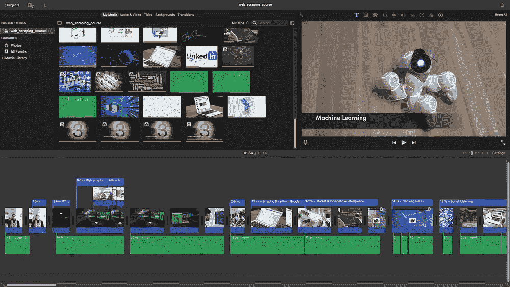
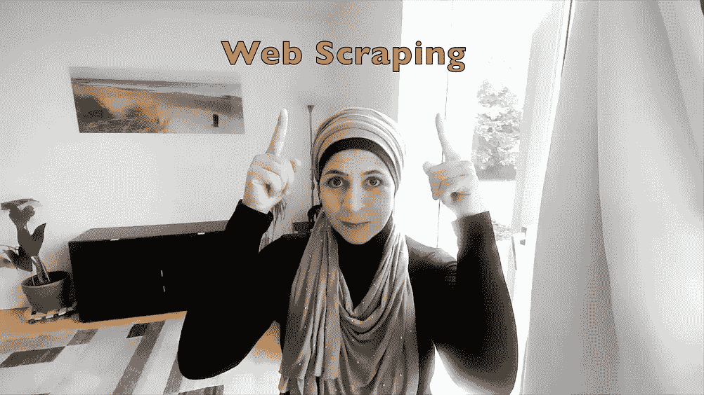
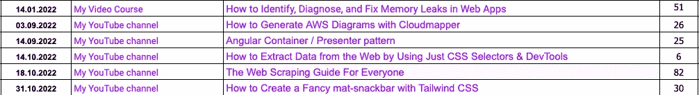
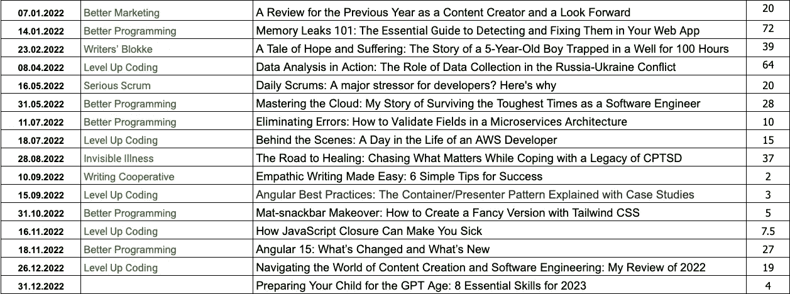
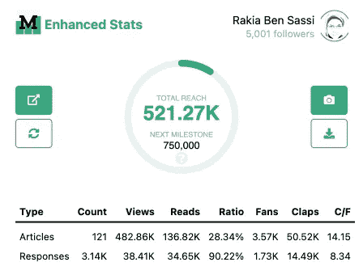
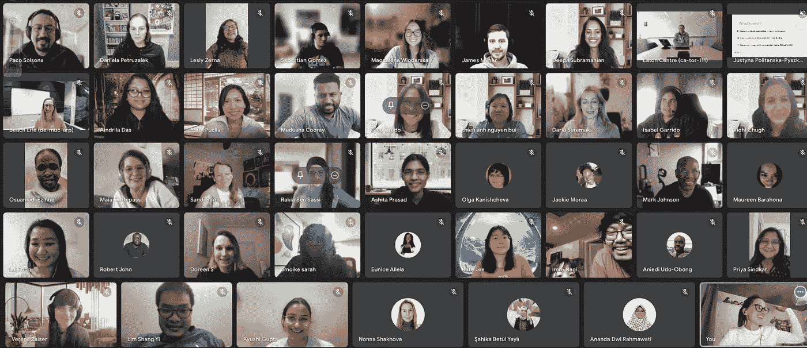
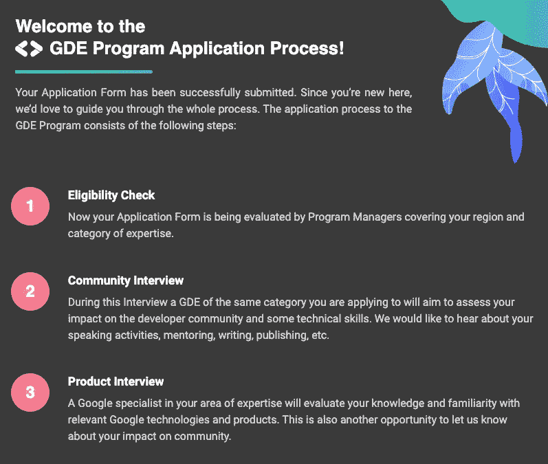
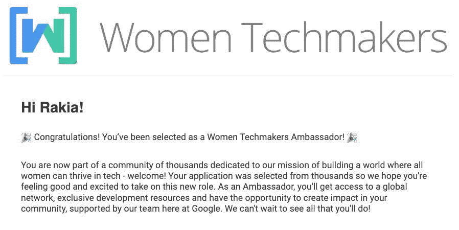
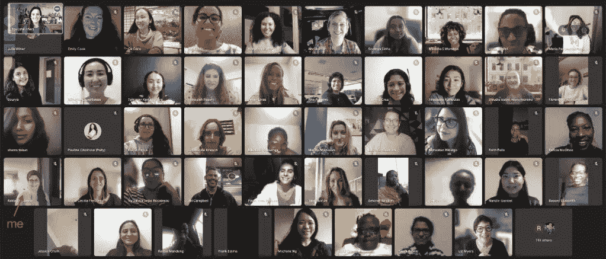

# 导航内容创作和软件工程的世界:我对 2022 年的回顾

> 原文：<https://levelup.gitconnected.com/review-of-a-year-as-a-content-creator-and-software-engineer-c18190af82ef>

## [我的 2022 年词:跳](https://rakiabensassi.medium.com/list/personal-development-52c3c4f72477)

## GDE 和 WTM 大使之路

由[托马索·福尔诺尼](https://unsplash.com/@tommytop?utm_source=medium&utm_medium=referral)在 [Unsplash](https://unsplash.com?utm_source=medium&utm_medium=referral) 上拍摄的照片

S **场景一:***下雨了。你站在一个不知名的小岛上，被冰冷的海水包围着。大洋彼岸，阳光明媚，也有一些机会。你会跳进几乎冰冷的水中，向希望之地游去吗？教练问道。*

“嗯，作为一个局外人进行判断和作为一个局内人进行判断是完全不同的,”我说，犹豫着要不要回答这个令人痛苦的问题。

接下来的几天，我不停地思考这个问题。最终，我明白了，也许在我生活的某些方面，这正是我现在正在做的事情；在冰冷的水中游向更好更大的陆地。

一个人想了想:“今年是等待的一年。无所事事的一年。这可能就是我去上舞蹈课的原因。我想以搬家来结束这一年，即使它只是大约 300 平方英尺的硬木地板。如果我能以某种方式前进，也许我能说服自己，我正在前进，[Julio Vincent Gambuto](https://medium.com/u/70197a4e8521?source=post_page-----c18190af82ef--------------------------------)最近写道。

虽然我仍然有需要改进的地方，但我不认为自己是一个停滞不前的人。但 2020 年和 2021 年对我来说是一次严峻的现实考验:实现我的宏伟目标没有简单的捷径。等待一些神奇的按钮打开新的大门不会让我去任何地方。

与文森特·甘布托不同，我去上舞蹈课并不是为了前进。相反，我在家坚持锻炼，并选择坚持和耐心，即使这意味着一步一步来。

S中新世二:外面零下 2℃。时钟在平纳伯格敲响了上午 8 点 30 分。我从旁边的玻璃墙看了一眼覆盖在植物和商店屋顶上的雪。因为冰点的温度，它还没有融化。

我回到我的屏幕，想知道我是否收到了对我的会议日期建议的答复。我检查了我的收件箱。但是没有新的消息。

也许他太忙了，或者在度假。他的团队已经通知我，由于即将到来的假期，这个过程会有一点延迟。让我们耐心等待接下来的几周。”我心想。

我们已经接近年底，我对我的下一步感到非常兴奋，这将是与谷歌项目负责人的产品面试。

T **想到两点:**2022 年，我的生活经历了如此多的变化，我周围的世界也是如此。我转了一个新时代，换了两次全职，发布了我的第一个 Udemy 视频课程，作为一个内容创作者变得更加自信。

二月，肆虐乌克兰的[战争](https://medium.com/gitconnected/data-collection-in-conflict-58be290dc6bc)反映了我们周围世界的动荡不安。在全球经济下滑的情况下，商品和能源价格继续上涨。由于就业形势不稳定，大辞职和大规模裁员成为常见的主题。

然而，气氛也发生了变化。在长时间的社会距离之后，人们能够更自由地在街上漫步和参加面对面的活动。

在整个过程中，我的日常工作保持不变:我醒来，准备一杯茶，编码，创建内容，然后上床睡觉。现在我还有一件事:参加谷歌组织的 RoadToGDE 和 WTM 会议。这有时让人不知所措，筋疲力尽，但总的来说，这是值得的。

# 围绕太阳的旅行

去年 1 月，我发表了一篇关于我 2021 年作为内容创作者的旅程的文章。现在 2022 年即将结束，我想和你一起反思一下。

在接下来的部分，我将回顾我所经历的变化，我现在在哪里，以及我未来的方向。

## 视频制作

2022 年的一个显著的事情是，我再次以全职软件工程师的身份工作，并继续在工作旁边制作和发布在线内容。

我还通过学习如何制作比我在 2021 年发布的视频更好的视频，将自己推向视觉内容。对于一个曾经是害羞的人，在这个领域没有什么经验的人来说，这是一项艰巨的任务。但我给了自己一个在角色中成长的机会。

与写作游戏不同，在写作游戏中，我安静地坐下来思考，并试图将它们转化为文字，视频制作活动需要我的多个部分共同参与:我的想法、我的脚本、我的语调、我的肢体语言和我的编辑技能。

[一个视频](https://www.youtube.com/watch?v=SZeppJxlQh8)花了我 80 多个小时才完成，丝毫没有降低我想要达到的质量。虽然它没有在 YouTube 上疯传，但它让我感到自豪。

[我的视频剪辑过程截图](https://www.youtube.com/watch?v=SZeppJxlQh8)(作者截图)

2022 年，我总共在[我的 YouTube 频道](https://www.youtube.com/@tekforge)添加了 11 个新视频，这些视频并非都是匿名的，并实现了 ***一千个*** 订户的里程碑。

在我前老板的鼓励下，我也发布了我的第一个 Udemy 视频课程“[内存泄漏 101:如何识别、诊断和修复 Web 应用程序中的内存泄漏](https://www.udemy.com/course/identify-and-fix-javascript-memory-leaks/)”我很高兴它现在有超过 13，000 名来自世界各地的学生。

制作这些视频花了我 220 个小时。我可以把这项工作分成写脚本、屏幕录制、画外音、寻找视频序列和图像以及编辑。

下表中的右栏显示了我在每个视频上投入的时间——在发布这些视频时，我将它们分成了多个部分:

我 2022 年发布的视频(作者截图)

## 写作

2022 年，我见证了不同的阶段。在 4 月和 8 月之间，我一直在纠结云计算的复杂性，以及它是如何降低开发人员的生产力并极大地增加他们的学习曲线的。也就是说，这一阶段是我接触 AWS 服务和无服务器架构并在几篇文章和一个视频中分享我所学到的东西的绝佳机会:

*   [掌握云:我作为软件工程师度过最艰难时期的故事](https://betterprogramming.pub/surviving-cloud-computing-complexity-1aabc1024a54)
*   [如何验证微服务架构中的字段](https://betterprogramming.pub/microservices-cloud-architecture-9d15be866ce6)
*   [幕后:AWS 开发人员的一天生活](/a-day-as-an-aws-cloud-developer-879396e85e98)
*   [每日混战:开发人员的主要压力源？下面是为什么](https://medium.com/serious-scrum/4-reasons-why-daily-scrums-are-stressful-for-developers-3be4a871db33)
*   视频:[可视化您的 AWS 环境:如何使用 Cloudmapper 生成图表](https://www.youtube.com/watch?v=HVy-mnjCLEM)

2022 年我在 Medium 上发表的文章总数是 16 篇——包括现在的这篇。我花了 372.5 小时来制作它们。下表的右栏显示了我在每篇文章上投入的时间:

我 2022 年发表的文章(作者截图)

我认为 2022 年最受欢迎的三件作品是:

1.  [内存泄漏 101:在你的网络应用中检测和修复内存泄漏的基本指南](https://betterprogramming.pub/javascript-memory-leaks-390957523a9e)
2.  [棱角 15](https://medium.com/p/193cb008e8f3) 有什么新鲜事
3.  [每日混战:开发人员的主要压力源？下面是为什么](https://medium.com/serious-scrum/4-reasons-why-daily-scrums-are-stressful-for-developers-3be4a871db33)

另一个我引以为豪的里程碑是我的内容在 Medium 上获得了 50 万次浏览:

2022 年 12 月 26 日我的中等总浏览量(作者截图)

## 通往 GDE 的道路

八月底，我成为了一个 40 人小组的成员，他们被选中参加谷歌为期三个月的项目:谷歌开发者专家之路(GDE)。

该计划中的学员来自世界各地，拥有各种技术背景。他们计划申请不同的 GDE 头衔:Google cloud、ML、Android、Web Technologies、Angular、Flutter 等等。

他们也有不同的技能:

*   一些人在社区建设和活动组织方面比其他人更好。
*   有些人擅长公开演讲，在他们的个人资料中也有一些公开演讲，但是在写他们的第一篇博客文章时却很吃力。
*   一些参与者，如 Verena Zaiser，出版了一本书并主持了一个播客。
*   其他人由于他们创造的内容而对社区产生了积极的影响。

2022 年 12 月 14 日的 RoadToGDE 毕业典礼

因此，在 RoadToGDE 快结束的时候，12 月 1 日，在填写了模拟申请并从我的导师 Martina Kraus 和 RoadToGDE 项目的经理那里得到反馈后，我向谷歌提交了申请，希望成为一名 GDE。

欢迎来到 GDE 申请流程【GDE 申请流程——拉基亚·本·萨希】

12 月 7 日，在顺利通过资格审查后，我收到了 GDE 社区面试的邀请。

会议在 2022 年 12 月举行，来自希腊的棱角分明的 GDE 给了我一些鼓励的话，比如“*你会成为一个伟大的 GDE* ”，听起来很好听。

12 月 14 日，我收到了 Angular 团队一名成员的产品面试邀请。

值得一提的是，这不是我第一次申请 GDE 项目。2021 年，我也申请了这个职位，并成功通过了资格审查和安格尔·GDE[黛博拉·库拉塔](https://twitter.com/DeborahKurata)的社区面试。但是产品面试之后，我得到了一个拒绝。

当时，我已经知道了:

*   [enterJS 2021 大会上的一次演讲](https://enterjs.de/veranstaltung-13271-0-build-me-a-web-app...-with-memory-leaks-please-how-to-detect-and-fix-memory-leaks-with-chrome-devtools.html)。
*   GitHub 上的一堆开源库[。](https://github.com/rakia)
*   大约 100 篇关于媒体的文章，总浏览量超过 200，000(对于我的技术和非技术职位)和 2，000+追随者。
*   我的 YouTube 频道上大约有 20 个视频——其中很少是关于棱角的。该频道的总订阅人数不到 100 人，总浏览量约为 5K。
*   订户不到 100 人的子堆栈简讯。

在产品面试期间，我被推荐继续发展我的 YouTube 频道，并在汉堡 Angular Meetups 上发表演讲，这是离我最近的 Angular 社区。

但是当然，为了决定你作为候选人是否准备好获得 GDE 头衔，谷歌团队不仅仅依靠你的知识、你的指导能力和你对社区的影响，他们还会考虑你的动机和你想要这个角色的原因。

## 女性科技创客(WTM)大使

在 RoadToGDE 的一次会议中，组织者介绍了 WTM 计划，并鼓励我们申请该计划，这就是我所做的。

到 11 月 15 日，我正式成为 WTM 大使🎉。

祝贺您成为女性 Techmakers (WTM)大使

随后在 11 月 30 日和 12 月 12 日召开了入职和启动会议。

2022 年 11 月 30 日，面向 WTM 大使的全球入职培训

# 最终想法

随着 2023 年的临近，我很高兴我磨练了一种更个人化和反思性的写作风格，包括:

*   用场景和想法来组织我的思考，
*   并包括轶事和观察来说明我的观点。

我也为使用描述性语言感到自豪，提供了关于我经历的具体细节，并能够在我的作品中融入内省和深思的语气。

我期待着明年分享更多令人兴奋的内容，当这是最好的决定时，我会毫不犹豫地承担适当的风险。

你对 2022 有什么想法？你有什么具体的逆来顺受、达成目标的策略吗？你打算申请 GDE 项目吗？

如果是这样，我很乐意在评论区听到你的意见。感谢您的到来，并祝您在未来的努力中一切顺利！

***2023 年 2 月 22 日更新:*** *今天我正式成为谷歌开发者角专家🎉*

# 想要更多吗？

我为一群聪明、好奇的🧠人写关于工程、技术和领导力的文章💡。 [**加入我的免费电子邮件简讯，获得独家访问**](https://rakiabensassi.substack.com/) 或在此注册 Medium [如果你还没有注册。](https://rakiabensassi.medium.com/membership)