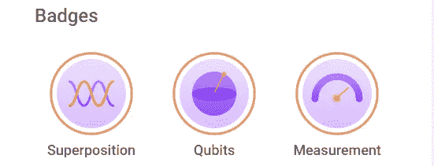
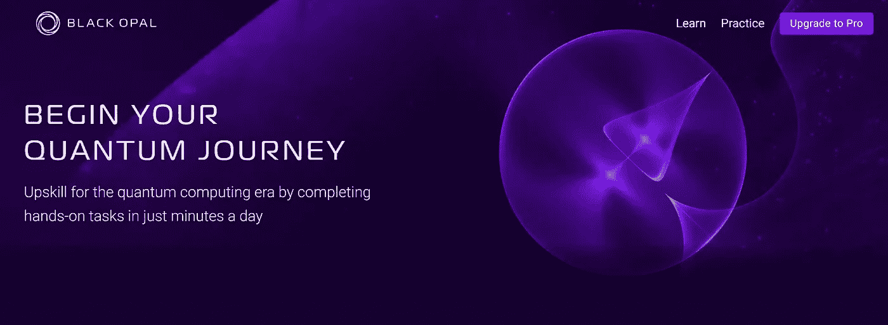
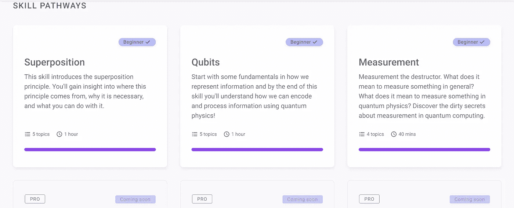

# 回顾:Q-Ctrl 的黑蛋白石教程

> 原文：<https://levelup.gitconnected.com/review-q-ctrls-black-opal-tutorials-3e888ac76f84>

# 这些可能是最好的

Q-Ctrl 宣布了一系列新的[量子计算教程](https://black.q-ctrl.com/skills)，因为如果这个行业现在迫切需要一样东西，那就是更多的教程。尤其是新手。你只是在哪里都找不到。

尽管讽刺，他们真的很好。

我在许多场合公开声明，最好的量子计算教程是由 James Wootton 博士等人编写的原始 IBMQ 教程。这些教程演变成了现在的 Qiskit 教科书，这是一个令人生畏的文档。前者为量子计算提供了一个温和的介绍，而后者看起来像一个完整的大学课程。我提倡一个两步走的计划:用温和的教程欢迎我进入这个领域，然后在我的脚处于干湿叠加状态后，邀请我认真对待教科书。但是，我跑题了…

尽管我很喜欢那些原创教程，但我必须承认，火炬可能已经传递了。我在这句话上加了一个星号，我将在本文中解释，但是 Q-Ctrl 教程是那么好。

## 好人

用户界面几乎令人愉快。有那么好。我已经用过这个表达了吗？随便啦。有那么好。

在屏幕的左侧，有一个简短的说明。这是一大块。谁都能咽下去。然后，在屏幕的右边，你有一个互动的测验。这不仅仅是选择一个答案，而是围绕一个布洛赫球旋转，构建简单的电路。感觉就像你在玩，但是如果这对你来说是新的，你就在玩的同时学习。嗯，我喜欢玩量子位和电路，所以对我来说就像是在玩。

如果我不得不挑选一个最简洁的特征，那将是一个布洛赫球体在电路中穿行的动画。所以，第一道门来了；让我们看看布洛赫球上的量子态变化。然后，第二道门来了；让我们看着量子态继续演化。

其次可能是光子系统的动画与各种量子位元技术的描述和解释之间的关系。我以前看过这些动画，但很高兴你不必离开教程，去 YouTube 观看它们。关于后者，我承认在回顾这篇文章的教程时，我学到了一些关于离子阱系统的新东西。

还有，你喜欢用英语学习吗？物理和数学不是你的母语吗？或者，你是一个对电路结构不熟悉的物理学家或数学家吗？你将会看到为什么 Q-Ctrl 会邀请“给婴儿”系列丛书的作者克里斯·费里博士。这些教程有非常可读的量子计算内容。从历史上看，在这个领域，我对唯一一位作者的可读性赞不绝口，巧合的是，他就是伍顿博士。

回到用户界面，很干净，很吸引人。[黑欧泊](https://black.q-ctrl.com/skills)的注册快速简单。而且，正如您从这篇文章的特色图片中看到的，您在学习的过程中会获得徽章。Q-Ctrl 现在承认我至少是个初学者，这比我昨天的水平高了一级。

## 坏事

此时，只有三条技能路径是免费的。尽管有 2 小时 40 分钟的免费教育内容，但还有很多免费内容。很多。除了前面提到的 Qiskit 教科书，你还有书籍、媒体文章、YouTube 视频和黑客马拉松。不用花钱就能学会所有这些东西是很有可能的。

幸运的是，升级到这种更好的方法并不需要花费太多成本；目前只有 50 美元。如果你在发达国家，这是一个巨大的价值。据我所知，这比苏托博士的《与量子位共舞》强不了多少。然而，我把它归入“坏”的一类，以示对那些生活在发展中国家的人的支持。我个人认识一些人，他们需要工作三分之一个月才能赚到相当于 50 美元的收入；不幸的是，这意味着几乎任何成本都是令人望而却步的。但是，实际上，如果你看这些教程，并考虑开发成本，你会不得不同意他们不能便宜。

## 丑陋的

没有丑的。你没读过关于用户界面干净有吸引力的部分吗？

## 结论

Q-Ctrl 的教程是不是质量最好的？他们只是有可能。我只检查了三个免费的，但是它们提供了最初的 IBMQ 教程所使用的温和的介绍。这不是最公平的比较，因为我这次不是初学者，但我必须想象我会发现可视化非常有用。

你在别处可以免费得到的东西，值得向 Q-Ctrl 付费吗？

是啊，有点像。

如果你不认为这些是教程，而是一个数字互动的书，那么成本堪比购买一本书的硬拷贝。另外，我相信这个费用也能让你得到黑蛋白石。我的黑欧泊试用版早就过期了，但如果你喜欢这些教程中的视觉效果，并且假设黑欧泊只是随着时间的推移而改进，你应该会喜欢你在黑欧泊内部看到的东西。

还有，如果你不是把这些教程比作书，而是比作大学的课程呢？我刚刚快速搜索了一下，一个 Q-Ctrl 升级比我找到的一个入门课程便宜 97%。那不是无关紧要的。

最后，如果你不是初学者呢？我会推荐看看这些教程只是为了看看 Q-Ctrl 的风格，甚至尝试黑欧泊，如果你可以的话。该公司有望在不久的将来发布 Fire Opal，Black Opal 应该会让每个人对他们有望提供给有经验的量子算法设计师的东西感到兴奋。就我个人而言，我对火蛋白石有着不切实际的高期望，但我也早在疫情之前就在等待它了。

TL；DR:你应该试试 Q-Ctrl 的新量子计算教程。