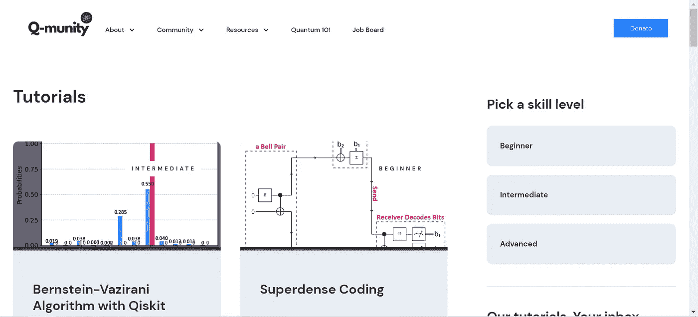

# 复习:Q 社区教程

> 原文：<https://levelup.gitconnected.com/review-q-munity-tutorials-c268c3497d3a>

[https://www.qmunity.tech/tutorials](https://www.qmunity.tech/tutorials)

# 高中生为高中生进行量子计算

"[Q-community](https://www.qmunity.tech/)是一个 501(c)(3)非营利组织，致力于联系并教授年轻人关于量子计算的知识."它是由一队[高中生](https://www.qmunity.tech/team)带领的。让那件事过一会儿吧…

然而，年龄并不意味着免费。一个诚实的评估随之而来。

## 好人

**三个技能等级**

教程被清楚地标记为初级、中级或高级，并且可以通过难度级别进行搜索。坦率地说，这对于所有年龄层都很重要，因为你不会让任何人直接跳到量子机器学习而气馁。这样，即使对量子计算一无所知的父母也可以确保他们的学生从适当的水平开始。

**不仅仅是 Qiskit**

本来期待看到 Qiskit 教程，Q-munity 也没有让人失望。但是，我很惊讶地看到了 Cirq 和 PennyLane 的教程。这当然是个好主意。谁知道所有这些职业道路会通向哪里？

**变分电路**

教程不只是在标准教科书算法之后停止；高级教程包括两个变分算法，又名混合经典量子算法。通常，我会忽略变分算法，因为它们已经过时了。然而，在这种情况下，学生们除了学习量子计算概念之外，还在学习经典编程。他们可以走任何一条路，要么成为 Python 开发者，要么成为量子算法设计师。他们还可以继续学习低级编程语言，教机器人“学习”潜力几乎是无限的。

**社区**

你真的希望你的青少年在 LinkedIn、Slack、Twitter 和 Reddit 上和陌生成年人交流任何事情吗？但是，与此同时，需要培养对量子计算的兴趣，对吗？作为一名家长，我喜欢这个同龄人社区的想法。

**值得支持**

Q 社区越发展，我们就越鼓励下一代。家里没有高中生？你仍然可以进行免税捐赠。

## 坏事

**喂？**

我猜，这就是它的全部，新增加的教程被添加到每个页面的顶部。这必然迫使旧教程在页面上向下移动一点。此外，虽然展示新内容通常是一个好主意，尤其是对经常性访问者来说，但对量子计算一无所知的第一次访问者怎么办？你可能认为任何初级教程都可以，但是，不，你应该从“你好，量子世界”开始，先学习叠加和纠缠。不幸的是，这第一个教程可能是第一个添加的，现在它一直位于页面的底部。这一个教程真的应该在最上面有一个荣耀的位置，带有某种“从这里开始”的信息。

**对于高中生？**

我很惊讶内容没有以某种方式为高中生定制。我不知道那会是什么样子，但在教程中至少有一个 arXiv 的链接，这些论文对成年人来说可能很难消化。高中似乎是学习更多先决条件的好时机，有像 Q-Ctrl 这样的“量子”公司直言不讳地说出他们需要未来的员工知道什么。我希望看到指导学生走向超越 Jupyter 笔记本电脑的许多“量子”职业道路的教程。你最好相信我的孩子会读这些。

## 丑陋的

没什么。一切看起来都很专业。大学现在应该去 https://www.qmunity.tech/的 T2 招聘这些年轻人。公司应该提供奖学金，确保他们未来的劳动力。不相信我？看一看。

## 结论

如果这些教程真的是高中生写的，并且实际上是高中生理解的，那么高中在我毕业后已经走过了非常长的一段路。我印象深刻。q-community 比其他任何“量子”组织更能代表未来，值得你的支持。