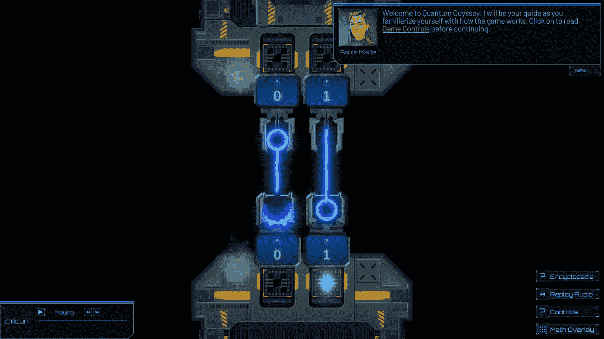

# 回顾(更新):量子奥德赛

> 原文：<https://levelup.gitconnected.com/review-quantum-odyssey-ca6cfed9241a>

欢迎来到量子奥德赛

# 游戏化量子计算

*注:本文原载于 2022 年 2 月 3 日，更新于 2022 年 12 月 2 日。*

不久前我第一次听说量子奥德赛，但出于某种原因，我从来没有研究过它。我不记得为什么了。不过，幸运的是，我最近想起了这件事。这一次，我下载并安装了它，我很高兴我做到了。

在开始我的评论之前，我必须声明这款游戏正处于 Alpha 阶段。那是程序员的行话，因为它还在开发中。这并不意味着游戏有问题；事实上，我在玩它的时候没有发现任何错误。但是，很明显，还会有更多的内容出现。已经有相当多的内容了，但是如果你看了很多教程，你会发现还有一些标准的内容没有提供。也就是说，新内容将于 2022 年 4 月发布。

# 好人

量子奥德赛有许多独特的功能，首先是它的视觉效果。你肯定没见过这样的量子计算教程。

## 快速启动

从一开始，你就在学习量子电路和量子门。有些教程需要很长时间才能到达。事实上，有些教程永远不会出现。但是，你将立即开始学习信息，这些信息可能有一天会帮助你在真正的量子处理器上进行真正的实验。

语音导游器

## 语音导游器

在屏幕的右上角，有一个虚拟向导带你浏览教程。这已经是量子计算教程的一个独特的转折，但这还不是全部。本指南不仅仅是文本性的；有一个愉快的声音为你讲述。当她说话时，你可以专注于屏幕上的内容。我被告知，目前总共有 15 个小时的录音可用。

*更新 1:人声属于一位“来自英国杜伦大学的著名教育家”*

*更新 2:有 11 个音频讲述的学习模块，每个模块时长从 30 分钟到 2 小时不等。*

鼠标悬停定义

## 鼠标悬停定义

你不确定某事是什么意思吗？如果它是粉红色的，带下划线，你可以将鼠标移到它上面，阅读这个术语的简短描述。你可能会认为其他教程已经做到了，也许有一些我还没有发现，但这是我第一次看到它。

百科全书

## 百科全书

通过鼠标悬停获得的简短定义是否不够？然后，继续点击该术语。内置的百科全书将会弹出，如你所见，那里的定义更加充实。尽管你在这里看到的“阿尔伯特·爱因斯坦”条目是文字性的，但有些条目包含了视觉辅助。

数学覆盖

## 数学覆盖

你可以打开一个数学覆盖图，显示你选择的状态向量或张量积。虽然游戏的重点是可视化学习，但有兴趣的人想用它来教授量子计算的数学。所以，你有机会保持数学覆盖图关闭，忽略所有的数学，或者你可以把它作为一个工具，也许可以更好地学习数学。

3 章+简介

## 小时的内容

在我写这篇文章的时候，有三个章节，总共九个模块和多达 250 个谜题。其中一些显然是非常入门的，但是我跳过了前面，许多谜题需要你已经对量子门和纠缠有了直觉。

更新 1:共有 11 个模块，共 344 个谜题，外加 6 个社区创建的挑战。

*更新 2:用户可以创建自己的内容，如果你解决了所有的学习模块，你将获得出版权，并可以为整个社区创造挑战。*

格罗弗算法

## 格罗弗算法

这个引起了我的注意。我把“格罗弗算法”看作一个模块，想看看你如何在这个游戏中实现一个实际的算法。虽然直觉是在屏幕中间发展起来的，这也是游戏的全部意义，但那些熟悉算法的人可能会在屏幕的左侧认出它。

这些符号是不同的，你可能想侧着头看，但你应该能看到两个沙漏状的哈达玛，后面是两个 X，然后是一个受控的 Z，再后面是两个 X，再后面是两个哈达玛。这是一个两个量子位的 Grover 扩散算子。因此，在游戏过程中，你将学习如何在屏幕的左侧建立一个电路，然后对屏幕中央的门实际上在做什么产生一种直觉。

## 无代码

也许你想更好地理解量子计算。你想比科普文章挖掘得更深，你想能够从现实中辨别炒作，但你不是计算机程序员，你也不想成为计算机程序员。尽管我没有看游戏的每一个屏幕，但我没有看到一行代码。

## 不和谐服务器

量子奥德赛当然看起来像一个视频游戏，但它是一个教育工具。另外，它还在开发中。无论你有“量子”问题还是游戏特有的问题，都有一个 Discord 服务器，通过它你可以从社区获得支持。

我不知道他有多活跃，但量子计算的地牢主人詹姆斯·伍顿博士本人就是其中一员。伍顿博士开创了量子游戏。你可以在他发表的一篇名为“[量子计算机游戏的历史](https://decodoku.medium.com/the-history-of-games-for-quantum-computers-a1de98859b5a)”的文章中读到关于适度的开端和快速的发展

## 破坏性干扰

我不想扫大家的兴，但是当破坏性干扰发生时，你肯定会知道。如果你还不知道它是什么，你会学会的。一旦你知道它是什么，你会从视觉和听觉上认出它。

# 坏事

《量子奥德赛》不错，但我有四个小问题。

## 装置

游戏需要安装。这没什么大不了的，但它看起来像是应该可以在浏览器中播放的东西。[劳伦提乌·尼塔](https://www.linkedin.com/in/laurentiu-nita-24b70796/)解释说，它不是基于浏览器的原因是因为它将成为一款视频游戏，所以我们必须等待并观察它在未来版本中的发展。

## 方向

在过去的几年里，我的量子线路总是朝着同一个方向。除了少数例外，我的测量结果几乎总是相同的。如果你是量子计算的新手，你应该不会有任何困难。但是，如果你已经这样做了一段时间，我会把它比作去一个国家，在那里每个人都在道路的对面开车，并试图开车去那里。

## 不自由

每当一种资源不是免费的，我总是不得不在“不好的”下面发表评论，以声援那些生活在看似很少的钱却贵得令人望而却步的经济体中的每一个人。我不嫉妒任何试图谋生或赚钱的人，但我代表所有无法负担的人感到难过。

## 没有演示

尽管我刚刚写了这个游戏不是免费的，但它至少应该有一个免费的演示。这显然是一种游戏类型，如果你允许人们尝试，就会有更多有购买能力的人购买。

# 丑陋的

可以看截图；这个游戏很吸引人。如果夸克互动公司的任何人正在阅读这篇文章，我会为百科全书建议一个不同的配色方案。或许那只是个人喜好；我从来不在阅读时使用“夜间模式”。

# 结论

量子奥德赛绝对是学习量子电路的一种独特方式。用户应该了解你需要知道的一切，以便开始使用拖放电路构建器来构建实际的量子电路，尽管如前所述，你最终将不得不适应电路的正常取向。然而，如果你应该继续玩这个游戏，有[计划集成 Qiskit](https://www.youtube.com/watch?v=obnNcxQDwcM) ，最流行的量子计算框架。当这种情况发生时，你不一定需要使用其他平台。

如果你有经验，没有兴趣再看一遍教程，你可能仍然喜欢第三章，它介绍了谜题。我没有探究这个特性，但是你也将有机会设计谜题。另外，不要忘了我们被许诺一个完整的视频游戏，所以希望每个级别的每个人都能喜欢。

想了解更多信息和下载《量子奥德赛》，请登陆 https://www.quarksinteractive.com/的。

*更新:现在可以用 Qiskit 模拟电路了；在编辑器中，在屏幕的右下角寻找“IBMQ”按钮。运行 Qiskit 模拟器后，您可以将电路的代码导出为。qasm 和。py 文件。*

***趣闻:我在第二本书里推荐量子奥德赛:“*** [***选择自己的量子冒险 2:量子计算行业个性化职业指南***](https://payhip.com/b/qUdya) ***。”***