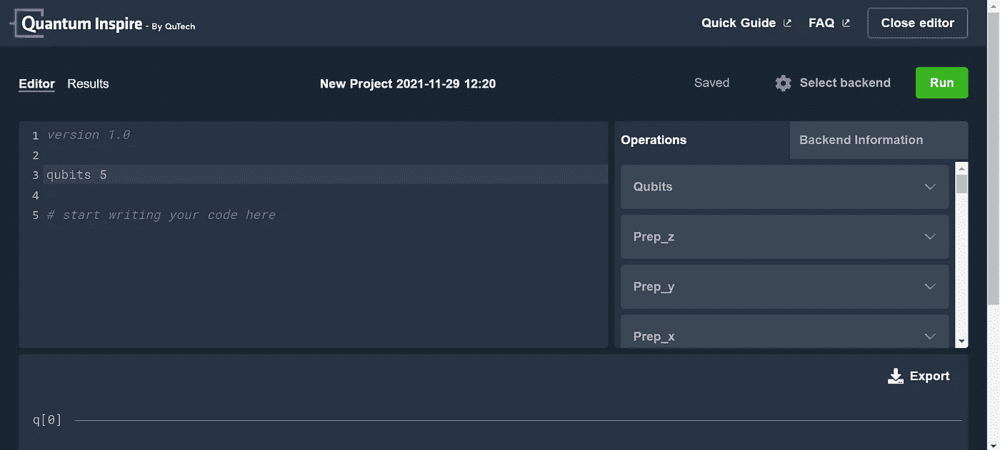
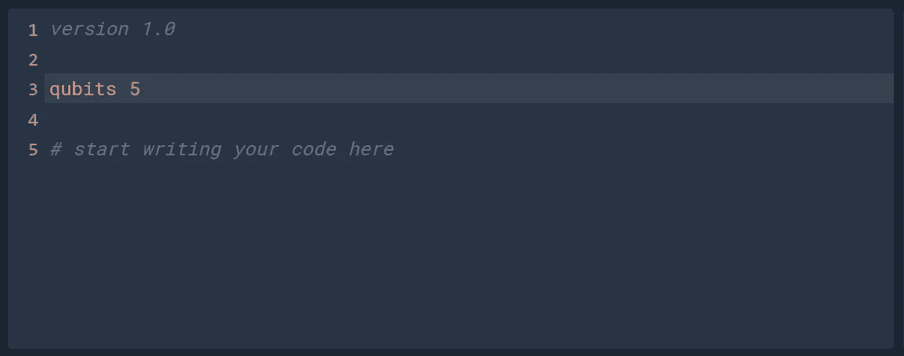
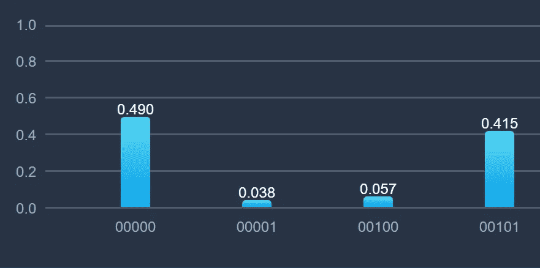
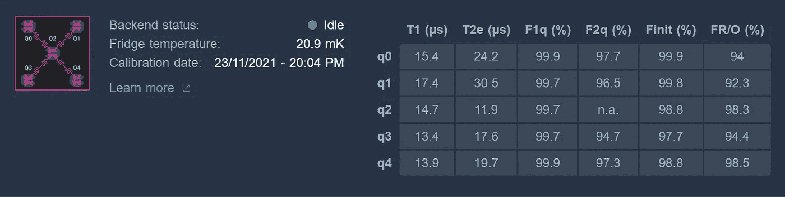

# 回顾:QuTech 的量子激励

> 原文：<https://levelup.gitconnected.com/review-qutechs-quantum-inspire-2aa560c05d14>

[https://www.quantum-inspire.com/](https://www.quantum-inspire.com/)

# 你个人的量子计算体验

几年前我发现了 Quantum Inspire (QI)，当时我正在努力自学 OpenQASM，还没有在 arXiv 上发现它的规范。当时，我只记得有一套标准的教程。他们还好。它们是基本的。但是，它们是用相对清晰的语言写的，所以我会把它们排在我的有史以来最好的量子计算教程的第三位，在 [Q-Ctrl](/review-q-ctrls-black-opal-tutorials-3e888ac76f84) 和 IBM 之后。

在很长一段时间没有访问 https://www.quantum-inspire.com/[网站后，我惊喜地发现了基于云计算的量子计算。有一个 2 量子位的“半导体电子自旋处理器”，一个 5 量子位的“超导量子处理器”，和三个模拟器，尽管其中一个模拟器不能通过免费帐户获得。](https://www.quantum-inspire.com/)

在我写这篇文章的时候，这个 2 量子比特设备是离线的。5 量子位设备和两个免费模拟器在线，队列中的作业总数为零。我不知道该把这归类为一件好事——至少我不用在运行我的实验时排队——还是一件坏事，似乎没有人使用这些资源。

## 好人

[https://www.quantum-inspire.com/](https://www.quantum-inspire.com/)

**没有蟒蛇！**

好吧，这有点夸张了。有一个[软件开发工具包](https://www.quantum-inspire.com/kbase/software-development-kit/)，据称如果你真的真的想使用 Python，你也可以使用，但是重点是 QuTech 的量子汇编语言，称为 cQASM。作为 IBM 第一个也是唯一一个非官方的 OpenQASM 倡导者，我全心全意地支持 QASM 的编辑，不管他们在哪里，即使有一个非常短暂的学习曲线来开始。虽然 cQASM 和 OpenQASM 之间有一些明显的差异，但适应这些变化最多需要一两分钟。

[https://www.quantum-inspire.com/](https://www.quantum-inspire.com/)

**屏幕指南**

cQASM 上手快的原因之一是屏幕右上方四分之一是语言资源。所以，*h q[0]；OpenQASM 中的*只是 cQASM 中的 *h q[0]* ？明白了。继续前进…

[https://www.quantum-inspire.com/](https://www.quantum-inspire.com/)

**鲜红色警告**

我写了大半辈子的代码，从没见过错误被如此清晰地指出。而且，至少有些错误是非常具体的。例如，对于 5 量子位设备，你必须初始化所有 5 个量子位。我试着改变它，系统再清楚不过了:我必须初始化所有五个。其他错误不太具体，但是如前所述，语言资源就在你面前。

**在其他基地初始化**

默认情况下，量子位以 z 为基础初始化。换句话说，它们都从|0 >开始。但是，您可以选择在 x 基(aka|+>)或 y 基(aka |i >)中初始化它们。

**测量其他基地**

所有三种碱基测量都是自然操作，而不是手动旋转来测量其他碱基。只需指定要测量的基准，然后 BAM 切换到结果选项卡。

**四分之一圈**

除了标准的半周轮换，正和负四分之一周轮换是所有三个基地的标准。我指出这一点是因为 IBM 只有 x 和 z 基数的四分之一循环，而 x 的四分之一循环相对较新。

**“显示”模拟器快捷键**

我没有尝试模拟器，但有两个命令被描述为模拟电路的快捷方式。

**又两个模拟量子位**

一个 QI 模拟器最多允许 34 个量子位，而 IBM OpenQASM 模拟器最多只允许 32 个。免责声明:无论如何，我发现这更多的是在理论上，而不是在实践中。模拟这么多量子比特纠缠会产生运行时间误差。但是，在理论上，QI 可以比 IBM 多模拟两个量子位。

**出口**

除了导出电路图，您还可以导出 csv 和 json 格式的直方图数据和原始数据。原始数据是逐镜头拍摄的结果。

[https://www.quantum-inspire.com/](https://www.quantum-inspire.com/)

**美观的电路图**

我更喜欢功能而不是形式，但我必须承认这是一个好看的电路图。

[https://www.quantum-inspire.com/](https://www.quantum-inspire.com/)

**赏心悦目的结果**

有了渐变和圆形边缘，直方图看起来也很不错。

## 坏事

**目标受众**

不是全部，但许多解释与 QuTech 的视频相符。如果你有物理学甚至数学的背景，它们可能没问题，但是对于计算机科学家和外行人来说几乎是难以理解的。因此，我的假设是《齐》并不适合所有的观众。

**初始化所有量子位**

正如前面在“亮红色警告”中提到的，无论你是否打算使用它们，所有的量子位都需要初始化。我在 IBM 设备上进行了测试，运行时间与初始化的量子位数量成正比。您可以通过对一个量子位应用 Hadamard 和 measurement，然后对所有可用的量子位应用 hada mard 和 measurement 来验证这一点。即使在更小的设备上，你也可以观察到仅仅几个量子位造成的运行时间差异。

[https://www.quantum-inspire.com/](https://www.quantum-inspire.com/)

**连接受限**

上面的“X”表明 Q2 具有 4 向连接性，这通常非常有用，然而其他四个量子位每个都只有单向连接性。没有直接连接的量子位需要相互交换，这是一种给电路增加消相干和误差的好方法。

**量子位质量**

将上面的数字与 IBM Quantum Experience 中的数字进行比较，我可以通过 IBM 获得更高质量的设备，而且是免费的。

**单轴旋转**

每次操作只能绕一个轴旋转。这与 IBM 的 U 和 CU3 gates 形成对比，后者允许你围绕 z 轴和 y 轴旋转。

**一次受控轴旋转**

除非你手动应用适当的单量子位旋转来绕其他轴旋转，否则你只能绕 z 轴执行受控旋转。

**无托夫里门**

Toffoli 门，又名 CCX，又名 CCNOT，又名受控-受控-x，又名受控-受控-非，又名和，不是 5 量子位设备固有的。如果您想要它的功能，您需要手动构造它。如果你想建造一个像 CCCCZ 这样的定制大门，通常由 Toffolis 组成，…好吧…祝你好运。请记住前面提到的量子位之间缺乏连通性。

**没有可视化效果**

在任何地方都找不到布洛赫球或 Q 球。我不记得在其他任何地方看到过完全没有可视化。

**无复位**

公平地说，IBM 最初只在其模拟器上提供重置功能，而在其任何设备上都没有。然而，重置在 IBM 设备上可用已经有一段时间了，而 QI 还没有实现它。

**无经典控制逻辑**

同样，IBM 设备最初也不允许这样做。然而，像 reset gates 一样，这个功能已经有一段时间了，而 QI 还没有实现它。

## 丑陋的

**自己交换**

如果你试图在两个不相连的量子位上执行多量子位操作，例如 CX 门，你会得到一个亮红色的警告。在 IBM 设备上，量子位在传输过程中为你交换，这样电路仍然可以运行。但是，在齐，没有。你必须自己去做。

**慢速运行时间**

我只运行了“你好，量子世界”实验，即使官方运行时间据报道为 0.156 秒，但没有队列的实际运行时间大致为 1 分钟。我实际上没有计时，但是考虑到使用任何设备似乎都没有任何竞争，所以感觉很慢。

**没有弗雷德金·盖茨**

我在“坏”和“丑”之间摇摆不定，但我使用弗雷德金门，又名受控交换，广泛用于量子机器学习，特别是[量子分类](https://medium.com/swlh/quantum-classification-cecbc7831be)和[量子聚类](/quantum-clustering-c498b089b88e)。像托夫里门一样，当然有可能构建一个弗雷德金门，但我相信最小的 transpiled 门数是 14，这并不包括前面提到的有限量子位连接。

## 结论

尽管有许多“不好”和“丑陋”的地方，我对 Quantum Inspire 的总体看法是积极的。尽管开发远远落后于我最熟悉的供应商 IBM，但在 QuTech 从头开始制造设备一定很有趣。我需要记得时不时来看看有什么新消息。

根据您的需要，尤其是如果您只是在学习，您可以免费获得两个设备和两个模拟器。我一整天都在检查，除了一个离线设备，其他设备在我每次检查时都是“空闲”的。因此，如果你能在限制范围内工作，你就可以在真正的硬件上运行所有你想要的电路，只需要大约一分钟来等待结果。很坦率地说，这感觉就像拥有了自己的个人量子计算中心。