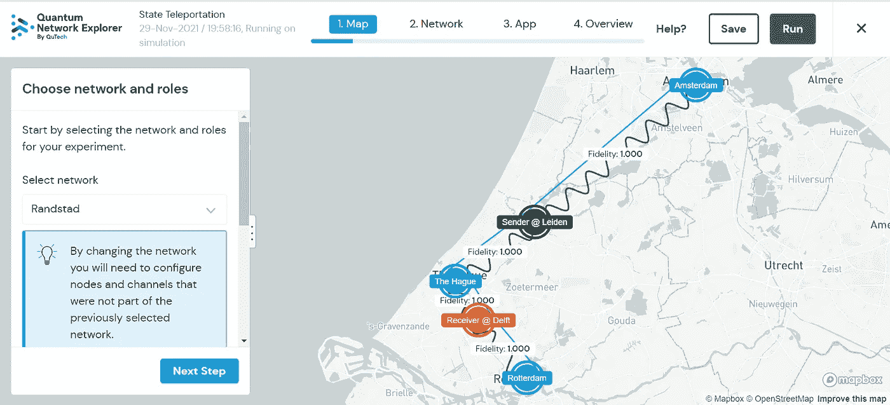
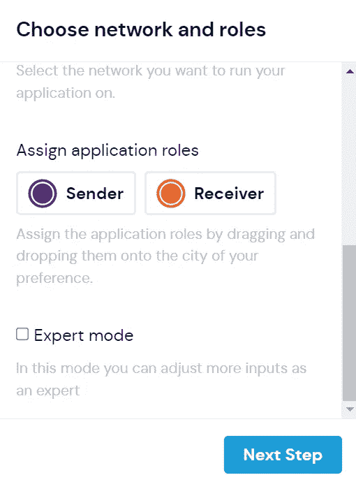
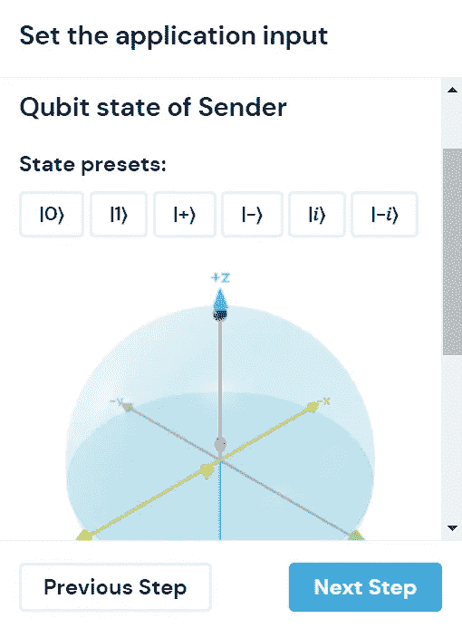
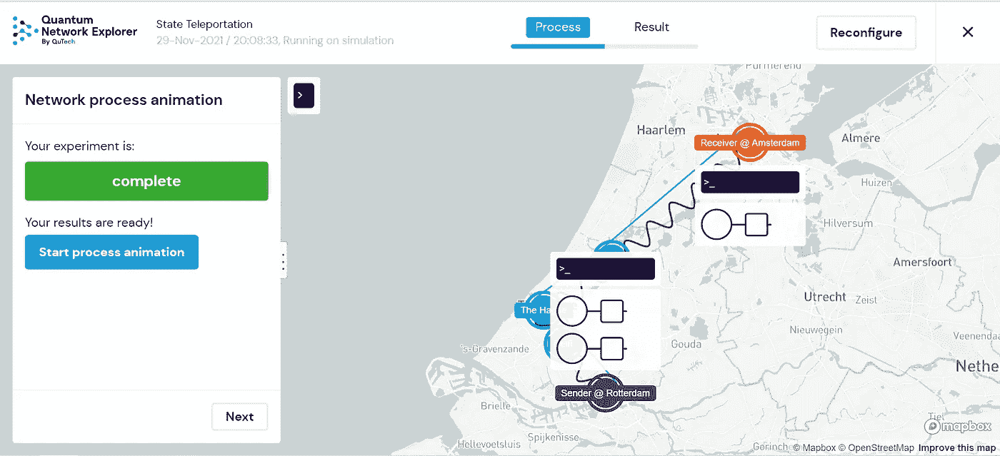

# 回顾:QuTech 的量子网络探索者

> 原文：<https://levelup.gitconnected.com/review-qutechs-quantum-network-explorer-397d251eadf>

[https://www.quantum-network.com/](https://www.quantum-network.com/)

# 简短的漫游

什么是量子网络，量子互联网如何工作？除了阅读这些问题的答案，我可以让你对 QuTech 的交互式可视化感兴趣吗？

[量子网络探索者](https://www.quantum-network.com/)首先给你一个选择。你想以“初学者”还是“专家”的身份继续下去出于评估目的，我选择了“初学者”

作为初学者，您可以选择三个预构建的应用程序。我考虑探索的应用是隐形传态和量子密钥分发(QKD)，因为这是我最熟悉的两个。我最终选择了传送，因为这是量子计算的标准入门教程。许多读者可能对 QKD 很熟悉，但我认为对心灵运输更熟悉。

令人震惊的是，传送的描述是用简单的英语写的。没有数学方程式或物理术语。这就好像 QuTech 想让普通大众理解这个概念。所以，那很好。

顺便说一句，值得注意的是，量子网络探索者将“隐形传态”称为“态隐形传态”。这是一个更好的描述，我天真地希望它的使用将获得广泛的采用。

【https://www.quantum-network.com/account/login 

[https://www.quantum-network.com/account/login](https://www.quantum-network.com/account/login)

该界面允许您非常容易地设置参数。看地图；您希望发送方爱丽丝在哪里，接收方鲍勃在哪里？只是拖放。然后，看着布洛赫球，选择一个预定义的量子态，或者设置你想要的θ和φ的任何角度。没有代码。再简单不过了。

[https://www.quantum-network.com/](https://www.quantum-network.com/)

设置完这些参数后，您将看到一个逐步的动画。你可以在地图上看到量子态的转变。你也可以看到一些细节，但从技术上来说，这并不是压倒性的。只要你已经完成了一个状态传送的教程，你真的应该能够跟上。

## 结论

试试看！它是免费的。制作精良。比我在这里回顾的要多得多。而且，我敢说很好玩。