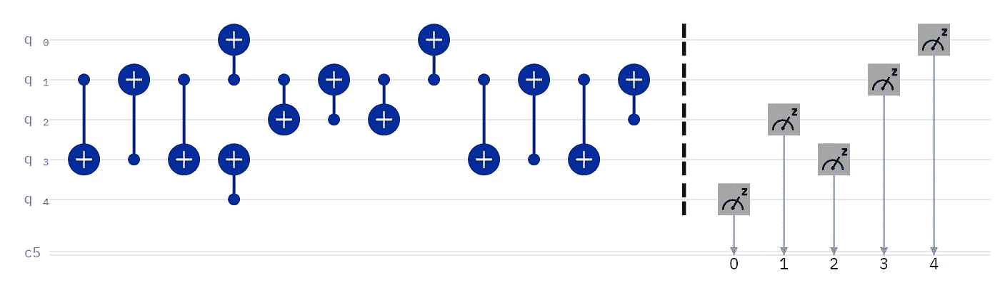

# 回顾:里盖蒂的 quilc

> 原文：<https://levelup.gitconnected.com/review-rigettis-quilc-579aa434815>

# quil 语言编译器

我被要求回顾 Rigetti 的 quilc，所以显而易见的第一个问题是:quilc 是什么？你可能听说过 Rigetti 的 quil 语言；quilc 是这种语言的编译器。你可能会问，什么是编译器？让我们一起虚拟漫步吧，年轻的学徒…

## quilc 是给程序员用的

Python 是量子计算的语言，因为它又快又容易学。你不必成为一个铁杆程序员来使用它，因为 Python 抽象出了细节。你可以专注于物理和化学等等，而不用担心你的经典计算机硬件在做什么。这类似于对量子位应用哈达玛门；你可以在没有任何微波脉冲知识的情况下进行量子计算。

在命令行界面、对 Linux 的强调、文档中的一些参考等等之间，quilc 显然是面向程序员的。所以，如果你不是程序员，也不想成为程序员，让我们先确定 quilc 是为程序员准备的。

## 汇编

当你运行 Python 代码时，你只是运行它。你的电脑会在运行过程中计算出它在做什么。但是，你的电脑不懂 Python。就此而言，它不理解任何其他语言。所以，这意味着你首选的编程语言必须首先被翻译成你的计算机能够理解的代码。这需要时间。

所以很多编程语言都是编译的。我的源代码在执行之前被优化并翻译成机器码，因此运行我的应用程序比其他情况下更快。当在你的屏幕上显示“你好，世界”时，这有关系吗？不能。但是，对于要求高性能的应用程序，绝对可以。

## 减速

使用 Python，您只需点击“运行”按钮。没有比这更简单的了。编译会减慢速度，这取决于需要编译多少代码。这里不需要太多的技术，你可以把它看作一个额外的步骤:编译然后运行，而不仅仅是运行。在所有其他条件相同的情况下，两步比一步耗时更长，尤其是当第一步可能需要一段时间的时候。

但是，等等，我刚才不是提到了性能吗？是的，但那是运行时间。Python 之所以吸引人，是因为开发生命周期很快。不断的重新编译减缓了开发生命周期，但最终换来的是卓越的性能。例如，这就是为什么 Tesla 快速开发 Python 应用程序，然后将其翻译成 C++以提高性能的原因。

## 最佳化

除了缩短经典运行时间(不是量子处理器的排队时间，那是不同的)之外，quilc 声称提供了多种优化功能:

1.  Rigetti 处理器的门优化
2.  量子位重新布线，这是一件大事:你可以专注于让你的算法工作，而编译器根据最佳连接分配物理量子位，从而最小化 CNOT 门数量和电路深度

IBM 量子传输电路最初有一个交换门(三个 CNOT 门)

3.量子位重新布线以防止早期交换门；上面的 IBM 量子传输电路显示了量子位 1 和量子位 3 之间的交换，quilc 承诺通过重新布线来消除这种交换

4.可移植性，也就是说你可以在不同的设备上运行你的电路，量子位重新布线将为你优化量子位分配

## 多线程操作

这又是一个关于经典代码的性能问题。想象一下，你可以同时对你所有的量子位进行操作，而不是一次一个量子位地顺序操作。经典计算通常被认为是顺序的，事实也的确如此，但是也有可能同时并行执行代码。因此，除了通过编译加速经典代码之外，quilc 还允许您最大限度地利用经典硬件。

## 术语

我对 quilc 的主要问题是 Rigetti 似乎对所有事情都使用专有术语。不要误解我:一切都是显而易见的。但是，量子计算已经被拥有多个名字的事物所困扰；我们需要的是缓解，而不是加剧。我希望所有与会者能在某个时候努力实现术语的标准化。

因为除了熟悉 Rigetti 的术语之外，别忘了在使用他们的 quilc 编译器之前，你还必须学习他们的 quil 语言。而且，如果你不是程序员，可能有些编程概念对你来说是新的。其中至少有两个似乎是不必要的使用障碍。

## 结论

你以前编译过代码吗？在 NISQ 时代很难证明这一点，尽管目前还没有量子应用。但是，如果我有大量的量子位和一个真实世界的应用程序，我至少要运行一个基准测试实验。现在，您可以开始使用 quilc 为这种可能性做准备，但是只要我们处于探索模式——这是来自一个 C 程序员——就很难证明与 Python 相比更长的开发时间是合理的。也就是说，这只是一种可能性；Rigetti 为后 NISQ 时代做了很好的定位。