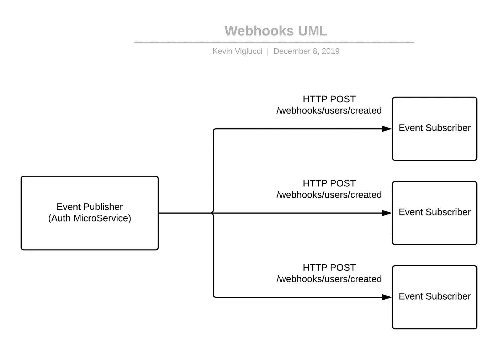
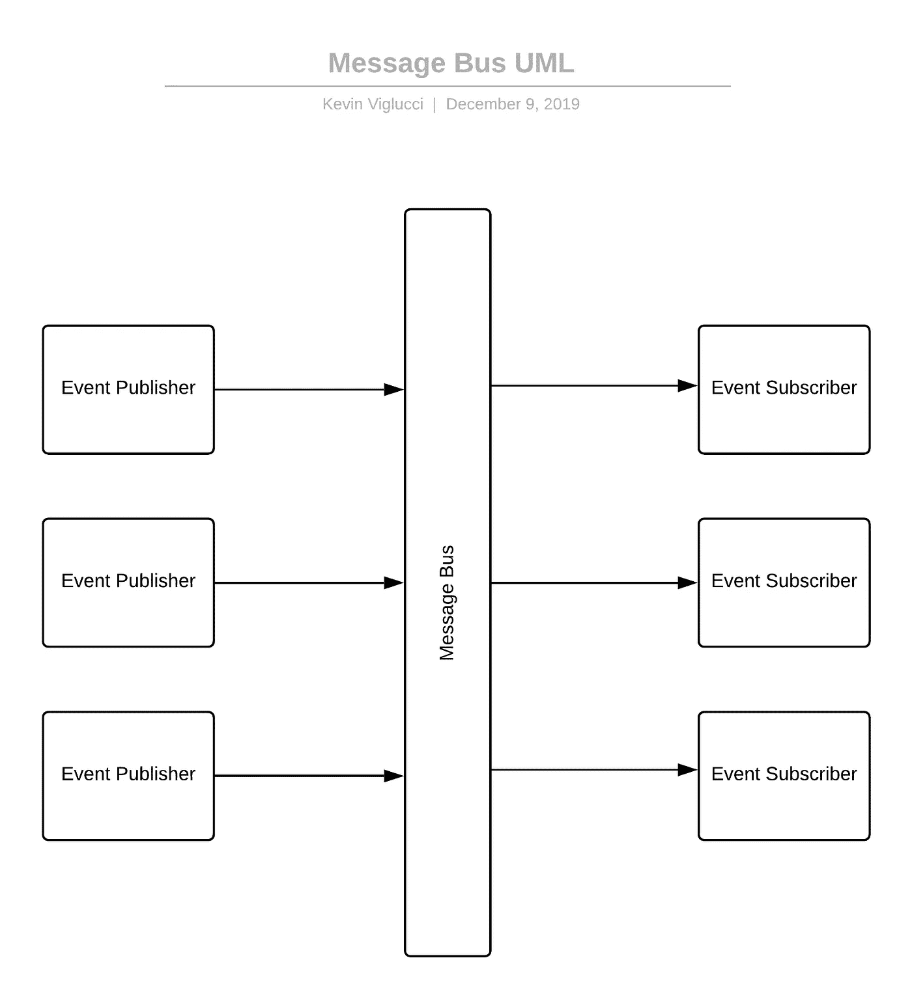
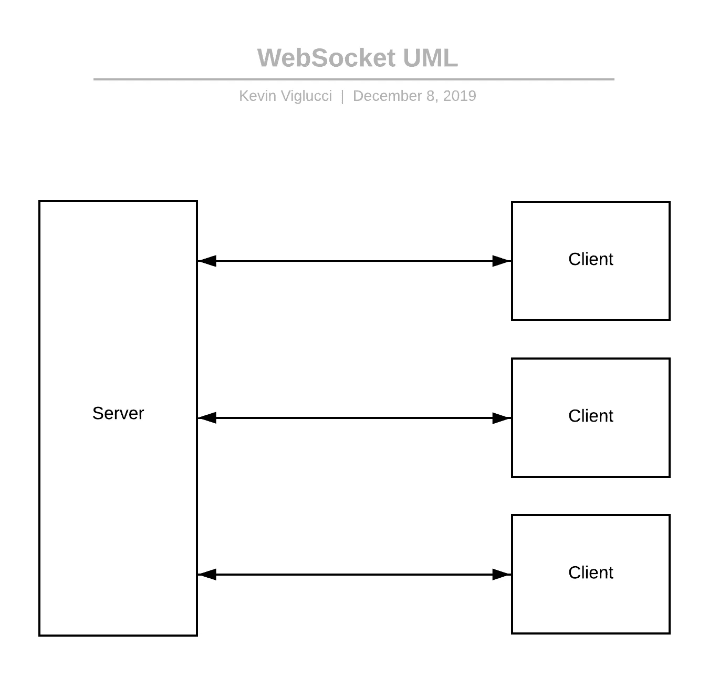

# 回顾分布式系统架构中的消息传递

> 原文：<https://levelup.gitconnected.com/reviewing-messaging-in-distributed-system-architectures-6cf2fd7b8b4e>

实时反应系统是我最喜欢构建的系统类型之一；然而，它们可能是令人望而生畏的任务，尤其是在学习一种新的编程语言或生态系统的过程中。最近，当我开始利用 Javascript/React & Java/Spring 构建一个“简单的”实时客户机/服务器应用程序时，这种想法更加坚定了，在这里我很快了解了几个新的消息传递协议(Stomp & RSocket)。

除了作为坎宁安定律的一个练习，这篇文章旨在加速你的分布式系统研究的开始，并为你节省一些我已经花在搜索互联网和 T2 在 Twitter 上尖叫的时间投资。

**你应该从这篇文章中期待什么？**

本文是对使用几种常见模式构建实时/分布式系统相关主题的高级概述，最终提供了对 RSocket 协议的高级概述。本文的目标不是提供完全有效的完整代码示例，也不是深入探究任何一个主题。相反，本文旨在指导读者理解常见的术语和概念，以便他们在其他地方继续研究时能够更容易地获得更深入的理解。

# 什么是分布式系统？

分布式系统拥有一个核心特征，即网络边界将各个系统组件分开。此外，在实时分布式系统中，当变化发生在整个系统拓扑上时，每个组件自动地对变化作出反应，而不需要系统的组件监视或定期检查系统的其他部分以查看是否有变化。主要使用无状态通信协议(如 HTTP)实现这样的系统通常被认为是不好的做法，因为它很快导致依赖于浪费的轮询技术的实现。然而，有许多模式可以克服 HTTP 轮询的浪费特性。

您今天可能看到的一些常见模式包括 Webhooks、消息传递系统(总线、代理和队列)以及使用持久连接协议(如 TCP、WebSockets 和不太常见的 Aeron)实现的双工数据流。

# Webhooks

webhooks 的实现可能是最容易理解和实现的(作为消费者)之一，因为它不比向应用程序(消费者)添加 HTTP 路由处理程序和接受来自事件发布者的 HTTP 请求更复杂。

该模式的核心是发布者和消费者之间的协议，即当特定事件发生时，发布者同意对消费者应用程序上实现的端点执行 HTTP 请求，并可能在每个请求中包含一些数据。

一旦消费者接收到来自发布者的请求，消费者现在可以采取一些后续行动。这个后续操作可能包括修改数据库中的记录、执行返回给发布者的 HTTP 请求以使用一些附加数据或许多其他操作。天空是极限。然而，这种关系在某些情况下会出现问题。例如，在发布者发布大量消息的系统中，或者在发布者的吞吐量高于其消费者的吞吐量的系统中，对消费者的请求通常会“积压”，从而在消费者和发布者都在努力释放资源时造成压力。

# 消息总线、代理和队列

消息总线、代理和队列是 webhooks 的升级，因为它们避免了实现 webhooks 时常见的一些可伸缩性问题。使用 webhooks，事件发布者需要跟踪对任何给定事件感兴趣的每个消费者，并在事件发生时单独通知每个消费者。在大规模情况下，随着发布者发布的事件数量和对这些事件感兴趣的消费者数量的有机增长，这一特性会很快带来性能问题。

为了克服这些挑战，消息总线、消息代理或消息队列实现了相似但不同的模式，它们与充当“中间人”的中间组件进行交互该中间人负责接收来自事件发布者的事件，并将这些事件重新发布给每个相关的消费者/订户，或者负责接收消费者要求任何新消息的请求。然而，后一种策略(由消费者进行轮询)不太常见，而且更加耗费资源。因此，代理发布消息的速度越快，消费者就越容易收到代理“推送”的消息。代理和消费者之间的这种关系给消费者带来了与 webhooks 相同的负担，因为他们必须以发布消息的速度消费消息，否则会冒系统重新排队甚至丢弃消息的风险。

为了实现事件的重新发布并大规模克服上述问题，系统通常涉及支持发布者和中间人之间持久连接的高性能组件，如 [Redis](https://redis.io/) 、[阿帕奇卡夫卡](https://kafka.apache.org/)、 [AMQP](https://www.amqp.org/) / [兔子 MQ](https://www.rabbitmq.com/) ，或云产品如 [AWS SQS](https://aws.amazon.com/sqs/) 。通过使用这种媒介，轮子中的每个齿轮(发布者、媒介和消费者)都可以独立伸缩，并获得其他好处，如避免为每个发布的消息建立 TCP 连接的开销。

除了系统组件的独立扩展和避免短暂 TCP 连接的开销之外，消息总线的使用允许事件发布者不知道事件的数量，甚至不知道谁是事件的消费者，而只关心与中间人的通信。此外，消费者/订户受益于这种模式，因为他们不知道哪些应用程序正在发布事件，而只需要关心与总线/代理/队列的通信。

# WebSockets 和 TCP

如果您已经深入了解了本文，那么您应该还记得在上一节中，我们提到了维护中间人之间的持久连接是避免短暂 TCP 连接开销的常用策略。设计良好的分布式系统的这一特征也适用于使用诸如 TCP(对于直接支持它的客户端/语言)或 WebSockets(在不直接支持 TCP 的情况下)之类的网络协议在发布者和消费者之间直接建立持久连接。

然而，在客户机/服务器(在这个场景中，客户机/服务器都可以是消费者或发布者)之间建立直接的持久连接，重新引入了一些通过利用消息总线作为中间人所克服的复杂性。最重要的是，建立连接的一方需要预先知道其他方的域名或直接 IP 地址，以及随着更多的客户端和服务器被添加到拓扑中，扩展整个系统的复杂性增加。无论如何，利用 WebSockets 或原始 TCP 作为系统组件之间的通信协议有许多额外的好处，其中最重要的一点是数据可以“双向流动”，这与 Webhooks 和消息总线相比是独一无二的。

**双工通信**

Webhooks 和消息总线系统实现的一个特征通常是数据只在一个方向上流动，从发布者到消费者，这与利用原始 TCP 或 WebSockets 的双工通信系统相反，在双工通信系统中，数据在两个方向上无缝地在组件之间流动。这种通过网络边界在两个连接的组件之间进行的双向数据传输称为“双工通信”，它允许连接的两端以最小的开销对另一端发生的变化和事件做出反应，但增加了围绕消息格式(协议)的实现复杂性。

**消息格式**

类似于自然口语使用一系列双方都同意的规则和期望，所有的网络交流也是如此。这种消息格式通常被称为“协议”，它指示所有相关方如何构造消息、预期的消息以及可能的顺序。

消息协议的简单实现可能定义以下参数和约束:

*   每隔 1000 毫秒，每个参与者将向另一个参与者发送一条“保活”消息；否则，任何一方都可以在他们认为合适的时候终止连接。
*   交换中的每条消息必须只包含可序列化为有效 JSON 的 UTF8 编码字符串。
*   每个消息包括一个`id`和一个`data`属性。

该协议中的一个示例消息可能如下所示:

有了这样的协议，利用它的通信参与者将拥有以预期和可理解的方式处理传入消息所需的一切。在现实世界的应用程序中，这可能表现为应用程序调用一个`UserEventHandler`类上的`userCreated`方法，在这个类中，应用程序已经实现了在接收到一个`id`为`user_created`的消息时随时调用。

对于最简单的系统，甚至是一些中度活跃/复杂的系统，这样的协议将包含足够的功能，以允许系统的成功开发，具有相对简单(但仍然足够复杂和有特色)的协议的例子，例如包括 [Stomp](https://stomp.github.io/) 和 [XMPP](https://xmpp.org/) 的协议。类似的协议在当今的现代应用中广泛使用。然而，它们没有提供机制来克服过载消费者的常见缺陷；然而，协议中一些最近的发展确实考虑到了这一点，例如 [RSocket](http://rsocket.io/) ，通过[背压](https://www.reactivemanifesto.org/glossary#Back-Pressure)的概念。

# RSocket 概述的最高级别

RSocket 是分布式系统领域相对较新的一员，自 2018 年下半年以来，搜索词在美国的受欢迎程度才刚刚开始增加(根据 [Google Trends](https://trends.google.com/trends/explore?date=today%205-y&geo=US&q=RSocket) )。然而，它提供了一些令人兴奋的概念，我个人很想深入研究。

**背压**

RSocket 支持[背压](https://www.reactivemanifesto.org/glossary#Back-Pressure)的概念，其核心意思是系统的任何给定组件都有权控制其自身与系统其他组件之间的消息传输速率。这个概念允许客户端向服务器传达它准备处理 N 个消息，并且服务器应该向它发送不超过 N 个消息，而无需客户端请求额外的消息。

**消息类型**

RSocket 协议支持多种消息类型，每种类型都满足在各种系统中使用的通用请求/响应模式。

**发射并忘记** —客户端向服务器发送消息，并且不期望服务器发送响应。客户端立即发送消息。

**请求响应** —客户端要向服务器发送一条消息，并期望服务器只响应一条响应消息。客户端不发送请求消息，直到它也准备好处理响应。

**请求流** —客户端向服务器发送请求，并期望服务器以 N 个响应进行响应。客户端在准备好处理响应之前不会发送请求，服务器在客户端执行了 N 个响应的后续请求之后才会发送响应。

**请求通道** —客户端和服务器各自准备好向对方发送和接收 N 条消息。客户端和服务器都不会向对方发送消息，直到对方通过首先向对方请求 N 条消息来表示准备好处理消息。

**多语言实现**

尽管 RSocket 是一项相对较新的技术，但该协议可以在任何语言或运行时中实现，可以直接利用 TCP 或 WebSockets。该协议的这一特性允许在 Java、Javascript、Go、.NET、C++和 Kotlin。语言实现的完整列表和完整的协议特性集可以在官方 [RSocket 网站](http://rsocket.io/)上查看。

# Webhooks、消息总线和 WebSockets，天啊！

我们讨论了很多内容，回顾了 Webhooks、消息总线、WebSockets，最后概述了 RSocket。幸运的话，这篇文章已经帮助您学习了一些新的东西，并帮助您决定哪种架构最适合您的应用程序的用例及需求。

如果你觉得这篇文章有帮助，请在下面的评论中告诉我，在 Twitter 上给我留言(下面简历中的链接)，或者如果你愿意，在你最喜欢的社交媒体网络上分享它。如果你发现这篇文章很不准确，或者对任何内容有其他问题，请随时在 Twitter 上给我发送你最喜欢的轻蔑的 meme。我可以建议一个当前的趋势吗？

*最初发布于*[https://viglucci . io/reviewing-distributed-system-architectures](https://viglucci.io/reviewing-distributed-system-architectures)*。*