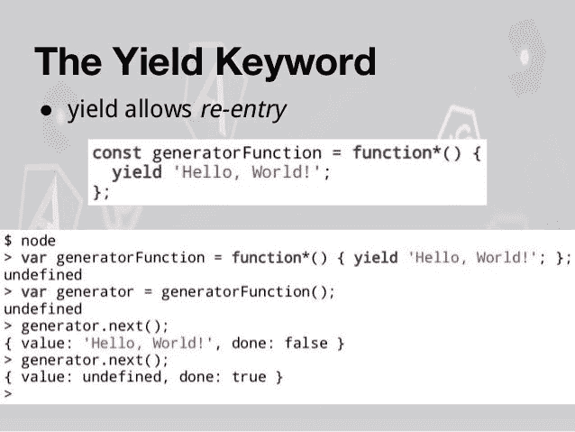
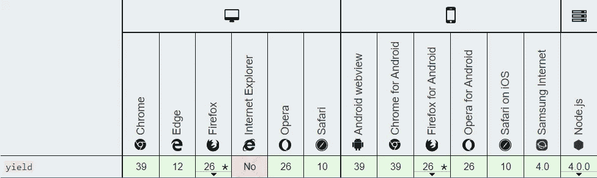

# 重新审视 JavaScript 中的 Yield 关键字

> 原文：<https://levelup.gitconnected.com/revisiting-yield-keyword-in-javascript-74a1ec108193>


使用`yield`关键字，我们可以异步暂停和恢复一个生成器函数。

一个[生成器函数](https://medium.com/javascript-in-plain-english/how-to-use-the-generator-function-in-javascript-continued-aada07d220c7)基本上是一个普通的函数，但是不同之处在于，每当函数返回任何值时，它都借助于关键字' ***yield*** '来完成。

> Yield 关键字可以被认为是基于生成器的 return 关键字版本。

## 语法:

```
[returnValue] = yield [expression]
```

*   **表达式|可选:**定义通过迭代器协议从生成器函数返回的值。如果省略，则返回 undefined。
*   **returnValue | Optional :** 检索传递给生成器的 ***next()*** 方法的可选值，以继续执行。

后跟`**yield**` 关键字的表达式值返回给生成器的调用者。我们不能从回调或嵌套函数中调用`**yield**` ，它只能从包含的生成器函数中调用。

```
function* yieldFunction(index) {
  while (index < 3) {
    yield index++;
  }
}const iterator = yieldFunction(1);
console.log(iterator.next());
console.log(iterator.next());**Output -->**
{ value: 1, done: false }
{ value: 2, done: false }
```

正如我们在上面的例子中看到的， ***yield*** 关键字导致调用生成器的 ***next()*** 方法，该方法返回一个 **IteratorResult** 对象。

**IteratorResult** 对象有两个属性:`value`和`done`。`value`属性包含 yield 表达式的评估值，而`done`指示生成器函数是否已经完全执行。

暂停 ***产生*** 表达式会导致发生器功能暂停。只有当我们调用 ***next()*** 方法时，它才会被恢复。当遇到 ***next()*** 方法时，该函数继续工作，直到面对另一个 ***yield*** 或返回表达式。

## 另一个例子:

```
function* displayHeroes () {
   var justiceLeaque = 
     ['Batman', 'Superman', 'Flash', 'Wonder Woman'];
   for (var hero = 0; hero < justiceLeaque.length; hero++) {
      yield justiceLeaque[hero];
   }
}var hero = displayHeroes();console.log(hero.next());
console.log(hero.next());
console.log(hero.next());
console.log(hero.next());
console.log(hero.next());**Output -->**
{ value: 'Batman', done: false }
{ value: 'Superman', done: false }
{ value: 'Flash', done: false }
{ value: 'Wonder Woman', done: false }
{ value: undefined, done: true }
```



# 用例

**1。**在我看来，使用`yield`最大的好处就是我们可以**消除所有的嵌套回调问题**。

它的方式是通过引入**协同例程**的概念，这是一个可以自动停止/暂停的功能，直到它得到它需要的东西。在 JavaScript 中，这由`function*`表示。只有`function*`功能可以使用`yield`。让我们看看下面的例子:

```
loadFromDB('someQuery', function (err, result) {
  // Do something with the result or handle the error
})
```

这很笨拙，因为现在我们所有的代码(显然需要等待这个`loadFromDB`调用)都需要在这个难看的回调中。

这种方法不好，原因如下:

*   所有代码都缩进一级
*   我们有这一端`})`,我们需要在任何地方跟踪它
*   所有这些多余的术语
*   不太清楚我们这样做是为了给`result`赋值

另一方面，使用`yield`，在 nice 协同例程框架的帮助下，所有这些都可以在*一行*中完成。

```
function* main() {
  var result = yield loadFromDB('someQuery')
}
```

**2。它可用于向生成器发送值。**

```
function *sendValue() {
    x = yield (0);
    yield x*x;
}

var gen = sendValue();

console.log(gen.next().value);  // prints 0
console.log(gen.next(2).value); // prints 4
```

这是可行的，因为值`2`被分配给`x`，在发生器停止在第一个产量(返回`0`)后，将其发送给发生器。

**3。斐波那契数列生成器**使用 yield 关键字，尽管这不是最好的做法。

```
function* getFibbonaciSeries(){
    var a = -1, b = 1, c;
    while(1){
        c = a + b;
        a = b;
        b = c;
        yield c;
    }   
}var fibonacciGenerator = getFibbonaciSeries();
console.log(fibonacciGenerator.next().value); // 0 
console.log(fibonacciGenerator.next().value); // 1
console.log(fibonacciGenerator.next().value); // 1
console.log(fibonacciGenerator.next().value); // 2 
console.log(fibonacciGenerator.next().value); // 3
```

**4。异步 JavaScript 调用之间的依赖关系**

```
function getRequest(url) {
  axios.get(url).then((reponse) => {
    it.next(response);
  })
}function* main() {
  const result1 = yield getRequest('[http://some.api.com'](http://some.api.com') );
  const result2 = yield getRequest('[http://some.otherapi?id='](http://some.otherapi?id=') + result1.id );
  console.log('Your response is: ' + result2.value);
}var it = main();
it.next()
```

# 浏览器兼容性



## 参考

[Mozilla Web Docs](https://developer.mozilla.org/en-US/docs/Web/JavaScript/Reference/Operators/yield)
[堆栈溢出](https://stackoverflow.com/questions/2282140/whats-the-yield-keyword-in-javascript)