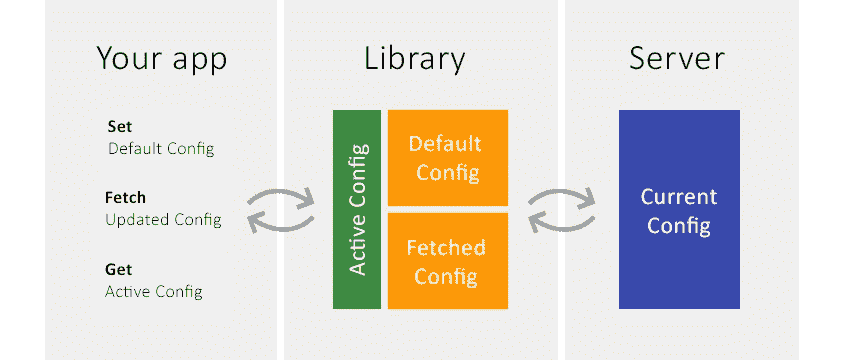
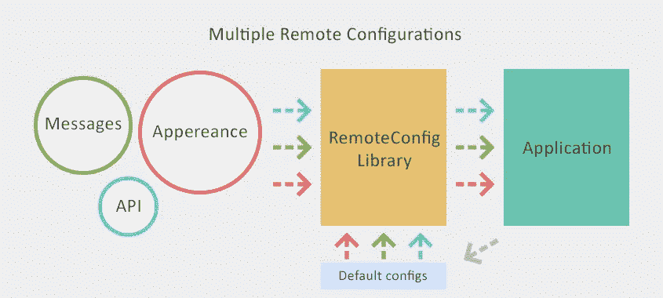

# 重写 Firebase RemoteConfig

> 原文：<https://levelup.gitconnected.com/rewriting-firebase-remoteconfig-b831e86247c8>

远程配置如何工作—Giuseppe giacopo

TLTR；我开发了一个 Kotlin 库，旨在比 Firebase RemoteConfig 更加灵活😎

你可以在这里找到它:[https://github.com/GiuseppeGiacoppo/RemoteConfig](https://github.com/GiuseppeGiacoppo/RemoteConfig)

它适用于任何 Kotlin 项目，而不仅仅是 Android🎉

如果你是一名 Android 开发者，迟早你会面临这个世界上最常见的问题之一:

> 如何在不发布新版本的情况下更改生产应用程序中的某些内容？

我指的不是部署新功能或改变整个流程这样的大事，而是有许多常见的问题:

*   强制用户升级应用程序。有时候你解决了一个 bug，你需要停止一个特定版本的应用
*   更改业务逻辑中的某些部分。您想要禁用或启用某些功能，更改 API 服务的基本 url，等等。
*   使用户界面可远程配置。它可以是一个标签、一条信息或你的调色板

Firebase 有一个非常有用的工具叫做 RemoteConfig。一旦您在他们的平台上配置了您的项目并包含了适当的库，它就允许您获取一个键值数据结构并在您的应用程序中使用这些值。

> 很酷，对吧？是的，但是..

但是有一个问题:你被迫使用单一的键值结构😒不可能有像这样复杂的物体:

您不能有多个具有不同提取逻辑的配置:

出于这些原因，我决定重写 RemoteConfig🙌

我的远程配置版本——朱塞佩·贾科波

首先我定义了图书馆应该做什么。对于每个配置(也称为*远程资源*):

*   让用户设置默认配置
*   让用户从远程获取配置
*   让用户手动激活配置

最后一点可能看起来是一个限制，但相反，它是一个好东西。它将允许用户立即激活上次获取的配置，然后在后台获取新的配置，这些配置不会影响正在运行的应用程序，直到您手动激活它们

另一个重要步骤是定义:

*   可以匹配配置结构的类
*   远程配置所在的位置(也称为*资源远程存储库*
*   在那里可以保存下载的配置 *(ResourceLocalRepository* )

由于这些原因，与 FirebaseRemoteConfig 相比，library 需要以更广泛的方式进行初始化，但 Kotlin 允许以一种非常干净的方式来完成:

只有几行代码:

*   MessagesConfig 类的 RemoteResource 已在 RemoteConfig 库中注册。它定义了配置的存储位置和获取位置
*   MessagesConfig 实例可以很容易地注入到您的应用程序中(KTX 是游戏规则的改变者)

> 就是这样！

你可以在自述文件中找到其他很酷的特性。您可以拥有多个匹配同一类的配置，您甚至可以扩展您自己的远程存储库，并以 YAML、原始文件或任何其他格式提供您的配置！

请随意尝试，并在评论中告诉我你对它的看法！

该库是开源的，可以在 Github 上通过以下链接获得:[https://github.com/GiuseppeGiacoppo/RemoteConfig](https://github.com/GiuseppeGiacoppo/RemoteConfig)

如果你来到这里，我要告诉你一个秘密:我正在开发一个 Android 扩展，所以你可以按照 Android 的指导方针存储配置文件(Java 文件 API 在这个环境中不是最好的)👌