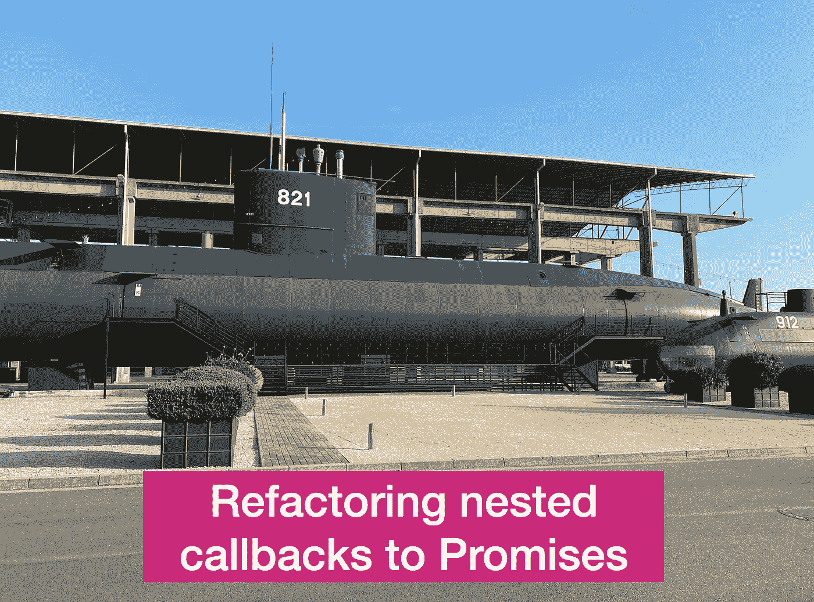

# 用承诺和异步/等待语法重写嵌套回调

> 原文：<https://levelup.gitconnected.com/rewriting-nested-callbacks-with-promises-and-async-await-syntax-ade1a0fe2d3d>

让我们考虑下面一个简单的 NodeJS 脚本，它从命令行运行一个调查问卷:

这是一段老式的 JS 代码，说明了在 *rl.question* 方法调用中嵌套回调的常见问题。

为了用现代语法重写它，首先应该定义承诺。

这里使用了[箭头](https://developer.mozilla.org/en-US/docs/Web/JavaScript/Reference/Functions/Arrow_functions)函数来创建一个新的承诺，该承诺接受两个特定的回调函数 *resolve* 和 *reject* 。在 promise 主体中调用这些函数，以便在成功和失败的情况下返回值。成功时叫做决心，失败时叫做拒绝，而成功时叫做决心。

承诺是异步执行的。这意味着执行流程在下一条语句之后继续，而不等待 promise 表达式返回值。

然而，操作符 *await* 允许暂停一个执行流，以便等待承诺解析(或拒绝)并返回一个值。Await 只能在用 *async* 关键字注释的函数中调用。

应用了*异步*和*等待*的结果脚本如下:

这种方法允许以更可读的方式重写嵌套的回调。

*参考文献*:

1.  [箭头功能。MDN](https://developer.mozilla.org/en-US/docs/Web/JavaScript/Reference/Functions/Arrow_functions)
2.  等待。MDN
3.  [答应。MDN](https://developer.mozilla.org/en-US/docs/Web/JavaScript/Reference/Global_Objects/Promise)