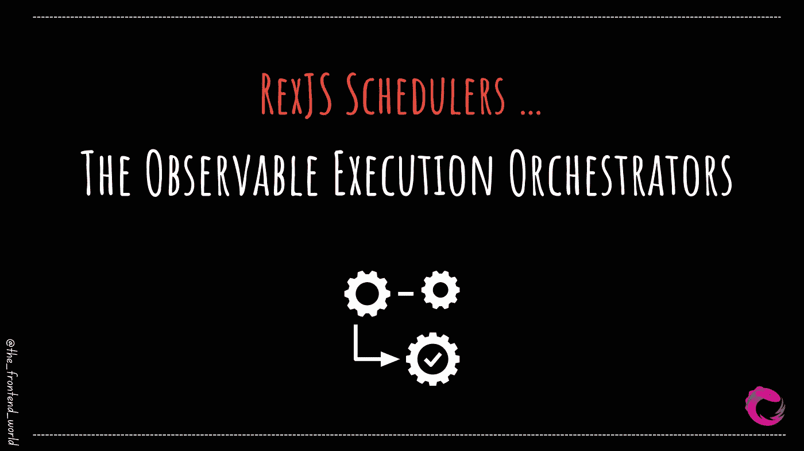
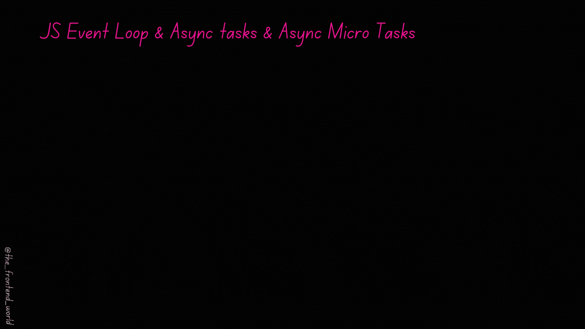
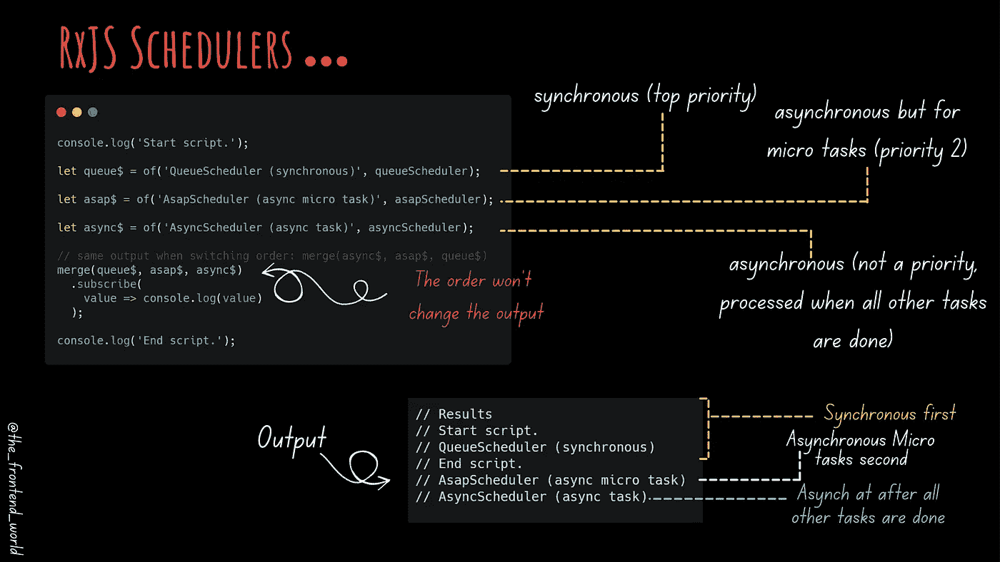

# RexJS 调度器…可观察的执行编排器

> 原文：<https://levelup.gitconnected.com/rexjs-schedulers-the-observable-execution-orchestrators-60479ece23da>

## RxJS 中的调度器是什么？

作者:FAM

这是一篇热门文章，我知道你们中的很多人要求发表它，它花了一些时间来发表，所以很抱歉……(我是全职前端开发人员^^')为我所有的待办事项列表找到时间并不容易。

现在，让我们直接跳到我们的 RxJS 管弦乐队。

# RxJS 中的调度器是什么？

> 计划程序控制订阅开始的时间和通知传递的时间。它由三部分组成。—做出反应

调度器只是为您编排执行上下文和条件的家伙。你什么时候需要？嗯，在特殊情况下，您希望同步或异步交付 observable 的通知。我把它看作一台时间机器。有了它，你就可以根据值的优先级，在你想要的 的时候，通过可观察的 ***来传递产生的值。***

# RxJS 中的调度器功能是什么💪？

由于我喜欢给你深刻的理解，下面是 RxJS 中调度程序背后的秘密:

*   计划者是一个有组织的人。他知道如何根据任务的优先级或者你自己的需求(我指的是 app 需求)来存储和排列任务。
*   调度器是一个执行上下文，所以他知道任务在何时何地被执行。他可以玩时间(哈哈哈，他是个强壮的家伙，不是吗？)
*   调度程序有自己的虚拟时钟。是的，我告诉过你，这就像一个时间机器。

# RxJS 内置的调度程序有哪些？

为了理解这些调度程序的执行时间，您需要了解任务在浏览器上是如何执行的。理解每个调度器之间的区别是至关重要的。

如果 ***事件循环*** 跟你对话，那么你可以继续，不检查下面的文章。否则，我推荐阅读这篇关于它的短文:

 [## JavaScript 中的事件循环是什么？

### JavaScript 多线程背后的秘密

famzil.medium.com](https://famzil.medium.com/what-is-event-loop-in-javascript-917ca464808e) 

## 队列调度器(0 级，最简单)

`QueueScheduler`:

*   该调度程序用于同步执行*。*
*   ***用途**:非常适合迭代运算。*

## *异步调度程序*

*`AsyncScheduler`:*

*   *这个调度器异步执行可观察的*。**
*   **可观察通知将异步产生，并且在可观察执行时不会阻塞`event loop`。**
*   *****用法:*** 非常适合基于时间的操作。**

## **AsapScheduler**

**`AsapScheduler`:**

*   **该调度将异步执行可观察的*。***
*   ***但是，要执行的任务被添加到微任务队列中。这就解释了*这个名字的由来*(顺便说一下，微任务队列与承诺队列是同一个队列。)***
*   **执行时间:当前作业之后，下一个作业之前。**
*   *****用法:*** 非常适合异步转换。**

## **动画帧调度程序**

**`AnimationFrameScheduler`**

*   **这个调度器在下一个浏览器内容重画操作之前执行这个可观察对象。**
*   *****用法:*** 一个完美选择创建流畅的浏览器动画。**

# **测试调度程序**

**`TestScheduler`**

*   **顾名思义，只用于单元测试。(我的任务清单上有一篇专门的文章😉)**

# **看看它的实际效果**

**如果你已经阅读了上面关于事件循环的文章，那么你就会理解上面例子的输出。快速刷新:**

****

**作者:FAM**

*   **JS 事件循环的优先级 n 1 首先是 ***同步*** 任务。**
*   **事件循环的优先级 n 2 是 ***异步微*** 任务。**
*   **当所有这些任务完成后，事件循环将处理 ***异步*** 任务。**

****

**作者:FAM**

**你可能想知道。这些病例非常罕见和特殊。**了解和学习这些调度器真的值得吗？****

**我同意不是为了经典 RxJS 需求的事实。RxJS 团队将这些调度器用于 RxJS 本身。但是我喜欢了解这些事情，因为当你需要实现一个特定的需求时，你至少会知道它的存在，并且它可能是最合适的解决方案。我与你分享这些知识，以防你也喜欢了解^^这种独特的东西**

**想要更多关于这个话题的例子和细节吗？让我知道😉**

> **我今天的故事到此结束，我希望你喜欢它，并从中吸取教训，❤**

**如果你喜欢看我的文章… ♥️**

** [## 如果你喜欢看我的文章… ♥️

### 如果你喜欢读我的文章… ♥️，当我的文章发表时，欢迎你第一个得到通知…

famzil.medium.com](https://famzil.medium.com/subscribe) 

> 谢谢你，❤

如果你有兴趣成为付费会员，你可以使用我的推荐链接。下次见

亲爱的读者，感谢你在我生命中的存在。

**让我们在** [**上取得联系**](https://medium.com/@famzil/)**[**Linkedin**](https://www.linkedin.com/in/fatima-amzil-9031ba95/)**[**脸书**](https://www.facebook.com/The-Front-End-World)**[**insta gram**](https://www.instagram.com/the_frontend_world/)**[**YouTube**](https://www.youtube.com/channel/UCaxr-f9r6P1u7Y7SKFHi12g)**或**********

******参见我的关于网络要素和一般文化的电子书。********