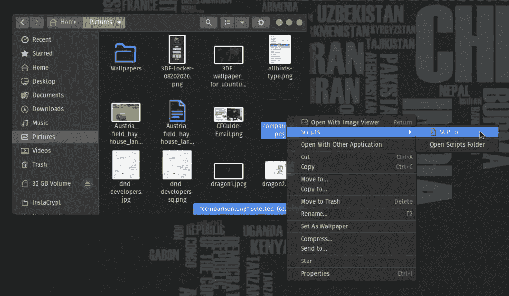
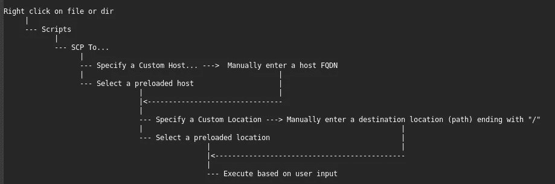
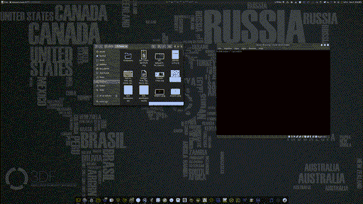
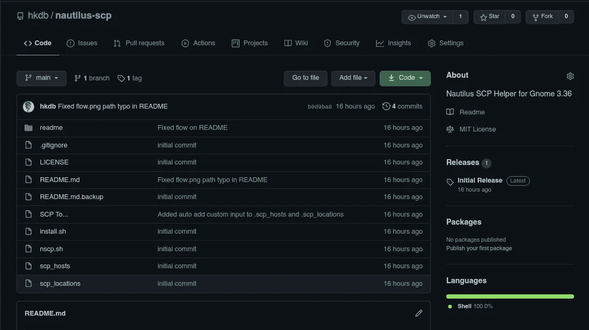

# 在 Gnome 中右键单击要 SCP 的文件

> 原文：<https://levelup.gitconnected.com/right-click-a-file-to-scp-in-gnome-4e51a7459853>

## 一个 Nautilus 脚本，使 SCP 可以通过 GUI 访问



系统管理员、DevOps 工程师和开发人员对 [SCP](https://en.wikipedia.org/wiki/Secure_copy_protocol) 并不陌生。即使最近 [CI/CD](https://en.wikipedia.org/wiki/CI/CD) 如此流行，我们仍然经常不得不处理一次性文件传输，无论是作为开发自动化的一部分，将文件上传到远程环境以供使用，处理遗留系统，还是仅仅是需要放到云开发环境中进行快速测试的修补程序。

不用说，如果您不使用 CI/CD，一种高效的交互式文件传输方法甚至更适合您的日常操作，而且在没有 BS、高效、直接且保持安全( [SSH 协议](https://en.wikipedia.org/wiki/SSH_(Secure_Shell)))的情况下将文件从主机 A 传输到主机 b，真的没有比 SCP 更好的了。此外，当您想要编写一个非交互式脚本将文件传输到多个主机时，真的没有更好的选择。

## 背景:

对于那些不熟悉的人，SCP 在终端中使用的语法如下:

```
scp <filename> <destination host>:<destination path>
```

从上面可以看出，您永远不必离开本地环境，只需一行代码，本地文件就可以毫不费力地传输到远程主机上的指定位置。它还带有良好的进度指示器，这样您就可以知道文件传输的速度，在传输过程中的任何时刻已经传输了多少数据，以及估计的剩余时间，如下所示。


综上所述，早在 90 年代末和 21 世纪初，SCP 就是我工具箱中最常用的工具之一。它只是工作，并迎合我的主要基于终端的工作流。

然而，偶尔，客户或同事会给我发送文件，我会出于某种原因使用 Gnome 文件管理器 Files(Nautilus)来分类或打开文件。完成我需要的工作后，下一步通常是将这些相同的文件上传到远程位置。我通常做的是右键单击该文件夹内的空白区域，然后单击“在终端中打开”,这样它会在我已经在的位置打开我的终端，从那里，我可以键入我的 SCP 命令，将文件发送到远程主机。这通常是可行的，但前几天我开始思考几个问题:

1.  如果我能做到这样，我甚至不必键入 scp 命令，这样，如果我已经在 GUI 中，我将继续 GUI 工作流，那会怎么样？
2.  如果有一个快速的 GUI hack 不仅可以优化我的工作流，还可以向非终端用户开放这个强大的终端工具，那会怎么样？

带着这两个问题，我继续寻找解决方案。嗯，也许是因为我不是一个很好的搜索者，但我无法找到任何符合我需要的东西，所以我开始研究如何将我自己在不同地方拼凑的松散的部分解决方案放在一起。

## 问题:

通过我对在线文档的初步调查，Gnome 的默认文件管理器 Nautilus 支持开箱即用的右击自动化。只要在~/中放一个 Bash、Perl 或者 Python 脚本。local/share/nautilus/scripts，它将显示为“scripts”左击菜单项下的一个子项。Nautilus 调用的该目录中的自定义脚本也继承了一些变量，这样您就能够识别用户选择的文件等内容。这些医生甚至有一个很好的基础[例子](https://help.ubuntu.com/community/NautilusScriptsHowto/SampleScripts#SCP_a_file_or_directory_to_a_remote_host)，这是我开始的一个很好的起点。

基础示例的问题是，由于这里描述的[的技术限制](http://blog.clay.shep.me/2009/06/showing-scp-progress-using-zenity.html)，没有进度指示。它还要求用户使用无密码的 ssh 密钥，这对我来说不是问题，因为无论如何基于密钥的认证是我首选的认证方法，但我想这并不适用于所有人，我也不能保证我为一次性或新配置的机器设置了基于密钥的认证。此外，如果要对 SSH 使用 MFA，这个解决方案也是行不通的。

所以我采用了这个基础脚本，并开始创建自己的脚本来解决这些问题。

## 解决方案:

解决上述问题的方法很简单。终端中的 SCP 在显示转会统计数据方面已经做得很好了，所以真的没有必要为它制作 GUI，也没有必要让 GUI 按照我想要的方式运行。由于“问题”一节中提到的限制，我只是从基础脚本中删除了整个 GUI 部分，代之以启动一个新的终端窗口来执行 SCP。另外，如果我使用新的终端窗口运行 SCP，我可以让用户在 MFA 或基于密钥的身份验证不可用的情况下输入密码。

因此，我将 GUI 交互和 SCP 的实际执行分成两个单独的脚本。一个坐在~/。local/share/nautilus/scripts，另一个位于~/中。本地/bin。GUI 交互部分也将从~/中读取。scp_hosts 和~/。scp_locations 分别用于预配置的主机和目的地路径。在每一个“预配置”文件中，都有一行指定了一个自定义选项，这样，如果用户选择该选项来执行一次性或尚未配置的新主机，脚本将知道要求用户输入。每当用户键入自定义主机或位置时，该脚本还会将该输入附加到相应的配置文件中，以便用户下次再次启动该脚本时，新的主机和位置会显示在预配置选项列表中。

下面是上述流程的 ASCII 映射:



流程图作业图

最后但并非最不重要的是，有一个对话框，在一切都完成后弹出，所以你可以查看它，如果你想或只是点击确定，一切都自动关闭。



[https://youtu.be/nXQ54ffyrTI](https://youtu.be/nXQ54ffyrTI)

到目前为止，这对我来说是一次很好的经历。如果你也对这样的解决方案或黑客感兴趣，我已经把这个贴在了 [GitHub](https://github.com/hkdb/nautilus-scp) 上。repo 中包含一个 install.sh 脚本，您只需运行该脚本就可以开始使用它了。



【https://github.com/hkdb/nautilus-scp 