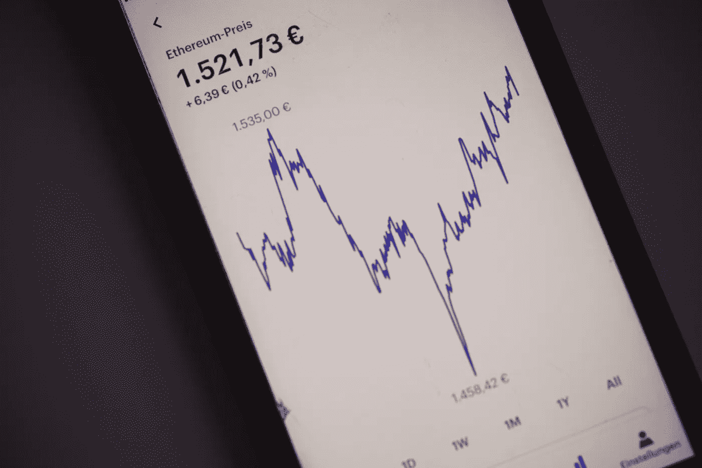

# 资产的风险和回报

> 原文：<https://levelup.gitconnected.com/risk-and-return-of-assets-667065b6d8d9>



马库斯·斯皮斯克在 [Unsplash](https://unsplash.com/s/photos/risk-and-return-investment?utm_source=unsplash&utm_medium=referral&utm_content=creditCopyText) 上的照片

欢迎回到和我一起的另一篇关于投资新手的文章，我肯定不是专业人士。这篇文章旨在帮助或指导其他人，他们和我处境相同，想要了解更多或重述风险和回报。对于那些期待我发布技术或编程文章的人，请再等一会儿。谢谢！

现在，这篇文章最初的灵感来自于通货膨胀是如何肆虐的。几乎每次我看新闻，都会有不同消费品或服务价格上涨的消息。接着，人们评论说，工资是唯一没有增加的东西，这是一个笑话，这是非常正确的。

然而，在被金融文章淹没了相当长一段时间后，通货膨胀的话题对我来说几乎就像一种常态，我没有认真思考过它，因为人们经常谈论这个话题。

有一天，我偶然看到一个视频，它是关于不同资产的风险和回报的。不同资产，或者更确切地说，现金的真实、可靠的数学计算的例子给了我很大的打击，使我更加重视通货膨胀。因此，在这里我试着与我的读者分享它，以便你在处理金钱或现金时变得更加体贴，也更好地理解为什么许多人经常说不要让你的多余现金无所事事。

另外，我还写了关于获得财务独立的[习惯](/6-habits-to-set-your-path-to-financial-independence-f794c3f5696c)，这可能有助于解释如何使用你的闲钱。

# 通货膨胀

什么是通货膨胀？总的来说，是消费品和服务价格的上涨。如果你想买肯德基，突然意识到通常的鸡肉餐涨价了 1 美元，那可能是因为通货膨胀。现在，有不同类型的通货膨胀，但我们不会在这里深入讨论，因为这只是一个确定现金如何贬值的例子。

那么，食品价格上涨 1 美元有什么大不了的？然后也许你的油价上涨，接着是你的水电费，然后是你的运输价格，等等。突然间所有东西都变得更贵了。

然后，当你意识到你的工资保持不变，但你不得不为你的日常用品付出更多时，现实就变得更加残酷了。对于收入相当可观的人来说，这似乎还不错，但在这一点上，那些比我们更穷的人实际上已经感受最深了。

# 现金

持有现金不是一种安全的投资或方式，因为它很容易受到通货膨胀的影响，这可以从前面的例子或当前的经济形势中看出。

现金可能看起来是一个完全安全的地方，因为没有什么可以影响它，没有任何波动可以像你在股市中失眠一样击败它，但这实际上是一种错误的安全感。事实上，有新闻说有人把现金存放在饼干盒里，但发现被虫子吃掉了。是的，即使这样也不安全！

所以，无论如何，通货膨胀率真的会在你没有意识到的情况下，每年以一定的百分比侵蚀你的现金价值。这是一个危险的部分，因为我觉得仅仅因为你赚得很舒服，你仍然可以不顾一切地花钱。你最终可能会存得更少，这会危及你的未来(退休)。

这就是为什么很多人说把你的现金作为资产来使用应该能够对冲通货膨胀。以股票市场为例，价格会上涨，这意味着你的投资资金也会增加。在这种情况下，与你的现金无所事事相比，你的现金价值在通货膨胀中损失较少。稍后我会给你看计算结果。

# 风险和回报

显然，有一件事告诉我们风险投资的等级制度。理论是，随着投资的风险越来越大，年回报率或你可以获得的金额也越来越高。在最低层或级别，有现金。级别越低，资产越安全。级别越高，风险就越大。

一般的进展通常是现金、短期债务、长期债务、财产、高收益债务，然后是股权。

现金排在最后，因为与其他资产相比，它是相当安全的，因为没有任何与之相关的风险(暂时排除通胀因素)。举个例子，如果政府债券或公司债券违约，你将面临亏损的风险。股票市场波动太大，如果你去 YOLO 投资 meme 股票，你可能会输掉你的钱。现金呢？它就在你的银行账户里，不受任何你能想到的波动的影响。

如果我们把通货膨胀率考虑进去呢？让我们看看。

众所周知，风险投资的等级是这样的:

```
Cash < Government Bond < Corporate Bond < Stocks < Alternative Investments
```

想象一下他们每个人的回报:

```
Cash: 0%Government Bond: 3%Corporate Bond: 5%Stocks: 10%Alternative Investments: 20% (Insert any risky one here)
```

看起来不错吧？现在，如果有 3%的通货膨胀率会发生什么？

```
Cash: -3%Government Bond: 0%Corporate Bond: 2%Stocks: 7%Alternative Investments: 17%
```

如果你注意到了，我已经扣除了每笔资产收益的 3%。为什么这么问？这是扣除通货膨胀因素后的实际回报或实际收入。记住，你不能逃避通货膨胀。

如果这还不够可怕，想象一下通胀率是 15%(我真的希望这不会发生)。突然间，你的现金成了唯一损失最大的资产。

这就是为什么人们经常说不要持有太多现金，因为当通货膨胀严重时，这些现金变得毫无用处。它的价值下降最快。

当我第一次看到计算结果时，我惊讶地意识到影响实际上比我们想象的要大。仅仅因为我们经常听说通货膨胀，并不意味着我们可以低估它。不过，只要你意识到了，我想应该没问题。

> 现金是垃圾——雷伊·达里奥

我经常从雷伊·达里奥那里听到这句话。他以全天候投资组合而闻名。这个投资组合是为了平衡。当一个东西下降，另一个就会上升。因此，投资组合的表现不会受到重大影响。如果你正在考虑投资，也许你可以看看他的。

如果你确实打算开始投资，你或许可以看看在你开始投资之前[该做什么。你可能还想了解更多关于不同的](/4-things-to-do-before-you-start-investing-716772d3c167)[资产和投资工具](https://medium.com/geekculture/asset-classes-and-investment-vehicles-a2f67b26e333)的信息。

无论如何，雷伊·达里奥建议，不要通过价格来看东西，而是用经通胀调整的美元来看东西。我觉得这是一个有趣的点。

# 结论

了解通货膨胀是好事。意识到这一点就更好了。对你的财务状况更加谨慎是不会出错的。拥有良好的理财习惯也不会有什么坏处。

说到投资组合，也许你可以通过购买不同类型的交易所交易基金来进一步分散你的投资组合。

你投资组合的多样化取决于你，也许是你的年龄，还有你个人理解的投资。

反正这篇文章就讲到这里。如果你觉得这个有用，可以对其他人有用，那就随便分享吧！如果我错过了什么或者你有什么要补充的，请在下面的评论中分享。

感谢读者朋友们。

如果您计划开立投资账户，您可以使用我的推荐注册免费礼品(截至发稿时):

*   [哞哞](https://j.moomoo.com/007s37)
*   [互动经纪人](https://ibkr.com/referral/deddy189)
*   [斯塔沙威](https://www.stashaway.sg/referrals/deddytv4e)
*   Syfe(转介代码:SRPT38VH3)