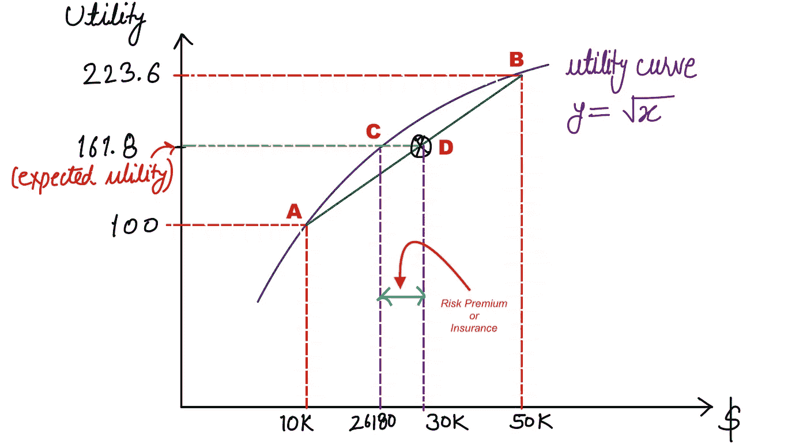

# 规避风险:什么时候应该买保险？

> 原文：<https://levelup.gitconnected.com/risk-aversion-when-should-you-buy-insurance-2292d247ea9e>

## 这篇文章将说明一个人应该支付多少钱的保险，以避免某些风险。


封面艺术(作者图片)

本文是我上一篇 ***《决策理论:期望效用与风险规避》的延续。*** 一定要看看这篇文章需要的一些见解。

[](/decision-theory-expected-utility-and-risk-aversion-9c568a00f54) [## 决策理论:期望效用和风险规避

### 本文详细阐述了期望效用、风险规避和效用函数，有助于人工决策

levelup.gitconnected.com](/decision-theory-expected-utility-and-risk-aversion-9c568a00f54) 

# 风险规避

术语“风险厌恶者”描述了一个人，他可能更喜欢回报较低的某个结果(有 100%的可能性),而不是回报较高的不确定结果。简单来说，个人愿意承担风险的程度被称为风险厌恶。大多数人都是风险规避者，因此他们购买保险来规避风险。低风险意味着稳定；低风险投资确保合理的回报，现有投资损失的可能性几乎为零。通常，随着时间的推移，低风险投资的回报将与通货膨胀水平相当，或者略高于通货膨胀水平；然而，高风险投资可能会获得或失去大量的金钱。

> “如果你不冒险，你就无法创造未来。”—猴子 D 路飞

## 风险规避效用函数的性质

如果我们有一个规避风险的问题，效用函数有以下性质。

1.  它应该是单调递增的，即一阶导数应该是正的。
2.  它应该是凹的，即二阶导数应该是负的。
3.  它应该服从货币的边际效用递减。例如，如果一个人很穷，10 美元会给这个人很高的边际效用，因为这个人可以用这 10 美元买一天的饭。然而，对于一个亿万富翁来说，这额外的 10 美元不会提供额外的边际效用。

现在，我们必须找出一个厌恶风险的人会向保险公司支付多少钱或保险费，以避免他面临的风险和不确定性。

**注:**只是为了解释的目的，我们使用 **√x** 作为风险规避的效用函数，因为它满足以上三个性质。

让我们来看一个场景，假设我有一栋房子，每年为我提供 50，000 美元的收入。在地震的情况下(地震的概率是一半)，由于破坏，我的年收入可能会减少到 10，000 美元。我的概率收益可以写成如下。

```
 (1/2 ; $50000 | 1/2 ; $10000)
```

在这种风险和不确定的情况下，收入的期望值(EV)是。

```
EV = 1/2 * ($50000) + 1/2 * ($10000)
EV = $30000
```

30，000 美元的预期收入是两个不确定选择的加权平均值，因此，预期收入不是我会得到的实际收入。

我们可以使用单个效用的加权平均值来计算预期效用(EU ),如下所示。

```
EU = 1/2 * (utility of $50000) + 1/2 * (utility of $10000)
EU = 1/2 * (√50000) + 1/2 * (√10000)
EU = 161.8
```

现在，我们将找出确切的数量，这将为我提供 161.8 的效用值。

```
√x = 161.8 => x ~ $26180
```



图一。效用曲线和期望效用值。

图 1 显示了我们示例的效用曲线和预期效用值。玩彩票/赌博的效用是 26，180 美元。这意味着我应该至少剩下 26，180 美元，才能让我对房子的任何损坏无动于衷。换句话说，如果我剩下的钱少于 26，180 美元，我不会支付保险费用。保险公司可以向我收取的最高金额是 23，820 美元(5 万美元——26，180 美元)。如果公司向我收取的费用超过 23，820 美元，我手头的资金就会减少，因此我在投保时会处于不利地位。在这种情况下，我宁愿赌一把，因为我至少能有 26180 美元的效用。

我们可以用另一种方式来理解。如果我从我不确定的预期收入中放弃 3820 美元(30000 美元——26180 美元)，我将获得与确定收入 26180 美元相同的效用 161.8。3820 美元(等于图 1 中的距离 CD)也被称为风险溢价。

# 结论

本文通过一个例子演示了如何计算一个人应该为保险支付的最大金额，以避免特定的风险。

# 参考