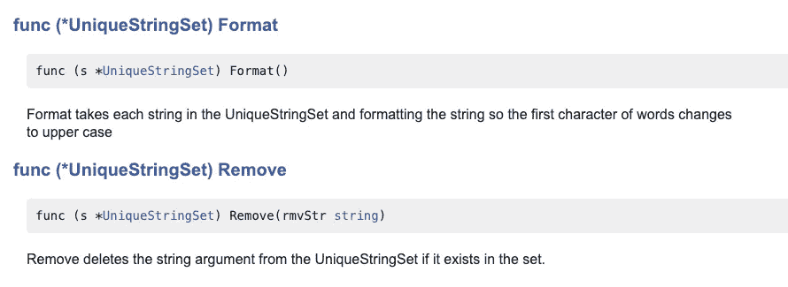
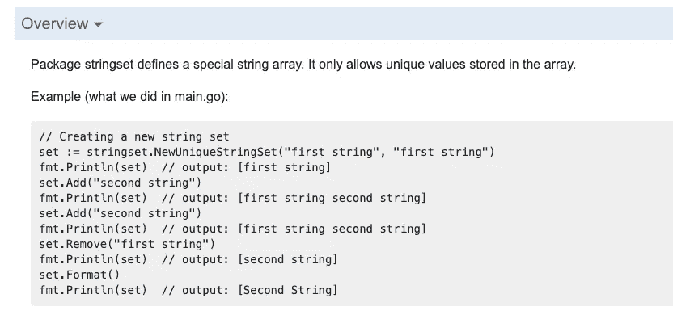

# Pro 之路—软件包和模块

> 原文：<https://levelup.gitconnected.com/road-to-go-pro-packages-modules-5b8aebe6a4e4>

*开始前说几句。你可以在这个* [*资源库*](https://github.com/songx23/RoadToGoPro) *中找到本教程使用的代码。你可以在这里* *找到 Road to Go Pro* [*的全部内容。如果你错过了最后一个，你可以通过这个*](https://medium.com/@songx/road-to-go-pro-f9d1f8a51fad) [*链接*](/road-to-go-pro-pointer-functions-1b4f18b4fdb0) *找到它。*

感谢您关注 Go Pro 之路。我们已经在前面的教程中学习了围棋的基础知识。在这一节中，我们将探索包和模块。当你开始构建围棋项目时，这些知识会派上用场。在我们开始之前，我强烈推荐查看这个[存储库(第 05 部分)](https://github.com/songx23/RoadToGoPro/tree/master/Part05-packages-and-modules)中的示例项目。让我们开始吧。

# 包装

照片由[可贴牌盒](https://unsplash.com/@brandablebox?utm_source=medium&utm_medium=referral)放在 [Unsplash](https://unsplash.com?utm_source=medium&utm_medium=referral) 上

你可能在很多编程语言中听说过包这个概念，比如 Java、C#和 python。通常，包是一个可重用和可移植的代码单元。在大多数 Go 项目中，你可以找到外部包(来自第三方模块)和内部包。使用包的好处是:

1.  使用外部包有助于节省大量时间来从头构建我们想要的功能。*“不要多此一举。”*
2.  将相关代码分组到内部包中使代码库更具可读性和可维护性。
3.  当重新编译包中的代码时，它只会重新编译发生变化的部分。

现在，让我们看看如何在 Go 中声明包。

## 申报

要创建一个包，我们需要创建三样东西:

1.  项目中的包目录。在示例项目中，您可以在`pkg`目录中看到一个名为`stringset`的目录。注意，这个包目录不是直接放在根目录下。这完全没问题。你可以把它放在任何你想放的地方。按照惯例，内部包放在`pkg`目录下。
2.  包目录中至少有一个 Go 文件。在示例项目中，您可以看到在`stringset`目录下有两个文件。
3.  `package`文件中的声明。在`stringset`目录下的文件中，你可以发现它们都以一个包声明开始:`package stringset`。

有了这三样东西，就在 Go 中创建了一个包。很简单。但是，一个只有这三样东西的包，用处不大。当向包中添加函数和结构之类的东西时，我们需要考虑它们是否需要被导出。

## 出口

我们在之前的[教程](/road-to-go-pro-flow-control-dfcc7b9a5395)中讨论过**“变量作用域”**。当时，我们简要地谈到了无障碍问题。在本节中，我们将再次讨论这个话题。

围棋中没有`export`关键字。哪个元素被导出到“外部世界”是由其名称决定的。如果名称以大写字母开头，则会导出，反之亦然:以小写字母开头的名称不会导出。在示例项目中，您可以看到像`NewUniqueStringSet`、`Add`、`Remove`和`Format`这样的函数被导出。因此，它们可用于`main.go`(在`stringset`封装之外)。

包中声明的任何内容都可以导出。然而，我们需要关注导出元素的“依赖性”。例如，如果我们不从`stringset`包中导出 struct `UniqueStringSet`，它的一个导出函数`NewUniqueStringSet()`将返回一个未导出的 struct，这给消费者带来了不便。因此，最好导出依赖项，比如在导出函数的签名中使用的结构。

## 导入

进口是出口的反义词。作为包的消费者，我们需要导入它以便使用它。从[第二教程](https://medium.com/swlh/road-to-go-pro-types-structures-21e5fedc5fe0)(即`import "fmt"`)开始我们就一直在用导入。当导入包时，我们需要在一条 import 语句中指定包名。如果您需要导入多个包，包名需要用括号括起来(包之间没有逗号)。或者，您可以为包名声明别名。通常，我们对长名字的包使用别名，以便引用它们变得更容易和更干净。

导入包

## 初始化功能

`init`是围棋中的特殊功能。一个包可以被多次导入，但是它的`init`函数在应用程序的生命周期中只运行一次。因此，`init`功能被广泛用于初始化目的。它不是软件包中的一个强制功能，如果你不需要它，可以省略它。

在示例包(`stringset`)中，我使用了`init`函数来初始化一个字符串处理器，该处理器将在后面的包中使用。

初始化函数示例

## 证明文件

文档是包中必不可少的组成部分之一，尤其是当包被外部团体使用时。Go 提供了一个工具`godoc`，来帮助从注释中生成 HTML 文档。你可以从 [GoDoc 网站](https://godoc.org/)查看 Go 文档的样子。它托管为公共包生成的文档。

`godoc`在生成文档时，不接受所有的注释。它只获取声明顶部的注释。这些注释应该以声明的名称开始。有一个例外，对于包，注释应该以`Package <Package_Name>`开始。

godoc 注释示例

上例中的注释由`godoc`收集，并生成漂亮的 HTML 文档(如下所示)。

godoc HTML 文档示例

如果您想提供包的详细概述，您可能会发现在包声明的顶部添加长注释看起来很混乱。您可以通过创建一个`doc.go`文件来优雅地解决这个问题。这是一个文档专用文件。您可以在其中添加任意多的细节。对了，Go 中的多行注释符号是`/* ... */`。

专用 doc.go 示例

`doc.go`中的内容将出现在 HTML 文档的概述部分。

godoc HTML 概述示例

要生成 HTML 文档，您需要运行`godoc`命令行工具。默认情况下，运行`godoc`会在端口`6060`启动一个文档服务器。您可以在此找到关于此 CLI [的更多详细信息。在示例项目的 README 文件中，您将找到关于`godoc`的部分，它向您展示了如何导航到`stringset`包文档。](https://godoc.org/golang.org/x/tools/cmd/godoc)

# 模块

[凯勒·安吉尔](https://unsplash.com/@calebeangel?utm_source=medium&utm_medium=referral)在 [Unsplash](https://unsplash.com?utm_source=medium&utm_medium=referral) 上拍摄的照片

Go 在 1.11 版本中引入了新的依赖管理系统 Go Modules。在过去，您需要将代码及其依赖项放在`$GOPATH`下，Go 才能正常工作。这很烦人，也违背了直觉。在本文撰写之时，Go 的最新稳定版本是 1.15。而且幸运的是，从 1.13 开始，围棋模块成为围棋开发的默认模式。现在，您可以将代码放在任何地方，并使用模块轻松管理依赖关系。

Go 模块是存储在一个带有`go.mod`文件的目录中的包的集合。一个`go.mod`文件，非常类似于 Javascript 世界中的一个`package.json`文件，存储了关于当前项目中使用的依赖项的信息。

要初始化新的 Go 模块，只需运行

“go mod init”命令

对于如何命名一个模块没有特别的规则，但是通常，模块名以组织名开始，然后是模块名。例如，如果一个模块托管在 Github 上，那么完整的模块名应该类似于`github.com/go-chi/chi`。

一旦运行了`go mod init`命令，您应该会看到在项目的根目录下创建了一个新的`go.mod`文件。在该文件中，您应该看到您声明的模块名和您正在使用的当前 go 版本。

go.sum 文件示例

## 属国

Go 模块中使用的依赖项可以分为两类，分别是外部依赖项和内部包。

**外部依赖性**

外部依赖是已建立的模块，您可以将它们添加到您的模块中，并直接开始使用它们。添加外部依赖项非常简单。您运行`go get`命令向您的模块添加所需的依赖项。

添加依赖关系

运行这个之后，您会在`go.mod`文件中找到一个新行。

go.mod 文件中的外部依赖项

这一行记录了您刚刚添加的依赖项的版本和模块名。注意,`indirect`注释意味着您目前没有在任何源文件中使用依赖项。一旦开始使用，在终端中运行`go mod tidy`后，间接注释就会消失。

如果您想升级您的依赖项的版本，您需要在`go get`命令中添加`-u`标志。

升级依赖关系

Go 模块也有一个供应商模式。如果它是打开的，Go 会保存依赖项的源文件的副本。您可以选择在存储库中提交它们。这样，依赖关系对于任何使用这个库的人来说都是一致的。要启用供应商模式，您可以运行以下命令。

打开供应商模式

你会发现在根目录下创建了一个名为`vendor`的新目录。依赖项的源文件存储在那里。当 Go 编译器检测到模块中有一个`vendor`文件夹时，它会在检查你的`$GOPATH`之前使用它。

**内部包**

在开发 Go 模块时，为一个工作单元创建一个包是非常常见的。对于您在模块内部创建的包，您无需运行`go get`命令就可以引用它。

要导入一个内部包，您需要将`<module_name>/<path_to_package>`添加到 import 语句中。例如，在示例项目中，您可以通过引用 import 语句中的`github.com/songx23/RoadToGoPro/part05/pkg/stringset`来导入`stringset`包。

# 下一步是什么？

照片由 [Olesya Grichina](https://unsplash.com/@lsgr?utm_source=medium&utm_medium=referral) 在 [Unsplash](https://unsplash.com?utm_source=medium&utm_medium=referral) 上拍摄

这是 2020 年要走的最后一段路。接下来的 2021 年，我们将讨论其他令人兴奋的话题，如并发性、如何构建 API 等。敬请关注。

圣诞快乐&新年快乐！祝大家假期愉快。

如果你遇到任何问题或者需要帮助，请在下面留下你的评论。随时欢迎反馈。感谢您的阅读！

***特别感谢*** [***马克谟-库克***](https://medium.com/@mhumecook) ***对本教程的点评。***