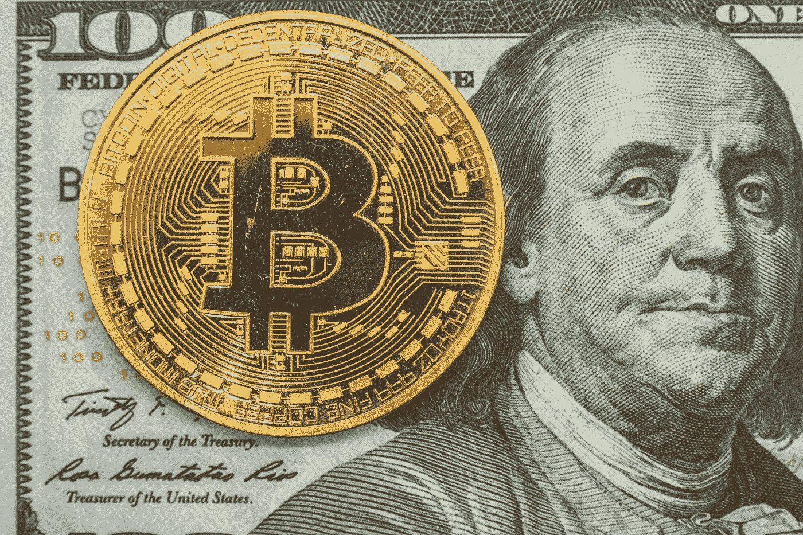
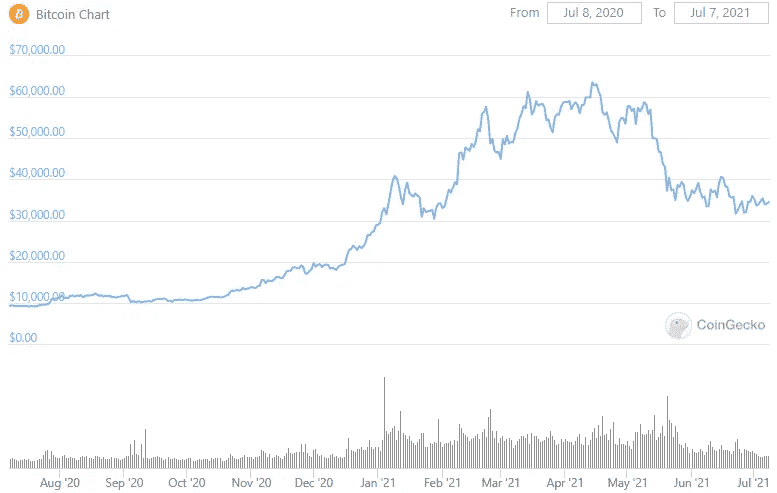
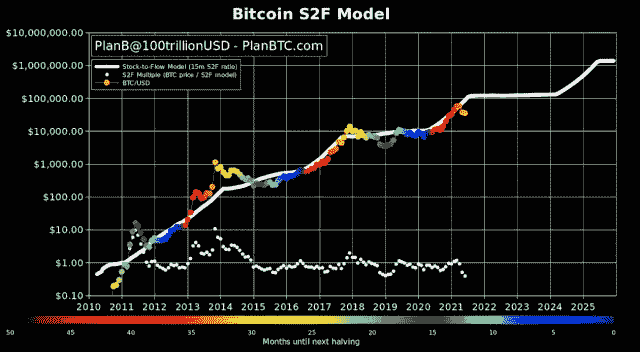

# 复苏之路:2021 年比特币还能突破 10 万美元吗？

> 原文：<https://levelup.gitconnected.com/road-to-recovery-could-bitcoin-still-top-100-000-in-2021-7a84c4b10f8b>

对于比特币来说，这是混乱的一年。以至于让投资者相信几乎任何价格都有可能的看涨购买狂潮，已经让位给了走向基本不确定的夏季的大幅崩盘。

作为世界上最著名的加密货币，比特币一直是许多关于其未来价值的猜测的主题。在 2017 年的牛市中，当硬币跌至略低于 2 万美元时，有人猜测加密市场是一个准备破裂的[泡沫](https://www.theguardian.com/technology/2017/dec/26/bitcoin-bubble-rises-again-after-pre-christmas-rout)。

然而，在 2020 年 5 月 18 日的[第三次减半事件](https://www.ig.com/en/bitcoin-btc/bitcoin-halving)之后，比特币开始了一轮牛市，将在 2021 年 4 月 14 日加速达到 64，800 美元的峰值——全面超越其前历史高点。

比特币创下历史新高一个月后，市场开始下跌，有时会导致比特币市值蒸发 50%以上。到 6 月底，BTC 的价格已跌至 3 万美元以下——抹去了加密货币价格在 2021 年期间取得的大部分进展。

*(图片:*[*coin gecko*](https://www.coingecko.com/en/coins/bitcoin)*)*

正如过去一年所显示的那样，随着比特币的价格开始飙升至平流层，然后回落，比特币重新获得了这种加密货币一直以来的大部分剧烈波动性。

随着 BTC 和更广泛的加密生态系统的普及，围绕加密货币的负面故事的影响引起了更深的市场恐慌。当世界首富埃隆·马斯克宣布特斯拉将不再接受 BTC 为他们的汽车付款时，引发了一场大规模抛售。

中国的重大监管措施也导致了 5 月和 6 月加密货币的一系列抛售。

最近，有消息称，美国当局扣押了支付给黑客的价值 230 万美元的比特币，这些黑客于 5 月入侵了 Colonial Pipeline，此举引发了人们对去中心化加密货币安全性的严重担忧。

一些旁观者认为，加密技术的使用和资金的最终追回证明了 BTC 并不像我们所认为的那样匿名和难以追踪——导致一些持有者抛售。

# 蓝天思维

风暴之前，围绕 BTC 的乐观情绪和情绪非常高涨——不仅仅是来自 T2 的散户投资者。

在过去的一年里，我们看到机构进入加密领域，因为更多的公司理解比特币是一种高级价值储存手段。比特币已经被认为是超越黄金的优质避险资产——尤其是自新冠肺炎疫情开始以来。事实上，在过去的财政年度，比特币的表现超过了 T4 纳斯达克 10 指数 300% 和标准普尔 1600%。

特斯拉和埃隆·马斯克(Elon Musk)可能因 2021 年初对比特币的 15 亿美元投资而占据了头条新闻，但在此之前，最大的独立上市商业智能公司 MicroStrategy 已经积累了超过 90，000 BTC 的投资——按目前的估值计算，相当于超过 30 亿美元。

随着企业将比特币视为应对疫情危机后全球经济不稳定的一种潜在分散对冲工具，机构开始意识到这一早期机会，买入一种在现实世界低迷时可能保持其价值的资产。

一些金融专家认为，BTC 在 2021 年达到 10 万美元的想法似乎过于保守。花旗银行的高级分析师 John Fitzpatrick 对比特币进行了技术分析，得出的结论是，到 2021 年 12 月，比特币可能价值 31.8 万美元。

然而，Fitzpatrick 的估计回到了 2020 年 11 月，在加密货币的夏季[混乱开始之前。在如此显著的回调之后，比特币真的能够反弹，在 2021 年夺回新高吗？](/what-would-a-ripple-ipo-mean-for-the-world-of-cryptocurrencies-eb50b9c0c4bf)

# 向 10 万美元靠拢

围绕比特币的情绪目前是悲观的，但未来有很大的乐观潜力，许多投资者仍然遵循比特币的股票到流量模型，作为乐观的理由。

*(图片:* [*雅虎！金融*](https://finance.yahoo.com/news/bitcoin-stock-flow-model-rooted-153030252.html) *)*

如图所示，自十多年前创立以来，比特币的价格一直遵循其存量到流量模型。随着硬币在每次减半事件后变得越来越稀缺，它会经历一次反弹，从而提高其市场价值。

根据股票到流量模型，[比特币应该](/is-warren-buffett-secretly-buying-bitcoin-101147fcd45c)在 2021 年底前仍会反弹至 10 万美元左右，然后在 2024 年减半后开始向 100 万美元的牛市。

彭博还声称，BTC 更有可能在 2021 年达到 10 万美元，而不是继续下降到 2 万美元。根据金融通讯社 6 月份的 Crypto Outlook 报告，“在我们认为的静止的加密资产牛市中，大约 40，000 美元可能是一段时间内的比特币上限。№2 以太坊正在迅速向市值第一的地位迈进，并已成为 2021 年彭博银河加密指数的主要驱动力。比特币更有可能朝着 10 万美元的阻力继续升值，而不是维持在 2 万美元以下。”

新冠肺炎疫情事件后，投资者基础似乎在不断扩大，这为彭博更为积极的前景提供了支撑。Freedom Finance Europe 投资研究主管马克西姆曼图罗夫(Maxim Manturov)指出，不断增长的投资者基础是股市增长的一个指标。

“我们上面分析的实际上看起来像是疫情和随后的刺激计划的后果。这创造了一个散户投资者可以开始投资股票的资金池。根据富达的报告，2020 年有 2600 万个零售账户，比 2019 年增长了 17%，”曼图罗夫说。

2021 年夏天，比特币经历了一个测试性的开端。虽然围绕 BTC 和其他加密货币的投资存在很多担忧，但评论人士对长期前景似乎更加乐观。

随着越来越多的散户投资者进入市场，以及有利的库存到流量模型的实现，这种世界上最著名的加密货币可能仍有望达到 10 万美元。