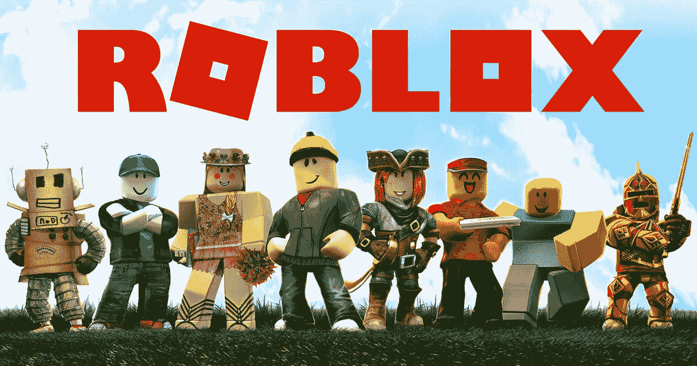
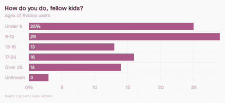
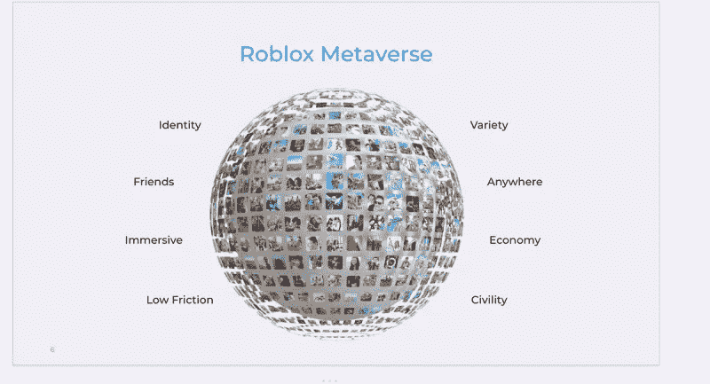
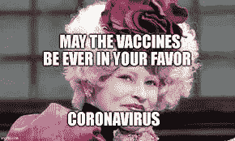

# Roblox 和医疗保健公司的元宇宙

> 原文：<https://levelup.gitconnected.com/roblox-and-healthcares-metaverse-1ed8d83bdbee>

信用:Roblox

作为一个既不是游戏玩家也不是游戏玩家的父母的人，我很自豪我能和游戏这种文化现象保持哪怕是轻微的接触。例如，我曾经写过[元宇宙](https://kimbellard.medium.com/an-epic-fight-for-the-metaverse-a93c7e9bb825)、[两周](https://tincture.io/towards-a-fortnite-healthcare-system-80e78715d263)和[电子竞技](https://tincture.io/not-just-a-game-1862732f8212)。尽管如此，我还是设法完全忘记了 [Roblox](https://www.roblox.com/) 的存在，直到它们本周上市，并且[的估值达到 450 亿美元](https://www.nytimes.com/2021/03/10/technology/roblox-stock-price.html)，比电子艺界(我*听说过*)还要高。

我再一次认为，这是医疗保健的教训。

数字世界研究公司(Digital World Research)首席执行官 p . j . McNealy[对 NPR](https://www.npr.org/2021/03/09/974893374/roblox-goes-public-whats-roblox-ask-anyone-with-kids)*这样描述 Roblox:“《我的世界》遇到了任天堂，任天堂遇到了乐高，手机实现了一大堆。”无论隐喻是什么，Roblox 正在蓬勃发展。一年前，它的估值为 40 亿美元，但疫情非常非常适合它。*

**

*信用:石英*

*半数美国儿童[使用 Roblox](https://www.theverge.com/2020/7/21/21333431/roblox-over-half-of-us-kids-playing-virtual-parties-fortnite) 。三分之二的用户是 16 岁及 16 岁以下的 T21，他们中的大多数人去年花了很多时间在家里。据估计，它现在拥有 3700 万独立用户，去年在网站上花费了大约 300 亿小时。它在 180 个国家有 11 种语言版本。*

*Roblox 特别独特的地方在于，它不是游戏开发商；这是一个用户开发“体验”的平台。Roblox 这样描述它的使命:*

> *Roblox 的使命是通过玩耍让世界走到一起。我们让任何人都能够想象、创造，并在朋友探索数百万身临其境的 3D 体验时与他们一起享受乐趣，所有这些都是由全球开发者社区构建的。*

*它声称 800 万开发者创造了 2000 万种体验，并向他们支付了超过 3 亿美元。这些游戏是免费的，但用户可以购买和消费游戏中的虚拟货币(Robux)，可以兑换成实际的货币(Roblox 与开发者分享 30%的收入)。至少有一个开发者[一年赚了超过 100 万美元](https://www.businessinsider.com/how-24-year-old-game-developer-makes-1-million-roblox-2020-9)；超过 1200 辆[让](https://www.bbc.com/news/technology-56345586)至少赚了 1 万美元，超过 300 辆让赚了 10 万美元。*

*麦克尼利先生[认为](https://www.npr.org/2021/03/09/974893374/roblox-goes-public-whats-roblox-ask-anyone-with-kids)IPO 将让 Roblox 大幅扩张:*

> *这笔钱要么让他们有机会为该平台构建更多内容，要么让他们进入音乐等相邻平台，或者与 Spotify 或电影服务合作。这就是我们要去的地方。*

*首席执行官兼联合创始人 David Baszucki 并不满足于这个年轻的市场，[想知道](https://www.npr.org/2021/03/09/974893374/roblox-goes-public-whats-roblox-ask-anyone-with-kids):“那么我们如何让 Roblox 与世界上的每个人联系起来？”Roblox 工作室 [Red Manta](https://www.redmanta.games/) 的联合创始人亚历克斯·希克斯(Alex Hicks)看到了这样的潜力，[告诉 *Polygon*](https://www.polygon.com/22326123/what-is-roblox-explainer-public-offering) :“许多孩子已经知道 Roblox 是什么，但他们只是与年长的观众接触了一下。”*

*在二月份的公司博客文章中，Baszucki 先生概述了一些愿景:*

> *我们看到的未来是，成千上万的人可以聚集在一个地方参加虚拟商务会议，参加电影首映式，或者观看他们最喜欢的艺术家的现场表演。我们正在努力使这一愿景成为现实，朝着新技术创新，如空间音频和具有逼真面部表情的高保真化身。*

*微软(团队)、谷歌(YouTube)和脸书(Live)都应该小心翼翼。*

*巴斯祖基先生去年告诉《连线》杂志:*

> *2021 年，我们将会看到人们玩耍、工作、学习或只是闲逛的方式发生转变。其中一些连接将转移到元宇宙，一个人们在数百万个 3D 虚拟体验中无缝聚集和互动的数字地方……(这)可以说是与电话或互联网一样大的在线通信转变。*

*啊，又是元宇宙。*

**

*信用:Roblox*

*总结一下:一个依赖于用户生成的内容并从中获得回报的平台，依靠共享的沉浸式体验而蓬勃发展，吸引年轻人，并且有趣。让我们看看，哪些也适用于我们的医疗保健系统？没错:一个都没有。*

*医疗保健至少在谈论平台(例如[梅奥诊所平台](https://www.mayoclinic.org/giving-to-mayo-clinic/our-priorities/mayo-clinic-platform))，但美国医疗保健系统最接近平台的可能是 [Epic](https://www.epic.com/) ，它以可用性差和缺乏互操作性而闻名。像 [AmWell](https://amwell.com/cm/) 这样的公司很想成为新的平台，但只是慢慢地从远程医疗的根基中脱离出来。对于许多人来说，Optum 有许多用途，但绝不是一个平台。*

*点对点的支持/建议在医疗保健中越来越重要，但通常是因为医疗保健专业人员和机构，而不是因为他们。专业的建议和治疗仍然被认为是“黄金标准”为病人创造的“体验”付费是闻所未闻的。*

**

*至于乐趣，嗯，当人们用“饥饿游戏”来描述获得新冠肺炎疫苗接种预约是什么样的时候，它并不打算传达任何乐趣。医疗保健可能会允许一些游戏/游戏化，但这太严肃了，不能把娱乐的重要性当回事。*

*建立在用户创作内容基础上的医疗保健平台在哪里，向那些创作者支付他们如何让其他用户参与沉浸式 3D 体验的费用？“参与式医疗”意味着简单地允许病人在他们自己的治疗中有发言权，这是 Roblox 甚至不会承认的低门槛。*

*与医疗保健相比，在线游戏是一个新的行业，但我们已经看到了旧的守卫者和新的模式之间的斗争。在 *Venture Beat* 中，迪安·塔卡哈斯基[对比了](https://venturebeat.com/2021/03/12/the-deanbeat-how-roblox-overshadowed-microsofts-bethesda-event-this-week/) Roblox 的首次公开募股和[微软重磅收购视频游戏发行商 Bethesda](https://www.cnbc.com/2021/03/09/microsoft-closes-bethesda-acquisition-aiming-to-take-on-sony.html) :*

> *我认为这是行业中有前途的部分(以 Roblox 的用户生成内容的潜力为代表)和行业中的旧部分(微软收购 Bethesda 是整合的一个新步骤)之间的竞争。*

*Techcrunch 的卢克·马特尼对此的看法是:*

> *随着 cross-play 打破了游戏平台动态的一些壁垒，游戏行业已经进入了一个非常民主的大步……虽然大型出版商已经将云游戏作为将他们的大片专营权串联起来的趋势，但他们都希望自己处于 Roblox 的位置。*

*医疗保健需要机器人。它需要一个平台，用户创建的内容和工具，除其他外，可以建立在其上。它需要一个利用最新技术吸引用户的平台。它需要一个医疗保健元宇宙。*

*这样的公司可能不会来自医疗保健行业；例如 [Epic Games](https://kimbellard.medium.com/an-epic-fight-for-the-metaverse-a93c7e9bb825) 比 Epic 更有可能创造一个医疗保健元宇宙。*

*我不知道医疗保健机器人会是什么样子；老实说，我甚至不知道 Roblox 长什么样。但我希望有一些更年轻、更聪明、更以游戏为导向的人能够想象这可能是什么，并让它成为现实。*