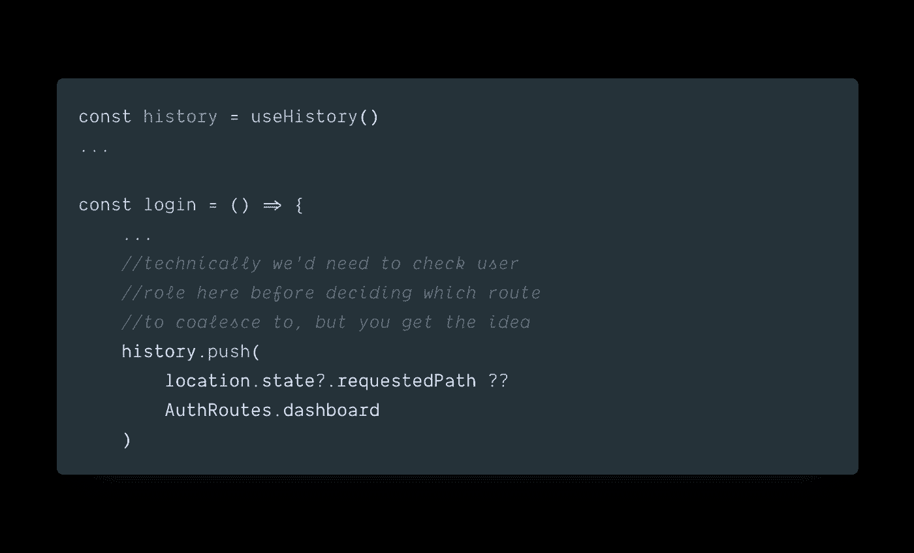

# 使用 React 路由器和类型脚本进行基于角色的身份验证

> 原文：<https://levelup.gitconnected.com/role-based-authentication-with-react-router-and-typescript-b707af568ccf>

## 通过处理身份验证和授权，定义一个强类型组件来处理基于角色的导航

身份验证和授权是现代应用程序不可或缺的一部分，但一直是我作为 React 开发人员的一个棘手问题，我认为可以肯定地说，我不是唯一一个处于这种困境的人。

我将展示我最近使用 React Router 和 TypeScript 进行基于角色的身份验证的设置。也就是说，这不是对这两种技术的介绍。换句话说，我将提供的示例将假设对它们的工作原理有一个基本的了解，并专注于解决基于角色的认证问题。

在我们进入代码之前，先简单提一下。这个系统绝对不是有效验证生产级应用程序所需的全部。这不会包含 Redux 或任何其他状态管理解决方案，也不会解决所有难题。我的目标是让它成为其他人的基础。

注意:为了简单起见，示例代码将使用本地存储进行令牌管理。对于生产应用程序，我不推荐这种方法。

假设我们有一个库存管理工具，需要对用户进行身份验证，有`super-admin`、`admin`和`non-admin`用户，他们每个人对应用程序的各个部分都有不同的写/读权限。

# 类型化角色

让我们设置一个角色枚举，然后在一个`userRoles`数组中使用它:

您可能想知道为什么我在`userRoles`对象中将枚举值转换成字符串。这是因为我希望能够检查给定的用户角色是否在所需角色的数组中。使用类型安全字符串数组使这变得更容易。我并不是说这是最佳实践，但它对我很有效。

# 路由器设置

对于 React 路由器来说，这应该非常简单。这是一个标准的导航设置。然而，目前我们的导航中没有整合认证逻辑，路由器也不关心(或知道)用户在导航应用程序时的授权角色。

让我们假设我们的服务器已经在工作了。因此，我们打个响指，在后端设置认证令牌。现在，我们希望确保用户在查看任何应用程序内容之前已经登录。

让我们做几件事来实现这一点:

1)为我们的授权和非授权路由定义枚举(这不是必需的，但我更喜欢它而不是传递字符串)。

2)为访问授权路由的非授权用户定义一个单独的组件来处理重定向逻辑。

# AuthRoute.tsx

现在让我们创建一个`AuthRoute`组件。我们稍后还将添加一个`Unauthorized`视图，如果用户试图访问他们不应该访问的内容，我们将向用户显示该视图(理想情况下，路由逻辑会阻止用户看到它，但以防万一，这是一个‘很好的’视图)。

让我们稍微分解一下这个组件。如果你不熟悉的话，来自`react-router-dom`的`Route`组件有一个[渲染](https://github.com/ReactTraining/react-router/blob/master/packages/react-router/docs/api/Route.md#render-func)道具，它允许我们传入一个函数，当位置与路线`path`匹配时，该函数将最终返回一个 React 组件。这是检查用户是否有权查看我们应用程序中给定页面的理想位置。如果组件通过标准的`component`属性呈现，这个函数也可以访问所有的路径属性。在我们验证了用户的身份之后，我们希望将这些属性传递给呈现的组件。

`Redirect`组件有一个 to [属性](https://github.com/ReactTraining/react-router/blob/master/packages/react-router/docs/api/Redirect.md#to-string),它不仅可以传递字符串，还可以传递带有属性的对象，我在`AuthRoute`组件中使用了其中的两个属性。`pathname`非常简单，但是我们也可以将状态片段传递给目的组件。如果您希望允许用户返回到他们在令牌过期之前尝试访问的视图，并且他们在不知情的情况下被注销，这将非常方便。

在成功登录后将用户导航到给定视图的登录逻辑中可以看到这样的例子:

# 将 AuthRoute 合并到路由器中

现在我们已经设置好了`AuthRoute`组件，让我们在路由器中使用它:

太棒了。现在，如果一个用户试图在未经认证的情况下访问这些视图，我们的路由器将引导他们返回登录页面。或者，如果用户偶然发现了不允许他们查看的内容，他们会看到一个`Unauthorized`视图，但是用户角色呢？让我们假设我们的应用程序在`Context`中存储了一个`userRole`字符串。让我们将逻辑合并到我们的`AuthRoute`组件中，以便在将用户路由到给定视图之前处理角色检查:

所以现在，组件接受一个`requiredRoles`数组，该数组将包含用户为了查看给定页面而必须拥有的角色。现在我们可以为每个组件传递所需的角色:

我们不仅要确保我们的用户通过了身份验证，还要确保他们被授权有权查看页面。注意，我们的`Redirect`组件的目的地也是由用户是否拥有所需的角色决定的。

差不多就是这样。我真的很喜欢我正在做的项目中的这个设置，并希望与他人分享，看看他们是否可以利用它(或评论它)👀).

感谢您的倾听👋🏻