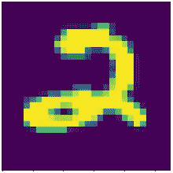
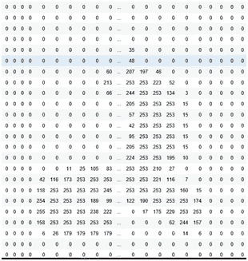
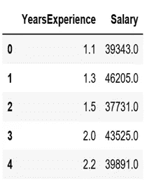
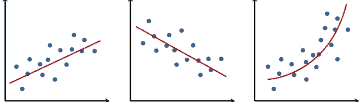
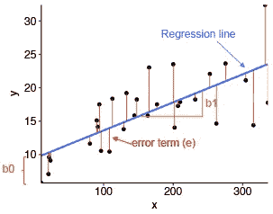
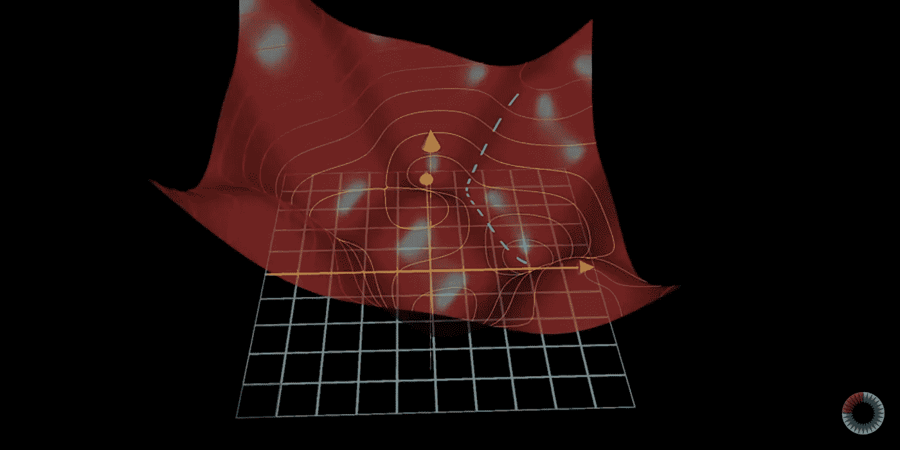
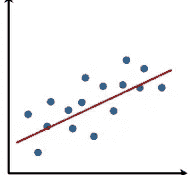
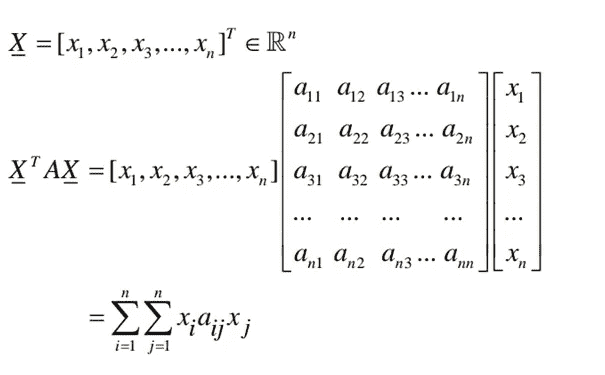
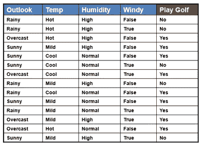
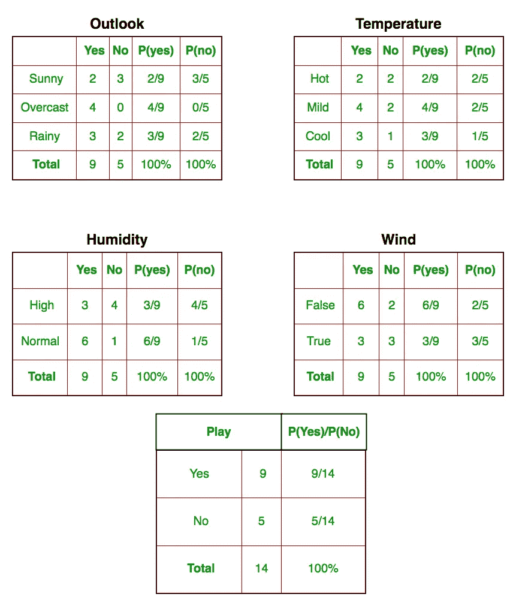

# 数学在机器学习中的作用

> 原文：<https://levelup.gitconnected.com/role-of-mathematics-in-machine-learning-496a6ffcc442>

我们生活在人工智能时代。驱动人工智能的核心是机器学习。但你可能听说过，机器学习预测一些产出的方式，无论是为你的脸选择合适的眼镜框，还是根据你的工作经验你应该获得的平均工资，都是基于数学的。许多人可能已经告诉你，要学习机器学习，你需要知道大量的数学知识。事实上，这种说法打消了大多数 ML 爱好者的积极性。

说实话，你确实需要懂数学。但是数量完全取决于你的兴趣。事实上，还有人在甚至不知道算法的情况下使用机器学习模型。他们只是调用内置函数，完成他们的工作。

为什么我们要应用数学来预测推论？或者说，数学是如何预测推论的？

嗯，对你来说，下图是一个 2。

但做出预测的是你。你希望你的电脑做出预测。你会怎么做？通过观察计算机所看到的，来理解你如何让计算机说它是一个 2。你的电脑看到的是:一堆对我们毫无意义的数字。

但这就是这个图像在你电脑里的存储方式:所有的数字。现在，从数字中得出推论的显而易见的事情是应用聪明的数学算法。

但是我们应该应用什么算法呢？或者哪种数学在这里得到应用？所有列的简单相加不会帮助计算机预测图像是 2。我们需要更复杂的算法来处理这个问题。

在这里，我介绍了在 ML 中使用的四个数学领域:

统计数字

结石

线性代数

可能性

现在，教计算机上面的图像是一个 2，对于初学者来说是一个相当麻烦的例子。让我们来看一个更简单的例子。

假设你有下面的数据，在第一栏你有工作经验的年数和相应的薪水。

你会如何预测(通过看到数据)一个人 1.9 年的工作经验应该拿多少工资？一种方法是在图表上绘制工资，对应于 1.9 年的经验，你将得到工资。

这正是数学算法所做的。这些算法把给定的数据点绘制在图上，从中得出推论。

# 统计数字

在上面的例子中，我们只有 5 个数据点。让我们举一个例子，我们有超过 5 个数据点绘制在一个图表上。显然，绘制的点将是一个散点图。

接下来，我们用统计学找出那些数据点之间的关系。我们试图用一条直线或一条曲线来拟合这些数据点。这叫做回归直线或曲线。

但是计算机如何找到哪条线或曲线最适合这些点(或者，给出最佳估计值)。为了找到最好的线，我们需要定义一些量来识别，哪一个将表示线是好的还是差的。这个量叫做误差。我们做的是:求回归线对应的所有点的误差之和。像这样:

但这只是一句台词。计算机可以尝试多条线，获得误差值的总和，并将其绘制成 3D 图形，可能如下所示:

礼貌用语:3 蓝色 1 棕色

这个图看起来像一个曲面。x、y 轴是不同回归线的 x、y 值(用 y=mx+c 表示)。z 轴(高度)表示误差项。

# 结石

通过查看上面的图表，我们可以很容易地找到误差最小的 x 和 y 值。误差值最小的点是图上最深的点。但是你的电脑是怎么算出来的呢？在这里，微积分开始发挥作用。

这里，我们使用一种通常称为梯度下降的算法。应用梯度下降给我们最陡下降的方向。沿着这个方向，我们将直接到达图上的最深点(这里，路径由图上的“白色虚线”给出)。

我们在获得图上最深点的过程中取得了什么？最深点表明我们得到了一条回归线，这是最好的回归线。

现在，我们可以应用不同的 x 值，并获得 y 的最佳估计值。如果我们将多年的经验绘制在 x 轴上，将工资绘制在 y 轴上，则回归线将根据给定的经验给出工资的最佳估计值。

# 线性代数

于是我们成功的找出了工作年限对应的工资。但是我们没有遇到任何像特征值或特征向量这样的线性代数术语，这是真的。但是相信我，在幕后这些微积分梯度下降算法使用线性代数。可能不是特征值或者特征向量，而是其他东西。梯度下降以什么方式使用线性代数？

在上面的例子中，我们只取了两列(年资和薪资)。但是，如果您的数据包含更多的参数，如已完成的项目或在竞争中获胜，会怎么样呢？我们将很难用图表来表示数据，以找出回归线。在这种情况下，我们没有回归线，我们有一个回归超平面，应用梯度下降的图有 5 个维度。并且在没有线性代数的情况下，用那些超平面参数执行计算是麻烦的。线性代数为我们提供了在更高维度中表示这类数据的工具。很可能，矩阵和向量是这个领域中使用最广泛的线性代数工具。

这些工具如何帮助我们？假设我们想要下列量的总和:

w1。a1 + w2。a2 + w3。a3 + …..+ wn。an = ∑ wi。其中 wi 和 ai 是任意量。

表示和执行上述计算是非常容易的。把 w 和 a 放在两个不同的向量中，然后得到它们的点积。

[w1 w2 w3 w4 … wn]。[ a1 a2 a3 … an] = ∑ wi。人工智能

这个操作也可以写成转置(W)。A= ∑ wi。ai 其中 W=[w1 w2 w3 w4 … wn]和 A=[a1 a2 a3 a4 … an]

这样，线性代数帮助我们快速执行高阶计算。在下一张图中，我们执行∑∑xi aij xj。

从图像中，我们可以看到，这只是用矩阵和向量的形式表示数据点的问题。然后应用点积、外积、内积或其他运算帮助我们快速执行繁琐的高维计算。

简单来说，如果没有线性代数，机器学习就会是盲目的。

# 可能性

概率在机器学习中对我们有什么帮助？一个直观的想法是预测对应于输入值的输出值的概率。让我们举一个不同的例子来扩大这个概念。比方说，我们有以下数据:

这些数据包含了可以或不可以打高尔夫球的不同情况。例如，如果天气多雨、温度高、湿度大且没有风，就不能打高尔夫球。

在这种情况下，如果我们知道一些天气状况、温度、湿度以及是否有风，我们就不能 100%准确地预测我们是否能打高尔夫。相反，我们可以给出一个概率值，我们有 60%的机会打高尔夫。

在这种情况下，我们试图找出每个列和目标列(“打高尔夫”)之间的概率关系。然后，我们应用巧妙的概率算法，如决策树分类器、随机森林或朴素贝叶斯，根据特定条件预测我们是否可以打高尔夫球。

# 结论

数学家设计算法来找出可能的最佳模型，编码人员和开发人员通过代码将这些算法公之于众，然后将代码应用于原始数据来预测结果。这些人对算法进行编码，这样我们就不必考虑算法背后的数学，这使得当我们试图找出哪种算法会给我们最好的结果而不是从头开始设计算法时，它变得真正可行。由于这些类和函数是可用的，我们可以只应用函数来获得结果。但是，为了真正理解为什么我们的模型表现很差(如果情况如此)，我们可能需要看一下算法(或者至少对算法有一个基本的概念)，以选择调整哪个超参数来获得更好的结果。如果我们不知道是什么让我们的模型预测坏的结果，我们可能只是用试凑法来将正确的超参数调整到正确的值，这可能需要大量的时间。所以，这真的取决于你想了解多少你想应用的算法。

还有一个问题你可能已经想好了。外面的世界有成千上万种算法，我们怎么可能知道所有这些算法的基础知识？

这就是为什么你会发现每个人都说，“机器学习是一个非常非常非常广阔的领域。这是一个我们刚刚开始探索的领域，还有很长的路要走。”