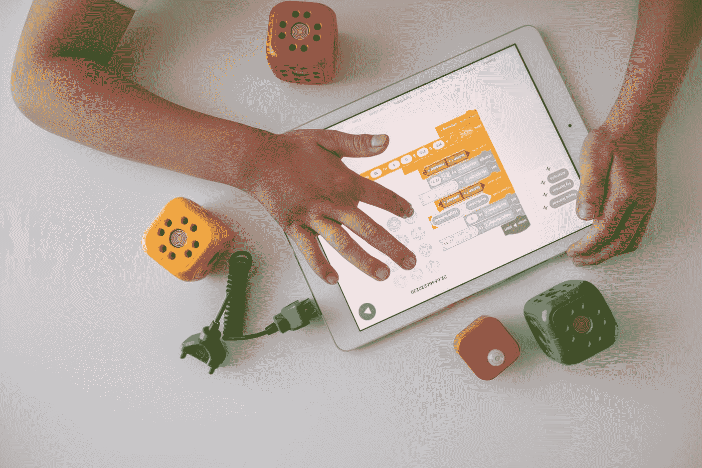

# 用 Python 掷骰子

> 原文：<https://levelup.gitconnected.com/roll-the-dice-with-python-6fe95316b4d5>

## 掷骰子的两种最佳方法，而不是典型方法



机器人神童在 [Unsplash](https://unsplash.com?utm_source=medium&utm_medium=referral) 上的照片

骰子模拟器的主要目的是反映在屏幕上滚动骰子的体验。模拟掷骰子可能很简单，但请检查这两个不同的程序。这个程序的逻辑是一样的，从六个选项中随机选择一个结果。但是输出和用于获得相同效果的各种方法是有趣的。

# 1.掷骰子的时间:

首先，让我们试着用 Tkinter 模拟掷骰子。查看下面想要的输出，并尝试自己编写一个程序。我们使用了六个骰子图像，并在每次运行程序时从组中随机选取它们。


## 模块:

1.  tkinter——众所周知，这个模块用于创建图形用户界面。
2.  PIL——简而言之，对于 Python 图像库，我们执行一些图像操作。
3.  随机-这个模块从给定的图像集中随机选择。

## 代码:

*   骰子变量包含每次你点击“掷骰子”按钮时随机选取的图像列表
*   一些 Tkinter 方法用于指定窗口的名称、几何图形和标题。

```
from tkinter import *
from PIL import Image, ImageTk
import random
def Roll() :
    randomImg = random.choice(diceImg)
    img_1 = Image.open(randomImg)
    img_2 = ImageTk.PhotoImage(img_1)
    imgLabel.configure(image = img_2)
    imgLabel.image = img_2

if __name__ == "__main__" :
    window = Tk()
    window.configure(background = 'black')
    window.geometry("500x510")
    window.title("Dice Roll")
    diceImg = ['11.jpg', '2.jpg', '3.jpg', '4.jpg', '5.jpg', '6.jpg']
    randomImg = random.choice(diceImg)
    img_1 = Image.open(randomImg)
    img_2 = ImageTk.PhotoImage(img_1)
    imgLabel = Label(window, image = img_2)
    imgLabel.grid(row = 2, column = 2,
                 padx = "50", pady = "50")
    rollButton = Button(window, text = "Roll Dice",
                    bg = "red", fg = "black",
                    command = Roll)
    rollButton.grid(row = 3, column = 2,
                     padx = "25", ipadx = "10")

    window.mainloop()
```

# 2.在控制台上打印骰子:

当你掷骰子的时候，而不是传统的打印一个数字。在控制台上设计一个骰子状的图形，而不仅仅是数字。从 1 到 6 的每个数字都有一种表示骰子数字的方式。看输出，自己试着做。


## 模块:

随机—此模块随机选择 1 到 6 之间的一个数字。

## 代码:

你将需要一个用符号和零表示的数字来写这个代码。如上所示，这里显示的数字是 6。零的数字表示骰子上的数值。

*   你需要为从一到六的每个数字写一个表示代码。
*   当代码运行时，它会随机选取一个数字，并将其显示为输出。

```
import random
x = "y"
while x == "y":
    no = random.randint(1, 6)if no == 1:
        print("[------------------------]")
        print("[                        ]")
        print("[            0           ]")
        print("[                         ")
        print("[------------------------]")
    if no == 2:
        print("[------------------------]")
        print("[           0            ]")
        print("[                        ]")
        print("[           0            ]")
        print("[------------------------]")
    if no == 3:
        print("[------------------------]")
        print("[ 0                      ]")
        print("[            0           ]")
        print("[                       0]")
        print("[------------------------]")
    if no == 4:
        print("[------------------------]")
        print("[  0                   0 ]")
        print("[                        ]")
        print("[  0                   0 ]")
        print("[------------------------]")
    if no == 5:
        print("[------------------------]")
        print("[  0                   0 ]")
        print("[            0           ]")
        print("[ 0                     0]")
        print("[------------------------]")
    if no == 6:
        print("[------------------------]")
        print("[  0         0         0 ]")
        print("[                        ]")
        print("[  0         0         0 ]")
        print("[------------------------]")x = input("press y to roll again and n to exit:")
    print("\n")
```

***请考虑通过我的链接订阅 Medium。这将有助于、支持和鼓励。谢谢***

[](https://swathiarun63.medium.com/membership) [## 通过我的推荐链接加入媒体

### 作为一个媒体会员，你的会员费的一部分会给你阅读的作家，你可以完全接触到每一个故事…

swathiarun63.medium.com](https://swathiarun63.medium.com/membership)