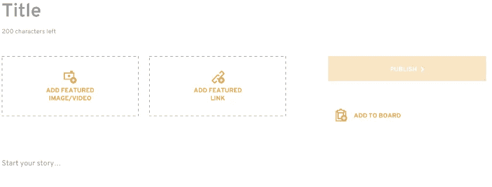

# 滚动我们自己的中等风格所见即所得

> 原文：<https://levelup.gitconnected.com/rolling-our-own-medium-style-wysiwyg-c10fda0e5699>

一年前，一个客户找到我们，要求提供一个富文本编辑器(RTE ),它的外观和感觉都像 Medium.com，并添加了一些自定义功能。我们开始的模型很简单，只有文章的主体是中等风格的。



2018 年 1 月—富文本编辑器模型

我们的一个初级开发人员从一个现有的 RTE 开始，[cke editor](https://ckeditor.com/)，并开始对它进行定制，以与我们在几个月前构建的 API 数据结构一起工作，但是在开发的几个星期后，危险信号开始出现:

*   我们如何可靠地获得用户文本插入符号的水平和垂直位置？(您正在书写的闪烁的垂直破折号)
*   我们应该将文本格式转换为 markdown 格式还是将原始 HTML 存储在数据中？
*   如果用户在段落中间插入图像或视频，我们如何处理将文本块一分为二？
*   旧版本的 Safari/Firefox 没有 CKEditor 中的一些新 ECMA 标准。
*   我们的构建规模从大约 450kb 膨胀到超过 1.5mb。

随着 CKEditor 的每一次发布，我们添加的定制似乎都崩溃了，导致了一次又一次的延迟。——最初看起来“可行”的事情很快变成了“好吧，让我们让它变得可用”的游戏。

我们编辑器的第一个版本漏洞百出，当格式问题出现时，我们的客户同意在我们手动编辑帖子数据的同时解决这些问题。在所有的错误中，最常见的与降价有关。

**降价并不完美。它非常有用，但远非完美。在很多情况下，它可能无法正确地转换回 HTML，尤其是当你需要支持诸如删除线、下划线、可选标题、 ***文字内的*** 抠图和组合格式(粗体、斜体、&删除线)等格式时。—更不用说 markdown 讨厌尾随空格。**

## 有趣的事实:甚至 Medium 也不支持删除线或下划线。

原因可能是因为流行的 web 标准只要求链接在 HTML 中加下划线，但是我们为我们的客户工作，我们的客户要求两种格式选项。—所以我们必须支持这一点。

几个月来，我们的客户令人沮丧地继续使用我们为他们制作的劣质解决方案，而我们则努力寻找更好的方法。经过几周的辩论和研究，我们决定最好的解决方案是从头开始，推出我们自己的产品。**好玩**。“好玩”。好玩？

# 输入内容可编辑

HTML 中的“contenteditable”属性已经存在多年，并且有一些现成的强大功能，但开发人员一直反对它(2014 年的[包括 Medium](https://medium.engineering/why-contenteditable-is-terrible-122d8a40e480) ，但现在使用“contenteditable”)。


在写这篇文章的时候，中等代码的快速峰值。

再加上一个可靠的 markdown 转换器来适当地存储数据，contenteditable HTML 元素是一个非常强大的东西。

*   格式化命令很简单:document.execCommand('bold ')。
*   键盘快捷键默认工作:CTRL + I，CTRL + Z 等。
*   找到光标位置和文本选择比使用普通 JS 更容易。
*   子 HTML 元素(特别是 embed 和 iframe)本身就可以工作。

虽然仍然有[有效的理由](https://ckeditor.com/blog/ContentEditable-The-Good-the-Bad-and-the-Ugly/)反对不使用 contenteditable，但是我们没有开发所需的资源来开发我们自己的一组 contenteditable 已经支持的定制侦听器。

# 我们所见即所得的基础:内容可编辑的内容块+降价。

从那时起，随着我们开始探索添加以下自定义功能，事情变得更加复杂:

*   自定义降价:删除线、下划线
*   净化和格式化从外部应用程序粘贴的内容
*   内容块的拖放
*   当用户需要时，退出某些元素，如

    1.  当用户插入嵌入元素时拆分文本块
    2.  确保用户不会到达 HTML 结构不正确的状态
    3.  如果用户在键入时接近 HTML 元素的结尾，则自动滚动页面
    4.  允许用户在内容中创建动态表格
    5.  检测粘贴的图像，而不是上传图像

同时保持尽可能小的构建规模。那么，让我们深入探讨一下我对最困难问题的一些解决方案。

## 1.定制降价

我认为 markdown 的一个弱点是开始和结束语法。
**text here**不如#%text here%#之类的东西好用。可能有我不知道的原因，但是当我知道哪些字符串是开始而不是结束时，转换自定义降价会容易得多。

对于我们的删除线自定义减价，我决定使用% % #删除线#%%，并且在传统的减价转换之后，我通过正则表达式来转换我的自定义减价，因此没有任何冲突。

## **2。净化软件**中粘贴的文本

这是一场持续的战斗。每一个软件都试图以不同的方式格式化它们的文本。当您从它复制和粘贴时，隐藏的格式随之而来。下面是一个从谷歌文档粘贴的例子。丑陋，但有道理。


其中一些需要保留，其余的可以丢弃。

我也可以去掉所有的格式并粘贴原始文本，但是这样做对用户不太友好。因此，我们去掉所有不重要的元素，然后清理可用的元素，如粗体、斜体、换行符和链接，然后检查每个主要的文本编辑器是否都受支持(Google、Word、写字板、TextEdit 等)。这涉及到大量的正则表达式魔术。这是我们定制消毒的**小** **样品**。

```
constremoveStyle = **function**(e) {
e.preventDefault();constpastedText = e.clipboardData;// change line breaks into p tags
letsanitizedText = pastedText.replace(/^\s*\n/gm, '<p><br /></p>');// remove all spans
sanitizedText = sanitizedText.replace(/<\/?span[^>]*>/g, '');// remove classes
sanitizedText = sanitizedText.replace(/class='[a-zA-Z0-9:;\\.\\s\\(\\)\\-\\,]*'/g, '');

// remove styles
sanitizedText = sanitizedText.replace(/style='[a-zA-Z0-9:;\\.\\s\\(\\)\\-\\,]*'/g, '');

document.execCommand('insertHTML', false, sanitizedText);}editableDiv.addEventListener('paste', removeStyle, false);
```

## 3.插入符号和选择检测

在一串文本中获得插入符号(闪烁的光标)的位置非常容易。

```
window.getSelection().getRangeAt(0).startOffset// or if user has selected textwindow.getSelection().getRangeAt(0).getBoundingClientRect().left
```

然而，获取插入符号的垂直位置并不容易。因为我们不仅需要知道左边的“+”号应该放在哪里，我们还需要知道在哪里插入您正在创建的新内容块(例如，插入一个图像或 Twitter 嵌入)。所以我们首先获得一个光标上方所有标签的数组，并找到我们在哪个标签上。

```
// index is passed by keyup or click eventconstcontentContainer = document.getElementById('textBlock-' + index);const child = window.getSelection().anchorNode;const currentParagraph = (Array.from(contentContainer['children']).indexOf(child)) + 1;consttagsAbove = Array.from(contentContainer['children']).slice(0, currentParagraph - 1);
```

然后，一旦我们知道我们在哪里，我们就确定元素的高度，我们知道光标上方的高度，我们可以将该值设置为“+”按钮的顶部 CSS 位置。

```
let heightAbove = 0;tagsAbove.forEach((tag) => {
  heightAbove += tag['clientHeight'] + 20;
});// adding 20px because each element has a margin bottom of 20px
```


我们新的所见即所得的截图。加号在正确的位置。

# 4 个月后……最终产品

迄今为止，这是我职业生涯中参与的最困难的项目。最终的 RTE 不到 2500 行 HTML、CSS 和 JS，支持嵌入 YouTube、Vimeo、SoundCloud、Twitter、Instagram、CrowdSignal、图像和视频。

我们确实使用了一个 [markdown 库](https://www.npmjs.com/package/ngx-markdown)来转换富文本。我们还没疯狂到写自己的。—下面您可以看到我们富文本编辑器的屏幕截图。


非常感谢我们 FanReact 的 QA 大师 Ian Shirley，他发现了数百个 bug。这是一个艰苦的 4 周的测试，错误挤压和发布，但我们有一个高度稳定和用户友好的编辑器，我感到自豪。

更多关于 Angular、Javascript、CSS 的文章请访问我的网站。

[](https://levelup.gitconnected.com)[](https://gitconnected.com/learn/javascript) [## 学习 JavaScript -最佳 JavaScript 教程(2019) | gitconnected

### 前 65 名 JavaScript 教程-免费学习 JavaScript。课程由开发人员提交并投票，从而实现…

gitconnected.com](https://gitconnected.com/learn/javascript)