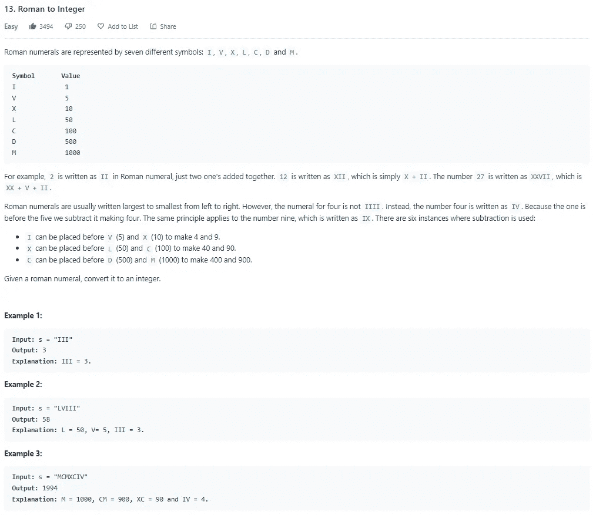
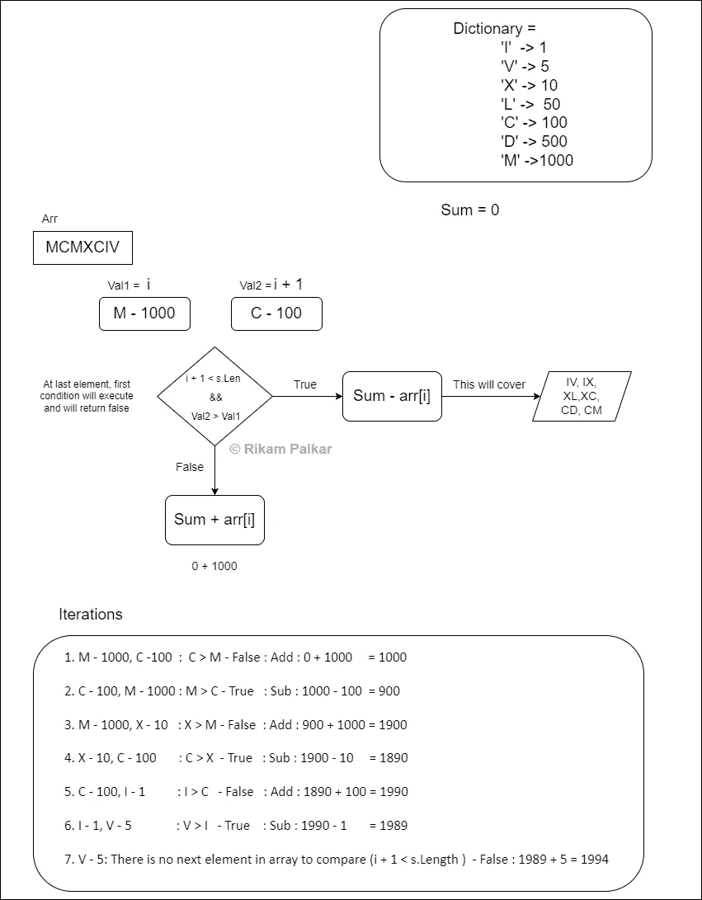
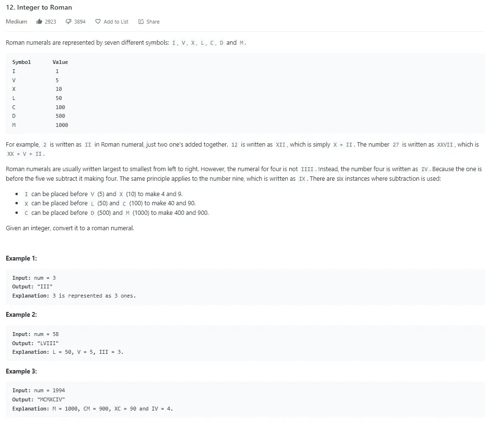
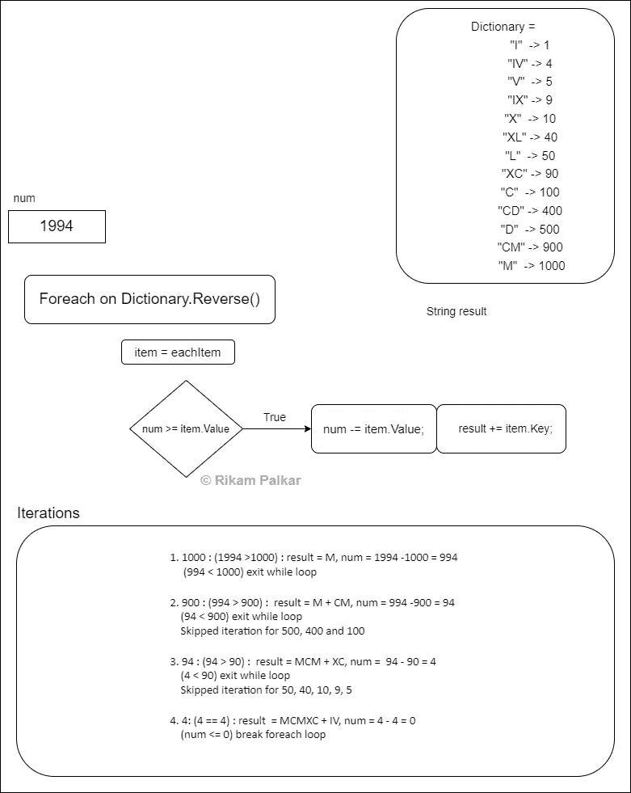

# C#中罗马数字到罗马数字的转换

> 原文：<https://levelup.gitconnected.com/roman-to-numbers-to-roman-in-c-12c6aa7e2ac7>

除了它非常混乱的标题，我有一桶令人困惑的代码❤只为你所有的好家伙在那里！

所以系好你的安全带，为这次颠簸的旅程做好准备。

我们今天的菜单上有两个项目，Leetcode 的问题编号 [12。整数到罗马](https://leetcode.com/problems/integer-to-roman/)和 [13。罗马到整数](https://leetcode.com/problems/roman-to-integer/)。

问题#12 的好消息是，考虑到消化它们需要时间，我做了两种方法。让我们暂时把问题#12 放在一边，从可爱的小问题# 13 开始。

# 13.罗马到整数

这个问题很简单。您将罗马数字作为输入参数，并且必须返回它各自的整数。

在我们进入逻辑之前，我强烈建议你们在这里详细阅读问题。如果你懒得浏览这个链接，这里有一个问题的快照。

Leetcode 的罗马到整数的快照

当我解决这个问题时，有一个测试用例失败了多次。这意味着我应该从简单的开始，对吗？拜托，我们在开什么玩笑，我决定以那个凶猛的数字为例，它是数字中的`“MCMXCIV”`转换回`1994`。

# 逻辑

所以我们需要一个数据结构来存储罗马数字及其相应的整数。例如对于`‘I’`我们需要`1`，对于`‘V’`我们将映射`5`。

让我们充分利用这本字典，好吗？

在这里，我们所要做的就是**减法**或者**加法**。 ***就是这样！***

*   例如，如果输入字符串是`“III”`，那么我们添加`1+1+1 = 3`
*   如果字符串是`“IV”`，那么我们将当前罗马元素`“I”`与其下一个罗马元素`“V”`进行比较。如果下一个元素的数值大于当前元素的值，我们将减去否则我们添加。你的小脑袋瓜就知道这些，不是吗？这是一个赏心悦目的例子。
*   `I = 1`，`V = 5`:这里`V > I`所以我们减去，`1 — 5 = -4`然后对于最后一个元素`“V”`只需将它各自的值`“5”`加到等式`-4 + 5 = 4`中，这就是你的最终答案。

仅此而已。这就是你的全部和灵魂逻辑。

现在，对于我们的例子`1994`，我已经创建了一个流程图，通过这个流程图，你会对我们的逻辑如何在每次迭代中工作有一个大概的了解。

N **注:**在比较下一个元素时，我们会在到达最后一个元素时遇到一个`Array IndexOutofBoundsException`。这是因为我们已经用完了数组长度。对于最后一个`i-th`元素，我们没有`i+1`元素。所以我们也需要注意验证。更多工作太棒了！

*   在上面的`“IV”`的例子中，当指针到达`“V”`时，我们将简单地增加`“V”`的值并退出循环。我知道这会让人困惑。这就是为什么我创造了这个美丽的流程图。

罗马数字的流程图和迭代。

一旦你通过流程图理解了逻辑，实际的代码就非常简单了。

**清单 1:romanton number . cs；时间复杂度为 O(n)，空间复杂度为 O(n)**

# 12.整数到罗马

在前一个问题中，我们看到了如何将罗马数字转换为数值，在这个问题中，我们将做完全相反的事情。
这是 [**leetcode 的问题#12**](https://leetcode.com/problems/integer-to-roman/) ，难度设置为**中等**。我们上次做的是比较当前和下一个罗马字符，并执行基本的加法和减法。
这个问题差不多，多余的地方很少。我说的额外空间是什么意思？让我想想。

这是一个问题的快照，

Leetcode 的罗马到整数的快照

# 逻辑

有两种解决方法。第一个复杂度为 O(n*m ),第二个复杂度为 O(n)。两个都看看吧。

# 第一种方法

这个问题我们需要的数据结构是一个**字典**。因为我们需要再次存储键值对**！**之前我提到过我们需要额外的空间，我们需要额外的空间来处理这 6 种情况。我们可以使用 if-else 语句或 switch cases 来处理这些条件，或者简单地将这些值作为字典的一部分添加到数据结构中。

对于逻辑，我们所要做的就是按照从大到小的**逆序**遍历字典。**提示:你也可以以逆序存储字典值**，这里只是为了演示，我使用的是字典的 **Reverse()** 方法。

对于字典中的每一项，我们需要比较数字，并在每次迭代中缩小数字。不明白，对吧？我就知道。让我们用一个例子来调试它。

让我们把`“350”`作为输入，

*   我们将开始以相反的顺序遍历字典。
*   将`“350”`与字典中的每个值进行比较，直到我们找到一个小于`“350”`的值。那会带我们去`“100”`。从那里我们将开始缩小数字`“350”`直到`“350”`小于字典中的下一个值。
*   这将需要 3 轮`“100”`，即`100 * 3 = “CCC”`，现在我们只剩下`“50”`，我们将继续向下遍历，直到找到`“50”`，现在我们收缩`“50”`。
*   将`50 = “L”`连接到结果。所以我们的最终结果是`“CCCL”`
*   我们将检查`number is <= 0`是否是，如果是，则中断循环并返回结果。

要了解执行流程，请参考下面的流程图。举个例子，我们使用同样可怕的数字`1994`。您将了解我们如何在每次迭代中更新数字。

流程图和罗马数字的迭代。

一旦你理解了其中的逻辑，代码就像往常一样简单明了。

**清单 2: Approach1.cs，时间复杂度为 O(n * m)，空间复杂度为 O(n)**

注意:之所以推荐这个解决方案，是因为在这里你不必像我们使用字典那样手动映射键和它们的值。但是这里我们有时间复杂度为 O(n * m) 的**，有空间复杂度为 O(n)** 的**。我们可以将这个解决方案扩展到 O(n ),但是代价是增加了空间复杂度。让我们这样做，为此我们需要两个数组，一个保存罗马字母，另一个保存数字。**

# 第二种方法

**清单 3:方法 2，时间复杂度为 O(n)，空间复杂度为 O(n + m)**

在这个解决方案中，我们优化了时间复杂度为 O(n)的代码，但现在空间复杂度为 O(n+m)。

这取决于你选择自己的冒险方式。

我的感觉是，第二种方法可能会导致用户错误。在输入的时候，我可以很容易地错配任何一个数组中的元素。所以我必须跟踪键和值对，以确保每个键都代表它自己的值。对于这个问题的范围来说，输入是有限的，这没什么，但是如果将来输入扩大了，那么就会产生问题。

但这是另一天的讨论。在那之前祝你愉快。

照片由[克里斯蒂娜@ wocintechchat.com](https://unsplash.com/@wocintechchat?utm_source=medium&utm_medium=referral)在 [Unsplash](https://unsplash.com?utm_source=medium&utm_medium=referral) 上拍摄

干杯

里卡姆。

 [## Rikam Palkar -软件工程师-小天鹅-威德福| LinkedIn

### 通过编写可伸缩的代码让世界变得更美好。我从来没有在大学里发现我对编码的热情，也没有在…

www.linkedin.com](https://www.linkedin.com/in/rikampalkar/)