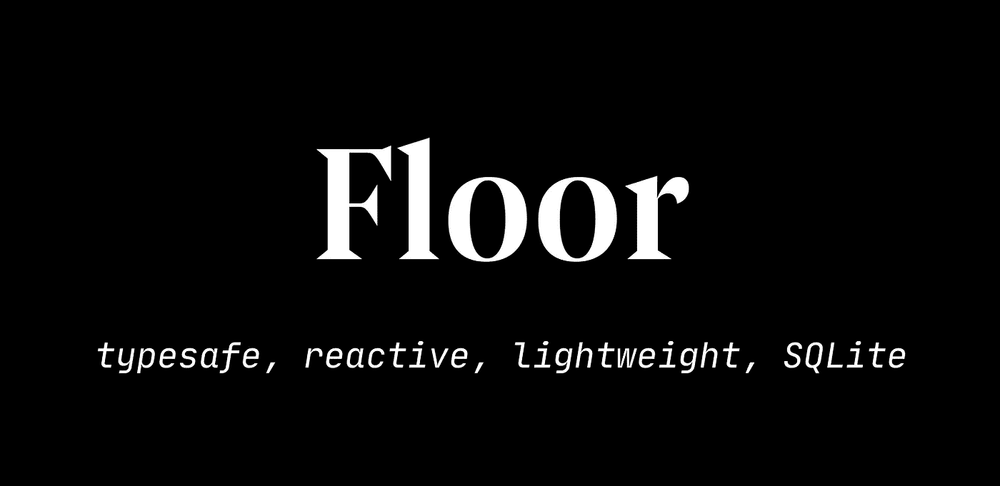

# 颤振的房间数据库当量

> 原文：<https://levelup.gitconnected.com/room-database-equivalent-for-flutter-807c9729b58d>

受[房间持久性库](https://developer.android.com/topic/libraries/architecture/room)的启发，Floor 为您的 Flutter 应用程序提供了一个简洁的 SQLite 抽象。它提供了内存对象和数据库行之间的自动映射，同时还提供了使用 SQL 对数据库的完全控制



楼层数据库

> 使用楼层数据库，您可以简单直接地保存、查询和删除您的对象！

## **开始**

从 Floor 开始，让我们将这些依赖项添加到 **pubspec.yaml**

```
dependencies:
   flutter:
     sdk: flutter
   floor: ^0.14.0

 dev_dependencies:
   floor_generator: ^0.14.0
   build_runner: ^1.7.3
```

## 实体类

实体类将代表一个数据库表列。`@entity`将该类标记为持久类，您需要添加一个`primaryKey`

```
*// entity/student.dart*

 **import** 'package:floor/floor.dart';

 @**Entity**(tableName: 'students'*)*
 **class** **Student** {
   **@primaryKey**(autoGenerate: true*)*
   **final** int id;

   **final** String name; **final** Float grade; Person(**this**.id, **this**.name, **this.**grade);
 }
```

## 数据访问对象

该组件负责管理对底层 SQLite 数据库的访问。

您可以使用普通的 SQLite `@Query`或`@insert`、`@delete`和`@update`

```
*// dao/student_dao.dart*

 **import** 'package:floor/floor.dart';

 **@dao**
 **abstract** **class** **StudentDao** {
   **@Query**('SELECT * FROM students')
   Future<List<**Student**>> findAllStudents();

   **@Query**('SELECT * FROM students WHERE id = :id')
   Stream<**Student**> findStudentById(int id);

   **@insert**
   Future<**void**> insertStudent(**Student** student); @**Query**('DELETE FROM students WHERE id = :id'*)* Future*<*void*>* delete*(*int id*)*;
 }
```

## 数据库ˌ资料库

它必须是一个扩展`FloorDatabase`的抽象类

```
*// database.dart*

 *// required package imports*
 **import** 'dart:async';
 **import** 'package:floor/floor.dart';
 **import** 'package:sqflite/sqflite.dart' **as** sqflite;

 **import** 'dao/*student_dao*.dart';
 **import** 'entity/*student*.dart';

 **part** 'database.g.dart'; *// the generated code will be there*

 **@Database**(version: 1, entities: [**Student**])
 **abstract** **class** **AppDatabase** **extends** **FloorDatabase** {
   **StudentDao get** studentDao;
 }
```

`part 'database.g.dart';` —确保添加这一行，它应该与您的数据库文件名相同，在我们的例子中是`*database.dart*` *。*

## 建立数据库

之后，到终端运行`flutter packages pub run build_runner build`，确保你添加了 flutter 到你的环境变量中。

## 终于！

现在您可以简单地使用`$Floor` +您的数据库类名来访问您的数据库，在我们的例子中是`**AppDatabase**`

```
**final** database = **await** $FloorAppDatabase.databaseBuilder('app_database.db').build();
 **final** studentDao = database.studentDao;

 **final** student= Student(1, 'Frank', 99);
 **await** studentDao.insertStudent(student);

 **final** result = **await** personDao.findPersonById(1);
```

如果您想自动生成 Id，那么您可以简单地在实体对象中传递 null 而不是 Id，即:

```
**final** student= Student(null, 'Frank', 99);
**await** studentDao.insertStudent(student);
```

我希望你喜欢这个漂亮而简单的数据库。