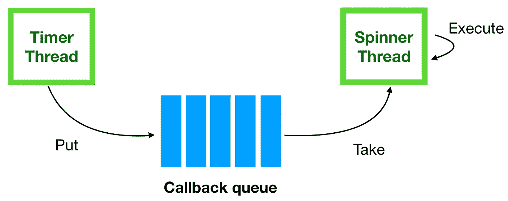
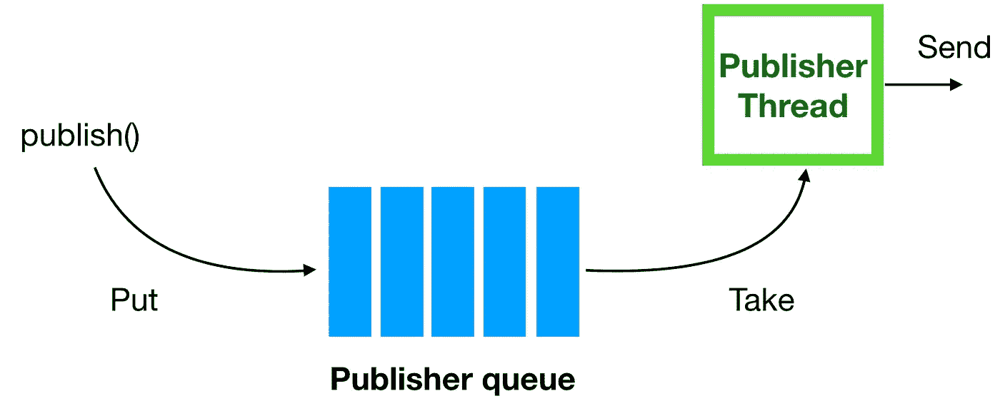
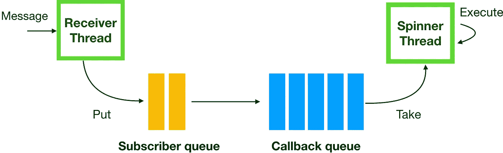
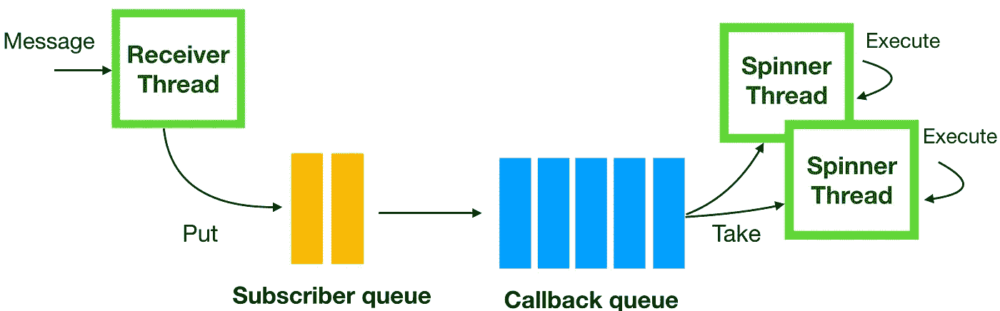
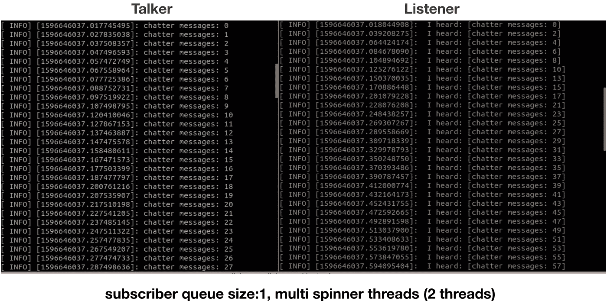
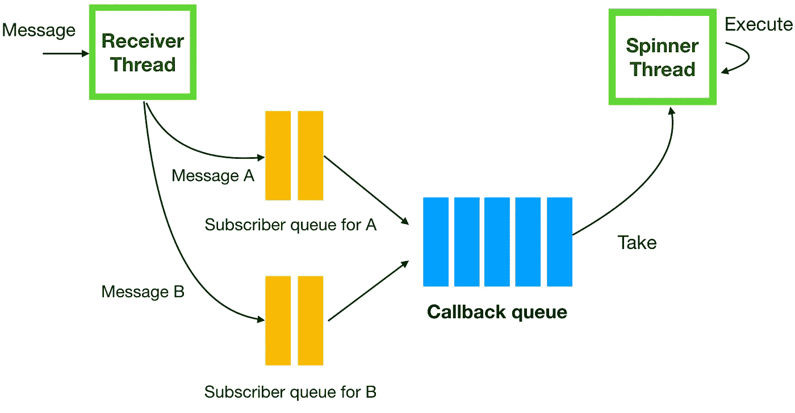
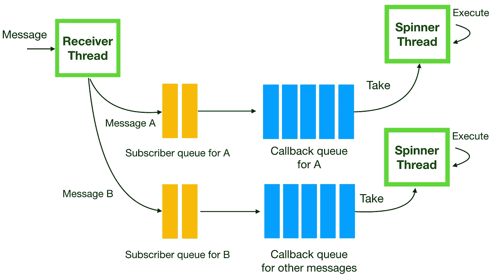

# ROS 旋转、穿线、排队

> 原文：<https://levelup.gitconnected.com/ros-spinning-threading-queuing-aac9c0a793f>

## 有效使用多个旋转线程，ROS 中的不同队列


机器人操作系统(ROS)是开发机器人应用程序的流行框架。ROS 提供的主要功能之一是发布者-订阅者通信，用于组件之间的消息传递。虽然实现发布者-订阅者很容易，但是并不清楚在它下面发生了什么，以及我们如何在实践中使它适合我们的特定问题。在这篇文章中，我将讨论 ROS 中发布者-订阅者背后的机制，比如它的执行模型、线程、排队机制。为了保持讨论的实际水平，我将使用简单的参考程序，这些程序来自 ROS 的原始教程。希望在本文结束时，您已经理解了这些概念和权衡，这样您就可以决定哪种方法最适合您的应用程序。

# 订户队列

如我所说，我将使用 ROS 教程中的一个示例包作为其余讨论的基础，并在我们继续讨论时对其进行修改。我们的例子有两个节点，一个称为“谈话者”，另一个称为“听众”。

## 空谈者

谈话者节点发布主题“chatter ”,而收听者节点订阅该主题。谈话者的实现如下所示，

```
#include <sstream>
#include "ros/ros.h"
#include "std_msgs/String.h"int main(int argc, char **argv) {
  ros::init(argc, argv, "talker");
  ros::NodeHandle n; ros::Publisher chatter_pub =     
  n.advertise<std_msgs::String("chatter", 1000); int chatter_count = 0; ros::Timer timer = n.createTimer(ros::Duration(0.01),
  [&](const ros::TimerEvent&) {
    std_msgs::String msg;
    std::stringstream ss;
    ss << "chatter messages: " << chatter_count;
    msg.data = ss.str();
    ROS_INFO("%s", msg.data.c_str());
    chatter_pub.publish(msg);
    chatter_count++;
  });

  ros::spin(); return 0;
}
```

我修改了原始示例代码，在这里使用了一个`ros::Timer`来解释它。如下图，当我们创建一个定时器时，它会创建一个新的线程(姑且称之为“定时器线程”)。计时器线程不断将给定的回调添加到在初始化期间自动创建的回调队列中。在这个例子中，给定的回调被指定为 lambda⁴函数。然后，当我们调用`ros::spin()`时，它不断从回调队列中获取回调，并在无限循环中逐个执行它们(充当“旋转”线程)。



在给定的回调函数(lambda 函数)中，它创建一条消息，并使用计数器值发布该消息，该计数器值在每次调用回调函数时递增。计时器的频率设置为 100 赫兹(持续时间为 0.01 秒)。因此，计时器线程将每隔 0.01 秒将回调函数放入回调队列。请注意，在发布主题时，发布者队列的大小被指定为 1000。如下图所示，发布者队列是另一个类似回调队列的队列，但是这个队列是用来对发布的消息进行排队的，每次调用`publish()`函数都会填充这个队列。

有一个单独的线程负责从发布者队列获取消息，并将其发送给主题的订阅者(如果有订阅者的话)。如果调用`publish()`的速度比发布者线程发送消息的速度快，消息就会在发布者队列中堆积起来，如果超过了指定的队列大小(在本例中为 1000)，旧消息就会被新消息覆盖。



## 听众

侦听器节点实现的第一个版本如下所示。

```
#include "ros/ros.h"
#include "std_msgs/String.h"void ChatterCallback(const std_msgs::String::ConstPtr& msg) {
  ROS_INFO(" I heard: [%s]", msg->data.c_str());
}int main(int argc, char **argv) {
  ros::init(argc, argv, "listener");
  ros::NodeHandle n; ros::Subscriber sub = n.subscribe("chatter", 1, ChatterCallback);
  ros::spin(); return 0;
}
```

如下所示，当侦听器节点初始化时，它会创建一个线程，负责接收它订阅的消息。每个订户都有一个队列，用于对传入消息进行排队。然后，注册到订户的相应回调与来自订户队列的消息一起被放入回调队列。

有一个单独的线程(姑且称之为“Spinner thread”)负责从回调队列中取出回调，并逐个执行回调。与上面提到的发布者队列的情况类似，如果订阅者队列接收消息的频率比旋转者线程处理回调的频率高，则接收到的消息开始在订阅者队列中堆积。如果超过了指定的队列大小，订阅者队列中的旧消息将被新接收的消息覆盖。



在此示例中，订户队列大小设置为 1。这意味着它不将传入的消息排队，而是仅将单个最新的消息保存在订户队列中。如果您需要始终只处理延迟最小的最新消息(不需要等到队列中较旧的消息处理完毕)，并且如果您希望节省内存使用(对于订阅者队列)以换取丢弃消息的风险，那么这种方法是有效的。

这似乎是一种可以避免的折衷，但实际上，通过使用多线程(在下一节中讨论)，我们可以防止消息丢失，同时保持小订阅者队列的优势。

# 多旋转螺纹

在 ROS 中，我们可以增加 spinner 线程的数量，以便监听器节点可以更快地处理来自回调队列的回调，如下所示。这也意味着它可以更快地处理订户队列中的消息，因此我们可以防止旧消息被覆盖。



要增加微调器线程的数量，您可以在监听器节点中使用如下所示的`ros::MultiThreadedSpinner`。

```
void ChatterCallback(const std_msgs::String::ConstPtr& msg) {
  ROS_INFO(" I heard: [%s]", msg->data.c_str());
  std::this_thread::sleep_for(0.02s);
}int main(int argc, char **argv) {
  ros::init(argc, argv, "listener");
  ros::NodeHandle n; ros::Subscriber sub = n.subscribe("chatter", 1, ChatterCallback);

  **ros::MultiThreadedSpinner spinner(2);
  spinner.spin();** return 0;
}
```

规定使用两个旋转器螺纹。理论上，这应该可以防止消息丢失。然而，如果我们再次执行谈话者和收听者节点，收听者节点仍然会丢弃一些消息。



原因是因为 ROS 默认防止一个注册在一个订阅者的回调被多个线程同时调用。因此，即使有 2 个 spinner 线程处理来自回调队列的回调，它们也不能同时执行`ChatterCallback`。一个 spinner 线程总是必须等待另一个线程完成执行，这就是为什么它没有提高处理回调的吞吐量。

为了解决这个问题，我们可以指定让`ChatterCallback`可以被并发调用。所需更改后的实现如下所示。

```
void ChatterCallback(const std_msgs::String::ConstPtr& msg) {
  ROS_INFO(" I heard: [%s]", msg->data.c_str());
  std::this_thread::sleep_for(0.02s);
}int main(int argc, char **argv) {
  ros::init(argc, argv, "listener");
  ros::NodeHandle n; **ros::SubscribeOptions ops;
  ops.template init<std_msgs::String>("chatter", 1, ChatterCallback);
  ops.allow_concurrent_callbacks = true;
  ros::Subscriber sub1 = n.subscribe(ops);** ros::MultiThreadedSpinner spinner(2);
  spinner.spin(); return 0;
}
```

通过这种改变，两个 spinner 线程可以同时执行`ChatterCallback`，因此 listener 节点可以处理消息而不会丢弃任何消息。

# 多个回调队列

到目前为止，我们讨论了侦听器节点只订阅一个主题的情况。然而，在实践中，一个典型的节点订阅多个主题，因此它有多个订阅者队列，如下所示。



这可能会带来新的问题，当侦听器节点只订阅一个主题时，我们不会面临这个问题。让我们假设监听器节点订阅主题 A 和 B，如上所示。并且假设消息 A 是重要消息，一旦监听器节点接收到它，就必须对其进行处理。另一方面，消息 B 是比消息 a 更频繁发送的不太重要的消息

如下所示，如果只有一个回调队列是 FIFO 队列(先进先出)，则在消息 B 的所有三个回调都被处理之前，消息 A 的回调不能被处理。如前所述，这个问题可以通过创建多个 spinner 线程来缓解，但是它不能完全解决由单个回调队列引起的问题。


为了解决这个问题，我们可以创建一个单独的回调队列和 spinner 线程，它专用于消息 A，如下所示。



通过拥有专用的回调队列和 spinner 线程，消息 A 的回调将得到处理，而不会被不太重要的其他消息的回调所阻塞。

实现如下所示，

```
#include <thread>
#include <ros/callback_queue.h>
#include "ros/ros.h"
#include "std_msgs/String.h"void CallbackA(const std_msgs::String::ConstPtr& msg) {
  ROS_INFO(" I heard: [%s]", msg->data.c_str());
}void CallbackB(const std_msgs::String::ConstPtr& msg) {
  ROS_INFO(" I heard: [%s]", msg->data.c_str());
}int main(int argc, char **argv) {
  ros::init(argc, argv, "listener");
  ros::NodeHandle n;
  ros::Subscriber sub_b = n.subscribe("MessageB", 1, CallbackB);

 **ros::NodeHandle n_a;** **ros::CallbackQueue callback_queue_a;
  n_a.setCallbackQueue(&callback_queue_a);
  ros::Subscriber sub_a = n_a.subscribe("MessageA", 1, CallbackA);** **std::thread spinner_thread_a([&callback_queue_a]() {
    ros::SingleThreadedSpinner spinner_a;
    spinner_a.spin(&callback_queue_a);
  });** ros::spin();
  **spinner_thread_a.join();** return 0;
}
```

它为消息 A 创建一个单独的节点句柄。然后，它为节点句柄设置一个新创建的回调队列，该队列专用于消息 A。此外，它使用节点句柄创建一个订阅者，并最终创建一个处理回调队列的独立线程，充当一个专用于消息 a 的独立旋转线程。

# 摘要

在这篇文章中，我解释了 ROS 中使用的执行模型、线程、队列的概念，尤其是与它的发布者-订阅者模式相关的概念。我们还讨论了队列大小、旋转线程数量、队列数量及其影响的不同可能配置。没有放之四海而皆准的解决方案，但是理解这些概念和权衡是很重要的，这样您就可以决定什么最适合您的应用。

[1]:[https://www.ros.org/](https://www.ros.org/)

[2]:[https://en . Wikipedia . org/wiki/Publish % E2 % 80% 93 subscribe _ pattern](https://en.wikipedia.org/wiki/Publish%E2%80%93subscribe_pattern)

[3]:[http://wiki . ROS . org/ROS/Tutorials/writing publisher subscriber % 28c % 2B % 2B % 29](http://wiki.ros.org/ROS/Tutorials/WritingPublisherSubscriber%28c%2B%2B%29)

【4】:[https://en.cppreference.com/w/cpp/language/lambda](https://en.cppreference.com/w/cpp/language/lambda)

[帖子中使用的示例代码的链接。](https://github.com/rjhcnf/ros_tutorial)