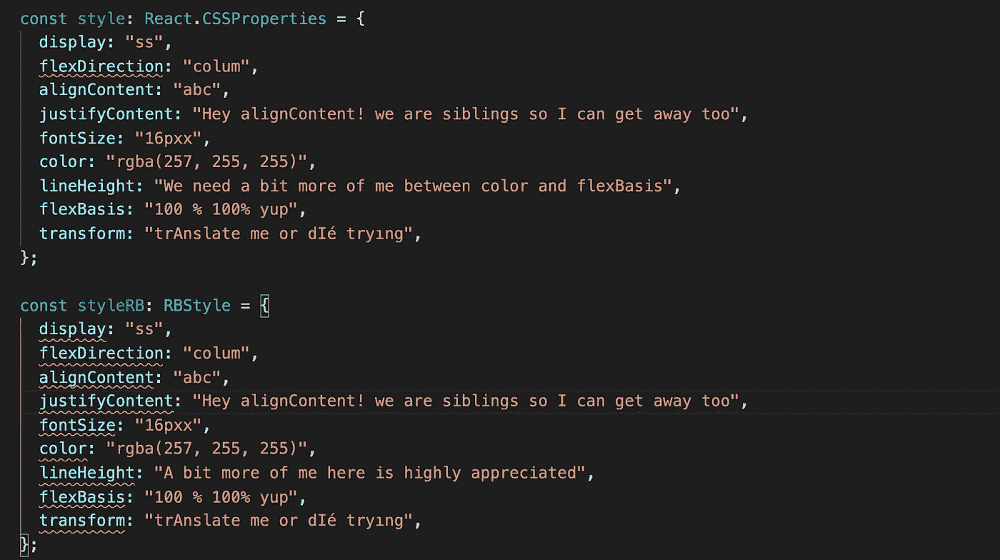
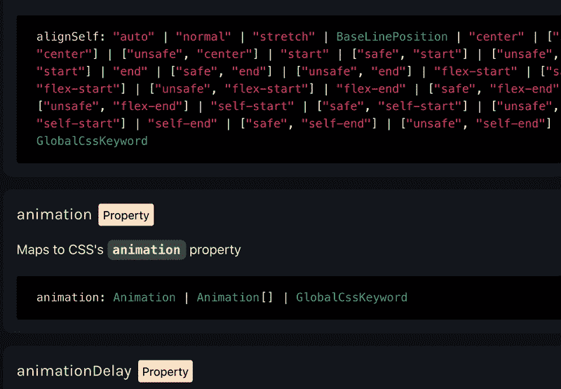

# rosebox:Typescript 中的 CSS

> 原文：<https://levelup.gitconnected.com/rosebox-css-in-typescript-8534afaa7583>

## 具有函数、对象和智能感知的样式

Rosebox 是一个 CSS-in-Typescript 库，它提供了诸如强类型(例如，`Angle`)、类型化函数(例如，`[linearGradient](https://www.rosebox.dev/api/#rb-vc-lingrad)`)、附加速记属性(例如，`[marginX](https://www.rosebox.dev/api/#rb-prop-marginX)`、`[paddingX](https://www.rosebox.dev/api/#rb-prop-paddingX)`)、一些复杂属性的对象接口(例如，`[animation](https://www.rosebox.dev/api/#rb-prop-animation)`)以及对高质量智能感知的支持等功能。

它将 CSS 的数据类型映射到 Typescript 中。这些数据类型中的一些直接映射到 TS 的固有类型，如`stringLiteral`、`string`和`number`，而其他的则映射到 RB 的自定义类型，如`Duration`、`TransformFunction`和`Length`。它的设计和开发着眼于**减少打字错误、更好的自动完成、富于表现力的 API 和数据操作的简易性**。

# 1.减少打字和更好的自动完成🤝

这两者是相辅相成的，就像 Knafeh 和糖浆一样。在我们的环境中分别讨论每一个问题是一件不可能完成的任务，尽管我尊重你对关注点分离原则的保留。

如果您在 React 中做过开发，那么您很可能使用过类型为`React.CSSProperties`的样式对象。让我们对`Rosebox.RBStyle`和`React.CSSProperties` (v17.0.1)进行型式检查测试:

正如您所看到的，在`React.CSSProperties`的情况下，类型检查器捕获的唯一类型错误是与`flexDirection`相关的错误，本例中的所有其他属性都通过了类型检查。为什么？因为除了`flexDirection`之外，它们都有类型`string`；全宇宙最欢迎错别字的类型；我把它叫做****错别字*** 。*

*另一方面，使用`Rosebox.RBStyle`，类型检查器捕捉这个例子中所有属性的类型错误。它之所以能够这样做，是因为 Rosebox 中的属性尽可能地缩小了类型范围。他们只有在万不得已的情况下才会得到`string`型。*

*这里有一个通过类型检查的`styleRB`版本:*

**

*这里是`display`所有可能值的文档截图:*

**

> *你不会打错的，不会的，先生！…*RB 的手表上没有。**

*这就把我们带到了**更好的自动完成**部分，这是 RB 中强类型化的自然产物，它大量使用`stringLiteral`而不是`string,`，甚至在元组和数组中也是如此。*

****

# *2.表达 API*

*所有基于单位的类型都是作为泛型类型实现的，这些泛型类型采用指定类型单位的类型参数。比如`Duration<'ms'>`和`Length<'em'>`。当您公开一个 API，并且想要清楚地说明您所期望的值的单位时，这就很方便了。考虑以下简单的 react 组件:*

**

*现在，如果我们试图通过一个`Duration<'s'>`我们会得到一个错误:*

**

*当然，我们并不总是想要强制执行`Duration`的某个单元或任何其他基于单元的类型；在这种情况下，我们只需省略类型参数(例如`Duration`)。*

*整洁，对不对？但这只是 RB 提供表达性 API 的一种方式。另一个是为一些复杂的属性如动画提供对象接口:*

**

# *3.无缝数据操作*

*当操作颜色时，我们通常需要在样式中使用它们之前将它们转换成`string`值。这里有一个例子:*

*在 RB 中，使用`@rosebox/colors`，您只是处理 RB 类型并返回 RB 类型，所以您不需要额外的序列化步骤，这是内部处理的:*

# *相关链接:*

*github:[https://github.com/rosebox/rosebox](https://github.com/rosebox/rosebox)*

*在 React 中使用 Rosebox:[https://www.rosebox.dev/docs/how-to-use](https://www.rosebox.dev/docs/how-to-use)*

*API:【https://www.rosebox.dev/api/ *