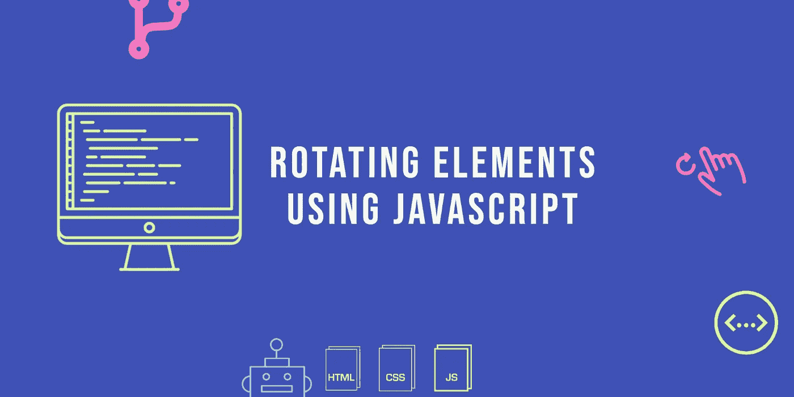

# 使用 JavaScript 旋转元素

> 原文：<https://levelup.gitconnected.com/rotate-elements-using-javascript-db5e0bcd3927>

我们将使用 [Propeller](https://github.com/PixelsCommander/Propeller) JavaScript 库来旋转元素。它支持惯性和步进旋转，也兼容触摸设备。要旋转元素，您只需拖动或滑动即可。

这是我们将要制作的[演示](https://webisora.github.io/rotate-elements-using-javascript/):

让我们从 **HTML** 开始:

带有`id="instructions"`的`p`暂时为空。我们将使用 JavaScript 填充指令，对于支持触摸的设备，使用*“滑动旋转”*，对于不支持触摸的桌面或设备，使用*“使用鼠标拖动并旋转”*。

现在，让我们添加一些 CSS:

最后， **JS** :

在上面的 Javascript 代码中，函数`is_touch_device`用于检查设备是否支持触摸，并相应地添加指令。然后我们把旋转力传给螺旋桨。我们将惯性设为 0.99，这样旋转会在一段时间后停止。如果你不想停止，那么简单地把惯性记为 1。以下是可用于此库的其他选项列表:

*   **角度**设置初始角度
*   **惯性**是最有价值的选项。它是一个介于 0 和 1 之间的数字。0 表示释放鼠标后不旋转。1 表示无限旋转。在这个演示中，我们使用惯性等于 0.99。
*   **速度** —旋转的初始速度。它也可以在运行时用作属性。
    最小速度——旋转的最小速度。只有当螺旋桨的惯性在 0 和 1 之间时才起作用。
*   **步进**允许设置步进模式的步进度数。
*   **stepTransitionTime** 使 CSS 转换从一个步骤移动到另一个步骤。这使得步骤平滑，并允许使用 CSS 过渡缓和。
*   **步进过渡使用**当处于步进模式且步进过渡时间大于零时，用于过渡的 CSS 缓解模式。关于旋转时执行的旋转回调函数
    的更多信息。你可以很容易地在回调函数中得到当前的角度。
*   **onStop** 停止时执行回调。
*   **onDragStart** 开始拖动时执行回调。
*   **onDragStop** 停止拖动时执行回调。

你可以在 [GitHub](https://github.com/webisora/rotate-elements-using-javascript) 上找到这个项目。

 [## webisora/rotate-elements-using-JavaScript

### 使用 JavaScript 通过鼠标或触摸输入旋转元素。-webisora/rotate-elements-using-JavaScript

github.com](https://github.com/webisora/rotate-elements-using-javascript) 

点击此处查看更多示例。