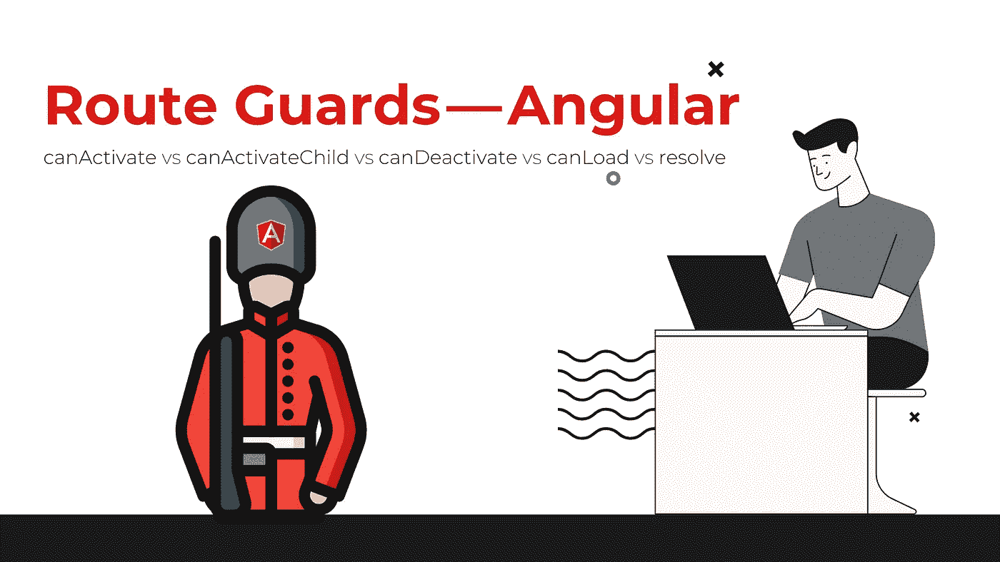

# 路线防护装置—角形

> 原文：<https://levelup.gitconnected.com/route-guards-angular-1ea6e596ce65>

## canActivate vs canActivate child vs can deactivate vs can load vs resolve



[来源](http://canva.com)

当涉及到访问角度路由时，有许多用例。有时，您希望限制对路径的访问，将访问权限仅限于某些特定用户，或者希望在离开路径之前提醒用户，甚至在访问路径之前检索数据。

谢天谢地，Angular 中有很多安全措施，我们可以用来保护路径，并为正确的用户提供正确的页面。

防护按以下顺序处理:

*   canDeactivate
*   canLoad
*   canactivated child
*   可以激活
*   解决

我将解释每一种类型，如何建立一个警卫服务，以及何时使用每一个例子。

准备好了吗？我们走吧(☞ﾟ∀ﾟ)☞

## **建立警卫服务**

Angular guard 通常构建为一个 Angular service，它实现我们感兴趣的特定内置 Angular Guard 类型。

当实现一个守卫接口时，我们必须定义相关的方法，比如为`**canActivate**`守卫定义`**canActivate()**`方法。这里有一个例子:

创建警卫服务后，我们可以通过以下方式在路由中使用它:

# 角度防护装置类型

## canActivate(导航到某条路线)

当 URL 改变到路由并将路由与守卫匹配时，调用`**canActivate**`。这种类型的防护装置通常用于:

*   限制特定用户的路线访问
*   确保满足先决条件

如果使用 Angular CLI，可以使用以下命令生成所需的保护:

```
***ng g g article/auth***
```

第一个`**g**`用于`**generate**`，第二个用于`**guard**`。在终端上启动这个命令后，Angular CLI 会问你除了`**canDeactivate**`和`**canLoad**`之外，你还想实现哪个 guard，后面我会讲到。选择防护类型后，CLI 将生成防护及其测试文件。

## canActivateChild(守护导航到子路线)

这种保护类型类似于`**canActivate**`保护，除了它是在激活路由子节点时调用的，而不是路由本身。该警戒工作是在激活子路由之前检查标准。这种类型的防护装置通常用于以下情况:

*   限制对子路由的访问
*   确保满足子路由的先决条件

## canDeactivate(保护导航远离某条路线)

警卫的工作是在离开这条路线之前检查标准。这种类型的防护装置的一些常见使用案例是:

*   检查未保存的更改
*   确认离开未完成的操作
*   提醒用户

正如我之前所说，对于这种类型的保护，CLI 在使用 CLI 命令时不会在要选择的保护类型中显示它。这是由`**canDeactivate**`的性质决定的。这种类型的保护有点不同，它是一个通用接口`**canDeactivate<T>**`，这意味着它需要一个通用参数。此参数标识将使用此保护的组件。这就是为什么 CLI 不建议使用这种类型的保护来生成它。

下面是我们如何使用这种保护的一个例子:

例如，我们可以在`**canDeactivate**`方法中检查用户在离开之前是否保存了他的工作。

最后一步是将此防护添加到模块中的路线:

## canLoad(防止异步路由)

执行`**canLoad**`守卫来决定是否可以装载孩子。你可能想知道`**canLoad**`和`**canActivate**`有什么区别？

嗯，这是有区别的，`**canActivate**`的存在是为了防止未经授权的用户访问某个路由，而`**canLoad**`是用来防止应用程序在用户未经授权的情况下以懒惰的方式加载整个模块或组件([懒惰加载](https://angular.io/guide/lazy-loading-ngmodules))。所以这类卫士的主要优势是优化 app，性能更好。

下面的例子实现了一个`**canLoad**`保护:

防护装置的使用方式与路线配置中的其他类型相同:

## 解决(激活路由前预取数据)

我要说的最后一种类型是`**resolve**`守卫。在我们导航到一条路线之前，这个守卫允许我们得到数据。你可能会说，等等，但是我们可以在`**ngOnInit()**`生命周期钩子中检索数据，对吗？我同意，但这种方法将导致我们在开始时看到一个空的组件。如果你的客户可以接受一个空的组件或者加载数据时的一个微调器，那也没问题，但是如果不能，有一个解决方案就是`**resolve**`保护。这允许您将组件与数据一起呈现。

下面是一个使用`**resolve**`保护的例子:

最后，将其添加到路由配置中:

# 💻用户基于角色的激活防护示例

基于@ [在这种情况下，我们需要访问此路线的权限。这意味着我们需要使用`**canActive**`警卫类型。但是我们还是需要告诉门卫，当前用户是有角色的，基于此，门卫会决定开门与否。因此，我们需要将数据传递给配置中的路由防护:](https://medium.com/@baldevkushal#1:添加路由配置</strong></li></ul><p id=)

[正如您在示例中看到的，我们将`**roles**`传递给了守卫。](https://medium.com/@baldevkushal#1:添加路由配置</strong></li></ul><p id=)

*   [**步骤#2:创建路线守卫**](https://medium.com/@baldevkushal#1:添加路由配置</strong></li></ul><p id=)

[既然我们已经配置了路由，我们需要创建我们的警卫角色警卫:](https://medium.com/@baldevkushal#1:添加路由配置</strong></li></ul><p id=)

*   [**步骤#3:根据用户角色显示菜单**](https://medium.com/@baldevkushal#1:添加路由配置</strong></li></ul><p id=)

[我们将根据用户的角色定制菜单甚至应用程序。](https://medium.com/@baldevkushal#1:添加路由配置</strong></li></ul><p id=)

[在组件类中:](https://medium.com/@baldevkushal#1:添加路由配置</strong></li></ul><p id=)

[希望这回答了你@](https://medium.com/@baldevkushal#1:添加路由配置</strong></li></ul><p id=) [Baldevkushal](https://medium.com/@baldevkushal?source=post_page-----e2ff924ee0ab--------------------------------) 和其他人的问题。谢谢大家的评论。

你也可以使用`**ngShow**` 指令来隐藏菜单中的一个元素，但它只会隐藏而不会像`**ngIf**`那样移除。

# 💡外卖:

*   为了与守卫共享数据，考虑使用`**route.paramMap.get('attribut')**`或者注入一个定制服务来共享你想要的数据。
*   要构建路由防护，首先要创建/生成一个防护服务，实现您感兴趣的防护类型。
*   要使用创建的保护服务，请将其添加到所需的路由配置中，否则在访问路由时不会考虑它。

亲爱的读者朋友们，感谢你们的支持和宝贵时间。我希望这对你有用和有帮助。

**关注我上** [**中**](https://medium.com/@famzil/) **、**[**Linkedin**](https://www.linkedin.com/in/fatima-amzil-9031ba95/)**、**[**Twitter**](https://twitter.com/FatimaAMZIL9)**了解更多文章。**

不久后见(ﾉ◕ヮ◕)ﾉ*:･ﾟ✧)

**FAM**