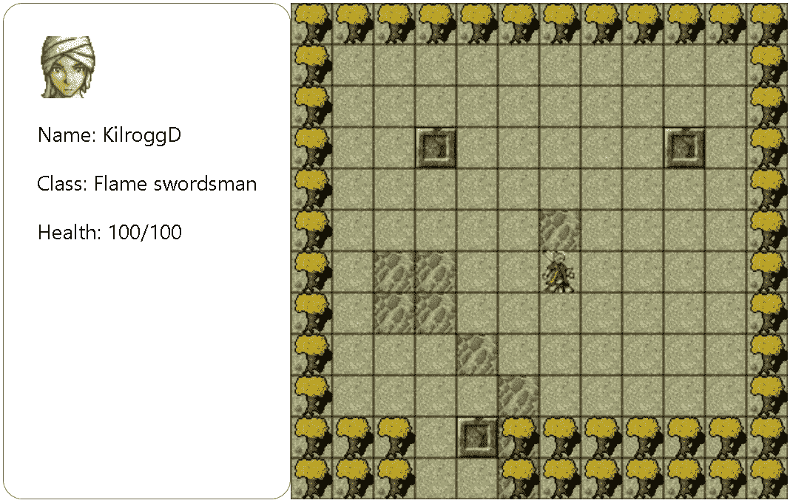
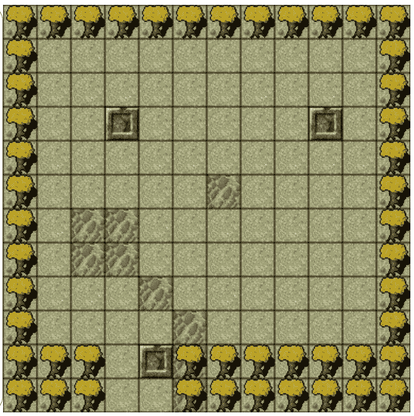
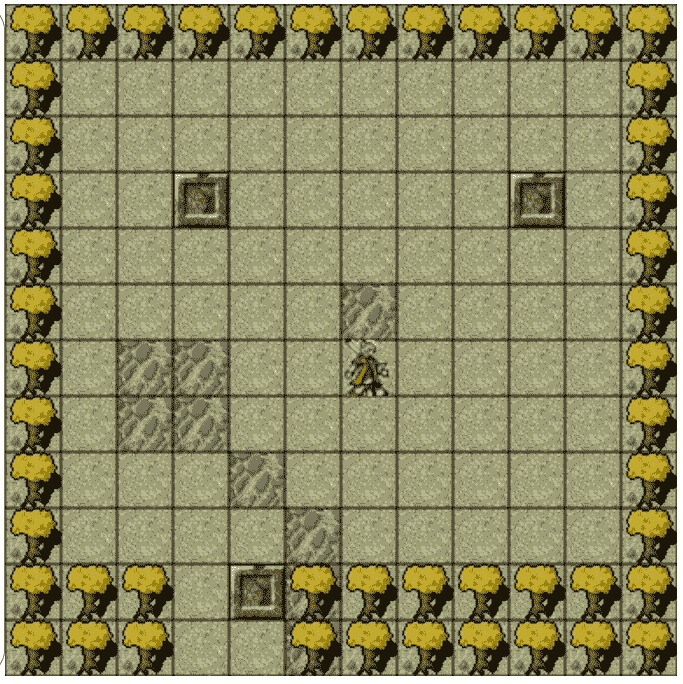
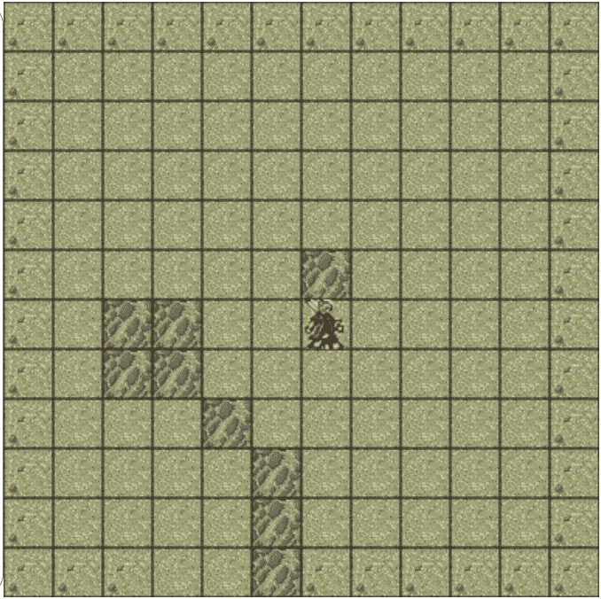
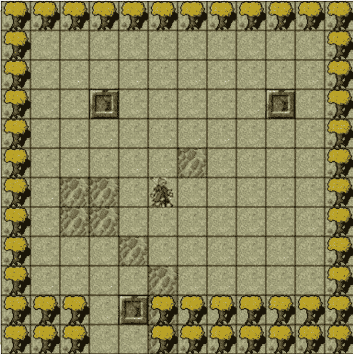

# 使用 React / Redux / HTML5 的 RPG 游戏——第 1 部分——使用移动的角色构建一个平铺地图

> 原文：<https://levelup.gitconnected.com/rpg-game-with-react-redux-html5-part-1-build-a-tile-map-9144fd867830>

# 介绍

在我之前的[教程](/writing-falling-dots-game-with-react-8b2884fa683d)中，我用 React + HTML / CSS stack 写了一个关于点击落点得分的小游戏。在本文中，我们将浏览另一个使用 React + Redux + HTML5 技术堆栈的小游戏开发教程。此外，我们将仔细研究一个相对较新的工具集，名为 [Redux Toolkit](https://redux-toolkit.js.org/) ，它旨在使我们使用 React / Redux 的工作更加容易。完整的工作源代码位于[库](https://github.com/KilroggD/rpg-react-redux)中。

享受你的阅读和编码吧！:)

# 从哪里开始

对于一篇文章来说，编写一个全功能的 RPG 游戏是一项巨大的任务，所以本教程只介绍几个重要的特性。

*   游戏领域表示为一个平铺地图，其中包含不同类型的地形和障碍，以及一个方形平铺的坐标网格
*   能够在 4 个主要方向移动的角色模型
*   代表主角状态的简单 UI。

在这个教程中，我使用了一些从 https://opengameart.org/网站下载的免费像素艺术收藏。

最终结果如下所示:



完整的源代码可以在[库](https://github.com/KilroggD/rpg-react-redux)中找到。要运行代码，只需克隆存储库，通过运行以下命令安装所有必需的软件包:

```
npm install
```

并通过运行以下命令在开发模式下启动代码:

```
npm start
```

# 解释了技术堆栈

*   React 和 Redux 用于游戏状态和逻辑——几乎免费共享游戏状态和开箱即用的组件支持，轻松集成连接到共享状态的游戏 UI 元素。
*   Redux 工具包——让我们使用 Redux 的工作变得更加容易
*   HTML5 [Canvas API](https://developer.mozilla.org/en-US/docs/Web/API/Canvas_API) —与在 HTML/CSS 中实现相同功能相比，代码更少，性能优化更好。
*   JavaScript[request animation frame](https://developer.mozilla.org/en-US/docs/Web/API/window/requestAnimationFrame)方法——为我们的 HTML5 游戏提供接近 60 fps 的性能优化。

你可能知道 React 和 Redux 通常不用于游戏开发。在本文中，我们将使用 React / Redux 作为状态管理和组件化工具，在 HTML5 Canvas 上呈现大部分 UI。React 还将帮助我们呈现有用的 UI 元素。此外，本教程旨在展示如何结合 HTML5 Canvas API 使用 React / Redux，并对 React hooks 和 Redux 进行更多练习。

# 关于 Redux 工具包的一些话

Redux 工具包包旨在成为编写 Redux 逻辑的标准方式。最初，它的设计是为了使 Redux 的使用更容易，并减少创建 React/Redux 应用程序所需的样板文件的数量。此外，使用这个工具包将创建 Redux 应用程序所需的包的数量减少到一个包——工具包本身

```
npm install @reduxjs/toolkit
```

本教程的另一个目的是尝试 Redux Toolkit 的一些主要特性和概念，看看它是如何工作的。

# 常量和设置

最大的[常量文件](https://github.com/KilroggD/rpg-react-redux/blob/master/src/tile-view/constants.js)包含平铺地图的主要设置:

*   以像素为单位的平铺尺寸
*   映射维度(行和列)
*   地图瓦片阵列(让我们现在做 2 层)
*   平铺图像的哈希映射(将数组中的数字映射到实际图像)
*   可能的移动方向(让我们向上/向下、向左/向右移动)
*   我们的英雄无法通过的“实心”瓷砖列表

所有这些常量都将用于构建我们的游戏。

还有一个更小的[常量文件](https://github.com/KilroggD/rpg-react-redux/blob/master/src/constants.js)，包含与我们的角色对象相关的参数(精灵、图像、大小等)。)

# 国家结构

在设计 React / Redux 应用程序时，从应用程序的状态结构开始通常是有意义的。Redux toolkit 有非常有用的工具用于状态结构设计和状态管理，称为[切片](https://redux-toolkit.js.org/tutorials/basic-tutorial#introducing-createslice)。它允许我们为一个对象提供 reducer 函数、自动生成的 action 类型字符串和基于我们列出的 reducer 名称的 action creator 函数。我们可以为切片定义初始状态对象。简而言之，我们可以把 slice 看作 redux store 的一部分，它有自己的初始状态和派生新状态的动作。[角色对象的切片](https://github.com/KilroggD/rpg-react-redux/blob/master/src/tile-view/slices/characterSlice.js)就是一个很好的例子:

```
import {createSlice} from '[@reduxjs/toolkit](http://twitter.com/reduxjs/toolkit)';const characterSlice = createSlice({
    name: 'character',
    initialState: {
        x: 6,
        y: 6,        
        heroClass: 'FLAME_SWORDSMAN',
        heroImg: null,
    },
    reducers: {
        move(state, action) {
            const [x, y] = action.payload;       
            state.x+=x;
            state.y+=y;
        },
        bufferImage(state, action) {
            state.heroImg = action.payload;
        }
    }
});export const { move, bufferImage } = characterSlice.actions;export default characterSlice.reducer;
```

它包含带有英雄参数和初始坐标的初始状态。还有两个动作——将英雄对象移动到新的坐标，并缓冲(加载)英雄的图像，将其放入我们的画布中。

其他 2 个切片代表游戏应用程序的[状态](https://github.com/KilroggD/rpg-react-redux/blob/master/src/tile-view/slices/statusSlice.js)和为我们的平铺地图加载的[地图图像](https://github.com/KilroggD/rpg-react-redux/blob/master/src/tile-view/slices/mapImagesSlice.js)

像通常的 Redux 应用程序一样，我们在[索引](https://github.com/KilroggD/rpg-react-redux/blob/master/src/reducers/index.js)文件中组合我们需要的所有 Redux。

```
import {combineReducers} from 'redux';
import characterReducer from '../tile-view/slices/characterSlice';
import mapImagesReducer from '../tile-view/slices/mapImagesSlice';
import statusReducer from '../tile-view/slices/statusSlice';export default combineReducers({
    mapImagesLoaded: mapImagesReducer,
    gameStatus: statusReducer,
    character: characterReducer,
});
```

然后我们可以传递那些组合的 reducers，存储在我们的根索引文件中。

```
import rootReducer from './reducers'const store = configureStore({
  reducer: rootReducer,
});ReactDOM.render(
  <React.StrictMode>
    <Provider store={store}>
      <App />
    </Provider>
  </React.StrictMode>,
  document.getElementById('root')
);
```

# 反应和画布—上下文 API

通常在 React 应用程序中，我们使用由应用程序当前状态驱动的虚拟 DOM 来呈现 UI。在这种情况下，我们使用 HTML [Canvas API](https://developer.mozilla.org/en-US/docs/Web/API/Canvas_API) 来渲染我们的游戏区域。因此，我们需要找到一种方法来将我们的应用程序状态映射到 Canvas API，以便让 HTML5 由 React 应用程序状态驱动。为此，React [上下文 API](https://reactjs.org/docs/context.html) 是一个很好的工具。上下文提供了一种在组件之间共享值的方式，而不必通过树的每一层显式地传递属性。因此，我们可以在 React 上下文值中保留对 HTML5 canvas 元素的引用，并使其在所有组件中可用。首先，我们定义我们的 [canvasContext](https://github.com/KilroggD/rpg-react-redux/blob/master/src/tile-view/canvasContext.js) 对象

```
import React from 'react';const CanvasContext = React.createContext(null);export default CanvasContext;
```

我们将在组件中使用 React 挂钩来修改 HTML5 canvas，使用 React 上下文中保存的引用来访问它。

然后，我们来看看主要的[游戏循环](https://github.com/KilroggD/rpg-react-redux/blob/master/src/tile-view/GameLoop.js)组件。这是我们的应用程序的一个非常重要的组件，将在本文的相关章节中进行描述。为了在我们的应用程序中集成 Canvas API，我们首先创建一个对 canvas HTML 元素的引用，并初始化一个指向 Canvas context 的指针(默认为 null)

```
const canvasRef = useRef(null);
const [ctx, setCtx] = useState(null);
```

React hook 用于在组件状态下保存对 canvas 的引用。

```
useEffect(() => {
    setCtx(canvasRef.current.getContext('2d'));
}, [setCtx]);
```

然后，我们呈现 canvas 元素和所有包装在上下文提供者组件中的后续子元素，传递一个指向 HTML5 Canvas 的指针。

```
return (
    <CanvasContext.Provider value={ctx}>
        <canvas
            ref={canvasRef} 
            width={width} 
            height={height}
        />
        {children}
    </CanvasContext.Provider>
);
```

您可以在我们的顶级 [App.js](https://github.com/KilroggD/rpg-react-redux/blob/master/src/App.js) 组件中看到，我们在 GameLoop 组件中包装了我们的磁贴视图。

# 让我们画一个网格


[网格](https://github.com/KilroggD/rpg-react-redux/blob/master/src/tile-view/Grid.js)组件简单地用黑色实线在提供的任何子节点上画一个网格。我们使用常量文件中的设置来获得行数和行间距的大小。

```
import {useContext, useEffect} from 'react';import CanvasContext from './canvasContext';
import {TILE_SIZE} from './constants';const Grid = ({width, height, children}) => {
    const ctx = useContext(CanvasContext);
    useEffect(() => {
        for(let i = 0; i < height; i++) {    
            const y = i * TILE_SIZE;         
            ctx.beginPath();
            ctx.moveTo(0, y);
            ctx.lineTo(width, y);
            ctx.stroke();
        }
        for(let j = 0; j < width; j++) {
            const x = j * TILE_SIZE;
            ctx.beginPath();
            ctx.moveTo(x, 0);
            ctx.lineTo(x, height);
            ctx.stroke();
        } 
    }, [ctx, height, width]); return children;
}export default Grid;
```

所有的逻辑都是通过两个钩子实现的——*使用 Context* 来连接 CanvasContext,*使用 Effect* 来绘制组件的安装或更新。然后我们简单地返回包裹在网格中的孩子。

# 让我们画一张地图——图像缓冲

当我们渲染由平铺图像组成的实际地图时，有些图像可能无法按时加载。这可能会导致一些不愉快的用户体验，而一些图像在我们的地图渲染时没有加载。为了避免这种情况，我们需要确保在实际的地图渲染之前加载所有的图像。我们可以称这个过程为图像的缓冲。角色的图标也应该被缓冲以防万一。为了保存缓冲的图像，我们创建了应用程序状态的一个特殊的[片段](https://github.com/KilroggD/rpg-react-redux/blob/master/src/tile-view/slices/mapImagesSlice.js)。它创建一个哈希映射，并在其中存储缓冲的图像路径。

```
import {createSlice} from '[@reduxjs/toolkit](http://twitter.com/reduxjs/toolkit)';const mapImagesSlice = createSlice({
    name: 'images',
    initialState: {},
    reducers: {
        bufferImage(state, action) {
            const path = action.payload;
            if (path) {
                state[path] = 1;
            }            
        },
    }
});export const { bufferImage } = mapImagesSlice.actions;export default mapImagesSlice.reducer;
```

然后，我们创建一个不可见的 [ImagesBuffer](https://github.com/KilroggD/rpg-react-redux/blob/master/src/tile-view/ImagesBuffer.js) 组件，在将所有图像注入 HTML5 画布之前，将它们加载到页面上。我们将切片中的 bufferImage 动作连接到这个组件。

```
import React from 'react';
import { connect } from 'react-redux';import {MAP_TILE_IMAGES} from './constants';
import {bufferImage} from './slices/mapImagesSlice';const mapDispatch = { bufferImage };const ImagesBuffer = ({ bufferImage }) => {
    return (
        <div className="images-buffer">
        {
            Object.keys(MAP_TILE_IMAGES).map(key => {
                return (
                     {      
                            bufferImage(MAP_TILE_IMAGES[key]);
                        }}
                    />
                );
            })
        }
        </div>
    )
}export default connect(null, mapDispatch)(ImagesBuffer);
```

在我们的[样式表](https://github.com/KilroggD/rpg-react-redux/blob/master/src/App.css)中，我们隐藏了图片缓冲区。

# 完成地图-切片和图层

我们的 tile view 应用程序的主要 UI 元素是地图本身。我们假设地图由两个[层](https://github.com/KilroggD/rpg-react-redux/blob/86c811b052ce92ef77e5a33df379e68eaa79eaf1/src/tile-view/constants.js#L17)组成——一个用于地图表面，一个用于其上的各种对象和表面(第二个列表中的非零元素)。标签列表中的每个数字代表[图像散列图](https://github.com/KilroggD/rpg-react-redux/blob/86c811b052ce92ef77e5a33df379e68eaa79eaf1/src/tile-view/constants.js#L9)中的一个图块图像。零元素是空瓷砖(没有物体或障碍物)。实心瓷砖是我们的角色无法通过的障碍物。

[Map](https://github.com/KilroggD/rpg-react-redux/blob/master/src/tile-view/Map.js) 是一个空渲染器，它使用来自我们的上下文和配置常量的指针在 HTML 5 画布上绘制地图块。

```
import {useContext, useEffect} from 'react';
import { connect } from 'react-redux';import {LAYERS, MAP_DIMENSIONS, TILE_SIZE} from './constants';
import CanvasContext from './canvasContext';
import {loadMap} from './slices/statusSlice';const mapDispatch = { loadMap };const Map = ({ loadMap }) => {
    const ctx = useContext(CanvasContext);
    const {COLS, ROWS} = MAP_DIMENSIONS; useEffect(() => {
        const drawLayer = grid => {
            for (let i = 0; i < ROWS; i++) {
                for (let j = 0; j < COLS; j++) {
                    const item = grid[i][j];
                    if (!item) {
                        // empty tile
                        continue;
                    }                
                    const img = document.querySelector(
                        `#map-tile-img-${item}`
                    );
                    const x = j * TILE_SIZE;
                    const y = i * TILE_SIZE;
                    ctx.drawImage(
                        img,
                        0,
                        0,
                        TILE_SIZE,
                        TILE_SIZE,
                        x,
                        y,
                        TILE_SIZE,
                        TILE_SIZE,
                    );
                }
            }
        }; drawLayer(LAYERS[0]);
        drawLayer(LAYERS[1]);
        loadMap(true);
    }, [COLS, ROWS, ctx, loadMap]); return null;
};export default connect(null, mapDispatch)(Map);
```

请注意，这个组件不直接在 DOM 中呈现任何东西。它只是一个围绕 canvas 的包装器，在组件的每次安装/更新时绘制地图(用`useEffect` React 钩子实现)。绘制完成后，我们将加载标志设置为 true。



# 我需要一个英雄！

地图在这里所以我们需要一个英雄:)在地图周围移动。在特殊的[常量](https://github.com/KilroggD/rpg-react-redux/blob/master/src/constants.js)中，您可以找到与我们的英雄对象相关的配置参数(图像精灵、图像大小、关于英雄的信息)。上面已经描述了在地图上代表英雄状态的状态[片](https://github.com/KilroggD/rpg-react-redux/blob/master/src/tile-view/slices/characterSlice.js)。[人物](https://github.com/KilroggD/rpg-react-redux/blob/master/src/tile-view/Character.js) React 组件与上一个非常相似。它加载并缓冲英雄的图像，将其保存在应用程序状态中，当图像被加载时，它在画布上绘制英雄的图标(useEffect 再次提供帮助！).

```
useEffect(() => {
        if (heroImg) {
            const {sx, sy} = HERO_CLASSES_MAP[heroClass].icon;
            ctx.drawImage(
                document.querySelector(heroImg),
                sx,
                sy,
                HERO_IMAGE_SIZE - 5,
                HERO_IMAGE_SIZE - 5,
                x * TILE_SIZE,
                y * TILE_SIZE,
                HERO_IMAGE_SIZE,
                HERO_IMAGE_SIZE,
            );
            loadCharacter(true);
        };  
}, [ctx, heroClass, heroImg, x, y, loadCharacter]);
```

我们使用英雄的 X 和 Y 坐标乘以 TILE_SIZE 来正确定位英雄图标在图块地图上的位置。

它呈现的唯一 HTML 是用于缓冲的隐形英雄的图像。

```
return (
     bufferImage(`#${imgRef.current.id}`)
        }
        className="images-buffer"
        src={HEROES_SPRITE}
    />
);
```



耶！我们的角色图标在这里，并准备好了一些行动:)

# 重要！安装和绘制顺序

也许你很好奇为什么我们要按照一定的顺序嵌套组件。TileView 将网格作为子组件，网格包含地图。此外，我们确保角色仅在地图加载后才被渲染。如果您看到 React JS 如何处理嵌套组件挂载，原因就很简单了。

让我们将`console.log('mapEffect')`放入地图组件`useEffect`钩子中，将`console.log('gridEffect')`放入网格的钩子中。

你会看到“地图效果”首先记录在控制台中。这是因为 React JS 方法在父组件的生命周期方法之前触发子组件的生命周期方法。但为什么这对我们的案子如此重要？

让我们交换地图组件中的 2 条线，在绘制第 2 层之前绘制第 1 层

```
drawLayer(LAYERS[1]);
drawLayer(LAYERS[0]);
```

你会看到这张不太好的照片。一层在另一层上面。



因此，如果我们需要在 HTML5 画布上绘制多个图层，绘制的顺序很重要。所以我们需要先画出我们的地图，然后在上面画一个网格。并且我们只需要在地图加载后绘制一个角色。这就是为什么我们将地图组件作为[子组件传递给网格](https://github.com/KilroggD/rpg-react-redux/blob/86c811b052ce92ef77e5a33df379e68eaa79eaf1/src/tile-view/TileView.js#L20)——我们需要比网格更早调用绘制地图的 useEffect 钩子——这样网格就呈现在地图上方，而不是下方。

对于角色，我们使用 [mapLoaded](https://github.com/KilroggD/rpg-react-redux/blob/86c811b052ce92ef77e5a33df379e68eaa79eaf1/src/tile-view/TileView.js#L24) 状态标志来确保角色的图标不会落在地图瓦片之下。

# 让它移动—请求动画帧

当谈到在 HTML 画布上移动东西时，最大的挑战是优化画布刷新，这样我们就不会在地图上看到移动对象的任何故障、闪烁或重复。Javascript 有一个很好的原生函数来处理这个问题，叫做 [requestAnimationFrame](https://developer.mozilla.org/ru/docs/DOM/window.requestAnimationFrame) 。它允许我们以接近 60 fps 的速度重新绘制画布。

本节主要关注负责主要游戏事件和 60fps 重绘循环的[游戏循环](https://github.com/KilroggD/rpg-react-redux/blob/master/src/tile-view/GameLoop.js)组件。

## 定义标志

有几个标志和变量对重新渲染我们的画布很有用

```
// used for re-rendering child components
const [isVisible, setIsVisible] = useState(true);// used to avoid unnecessary updates and re-draws
const [isUpdateRequired, setIsUpdateRequired] = useState(false);// keeps the reference to the main rendering loop
const loopRef = useRef();
```

## 检查地图边缘和障碍物

移动我们的角色比仅仅改变地图上的 X 和 Y 坐标要复杂一些。我们还需要确保我们的英雄不能穿过墙壁和树木，从地图的边缘掉下来。一小部分[实用函数](https://github.com/KilroggD/rpg-react-redux/blob/master/src/tile-view/utils.js)用于它。

```
import {LAYERS, MAP_DIMENSIONS, SOLID_TILES} from './constants';export const isSolidTile = (x, y) => {
    for (let layer of LAYERS) {
        if (SOLID_TILES.includes(layer[y][x])) {
            return true;
        }
    }
    return false;
};export const isMapEdge = (x, y) => {
    const {ROWS, COLS} = MAP_DIMENSIONS;
    return (x < 0 || x >= COLS || y < 0 || y >= ROWS)        
};export const checkMapCollision = (x, y) => {
    return isMapEdge(x,y) || isSolidTile(x,y);
};
```

主`checkMapCollision`函数检查主角是否真的可以移动到给定 X 和 Y 坐标的方块上

## 移动角色的图标

移动角色函数只是检查目标图块是否可以继续移动，并使用我们的角色在地图{x，y}上的新坐标更新我们的应用程序状态的角色片段:

```
const moveCharacter = useCallback((e) => {
    const key = e.key;
    if (MOVE_DIRECTIONS[key]) {
        const [x,y] = MOVE_DIRECTIONS[key];
        if (!checkMapCollision(character.x + x, character.y + y)) { 
           setIsUpdateRequired(true);
           move([x, y]);
        }
    }
}, [move, character.x, character.y]);
```

[移动方向](https://github.com/KilroggD/rpg-react-redux/blob/86c811b052ce92ef77e5a33df379e68eaa79eaf1/src/tile-view/constants.js#L48)映射到所有玩家熟悉的 W/A/S/D 键:)

```
export const MOVE_DIRECTIONS = {
    w: [0, -1],
    a: [-1, 0],
    s: [0, 1],
    d: [1, 0],
};
```

在角色被移动后，我们将`isUpdateRequired`标志设置为 true，以表明某些东西已经被改变，需要更新 UI。

```
useEffect(() => {
    document.addEventListener('keypress', moveCharacter);
    return () => {
        document.removeEventListener('keypress', moveCharacter);
    }
}, [moveCharacter]);
```

我们将`moveCharacter`回调绑定到`keypress` DOM 事件。

## 清除并重新绘制画布

构建重绘循环的一个重要要求是，当需要重绘来呈现下一个状态时，清除画布。在本教程中，我们已经成功地利用这个机会将与画布相关的操作放入 React 组件的生命周期挂钩中，以便在我们的地图上绘制一些东西。为什么不用同样的方法来清理画布呢？看看其中一个顶级子组件— [TileView](https://github.com/KilroggD/rpg-react-redux/blob/master/src/tile-view/TileView.js) 组件。

```
useEffect(() => {
   return () => {
       return () => ctx && ctx.clearRect(
           0, 0, ctx.width, ctx.height
       );
   }
}, [ctx])
```

这里我们使用一个空的 useEffect 钩子，它有 cleanup 部分。这部分是最重要的，因为当我们卸载 TileView 组件时，它会清空画布。就像我们在 GameLoop 组件中做的那样:

```
return (
    <CanvasContext.Provider value={ctx}>
        <canvas
            ref={canvasRef} 
            width={width} 
            height={height}
        />
        {isVisible && children}
    </CanvasContext.Provider>
);
```

在我们的[应用](https://github.com/KilroggD/rpg-react-redux/blob/master/src/App.js)中，TileView 作为子组件被传递到那里。因此，当`isVisible`标志为假时，TileView 组件被卸载，并且 useEffect cleanup [清除](https://github.com/KilroggD/rpg-react-redux/blob/23983851d0e15ff7101ba701d47c8ac55479d7bd/src/tile-view/TileView.js#L18)画布和游戏区域。

现在，让我们回到我们的主[游戏循环](https://github.com/KilroggD/rpg-react-redux/blob/master/src/tile-view/GameLoop.js)，仔细看看以下两个函数:

```
const tick = useCallback(() => {
    if (isUpdateRequired) {
        setIsVisible(false);
        setIsVisible(true);    
        setIsUpdateRequired(false);
    }     
    loopRef.current = requestAnimationFrame(tick);
}, [isUpdateRequired, setIsVisible, setIsUpdateRequired]);
```

第一个是我们游戏循环中的单个“滴答”。它检查是否需要更新，然后通过切换可见性标志来触发子组件的重新呈现。则它将需要更新标志重置为假，并请求下一次更新。

```
useEffect(() => {   
    loopRef.current = requestAnimationFrame(tick);
    return () => {
        loopRef.current && cancelAnimationFrame(loopRef.current);
    }
}, [loopRef, tick])
```

第二个函数是一个 useEffect 钩子。它保存对刷新循环的引用，并开始刷新过程。当组件卸载时，我们还添加了一个清理函数来 cancelAnimationFrame。

## 检查它移动！

看到字符图标在地图上移动，而不能通过墙壁，树木和地图的边缘:)



# **增加一些游戏 UI**

为了让我们的应用程序看起来更像一个游戏，还缺少一个小东西。我们需要一个简单的用户界面面板来显示角色的名字，头像和基本信息。

我们不必为这个面板使用 canvas，因此它可以简单地由连接到角色状态部分的 [GameUI](https://github.com/KilroggD/rpg-react-redux/blob/master/src/game-ui/GameUI.js) React 组件来呈现。在这个阶段，我们只从我们的状态中获取 hero 的类属性，并为其他参数使用常量。最终的照片是这样的:


# 后续步骤

我真的很喜欢写这个应用程序和这篇文章，我希望你有一个很好的乐趣阅读和启动应用程序。除了获得一些乐趣之外，它还帮助我了解了相对较新且相当强大的 Redux-toolkit 库的一些主要特性。此外，练习更多的 React 挂钩用法并以不寻常的方式使用它们来处理外部对象状态(HTML5 canvas)也很棒。由于我们的工具包(redux + hooks + context)给了我们高度的灵活性，这种方法到目前为止都是有效的。

但是正如你可能注意到的，这个应用程序并不完美，缺少一些重要的功能。本教程的下一部分有一些想法:

*   制作一个可滚动的地图，这样我们的英雄就可以离开边缘，进入地图的下一个屏幕
*   添加一些对象，如 NPC，怪物或项目
*   添加我们的英雄和那些物体之间的互动
*   构建其他视图屏幕，如角色/库存视图、战斗视图等。
*   创建一个可定制的设置，可以选择角色的名字，职业，图片等。

# 谢谢你的主意

有一些有用的文档和文章启发了我，并帮助我创建了这个教程:

*   [MDN 教程](https://developer.mozilla.org/en-US/docs/Games/Techniques/Tilemaps)普通 JS 平铺地图
*   [教程](https://dev.to/martyhimmel/moving-a-sprite-sheet-character-with-javascript-3adg)关于在 Javascript 中移动 sprite 工作表字符
*   [https://opengameart.org](https://opengameart.org/)—一些免费的像素艺术和许多灵感:)