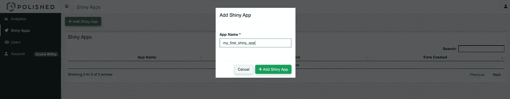

# 在 AWS Kubernetes 上使用抛光的 RShiny 认证

> 原文：<https://levelup.gitconnected.com/rshiny-authentication-with-polished-on-aws-kubernetes-358baff9a61c>


如果你正在寻找一种便捷的方式为你的 RShiny 应用添加认证，你应该看看 [polished.tech](http://polished.tech/) 。用他们自己的话说:

> *Polished 是一个 R 包，它为你闪亮的应用程序增加了认证、用户管理和其他功能。抛光。技术是最快和最简单的方法来使用抛光。*
> 
> Polished.tech 提供了一个托管的 API 和仪表板，所以你不需要担心设置和维护 polished API。有了 polished.tech，您可以不再担心样板基础设施，并回到构建您的核心应用程序逻辑。

Polished.tech 是一个托管解决方案，用于为您的 RShiny 应用程序添加身份验证。它对前 10 个用户是完全免费的，这给了你足够的自由来使用它。

在这篇文章中，我们将讨论如何:

*   快速轻松地开始使用 polished.tech 托管解决方案，并获取您的 API 证书
*   使用预构建的 docker 容器测试您的 API 凭证
*   部署 AWS Kubernetes (EKS)集群
*   将您的 API 凭据安全地添加到 EKS 集群
*   使用 polished.tech 身份验证，使用示例 RShiny 应用程序部署舵图！

所以让我们开始吧！

# 先决条件

为了完成本教程的 AWS 部分，您需要:

# 码头工人

您将需要 Docker 来运行快速入门指南。

我总是用我需要的所有 CLI 工具创建一个 Docker 映像，并将任何凭证的副本直接保存在项目文件夹中。您不需要特别了解如何使用 Docker，因为我们只是将容器视为一个终端。

如果您不想使用 Docker，您需要安装 Docker 文件中显示的所有 CLI 工具，并在本地运行 shiny 应用程序。

# AWS IAM 用户

如果您想部署到 AWS，您需要一个 AWS IAM 用户，以及该用户的 API 密匙。更多信息参见 [AWS 文档](https://docs.aws.amazon.com/cli/latest/userguide/cli-configure-quickstart.html#cli-configure-quickstart-creds)。

同一个 AWS IAM 用户必须拥有创建 EKS 集群的权限。您可以使用[这个角色](https://docs.aws.amazon.com/eks/latest/userguide/service_IAM_role.html)，或者具有管理员权限的用户。

# 快速启动

如果您已经有了完善的 API 证书，那么您可以从这里开始。

```
docker run -it \
 --rm \
-p 3838:3838 \
 -e POLISHED_APP_NAME="my_first_shiny_app" \
 -e POLISHED_API_KEY="XXXXXXXXXXXXXX" \
 jerowe/polished-tech:latest
```

将您自己的凭证添加到`POLISHED_APP_NAME`和`POLISHED_API_KEY`中。

然后在`localhost:3838`打开浏览器，使用你的电子邮件和密码组合登录你的应用程序。

# 注册并获得您的证书

所有这些说明都在文档中[，这里只是为了完整起见。](https://polished.tech/docs/get-started)

# 签约雇用

前往[仪表板 URL](https://dashboard.polished.tech) 并注册。从那里，登录，你会看到你的帐户仪表板。


如果你使用谷歌或微软，系统会提示你使用这些账户登录。如果您使用电子邮件，系统会提示您创建密码。

# 可选—社交登录与电子邮件和密码

如果您想使用社交登录并在 AWS 上部署，您需要使用[外部域](https://polished.tech/docs/firebase-setup)设置 Firebase。如果您要部署到 localhost 之外的主机，并且想要使用 Google 之类的社交登录提供者，那么您只需要完成这一步。当我们进一步部署到 AWS 时，我们将进入更多的细节。

# 获取您的 API 密钥

前往[仪表板](https://dashboard.polished.tech/)，在左侧菜单中，点击*账户*获取您的密钥。


把它放在某个地方！从现在开始，我们将把它称为`POLISHED_API_KEY`。

# 创建应用程序

你必须创建一个应用程序，整个计划才能发挥作用。

在左侧菜单中点击*闪亮应用*。



把它写在某个地方！从这里开始，我们将把它称为`POLISHED_APP_NAME`。

# 将应用程序与您的用户相关联

(还有潜在的其他用户！)

一旦你有了一个应用，一定要把它和你的用户联系起来。这个第一次就把我难住了，因为我没有很好地遵循指示。；-)如果跳过这一步，您将无法登录。

在您的仪表板左侧菜单中，转到*用户*，将应用程序与用户相关联。

您可以编辑用户以允许访问应用程序，也可以编辑应用程序以授予用户访问权限。两者都实现了相同的目标。

**从用户菜单**


**从应用菜单**


# 测试您的证书

如果你只是想测试你的凭证，运行`docker run`命令。

```
docker run -it \
 --rm \
 -p 3838:3838 \
 -e POLISHED_APP_NAME="my_first_shiny_app" \
 -e POLISHED_API_KEY="XXXXXXXXXXXXXX" \
 jerowe/polished-tech:latest
```

当然，我知道你之前写下的凭证。；-)

在`localhost:3838`打开浏览器，使用您的用户邮箱和密码登录。您应该会看到一个包含您的用户 UID 和会话信息的屏幕。成功！

# 让我们部署我们的应用程序吧！

在教程的下一部分，我们将讨论如何让你的应用程序进入大自然！我为此选择了 Kubernetes，因为它在任何地方都可以工作，而且托管的 AWS 解决方案也很好。此外，部署到 Kubernetes 允许您轻松地加密 API 密钥、数据库凭证等。

# 抓住密码

如果你想继续克隆 Github repo。

```
git clone [https://github.com/jerowe/rshiny-with-polished-tech-eks](https://github.com/jerowe/rshiny-with-polished-tech-eks)
```

# 项目结构

GitHub repo 中有两个目录，`auto-deployment,`和`rshiny-app-polished-auth`。

`auto-deployment`有一个(稍微修改的)[地形 EKS](https://github.com/terraform-aws-modules/terraform-aws-eks) 的配方，首先部署我们的 EKS 集群，安装我们的舵图，并做一些联网魔法。

如果您以前从未使用过 Terraform，请不要担心。它真的像一个语法更好的 Makefile。[掌舵图](https://helm.sh/docs/topics/charts/)是 Kubernetes 打包和定义应用程序的首选方法。

深入掌舵图会让这篇文章*太长，但我会在这篇文章中更深入地讨论[。](https://www.dabbleofdevops.com/blog/deploy-rshiny-on-kubernetes-with-a-helm-chart)*

项目系统的根中还有一个`Dockerfile`。这个`Dockerfile`拥有部署 EKS 集群和安装掌舵图所需的一切。安装`aws-cli`、`terraform`、`helm`和`kubectl` cli 工具。你可以在你的本地电脑上安装这些东西，但是那会很痛苦。；-)

```
├── Dockerfile
├── README.md
├── auto-deployment
│   ├── eks
│   │   ├── aws.tf
│   │   ├── helm.tf
│   │   ├── helm_charts
│   │   │   ├── rshiny-eks
│   │   │   │   ├── Chart.yaml
│   │   │   │   ├── charts
│   │   │   │   ├── templates
│   │   │   │   │   ├── NOTES.txt
│   │   │   │   │   ├── _helpers.tpl
│   │   │   │   │   ├── deployment.yaml
│   │   │   │   │   ├── ingress.yaml
│   │   │   │   │   ├── service.yaml
│   │   │   │   │   ├── serviceaccount.yaml
│   │   │   │   │   └── tests
│   │   │   │   │       └── test-connection.yaml
│   │   │   │   └── values.yaml
│   │   ├── main.tf
│   │   ├── outputs.tf
│   │   └── variables.tf
│   └── terraform-state
│       ├── main.tf
├── build_and_run_polished_app.sh
└── rshiny-app-polished-auth
    ├── Dockerfile
    ├── app.R
    └── shiny-server.sh
```

# 码头工人形象

我基于[摇杆/闪亮](https://hub.docker.com/r/rocker/shiny)图像构建了一个 docker 图像。

这里需要注意的重要事情是，我删除了默认的 index.html 和其他示例应用程序，并添加了我自己的应用程序

## 环境变量

我添加了一个启动 CMD 来将`POLISHED_*`变量添加到`/home/shiny/.Renviron`。闪亮的服务器运行一个干净的过程，它不会拾取任何外部环境变量。

```
# rshiny-app-polished-auth/Dockerfile
FROM rocker/shiny:4.0.0

# Install everything needed for polished

RUN apt-get update && apt-get install -y \
    libssl-dev

RUN R -e "install.packages('remotes')"
RUN R -e "remotes::install_github('tychobra/polished')"
RUN rm -rf /srv/shiny-server/*
COPY app.R /srv/shiny-server/app.R

COPY shiny-server.sh /usr/bin/shiny-server.sh
```

`shiny-server`进程干净地运行，这意味着我们必须从`~/.Renviron`文件中加载我们的`POLISHED_*`环境变量。如果您需要添加任何其他变量，请确保您在这里这样做，并重建 docker 映像！

```
# rshiny-app-polished-auth/shiny-server.sh
#!/bin/sh

# Make sure that we add our Polished to our /home/shiny/.Renviron
env | grep POLISHED > /home/shiny/.Renviron
chown shiny:shiny /home/shiny/.Renviron

# Make sure the directory for individual app logs exists
mkdir -p /var/log/shiny-server
chown shiny.shiny /var/log/shiny-server

if [ "$APPLICATION_LOGS_TO_STDOUT" != "false" ];
then
    # push the "real" application logs to stdout with xtail in detached mode
    exec xtail /var/log/shiny-server/ &
fi

# start shiny server
exec shiny-server 2>&1
```

# 更新 AWS 区域

AWS 区域被设置为`us-east-1`。如果你需要改变它，看看`auto-deployment/eks/variables.tf`和`auto-deployment/terraform-state/main.tf`。

# 可选—社交登录的 Firebase 设置

如果你想使用社会登录(谷歌，微软等)，你需要获得自己的 Firebase 帐户和凭证。如果你使用电子邮件和密码，你可以跳过这一步！

首先，我们将设置 Firebase 项目，然后我们将向该项目注册一个应用程序。

# FireBase 项目设置

前往 [FireBase 控制台](https://console.firebase.google.com/u/0/?pli=1)建立一个项目。这非常简单，向导会引导您完成所有步骤。从那里转到 _Develop - >认证- >登录方法。_ 然后启用电子邮件+密码以及您喜欢的任何社交提供商。


确保您的社交登录为绿色并已启用！

# 设置您的 FireBase 应用程序

在您的项目中，您需要注册一个应用程序并获取凭据。在你的 Firebase 项目中点击设置图标，然后点击*添加应用。*


注册应用程序后，您将获得应用程序凭据。


在下一步中，您将把这些添加到 terraform 配方中。

将您的完美证书添加到 Terraform 食谱中

在部署您的 EKS 集群之前，请确保您添加了完善的凭证。

```
# auto-deployment/eks/variables.tf
# CHANGE THESE!

...

# Then make sure to add your user to the app!
variable "POLISHED_APP_NAME" {
  default = "my_first_shiny_app"
}

# Grab this from the polished.tech Dashboard -> Account -> Secret
variable "POLISHED_API_KEY" {
  default = "XXXXXXXXXXXXXXXXXX"
}

# Firebase credentials
# Only add these if you've setup your own firebase credentials
variable "POLISHED_FIREBASE_API_KEY" {
  default = ""
}
```

如果您按照 Firebase 的说明进行操作，请确保您也添加了 Firebase 凭据。如果你不是，就让它们保持原样。

# 库伯内特的秘密

您可以看到我们添加了作为 terraform 变量的`POLISHED_*`变量，然后这些变量作为[秘密](https://kubernetes.io/docs/concepts/configuration/secret/)被添加到我们的 Kubernetes 集群中。

秘密变得有点棘手，因为感觉你必须把它们添加到一百万个地方，而且很容易让它们不同步。我建议选择一个，并且只有一个引用变量的方法。别装可爱了！；-)

你的 Kubernetes 秘密(通常)出现在 3 个地方:

*   在你的 Terraform 食谱中(作为秘密)
*   在你的舵轮图中的环境变量要么在`values.yaml`
*   还是在`templates/deployment.yaml`里。

第二个真的取决于你的图表的组织方式。

秘密可能很棘手，所以我用几种不同的方式展示它们。

# Kubernetes 的秘密—代码视图

以下是我们在 terraform 部署中的秘密:

```
# auto-deployment/eks/main.tf
locals {
  secrets = [
    {
      name = "polished"
      data = {
        app_name = var.POLISHED_APP_NAME
        api_key = var.POLISHED_API_KEY
      }
    },
  ]
}

resource "kubernetes_secret" "main" {
  depends_on = [
    module.eks,
  ]
  count = length(local.secrets)

  metadata {
    name = local.secrets[count.index].name
    labels = {
      Project = local.cluster_name
      Owner = "terraform"
    }

  }

  data = local.secrets[count.index].data

  type = "Opaque"
}
```

火焰基地的秘密也在那里，只是为了不使它成为百科全书而没有展示出来。现在我们将它们读入我们的 RShiny 应用程序部署，告诉 Helm 它们是 Kubernetes 的秘密。

```
# auto-deployment/helm_charts/rshiny-eks/values.yaml
env:
  - name: POLISHED_API_KEY
    valueFrom:
      secretKeyRef:
        # In terraform this is locals.secrets.[0].polish.data.api_key
        name: polished
        key: api_key
  - name: POLISHED_APP_NAME
    valueFrom:
      secretKeyRef:
        # In terraform this is locals.secrets.[0].polish.data.app_name
        name: polished
        key: app_name
```

最后，在我们的实际部署中，我们添加了来自`values.yaml`的 env 键。

```
containers:
   - name: {{ .Chart.Name }}
     securityContext:
       {{- toYaml .Values.securityContext | nindent 12 }}
     image: "{{ .Values.image.repository }}:{{ .Values.image.tag }}"
     imagePullPolicy: {{ .Values.image.pullPolicy }}
     # Env vars are read in HERE
     env:
       - name: TAG
         value: {{ .Values.image.tag }}
       {{- toYaml .Values.env | nindent 12 }}
```

## Kubernetes 的秘密—图像视图

这是我们的中公布的秘密的并排视图:

*   地形变量— `auto-deployment/eks/variables.tf`
*   库伯内特的秘密— `auto-deployment/eks/main.tf`
*   在舵图中——`auto-deployment/eks/helm_charts/rshiny-eks/values.yaml`(以及`auto-deployment/eks/helm_charts/rshiny-eks/templates/deployment.yaml`的`containers[0].env`)


# 部署到 AWS Kubernetes 集群(EKS)

现在我们已经介绍了所有的基础知识，让我们最终部署我们的集群吧！

# 构建 Terraform Docker 映像

我喜欢在 docker 文件中拥有部署特定项目所需的一切。我几乎为我参与的每个项目都准备了一个，因为没有人想跟踪部署情况。

我的大多数项目看起来像:

```
├── .aws
├── Dockerfile
├── README.md
├── auto-deployment
```

其中的`.aws`目录包含项目的 AWS 凭证，Dockerfile 包含部署所需的 cli 工具，然后是实际的自动部署。如果您还没有配置 AWS CLI，您可以在 [AWS 文档](https://docs.aws.amazon.com/cli/latest/userguide/cli-configure-quickstart.html#cli-configure-quickstart-creds)中了解更多信息。

```
# From the project directory
docker build -t eks-k8 .
# If your aws credentials are someplace else be sure to change this!
# The default AWS cli credentials location is home
# If you keep your .aws credentials in the project folder use this command
#docker run -it -v "$(pwd):/project" -v "$(pwd)/.aws:/root/.aws" eks-k8 bash
# If your AWS credentials are in ~/.aws use this one
docker run -it \
    -v "$(pwd):/project" -v "${HOME}/.aws:/root/.aws" eks-k8 bash
```

这将创建一个包含您需要的所有内容的映像，然后将您放入 shell 中。从那里像对待任何其他终端一样对待您的图像。

# 初始化地形状态

还记得我之前说过 Terraform 有点像 Makefile 吗？作为其[状态](https://www.terraform.io/docs/state/)的一部分，它跟踪它所执行的操作、它所创建或销毁的资源。它可以在本地或在 S3 桶或其他类型的存储中跟踪这些内容。在我们的例子中，我们将在 S3 桶中跟踪状态。

现在，S3 存储桶名称必须是全球唯一的。这意味着你和我不能有相同的 S3 桶名！我使用一个随机数生成器，但你也可以在 _ `auto-deployment/terraform-state/main.tf`中更改名称

```
# From within the eks-k8 docker image
cd /project/auto-deployment/terraform-state
terraform init; terraform refresh; terraform apply -auto-approve
```

# 部署集群！

**终于！**

我们将一举部署我们的集群，配置我们的各种 CLI，安装我们的舵图，并获得我们的外部 URL！

```
# From within the eks-k8 docker image
cd /project/auto-deployment/eks
terraform init; terraform refresh; terraform apply -auto-approve
```

偶尔，东西会超时。您可能需要多次运行该命令。抓个零食看着它走！

最后，你应该会看到这样的东西-


# 查看我们的 RShiny 应用程序

如果你注意的话，你会看到很多很多 terraform 命令的输出。

对于没有耐心的人来说，我们真正想要的是运行这个命令来获取外部 URL。

```
export EXPOSED_URL=$(kubectl get svc --namespace default rshiny-nginx-ingress-controller -o json | jq -r '.status.loadBalancer.ingress[]?.hostname') 
echo $EXPOSED_URL
```

# 可选—将外部域添加到 Firebase

如果你已经建立了自己的 Firebase 帐户，那么你需要获取外部 URL 并将其添加到 Firebase 控制台。*进入开发- >认证- >签到方式- >授权域。*


# 成功！

抓取$EXTERNAL_URL 并打开浏览器。您应该会看到 polished.tech 登录页面！


然后，当您登录时，您将看到会话数据！


# 有用的命令

下面是一些在 Kubernetes 上导航 RShiny 部署的有用命令。

```
# Get a list of all running pods
kubectl get pods 
# Describe the pod. This is very useful for troubleshooting! 
kubectl describe pod PODNAME
# Drop into a shell in your pod. It's like docker run.
kubectl exec -it PODNAME bash
# Get the logs from stdout on your pod
kubectl logs PODNAME 
# Get all the services and urls
kubectl get svc
```

# 关于 SSL 的简短说明

进入 SSL 有点超出了本教程的范围，但是这里有两个资源可以帮助您入门。

第一个是[数字海洋教程](https://www.digitalocean.com/community/tutorials/how-to-set-up-an-nginx-ingress-with-cert-manager-on-digitalocean-kubernetes)关于通过 NGINX 入口保护你的应用。我建议通读这篇文章，因为这会让您对设置 https 有一个很好的概念性理解。

第二篇是由[比特纳米](https://docs.bitnami.com/tutorials/secure-kubernetes-services-with-ingress-tls-letsencrypt/)写的文章。这是一个非常清晰的教程，教你如何使用舵轮图来启动和运行 HTTPS，我认为它很好地指导你尽可能简单地完成步骤。

如果你不在乎用 Kubernetes 理解 https 的来龙去脉，就去读 Bitnami 教程吧。；-)

# 包裹

就是这样！希望您能看到使用 polished.tech 托管服务启动和运行安全认证是多么容易！

如果您有任何问题或意见，请通过[jillian@dabbleofdevops.com](mailto:jillian@dabbleofdevops.com)直接联系我。如果你对 polished.tech 认证服务[有任何疑问，请访问他们的网站](http://polished.tech/)。

# 资源

[抛光技术认证](https://polished.tech/docs/get-started)

[舵图](https://helm.sh/docs/topics/charts/)

[地形 EKS 食谱](https://github.com/terraform-aws-modules/terraform-aws-eks)

[摇杆闪亮的 Docker 图像](https://hub.docker.com/r/rocker/shiny)

[EKS — AWS 管理的 Kubernetes 集群](https://aws.amazon.com/eks/)

[添加 SSL 教程](https://docs.bitnami.com/tutorials/secure-kubernetes-services-with-ingress-tls-letsencrypt/) [AWS —地区](https://aws.amazon.com/about-aws/global-infrastructure/regions_az/#:~:text=AWS%20maintains%20multiple%20geographic%20Regions,Africa%2C%20and%20the%20Middle%20East.)

[AWS —配置 CLI](https://docs.aws.amazon.com/cli/latest/userguide/cli-configure-quickstart.html#cli-configure-quickstart-creds) [AWS — EKS IAM 策略](https://docs.aws.amazon.com/eks/latest/userguide/service_IAM_role.html)

*最初发表于*[*https://www.dabbleofdevops.com*](https://www.dabbleofdevops.com/blog/rshiny-authentication-with-polished-on-aws-kubernetes)*。*