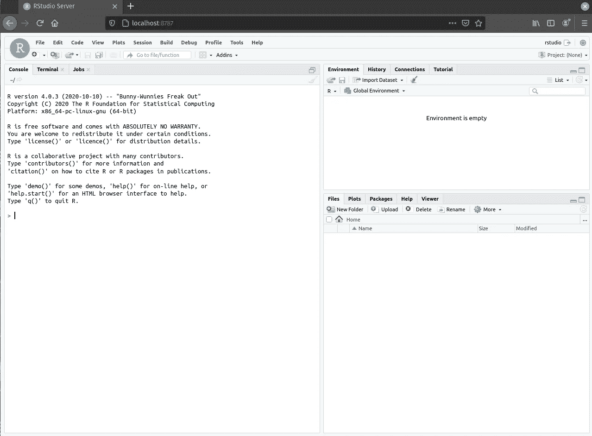

# RStudio 现在就在 Docker！

> 原文：<https://levelup.gitconnected.com/rstudio-in-docker-now-9d4daef23e9e>


照片由 [Fotis Fotopoulos](https://unsplash.com/@ffstop?utm_source=medium&utm_medium=referral) 在 [Unsplash](https://unsplash.com?utm_source=medium&utm_medium=referral) 上拍摄

## Docker 容器环境中的 RStudio

**码头工人和集装箱**

每次我们都需要创建能够支持从小型应用到分布式数据库的隔离和弹性环境，同时对基础设施和网络的计算资源进行智能管理，从而根据所涵盖场景的需求水平扩展解决方案。

> 作为这一困境的解决方案，容器出现了，按照微软的说法，它们“类似于虚拟机，但它们不能创建一个完整的虚拟操作系统。相反，Docker 允许应用程序使用与其运行的系统相同的 Linux 内核。”

Docker 是我们目前用于创建、执行和共享容器映像的主要工具之一；它的安装非常简单:

1.  安装必要的软件包:

```
sudo apt-get updatesudo apt-get install \
    apt-transport-https \
    ca-certificates \
    curl \
    gnupg \
    lsb-release
```

2.添加官方码头工人 GPG 键:

```
sudo apt-get update
 sudo apt-get install docker-ce docker-ce-cli containerd.io
```

3.安装 Docker:

```
sudo apt-get update
 sudo apt-get install docker-ce docker-ce-cli containerd.io
```

4.测试您的安装:

```
sudo docker run hello-world
```

# 用于 R 的 IDE:

有几种环境可以帮助开发人员使用计算语言 R 进行编程，毫无疑问，目前市场上最著名和使用最多的是 RStudio。

[](https://www.rstudio.com/) [## RStudio |面向数据科学团队的开源专业软件

### 控制您的 R 和 Python 代码一个 R 和 Python 的集成开发环境，带有一个控制台…

www.rstudio.com](https://www.rstudio.com/) 

**RStudio in Docker:** 随着容器环境的易用性，RStudio for docker 的版本应运而生，其正式版不幸为使用付费；只需运行下面的命令:

```
# Replace with valid license
export RSP_LICENSE=XXXX-XXXX-XXXX-XXXX-XXXX-XXXX-XXXX# Run without persistent data using default configuration
docker run --privileged -it \
    -p 8787:8787 \
    -e RSP_LICENSE=$RSP_LICENSE \
    rstudio/rstudio-server-pro:latest
```

 [## 码头枢纽

### 编辑描述

hub.docker.com](https://hub.docker.com/r/rstudio/rstudio-server-pro) 

在终端执行上述命令后，进入 [http://localhost:8787](http://localhost:8787) ，登录 RStudio，使用“rstudio”作为用户；没有必要使用密码。

**但是，**

由于 RStudio 是一个开源项目，并且使用 docker，可以创建容器的图像并免费共享；已经出现了几个项目，使得 RStudio 可以在容器的映像中免费使用和定制，其中最有前途的是由“rock-org”社区维护的项目。

要使用，请使用下面的命令:

```
docker run --rm \
  -p 127.0.0.1:8787:8787 \
  -e DISABLE_AUTH=true \
  rocker/rstudio
```

 [## 码头枢纽

### 编辑描述

hub.docker.com](https://hub.docker.com/r/rocker/rstudio) 

在终端中执行上述命令后，访问 [http://localhost:8787](http://localhost:8787/)



有趣的是，整个项目在 GitHub 上是开放的，改变了基础映像及其库。这是通过 Docker 容器运行 RStudio 的简单步骤。

参考资料:

[](https://docs.microsoft.com/pt-br/windows/nodejs/containers) [## Contêineres do Docker com o Node.js

### instalar o build 18932 ou postal do Windows 10 Insider 预览版。安装 Windows 10 Insider 预览版内部版本 18932 或…

docs.microsoft.com](https://docs.microsoft.com/pt-br/windows/nodejs/containers) [](https://github.com/rocker-org/rocker-versioned) [## 摇杆-组织/摇杆-版本

### 访问 rocker-project.org 了解更多可用的摇杆图像，配置和使用。对于 R >=…

github.com](https://github.com/rocker-org/rocker-versioned) 

#谢谢你的阅读！:)