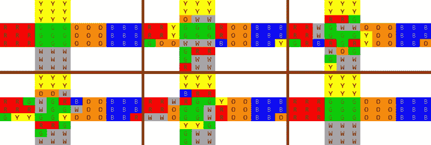
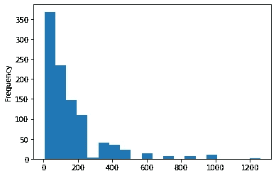
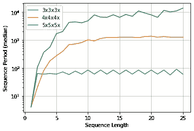

# 魔方:重复直到解决

> 原文：<https://levelup.gitconnected.com/rubik-cube-repeat-until-solved-71bd3409a021>

奥拉夫·阿伦斯·罗特内在 [Unsplash](https://unsplash.com/s/photos/cube-rubik?utm_source=unsplash&utm_medium=referral&utm_content=creditCopyText) 上的照片

如果你在一个魔方上重复任何顺序的移动足够的次数，魔方将返回到初始(已解)状态。
无论选择的序列有多简单或复杂，都会发生这种情况。

每个序列都有一个长度(序列中的移动次数)和一个周期或组顺序，即在立方体返回到已解状态之前必须重复的次数。

示例序列:F' L' F' L

序列:F' L' F' L(图片由作者提供)

# 序列周期:重复多少次？

在 3x3x3 立方体上，根据选择的顺序，周期可能低至 1，也可能高达 1260。这里有几个例子。

在 4x4x4 立方体上，周期可以大得多，甚至达到 765765。
一些例子。

# 序列周期分析

**主要问题**:给定一个 N 步随机序列，平均序列周期是多少？

虽然有[数学方法](https://people.kth.se/~boij/kandexjobbVT11/Material/rubikscube.pdf)来回答这个问题，但我们使用 Python 库 [magiccube](https://github.com/trincaog/magiccube) 的模拟方法，这是一个快速的魔方模拟器。

模拟运行 1000 次。每次运行都会执行该序列，直到立方体返回到初始状态。

# 序列周期衰减

序列周期的分布呈指数衰减。大多数序列有小周期，少数序列有大周期。

在 3x3x3 立方体上使用 30 次随机移动的序列长度，我们可以看到周期大小的分布。

序列周期衰减(图片由作者提供)

# 序列长度与周期

序列长度越短，序列周期通常越小，但超过某个阈值后，周期不再增加。
在 3x3x3 立方体上，阈值大约是 2–5 步。
在 4x4x4 立方体上，阈值约为 11–16 步。
在 5x5x5 立方体上，阈值超过 20 步。

序列长度与周期(图片由作者提供)

# 最后的想法

希望你喜欢。
如果你是魔方的粉丝，可以使用开源的 Python 库 [magiccube](https://github.com/trincaog/magiccube) 来解魔方，进行模拟。