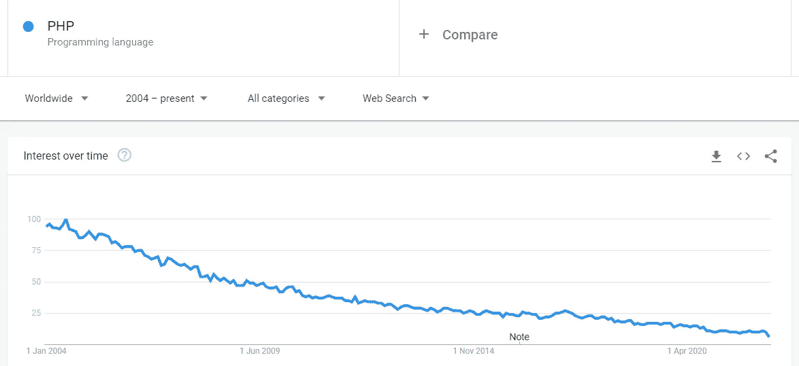
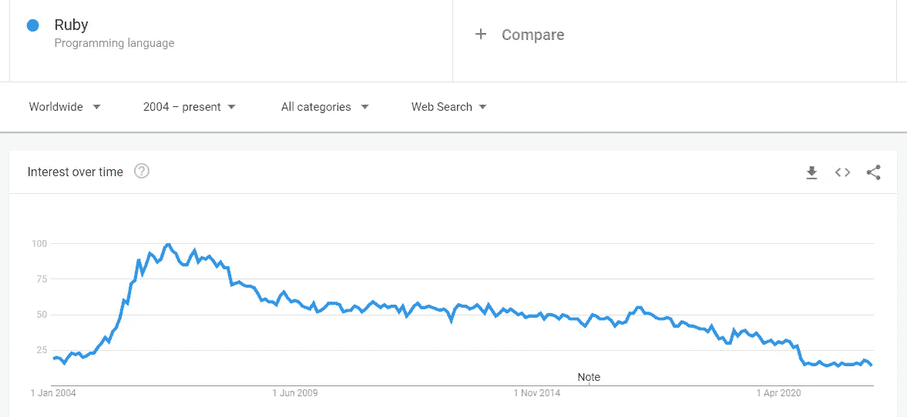
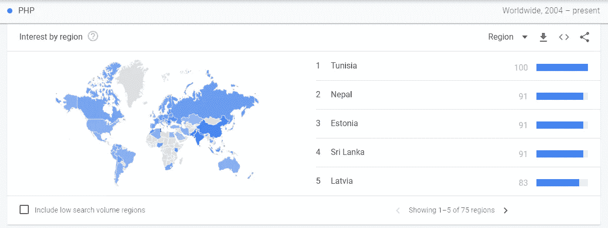
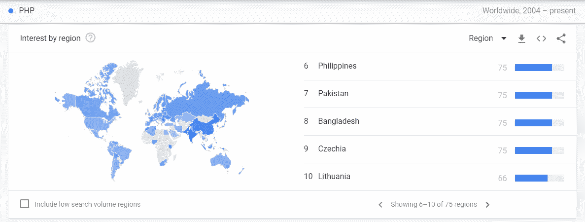
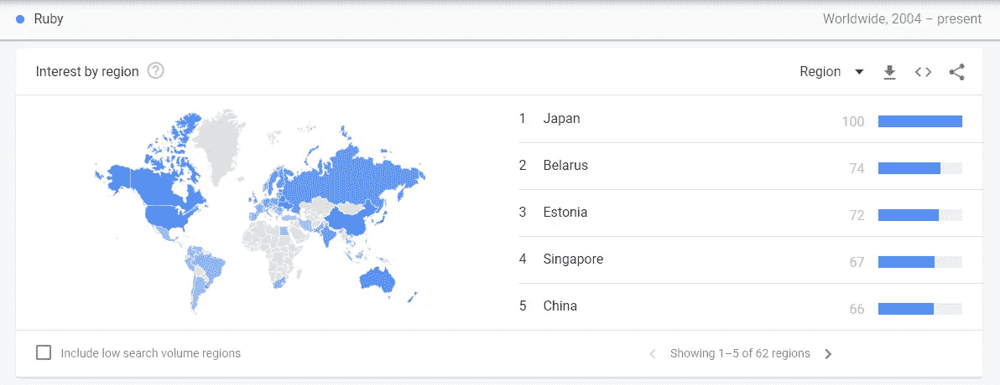
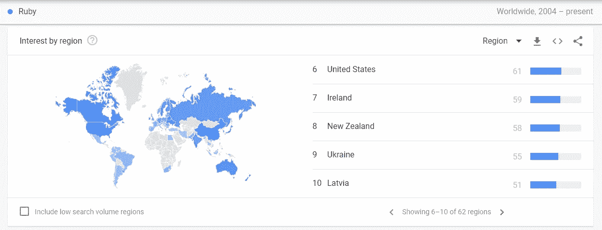

# 露比不会死

> 原文：<https://levelup.gitconnected.com/ruby-is-not-dying-3a916b127fcd>

## 它会留在这里

图片来源: [Pixabay](https://pixabay.com/photos/diamond-diamonds-gem-gemstone-ruby-3185447/)

一些开发者认为 Ruby 正在走向死亡。这与事实相去甚远。

这个传说已经广为流传，一些编程方面的 Youtubers 用户已经将 Ruby 列为濒临死亡的编程语言之一。

在论坛上，遇到一个抨击 Ruby 的程序员并不奇怪。这真的必须停止。

露比哪儿也不会去，它会留在这里。在这篇文章中，我会告诉你为什么。

# 红宝石不可或缺

Ruby 扮演的角色不可或缺。不像 PHP 目前被开发用来维护遗留软件。Ruby 正被积极地用于从零开始创建项目。

例如，大多数 PHP 开发人员厌倦了维护工作，因为很少有项目是使用 PHP 构建的。对于 Ruby 来说，情况并非如此。

事实上，Ruby 是从头开始构建项目的最受欢迎的语言之一。这是硅谷的宠儿，在创业公司中得到大力应用。

Ruby 提供了其他语言所没有的。这使得它不可或缺。

看一种编程语言是否正在消亡的一个合乎逻辑的方法是检查它是否可有可无。露比不是。

让它如此难以摆脱的是它的速度。我指的不是语言执行的速度，而是开发的速度。

速度处处重要。在创业公司，速度更重要。你总是想在竞争中领先。速度可能意味着生死。

要么你走得快，打败竞争对手，要么你走得慢，被淘汰出局。有了 Ruby，团队更有生产力。他们前进得更快。与其他语言相比，特性的发布速度要快得多。

# 谷歌趋势无视创业环境

用来诋毁 Ruby 的一个论据是 Google trends。在谷歌趋势上，线形图并不是急剧下降。无法和 PHP 这样的语言相比。

下面是 PHP 图表。

[来源](https://trends.google.com/trends/explore?date=all&q=%2Fm%2F060kv)

下面是红宝石图。

[来源](https://trends.google.com/trends/explore?date=all&q=%2Fm%2F06ff5)

你能看出这两幅图之间的区别吗？Ruby 并没有像 PHP 那样急剧衰落。

Google trends 不考虑 Ruby 受欢迎和使用的起始环境。

深入挖掘趋势揭示了一些更有趣的细节。与 PHP 相比，以下是对这两种语言排序最多的国家。

对 PHP 感兴趣的前十个国家。下图。

[来源](https://trends.google.com/trends/explore?date=all&q=%2Fm%2F060kv)

[来源](https://trends.google.com/trends/explore?date=all&q=%2Fm%2F060kv)

现在让我们看看 Ruby。对 Ruby 感兴趣的十大国家。

[来源](https://trends.google.com/trends/explore?date=all&q=%2Fm%2F06ff5)

[来源](https://trends.google.com/trends/explore?date=all&q=%2Fm%2F06ff5)

你注意到不同了吗？

PHP 在亚洲排在第三位——尼泊尔、菲律宾、巴基斯坦和孟加拉国。突尼斯对非洲最感兴趣。一些欧洲国家也榜上有名。

美国不是大多数创业公司存在的地方。

PHP 在非洲和亚洲的统治地位告诉我们一件事。维修工作是它在那里受欢迎的原因。除了本地创业公司，这些国家很少涉足创业公司。

另一方面，Ruby 有更多的发达国家。与发展中国家相比，这些国家能更好地培育初创企业。

日本是对 Ruby 最感兴趣的国家，以其开发者而闻名。这些开发人员不是面向维护的。他们大多从零开始构建项目。

美国是排在 Ruby 之后的第六个国家。这是因为硅谷的创业文化更为盛行。

第二大超级大国中国是排在红宝石之后的第五大国家。它的高需求可能与中国的建筑文化和快速建筑有关。

在新西兰，有一种倾向于模仿硅谷的创业文化。大概是新西兰也榜上有名的原因吧。

Ruby 在创业公司中被广泛使用，而且短期内没有什么能改变这一点。

# **它是收入最高的编程语言之一**

事实上，它是初创公司的最爱，其特点是[需求更高而竞争更低](/5-programming-languages-with-the-least-competition-yet-command-the-highest-salaries-852ee2f1bd79)。

与其他语言相比，找到一个真正优秀的 Ruby 开发者并不容易。

就像旧金山的生活成本因为创业公司而高一样。Ruby 开发人员也因此获得了更高的薪水。这句话*创业就是钱在哪里*可能离事实不远。

根据 coding 游牧民在 2022 年发表的一项研究，Ruby 是收入最高的编程语言。这是从 Indeed 和 Glassdoor 获得的平均值。它的开发人员平均工资最高。