# Ruby 方法对我来说是新的

> 原文：<https://levelup.gitconnected.com/ruby-methods-new-to-me-e82b2a8ebde9>

为了前端和基于 React 的项目/技能，我在博客上退了一步，也关注了 Ruby。在一周前做了一次课后测试后，我意识到我已经足够擅长制作我自己的 RoR 项目，但是从零开始创建一个正则表达式，简单的 Ruby 设置…我不是。知道 Rails 的工作方式，但在一个普通的 Regex 文件中，忘记使用 require‘path _ name’感觉很奇怪。我认为这是 Ruby 的一个优点，也是一个缺点。由于 Ruby 社区和语言的稳定性和寿命，很多工作都是在后台自动完成的，但与此同时，知道 x 做 y，并不一定有助于您理解*为什么* x 做 y。在带回家的考试中，我发现自己学到了新的简单的东西，无论是用 rspec 测试还是更好地使用 Ruby 枚举。所以我决定记录下我遇到的一些问题。

首先，一个简单的问题。在某些数组方法上使用 bang。在我日常使用 Ruby 或其他语言时，我总是使用 bang(！)或者双(！！)为真/假。

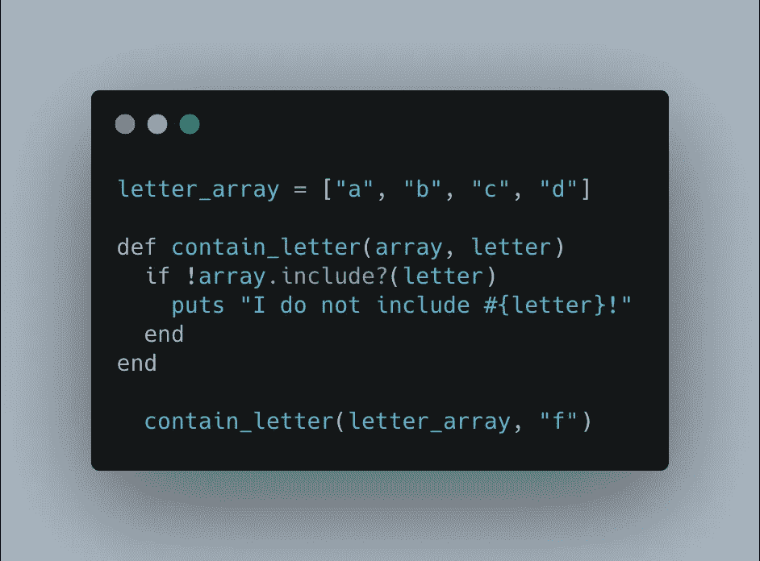

像这样最基本的东西。它只是简单地使用了'！'在数组前说“如果数组不包含字母，则返回…”。

然而，在经历了这次带回家的考试后，我不得不操纵我做的一个散列。散列有指向元素数组的单个键。我需要找出每个数组中每个键的唯一值的数量。然而……这个散列是一个实例变量，因此我随后需要将存储在其中的数据用于另一个方法。但是我一直发现如果我打电话给 uniq！方法，它操作我的散列，由此我的下一个方法处理一个只包含唯一值的被操作的散列！

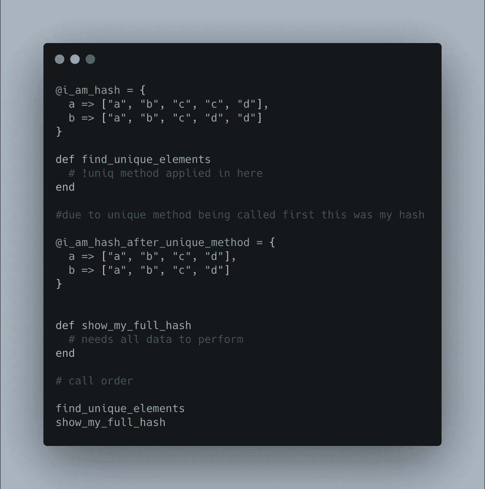

这不应该发生的！在我的带回家的文章中，我把这个独特的方法称为最后一个。所以幸运的是，通过检查最后一个方法后的数据是否正常，我发现它不正常，我已经操纵了我的实例变量。

爆炸在操纵自我并将其还原。

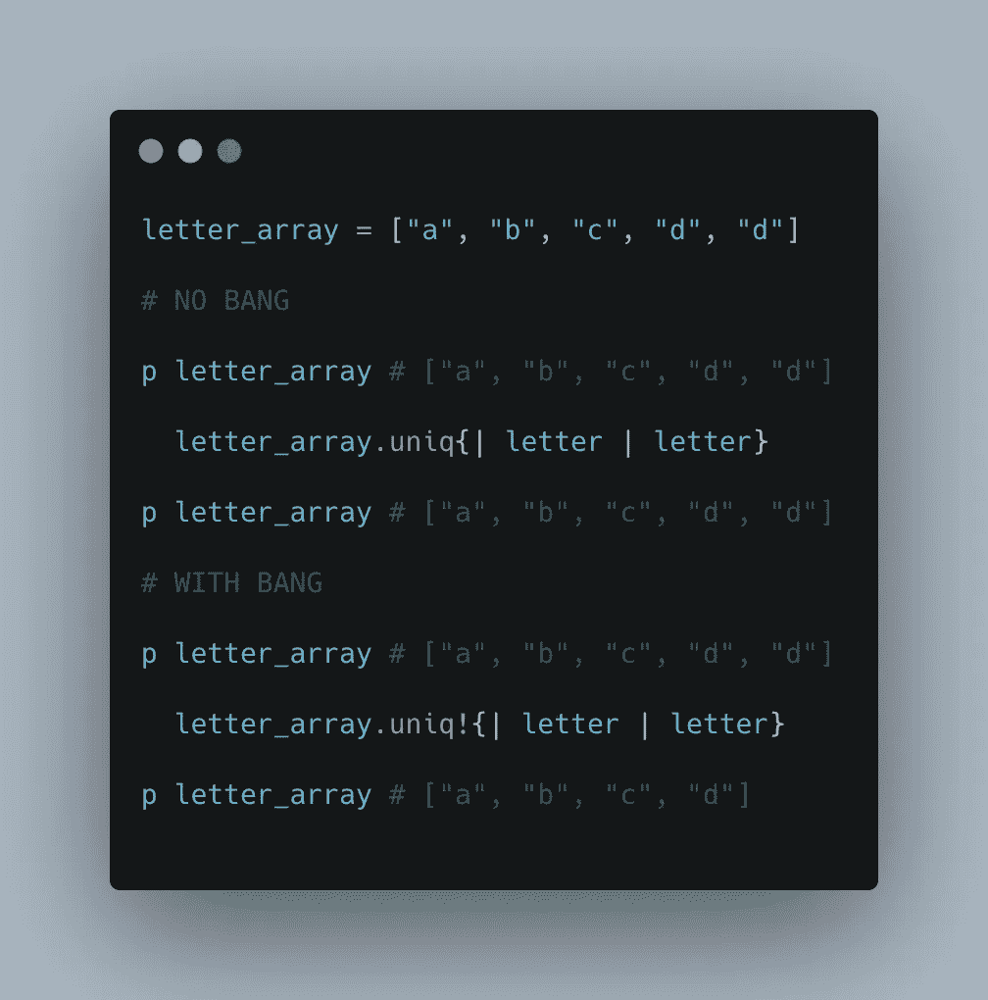

接下来是兰姆达斯。或者没有名字的函数。因为 lambdas 是匿名函数。lambda 的最后一个表达式是返回的内容。我不知道的是这实际上非常有用。

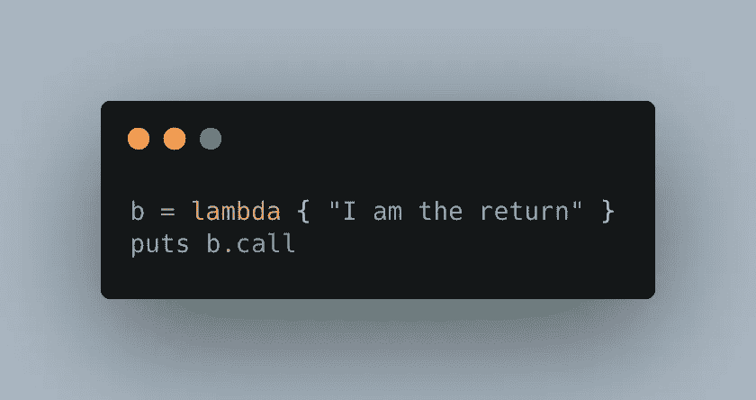

这将返回值“我是返回者”。例如，当递增任何一个数字时，我们可以创建一个 lambda，它只接受一个数字并调用。下一步返回下一个数字。

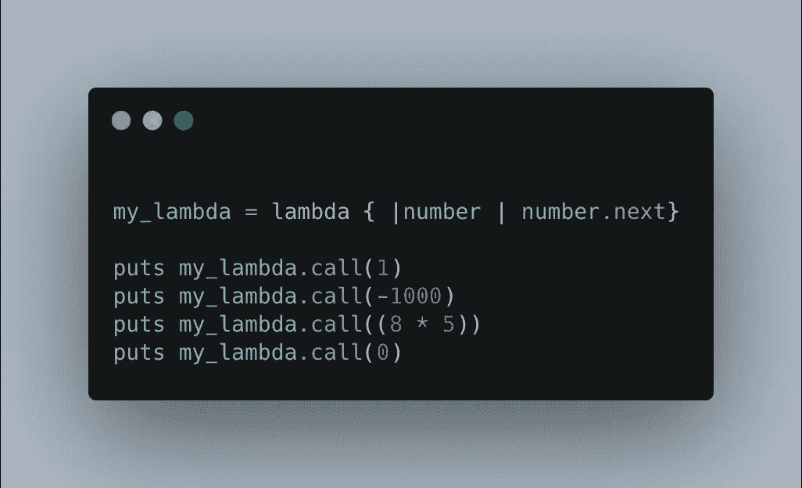

Find_all 帮助查找非重复项。如果你要获取一个数组，你只是想找到所有不重复的元素，find_all 非常有用，它在块中使用了 count。

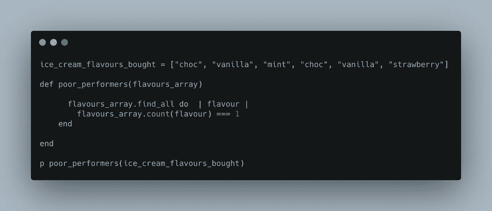

这将返回["薄荷"，"草莓"]。我发现 find_all 实际上是一个非常有用的可枚举类型，可以被很好地使用！

现在，我将再做一个枚举，然后进入依赖注入和::常量查找操作符。如果你知道这一切，就对我坦白吧！

每个带有对象。我发现这对于计算数组元素的频率非常有用(尽管非常类似于 inject)。

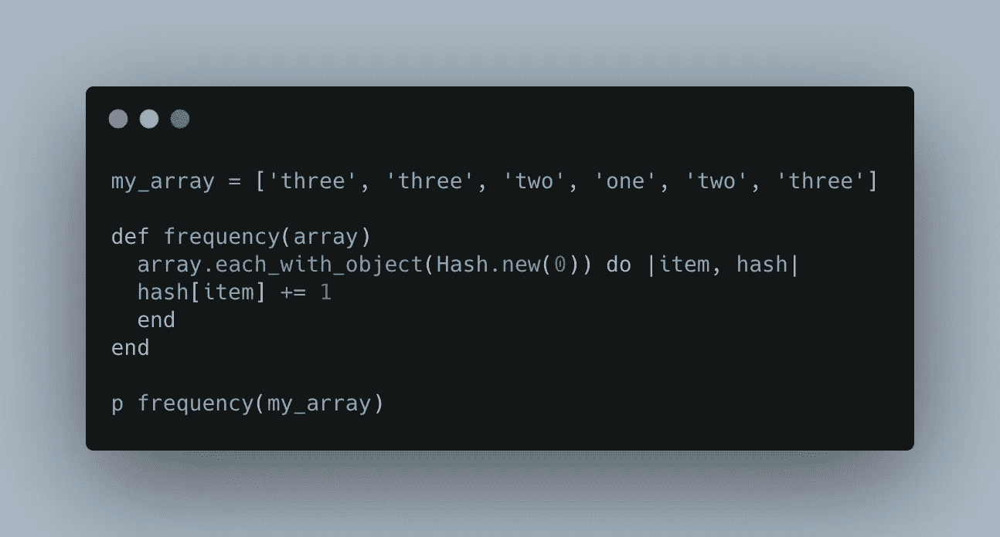

对于 each_with_object，与在块之前声明结构相反，您可以将正在创建的结构声明为参数。这里我们选择了散列，但是我也可以使用数组。

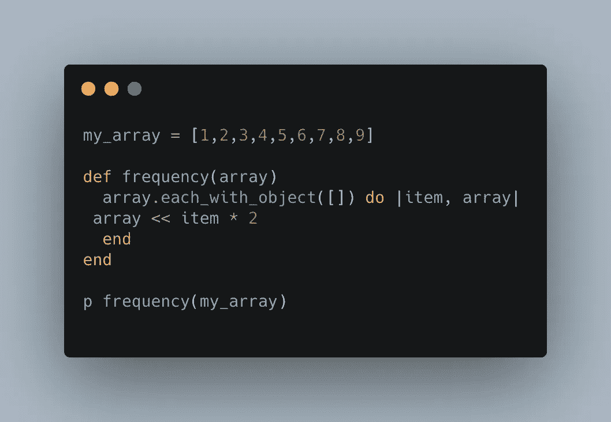

我发现的一件事是你不能用不可变对象来枚举。我在 womanonrails.com 找到了一个很好的例子—

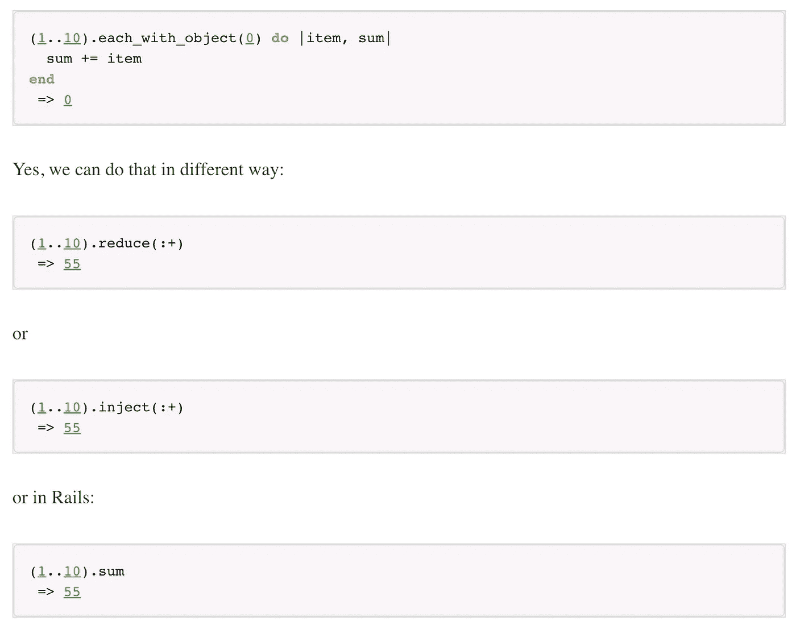

好了，现在开始更深入的学习。依赖注入。

我在 RSpec3 的有效测试中发现了这一点。依赖注入是一种技术，通过这种技术，您可以传入协作对象，而不是对它们进行硬编码，或者将组件粘合在一起。在 OOP 中，对象通常依赖于其他对象才能正常工作。

它给你带来了几个好处:

*   初始化中记录的显式依赖项
*   更容易推理的代码(没有全局状态)。
*   更容易放入另一个项目的库。
*   更多可测试的代码。

假设我们有一个 ReportFormatter 类，它依赖于另一个单独的类来像 CSVFormatter 类一样工作。CSVFormatter 类将数据解析为特定的结构，并将其发送给 ReportFormatter。

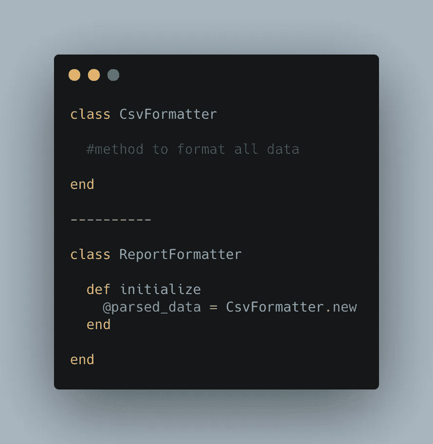

这就建立了对 CsvFormatter 的依赖，这不是我们想要的。一种更好的方式是这样写的，它给这个类更多的灵活性:

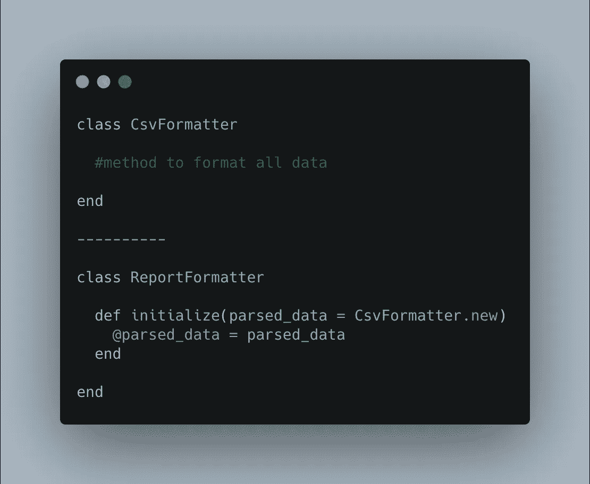

这允许使用更改 parsed_data 的选项。它不再被锁定为 CSVFormatter 的一个实例，它将简单地使用它作为默认值。我们可以创建一个新的类，将数据解析为 JSOn 格式，并将其传递给我们的 ReportFormatter。它允许我们在代码和测试中创造更多的灵活性。

最后是::lookup 操作符。

模块可以容纳类。

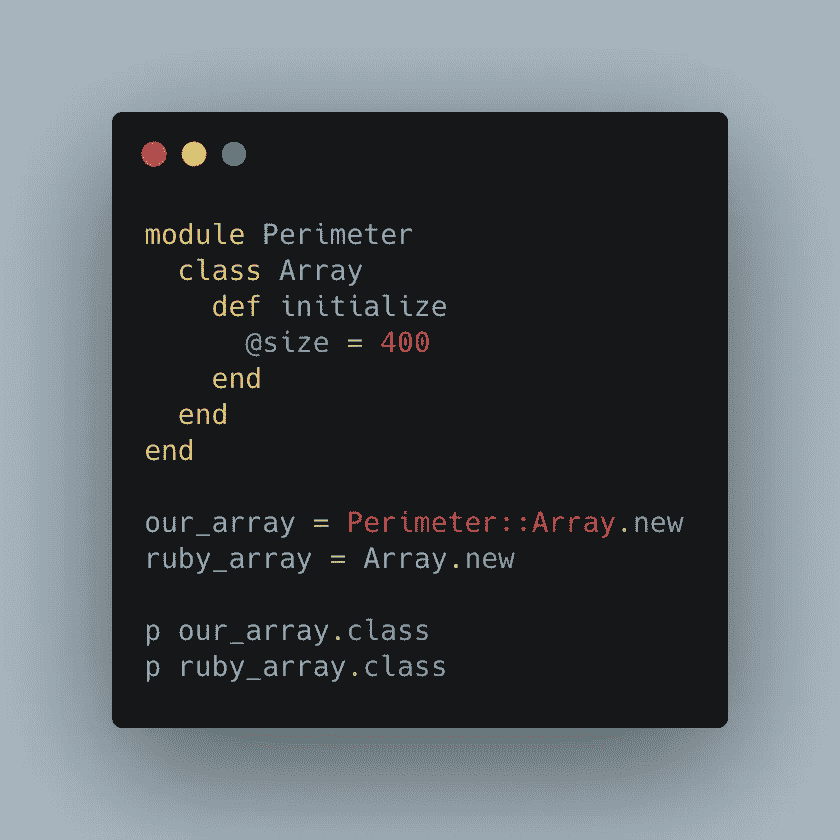

这是我在 RubyMonk 上找到的一个很好的例子。这会输出，Perimeter::Array 和 Array。这可能是因为我们使用了命名空间。如果我们没有使用命名空间，而是使用:

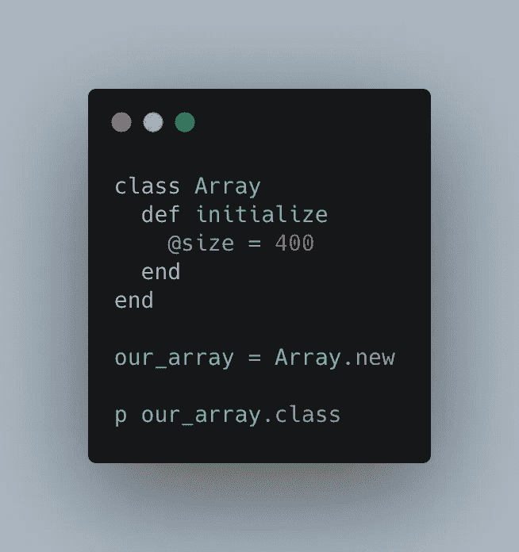

我们输出应该是数组。这不是我们想要的，因为这会在整个项目中全局扩展数组类。

命名空间的使用允许我们只在外围模块中查找数组常量。

来自 RubyMonk 的最后一个例子使用查找向您展示了一个很长的模块/类列表。

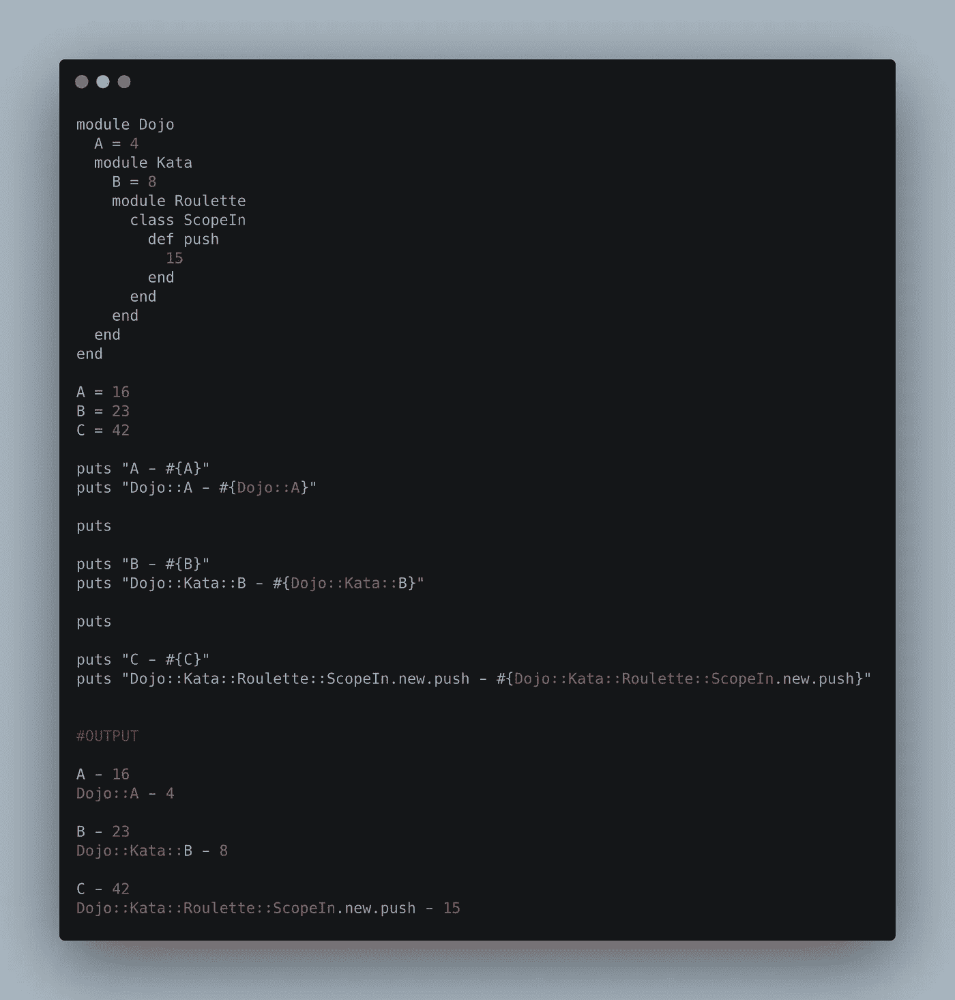

我知道这有点随机！但是学习经历的一部分是接触新事物并分享它们。堆栈溢出和介质节省了我很多时间。你也可能从未使用过这些工具，但是如果你真的遇到了它们，了解它们的作用是有好处的。

祝你好运！