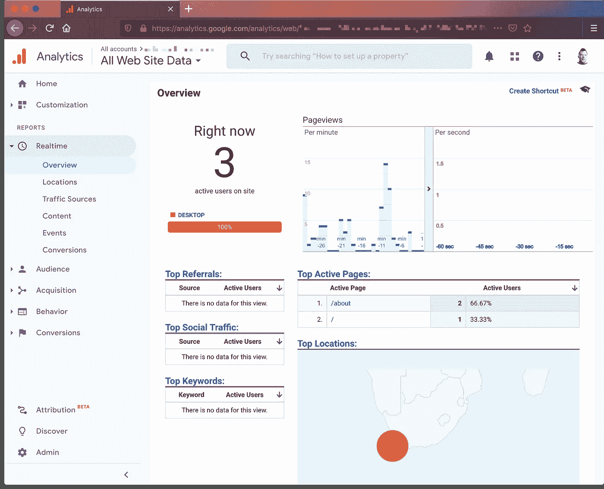
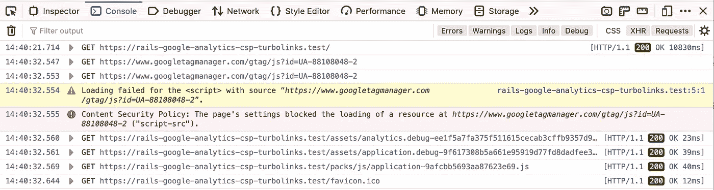
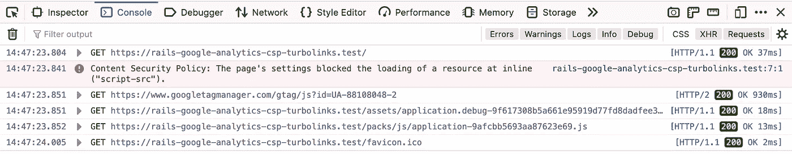
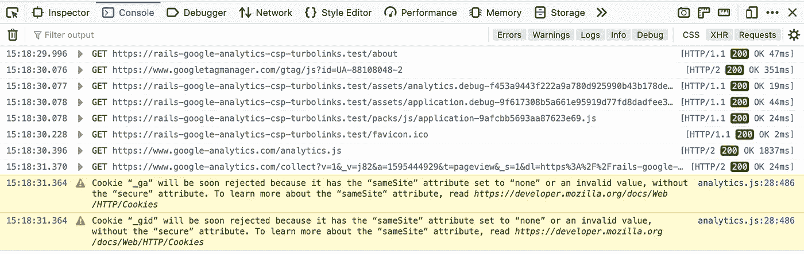
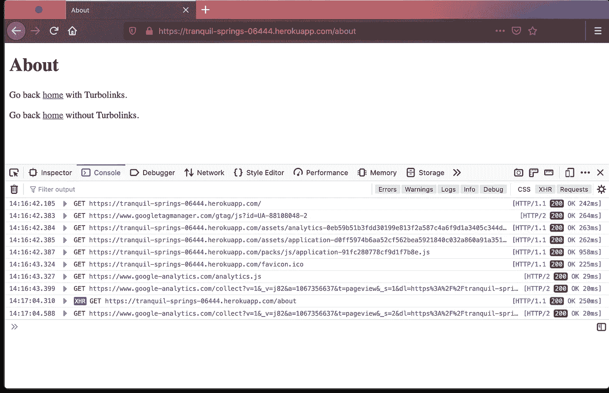

# Ruby on Rails 6，带有 Google Analytics、Turbolinks 和内容安全策略

> 原文：<https://levelup.gitconnected.com/ruby-on-rails-6-with-google-analytics-turbolinks-and-a-content-security-policy-c4e078df8530>



谷歌分析显示 3 个实时访客登录

在过去的几年里，我没有在 Ruby on Rails 网站上添加 Google Analytics，但当我发现对它的“开箱即用”支持如此之少时，我感到震惊。如果你按照 Google Analytics 的设置，将他们的脚本复制并粘贴到 HTML 的`head`中，你可能会遇到很多冲突。其中主要是内容安全政策(CSP)和 Turbolinks。对于一个想要安全和快速的现代网站来说，这两者都是必不可少的。

特别是 CSP 保护您和您的用户免受[一系列跨站点脚本(XSS)攻击](https://owasp.org/www-community/xss-filter-evasion-cheatsheet)。虽然这可能会很复杂和繁琐，但是您应该启用它，就像您使用`config.force_ssl = true`实施 https 一样。

因此，在保留 CSP 和 Turbolinks 的同时，安全地将 Google Analytics 添加到您的 Rails 网站中是非常重要的。

首先在`config/initializers/content_security_policy.rb`启用 CSP。您会注意到 Rails 默认为`policy.script_src :self, :https`，它允许您的站点脚本和来自任何 https 源的任何脚本。坏人也使用 https，所以这似乎是不明智的。而是指定您想要允许的确切外部来源。

您需要两个 Google 域，因为来自第一个域的脚本与第二个域交互。

如果你忽略了谷歌资源，保留了`:self`，那么你就是在告诉浏览器，你只希望允许与你的网站在同一个域的脚本。如果你试图加载谷歌分析，那么你的浏览器会显示这样的错误。



浏览器中的内容安全策略源错误

如果你包含了 Google sources，但是按照 Google Analytics 的建议在你的`application.html.erb`中放了一个脚本块，那么你就会遇到这个 CSP 错误。



浏览器中的内容安全策略内联脚本错误

您可以使用`policy.script_src :self, :unsafe_inline…`来实现这一点，但是顾名思义，这是不安全的。或者，您可以在脚本块中添加一个 nonce，向浏览器和服务器证明脚本块是安全的。为此，您需要为 Rails CSP 配置一个随机数生成器:

```
Rails.application.config.content_security_policy_nonce_generator = ->(_request) { SecureRandom.base64(16) }
```

然后你可以使用`<%= javascript_tag nonce: true do %>`助手。这种方法可以工作，但是您需要通过所有的 Turbolinks XHR 调用来传输随机数，并修改 Rails CSP 随机数生成器，以便为一个会话使用一个随机数。这很复杂，复杂会导致您的安全漏洞和分析失误。

不如忘记脚本块，将 Google Analytics 代码包含在您自己的 Javascript 文件中。因为您已经说过`policy.script_src :self`脚本将被允许，并且不需要随机数。

在你的`application.html.erb`中包含谷歌脚本和你自己的`analytics.js`

重要的一点是不要让 Webpack 编译`analytics.js`或者把它和你的其他 Javascript 一起包含在一个包中。Webpack 将 Javascript 包在几层中，这似乎阻碍了 Google Analytics 的工作。你可以把`analytics.js`放在`app/assets/javascript`而不是`app/javascripts`。您还需要更新`manifest.js`以包含`//= link analytics.js`。

在这一点上，你将有工作和安全的首页访问跟踪。然而，由于 Turbolinks 通过 XHR 加载页面，后续的访问将不会被发送到谷歌分析。您需要像这样利用`turbolinks:load`事件:

您可能会注意到可选的`cookie_flags`，它在`samesite`cookie 上设置了`secure`选项。这是向浏览器推出的额外安全性，通常会导致警告，但很快就会变成错误:



现在你知道了，为了确保你可以在你的 Ruby on Rails 6 应用中安全可靠地使用谷歌分析，你跳了很多次。



显示谷歌分析 XHR 跟踪的浏览器控制台

一个演示应用的源代码可以在[https://github . com/paulmwatson/rails-Google-analytics-CSP-turbo links](https://github.com/paulmwatson/rails-google-analytics-csp-turbolinks)上找到。

关键文件是:

*   [content _ security _ policy . Rb](https://github.com/paulmwatson/rails-google-analytics-csp-turbolinks/blob/master/config/initializers/content_security_policy.rb)
*   [application.html.erb](https://github.com/paulmwatson/rails-google-analytics-csp-turbolinks/blob/master/app/views/layouts/application.html.erb)
*   [analytics.js](https://github.com/paulmwatson/rails-google-analytics-csp-turbolinks/blob/master/app/assets/javascript/analytics.js)