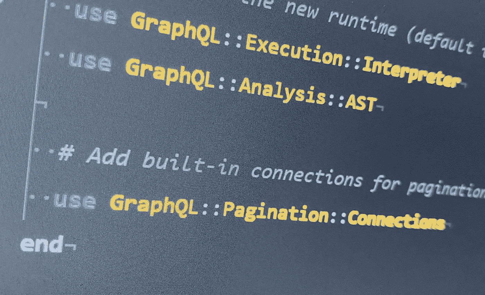
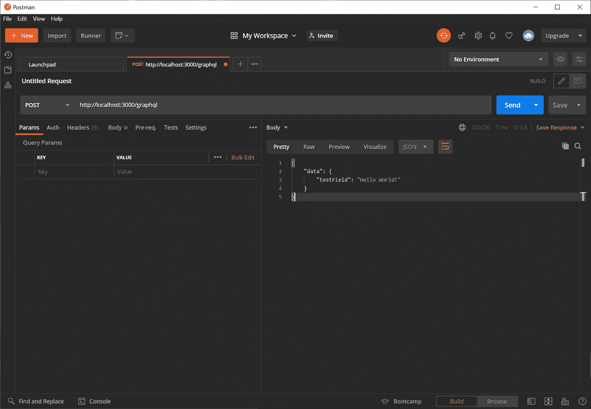
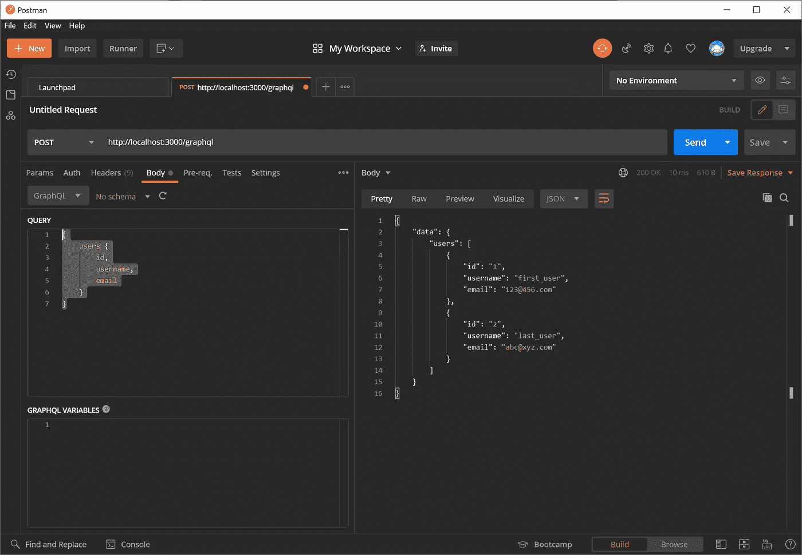
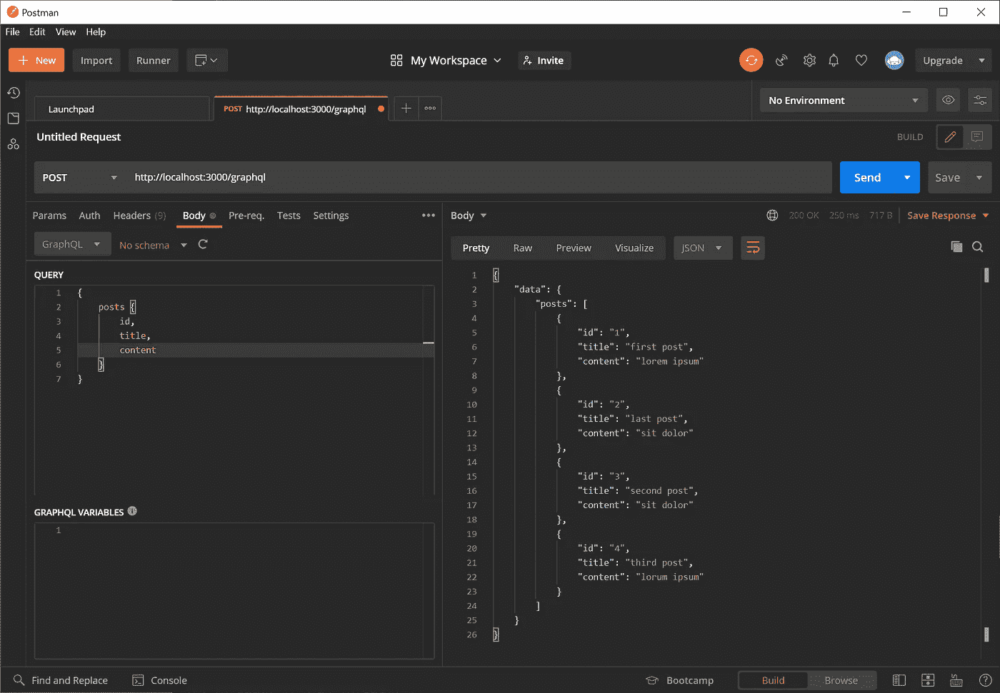
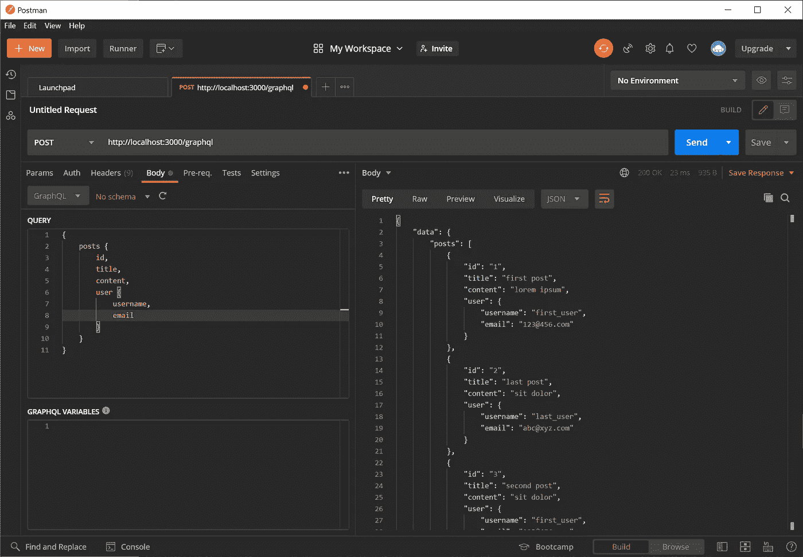
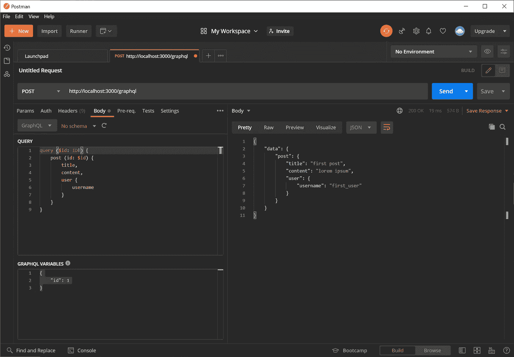

# Ruby on Rails API 和图形 QL

> 原文：<https://levelup.gitconnected.com/ruby-on-rails-api-and-graph-ql-d31857755118>



所以你想把 GraphQL 和 Ruby on Rails 一起用做 API？你来对地方了，我的朋友。如果你在 RoR 创建一个 API，用 React 或 Vue 或其他优秀的前端框架创建一个前端，这是非常有用的。我们将介绍设置和配置一些简单查询的基础知识。

按照这个指南，你需要 Ruby on Rails 和 Postman。

Ruby on Rails |一个 web 应用程序框架，包含了根据模型-视图-控制器(MVC)模式创建数据库支持的 web 应用程序所需的一切。

[Postman | API 开发的协作平台](https://www.postman.com/)

在这篇文章中，我将介绍:

1.  使用 GraphQL 将 Ruby on Rails 配置为 API
2.  生成资源并将其设置为由 GraphQL 访问
3.  用 GraphQL 获取资源
4.  创建嵌套的 GraphQl 资源
5.  用 GraphQL 提取单个条目

在以后的文章中，我将介绍 GraphQL 和 CRUD 操作，以及在 React 中使用 Apollo 与我们的 GraphQL API 进行交互。让我们开始吧！

让我们创建我们的 API。

`rails new graph_ql_api_test_project --api`

接下来，我们将生成一些资源。

`rails g resource User username email`

`rails g resource Post title content:text user:references`

设置好资源后，您应该运行迁移。

`rails db:migrate`

一旦数据库准备就绪，就应该在数据库中创建一些条目来测试 GraphQL。您可以使用以下内容进行演示:

```
users = User.create([{username: 'first_user', email: '[123@456.com](mailto:123@456.com)'}, {username: 'last_user', email: '[abc@xyz.com](mailto:abc@xyz.com)'}])
Post.create([{title: 'first post', content: 'lorem ipsum', user: User.first},{title: 'second post', content: 'sit dolor', user: User.first}, {title: 'third post', content: 'lorum ipsum', user: User.last}, {title: 'last post', content: 'sit dolor', user: User.last}])
```

然后跑`rails db:seed`

在您的 gem 文件中添加:

`gem 'graphql'`

接下来，您需要在控制台中运行以下命令:

`rails g graphql:install`

`rails g graphql:object user`

`rails g graphql:object post`

这将创建所有的 GraphQL 样板文件。让我们看看我们的路线和创建的控制器。

```
Rails.application.routes.draw do
  post "/graphql", to: "graphql#execute"
  resources :posts
  resources :users
  # For details on the DSL available within this file, see [https://guides.rubyonrails.org/routing.html](https://guides.rubyonrails.org/routing.html)
end
```

```
class GraphqlController < ApplicationController
  # If accessing from outside this domain, nullify the session
  # This allows for outside API access while preventing CSRF attacks,
  # but you'll have to authenticate your user separately
  # protect_from_forgery with: :null_sessiondef execute
    variables = prepare_variables(params[:variables])
    query = params[:query]
    operation_name = params[:operationName]
    context = {
      # Query context goes here, for example:
      # current_user: current_user,
    }
    result = GraphQlApiTestProjectSchema.execute(query, variables: variables, context: context, operation_name: operation_name)
    render json: result
  rescue => e
    raise e unless Rails.env.development?
    handle_error_in_development e
  endprivate# Handle variables in form data, JSON body, or a blank value
  def prepare_variables(variables_param)
    case variables_param
    when String
      if variables_param.present?
        JSON.parse(variables_param) || {}
      else
        {}
      end
    when Hash
      variables_param
    when ActionController::Parameters
      variables_param.to_unsafe_hash # GraphQL-Ruby will validate name and type of incoming variables.
    when nil
      {}
    else
      raise ArgumentError, "Unexpected parameter: #{variables_param}"
    end
  enddef handle_error_in_development(e)
    logger.error e.message
    logger.error e.backtrace.join("\n")render json: { errors: [{ message: e.message, backtrace: e.backtrace }], data: {} }, status: 500
  end
end
```

实际上，控制器中的 GraphQL 样板文件接受任何变量和查询，并通过 GraphQl 引擎从数据库中获取信息。我们所有的 GraphQL 查询都通过相同的路径`'/graphql'`访问，并通过这个 execute 方法。

谢天谢地，我们根本不需要修改这段代码。我们的重点是在`app/types`文件夹中找到的代码。

我们来看看`app/graphql/query_type.rb`

```
module Types
  class QueryType < Types::BaseObject
    # Add root-level fields here.
    # They will be entry points for queries on your schema.# TODO: remove me
    field :test_field, String, null: false,
      description: "An example field added by the generator"
    def test_field
      "Hello World!"
    end
  end
end
```

让我们启动 postman 并测试一下！打开一个新的选项卡，将类型更改为 post，设置 url(在我的例子中是“https://localhost:3000/graphql ”,这对您来说应该是一样的)。

接下来，您应该单击 body 选项卡并从下拉列表中选择 GraphQl。将以下内容添加到查询框中:

```
{
  testField
}
```

这应该是你提交后看到的。



让我们设置它，这样我们就可以让我们的用户使用 GraphQL。在`query_type.rb`中，删除演示内容并添加代码，得到以下内容:

```
module Types
  class QueryType < Types::BaseObject
    field :users,
    [Types::UserType],
    null: false,
    description: 'get Users' def users
      User.all
    end
  end
end
```

现在在 postman 中运行这个查询:

```
{
  users {
    id,
    username,
    email
  }
}
```

你应该得到这样的结果:



哇！这么快你就问自己？是的，就是这么简单！抓紧你的马，因为这是变凉的地方！

如果我们想得到邮件呢？

让我们进一步修改`query_type.rb`以包括:

```
module Types
  class QueryType < Types::BaseObject
    field :users,
    [Types::UserType],
    null: false,
    description: 'get Users'# new code
    field :posts,
    [Types::PostType],
    null: false,
    description: 'get Posts' def posts 
      Post.all
    end
# end new code def users
      User.all
    end
  end
end
```



让我们在每个帖子中嵌套用户！在`app/graphql/types_post/type.rb`中修改下面一行:

```
module Types
  class PostType < Types::BaseObject
    field :id, ID, null: false
    field :title, String, null: true
    field :content, String, null: true #  remove the following line
    #  field :user_id, Integer, null: false
    #  add the next line
    field :user, Types:UserType, null:false field :created_at, GraphQL::Types::ISO8601DateTime, null: false
    field :updated_at, GraphQL::Types::ISO8601DateTime, null: false
  end
end
```

现在，如果您将用户添加到帖子查询中，您可以看到实际的结果:



最后，让我们用 GraphQL 按 ID 抓取一个帖子！将以下新代码添加到您的`query_type.rb`中

```
module Types
  class QueryType < Types::BaseObject
    field :users,
       [Types::UserType],
       null: false,
       description: 'get Users' field :posts,
      [Types::PostType],
      null: false,
      description: 'get Posts'

    # new code
    field :post, Types::PostType, null: false do
      argument :id, ID, required: true
      description 'find post by id'
    end def post(id:)
      Post.find(id)
    end
    # end new code def posts
      Post.all
    end def users
      User.all
    end
  end
end
```

在 Postman 中，您应该像这样设置查询:

```
query ($id: ID!) {
  post (id: $id) {
    title,
    content,
    user {
      username
    }
  }
}
```

在查询下面，你可以添加你的变量，这就是`$id`是什么。

```
{
  "id": 1
}
```

基本上，我们说我们有一个值为`1`的变量`id`，数据类型为`ID`,`ID!`中的`!`表示这是一个必需的参数。

提交此查询时，您应该会在 Postman 中看到理想的结果:



恭喜你。您用 GraphQL 设置了一个 rails API。快乐编码。

[这是本指南的第二部分！](https://medium.com/p/ruby-on-rails-and-graphql-part-2-2e46145f0756)

更多指南即将推出！