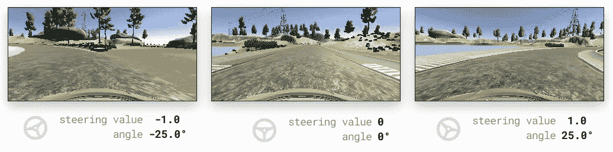
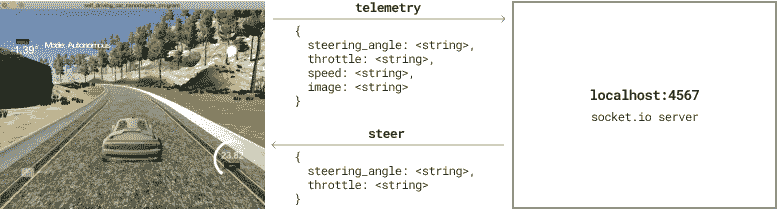

# 使用 JavaScript 和 TensorFlow.js 运行自动驾驶汽车

> 原文：<https://levelup.gitconnected.com/run-a-self-driving-car-using-javascript-and-tensorflow-js-8b9b3f7af23d>


在本教程中，我们将学习如何使用 Node.js、TensorFlow.js 和 Udacity 自动驾驶汽车模拟器，在虚拟驾驶模拟器中训练深度学习模型自动驾驶汽车。我们会看到完全用 JavaScript 创建和训练深度学习模型是多么容易。

您可以在 [GitHub 资源库](https://github.com/bakoushin/self-driving-car-javascript)中找到该项目的完整代码。

# 模拟器

汽车将在开源 [Udacity 自动驾驶汽车模拟器](https://github.com/udacity/self-driving-car-sim)提供的模拟环境中运行。您可以从 GitHub repo 下载 Linux、Mac 和 Windows 的预构建版本。


我们将使用“术语 1”标题下的一个构建。这些提供了两条虚拟轨道，我们将使用第一条。


# 行动（或活动、袭击）计划

为了让汽车使用深度学习自动驾驶，我们必须遵循以下 5 个步骤:

1.  收集数据以训练模型。
2.  定义深度学习模型。
3.  加载并准备用于培训的数据。
4.  训练深度学习模型。
5.  使用模型驾驶汽车。

# 1.收集数据

基本上，我们所要做的就是向汽车展示我们通常是如何驾驶的。这被称为*行为克隆*。基本上，我们希望我们的汽车在类似的环境中模仿人类驾驶员的行为。

我们将教给我们的汽车的唯一技能是*转向*。我们希望它在左转时转向左边，在右转时转向右边，并且在直行时不要转向太多。这是一个故意过于简化的例子，但它旨在抓住自动驾驶汽车的基础。

> 事实上，英伟达的研究人员在 2016 年也在解决同样的转向问题。阅读他们的[伟大文章](https://devblogs.nvidia.com/deep-learning-self-driving-cars/)，观看[视频](https://www.youtube.com/watch?v=NJU9ULQUwng)。

从技术上来说，我们希望从透过汽车挡风玻璃观看的相机中收集一系列图像，以及相应的转向值。然后，我们的深度学习模型将查看这些图像，并学习如何相应地转向。



**来自车载摄像头的图像与不同的转向值相关联**
[方向盘图标](https://thenounproject.com/term/steer/850999)来自名词项目

有了 Udacity 模拟器，我们可以轻松地收集数据。就像在电子游戏中一样驾驶虚拟汽车，并记录旅程。模拟器将自动提取和保存所有必要的图像和转向值。

最终数据集将保存在一个具有以下结构的文件夹中:一个包含一组图像的`IMG`目录，以及一个包含映射到图像的转向和其他遥测数据的`driving_log.csv`文件。

```
data
+- driving_log.csv
+- IMG
   +- center_2020_05_24_20_51_38_536.jpg
   +- left_2020_05_24_20_51_38_536.jpg
   +- right_2020_05_24_20_51_38_536.jpg
   ...
```

## 说明

1.  在训练模式下运行模拟器。
2.  点击屏幕右上角的录制按钮。
3.  选择存储数据的文件夹。
4.  再次点击录音按钮开始录音。
5.  驾驶展现出色驾驶技巧的汽车。至少跑一整圈，最好是两三圈。记住:这是汽车要学习的东西！
6.  再次点击录音按钮停止录音。等到它结束。同时，享受你的史诗旅程重播。

# 2.定义深度学习模型

深度学习模型基本上是一系列操作，它接受一个输入——在我们的情况下，是一个图像，通过一组过滤器，并输出一些结果。我们的结果将是一个导向值，该模型认为适合于给定的图像。

> 如果你熟悉 JavaScript `Array.prototype.map()`的功能，我们的模型会做基本相同的事情:将给定的图像映射到合适的导向值。但是我们没有自己编写映射算法，而是让模型自己解决。这就是训练的全部内容。

深度学习的网络架构有几种类型。我们将使用一个称为 CNN 的网络，它代表卷积神经网络。这种类型的神经网络在分析图像方面极其强大。通常 CNN 会从图像中提取一些特征，比如线条、形状、颜色。然后它使用这些信息来产生结果。

我们将使用一个非常基本但功能强大的 CNN 架构:一个*裁剪层*，后面是两个*卷积层*，每个后面是一个*最大池层*，所有这些后面是三个*密集层*。对于所有层，除了最后一层，我们将使用 *ReLU 激活功能*。最后一层将只有一个值，那就是我们的转向值。

如果现在对你来说这听起来毫无意义，不要担心:我们将讨论这个架构的每个元素，以便对正在发生的事情有一些基本的了解。

下面是我们如何使用 TensorFlow.js 在代码中定义模型:

```
const model = tf.sequential({
  layers: [ ***// Cropping layer***
    tf.layers.cropping2D({
      cropping: [[75, 25], [0, 0]],
      inputShape: [160, 320, 3]
     }), ***// 1st convolutional layer***
    tf.layers.conv2d({
      filters: 16,
      kernelSize: [3, 3],
      strides: [2, 2],
      activation: 'relu'
    }),

    ***// 1st max-pooling layer***
    tf.layers.maxPool2d({ 
      poolSize: [2, 2] 
    }), ***// 2nd convolutional layer***
    tf.layers.conv2d({
      filters: 32,
      kernelSize: [3, 3],
      strides: [2, 2],
      activation: 'relu'
    }), ***// 2nd max-pool layer***
    tf.layers.maxPool2d({ 
      poolSize: [2, 2] 
    }), ***// Dense layers with dropout layer***
    tf.layers.flatten(),
    tf.layers.dense({ units: 1024, activation: 'relu' }),
    tf.layers.dropout({ rate: 0.25 }),tf.layers.dense({ units: 128, activation: 'relu' }),
    tf.layers.dense({ units: 1, activation: 'linear' })
  ]
});model.compile({
  optimizer: 'adam',
  loss: 'meanSquaredError'
});
```

首先，我们使用`[tf.equential()](https://js.tensorflow.org/api/latest/#sequential)`创建我们的模型。这意味着我们的模型将循序渐进地从输入到输出进行处理。然后，我们添加一系列层来按顺序处理数据。让我们逐一讨论。

## 裁剪层

图像包括许多额外的细节，如风景或汽车引擎盖。这些细节并没有给出在给定的时间内转向何处的提示。为了加强信噪比，我们将裁剪图像的顶部和底部。

```
***// Cropping layer***
tf.layers.cropping2D({
  cropping: [[75, 25], [0, 0]],
  inputShape: [160, 320, 3]
})
```

我们将使用`[tf.layers.cropping2D](https://js.tensorflow.org/api/latest/#layers.cropping2D)`从图像顶部(风景)裁剪`75px`，从图像底部(汽车引擎盖)裁剪`25px`。

> 我们必须在`*inputShape*`参数中指定初始图像的尺寸。这对于模型的第一层是必须的。这里的`*160*`是图像的高度，`*320*`是它的宽度，`*3*`表示它有三个颜色通道——红色、绿色和蓝色(也称为 RGB)。


TF . layers . cropping 2d({ cropping:[[75，25]，[0，0]]，inputShape: [160，320，3] })

## 卷积层

我们使用`[tf.layers.conv2d](https://js.tensorflow.org/api/latest/#layers.conv2d)`创建两个连续的卷积层。这些方法的目的是从给定的图像中提取突出的特征，例如线条和形状。

卷积层通过将*内核过滤器*应用于前一层的数据来实现。

> 了解更多:
> [Victor Powell 的图像内核](https://setosa.io/ev/image-kernels/)
> [卷积](https://youtu.be/sAPg-qaT0b4)视频来自 uda city[tensor flow 简介](https://www.udacity.com/course/intro-to-tensorflow-for-deep-learning--ud187)免费课程

使用哪种确切的滤波器，模型在训练期间自行决定。我们只需定义要使用多少种不同的过滤器、过滤器内核的大小以及应用过滤器时步长的大小。

结果是一组具有重要特征的灰度图像，由过滤器突出显示。我们将看不到这些图像中的任何一个，但是模型将使用它们来进行进一步的计算。


tf.layers.conv2d({ filters: 16，kernelSize: [3，3]，steps:[2，2]，activation: 'relu' })

```
***// 1st convolutional layer***
tf.layers.conv2d({
  filters: 16,
  kernelSize: [3, 3],
  strides: [2, 2],
  activation: 'relu'
})
```

我们将连续使用`16`和`32`过滤器和一个步幅为`2`的`3x3`内核。请随意尝试其他尺寸。

我们稍后将讨论的`activation`参数。

## 最大池层数

每个卷积层之后是最大池层。可以把它想象成卷积层结果的压缩版本。最大池只是减少了数据量，同时保留了最重要的信息。我们在这里的目标和裁剪是一样的——加强噪音上的信号。在卷积层之后添加最大池层是计算机视觉中的常见做法。

> 另见:[来自 Udacity 的最大池](https://youtu.be/o_DJ-FO6dw0)视频[tensor flow 简介](https://www.udacity.com/course/intro-to-tensorflow-for-deep-learning--ud187)免费课程


TF . layers . maxpool 2d({ poolSize:[2，2] })

```
***// 1st max-pooling layer***
  tf.layers.maxPool2d({ 
  poolSize: [2, 2] 
})
```

这里，我们再次指定池过滤器的大小。我们使用`2x2`的大小，这使得数据大小减少了一倍。请随意试验我们自己的尺寸。

## 致密层

最后，我们添加三个`[dense()](https://js.tensorflow.org/api/latest/#layers.dense)`层。这些负责使用深度学习魔法实际推断转向值。把它们想象成另一套过滤器，用来提取我们需要的信息。这里，我们再次设置过滤器的大小，模型将在训练期间计算出这些过滤器的精确值。

注意，在第一个密集层之前，我们插入一个`[flatten()](https://js.tensorflow.org/api/latest/#layers.flatten)`层。它的工作是将多维表示的数据转换成单一的平面数组。这是必要的，因为每个密集层是一个单一的平面阵列。


tf.layers.dense({ units: 1024，activation: 'relu' })，
tf.layers.dense({ units: 128，activation: 'relu' })，
tf.layers.dense({ units: 1，activation: 'linear' })

```
***// Dense layers with dropout layer***
tf.layers.flatten(),
tf.layers.dense({ units: 1024, activation: 'relu' }),
tf.layers.dropout({ rate: 0.25 }),tf.layers.dense({ units: 128, activation: 'relu' }),
tf.layers.dense({ units: 1, activation: 'linear' })
```

我们将添加两个大小为`1024`和`128`的连续密集层。随意试验其他尺寸和一些密集层。

最后一个密集层只有一个值——我们正在寻找的导向值。这是将模型中的所有滤镜应用于初始图像的结果。

## 脱落层

`[tf.layers.dropout()](https://js.tensorflow.org/api/latest/#layers.dropout)`层仅在训练期间使用。它的工作是关闭两个连续层之间特定数量的连接。这种技术被认为是训练的有效方法。


*//虚线连接被丢弃*
TF . layers . dense({ units:1024，activation: 'relu' })，
**TF . layers . dropout({ rate:0.25 })，**
TF . layers . dense({ units:128，activation: 'relu' })

我们将在前两个密集层之间增加 25%的压差。随意试验你自己的价值观，或者干脆摆脱这一层。

## 激活功能

对于我们网络的所有层，除了最后一层，我们将使用 *ReLU* 激活函数。激活功能就像是图层末尾的另一个滤镜。ReLU 所做的——它通过应用`max(0, value)`丢弃小于零的值。这被认为是有效的培训，并被广泛使用。

对于最后一层，我们不想删除负值，因为我们的转向值应该在`-1`和`1`之间。所以我们使用一个*线性*激活函数。这仅仅意味着*“对该值不做任何事情，只传递它”*。

## 损失和优化函数

最后，我们必须指定我们的模型将使用哪个*损失*和*优化器*函数。这些是模型将在训练期间使用的工具，以便为其所有过滤器设置适当的值。

**损失函数**:模型用来衡量滤波器工作的好坏。我们将使用名为*的均方差*。当我们想得到一个单一的数值作为输出时，这是一个标准的做法。它衡量模型返回的值与实际值有多远。损失越少，模型就越好。训练的目标是使损失值最小化。

**优化器函数**:由模型使用，在训练期间复杂地更新所有过滤器。亚当是这里的标准人选。

# 3.加载和准备培训数据

为了给我们的模型提供数据，我们将创建一个*生成器函数*，它将无限循环遍历我们的`driving_log.csv`，并生成一个带有图像数据和转向值的`Buffer`。

> 我们使用一个生成器函数，因为它是 TensorFlow `*fitDataset()*`方法所期望的——我们稍后会看到。基本上 TensorFlow 希望我们提供一个函数，允许它迭代数据集中的每一项。
> 
> 了解关于生成器的更多信息:
> [Gajus Kuizinas 的 JavaScript 生成器权威指南](https://dev.to/gajus/the-definitive-guide-to-the-javascript-generators-1deo)
> [生成器](https://exploringjs.com/es6/ch_generators.html)在 Axel Rauschmayer 博士的书《探索 ES6

注意，`driving_log.csv`的每一行实际上包含 3 个图像:一个来自汽车的中央摄像机，两个来自侧面摄像机。

```
/data/IMG/center_2020_05_24_15_52_29_872.jpg,/data/IMG/left_2020_05_24_15_52_29_872.jpg,/data/IMG/right_2020_05_24_15_52_29_872.jpg,-0.35,0,0,25.13947
```

我们将使用所有三个图像。对于来自侧面摄像机的图像，我们将对转向值应用偏移`0.333`，因为它们从中心偏移了一点点。

> 这个偏移量从何而来？这是实证实验的结果。人们报告说，在`0.2`和`0.4`之间的数值范围内，他们得到了好的结果。我们将选择中间立场，但你可以自由地自己进行实验。


输出数据文件`driving_log.csv`包含另一个遥测:`throttle`、`brake`和`speed`。我们暂时忽略这些。

下面是我们如何实现一个生成器函数:

在这个函数中，我们使用 [csv 解析器](https://www.npmjs.com/package/csv-parser)创建了一个`csvStream`，它将读取我们的`driving_log.csv`并逐行循环。

请注意，我们有三个`yield`语句，因为`driving_log.csv`文件的每一个实际行都会产生 3 对单独的图像以及转向值。

当`for await`循环到达`driving_log.csv`的结尾时，文件将从开始处再次打开。这将使我们能够尽可能多地循环数据。

我们可以使用`next()`方法检查我们的发电机是否正常工作:

```
const data = dataGenerator();
data.next() // { value: [<Buffer>, <Number>], done: false }
data.next() // { value: [<Buffer>, <Number>], done: false }
...
```

## 转换张量流的数据

最后，我们需要将数据转换为 TensorFlow 可以理解的表示形式:

1.  将图像中的每个像素值从`0`和`255`之间的范围转换为`0`和`1`之间的范围，因为深度学习模型在使用`0`和`1`之间的值时效果更好。
2.  将我们的数字打包到`[Tensors](https://js.tensorflow.org/api/latest/#Tensors)`中，因为这是 TensorFlow 处理的数据类型。

我们可以这样做:

```
const batchSize = 64;const dataset = tf.data
  ***// Use our generator function***
  .generator(dataGenerator)
  ***// Convert each datapoint to TensorFlow-specific representation***
  .map(([imageBuffer, steering]) => {
    const xs = tf.node.decodeJpeg(imageBuffer).div(255);
    const ys = tf.tensor1d([steering]);
    return { xs, ys };
  })
  ***// Randomly shuffle data within batches of specific size***
  .shuffle(batchSize)
  ***// Return datapoints in batches of specific size***
  .batch(batchSize);
```

我们用生成器函数创建 TensorFlow [数据集](https://js.tensorflow.org/api/latest/#class:data.Dataset)，然后指示 TensorFlow 使用`map`函数处理数据集中的每一项。

在`map`函数中，我们将`JPEG`图像转换成`Tensor`，然后将张量中的每个值除以`255`。结果，我们有了一个适合深度学习的图像表示——一个值在`0`和`1`之间的张量。

> 将任意值调整到`0`和`1`之间的范围内，广泛应用于深度学习。

转向值已经在`0`和`1`之间，我们就把它包装成一个`Tensor`。

请注意，我们将每个条目作为一个带有两个键的对象返回:`xs`和`ys`。这就是我们如何为模型指定输入值(x)和预期输出值(y)的。

最后，我们指示数据集以混合批次的`64`项提供数据。这意味着我们的模型在学习时会一次看 64 张图片。批量通常会使训练更有效率。常见的尺寸有`32`、`64`、`128`等。请随意试验您自己的尺寸。

# 4.训练深度学习模型

在定义了神经网络模型并且数据集准备好之后，我们想要最终训练我们的网络。

训练代码非常简单。TensorFlow 在幕后为我们完成了所有繁重的工作:

```
const linesCount = require('file-lines-count');**// Initialize our model**
const model = initModel();**// Calulate total number of samples in our dataset**
const totalSamples = (await linesCount(pathToCSV)) * 3;**// Train the model**
await model.fitDataset(dataset, {
  epochs,
  batchesPerEpoch: Math.floor(totalSamples / batchSize)
});**// Save the trained model**
await model.save(`file://${modelDir}`);
```

首先，我们使用之前创建的`initModel()`函数初始化我们的模型。那么我们称之为`[model.fitDataset()](https://js.tensorflow.org/api/latest/#tf.Sequential.fitDataset)`法。这个方法将做实际的训练。最后，我们将训练好的模型保存到磁盘上，以便进一步用于驾驶汽车。

我们向`model.fitDataset()`提供以下参数:

`**dataset**`:我们之前创建的 TensorFlow 数据集；

`**epochs**`:历元数。*历元*是在训练期间遍历整个数据集的一次迭代。通过指定历元的数量，我们定义了我们想要遍历数据集的次数。通常，我们想要循环几次，因为每个时期为模型中的所有滤波器产生更好的调整；

`**batchesPerEpoch**`:单个历元中数据的批次数。因为我们提供数据集作为生成器，所以模型不知道总共有多少项。我们必须通过指定数据集包含多少个批次来自己提供它。我们将该值计算为样本总数除以批次大小。因为我们的`CSV`文件中的每一行都产生`3`个样本，所以我们将样本总数计算为`CSV`文件中的行数乘以`3`。为了在一行代码中快速计算文件中的行数，我们使用了一个很小的`[file-lines-count](https://www.npmjs.com/package/file-lines-count)`库。

## 命令行参数

我们可能希望使用不同的数据集和不同的历元数进行训练实验。能够将数据集目录、历元数和最终模型目录指定为命令行参数会很方便。为此我们可以使用`[minimist](https://www.npmjs.com/package/minimist)`:

```
const parseArgs = require('minimist');const { 
  data: dataDir = 'data',
  model: modelDir = 'model',
  epochs = 10
} = parseArgs(process.argv.slice(2));
```

这里我们读取命令行参数`data`、`model`、`epochs`，并分别将它们赋给常量`dataDir`、`modelDir`和`epochs`。
训练代码可以这样调用:

```
node train.js --data mydatadir --epochs 5 --model mymodeldir
```

我们还为每个参数提供了默认值，因此可以省略它们。

## 培养

最后，我们可以通过运行我们的脚本开始训练。例如，如果我们的记录存储在当前用户的目录`Documents`中的目录`track1`中，并且我们想要训练 3 个时期，我们可以在这里指定它:

```
node train.js --data ~/Documents/track1 --epochs 3
```

下面是一个输出示例:

```
Epoch 1 / 3
eta=0.0 ==========================================================> 
103621ms 761918us/step - loss=0.0667 
Epoch 2 / 3
eta=0.0 ==================================================================> 
127557ms 937918us/step - loss=0.0568 
Epoch 3 / 3
eta=0.0 ==================================================================> 
116276ms 854970us/step - loss=0.0588 
Model saved to: model
```

注意`loss`在第三个时期增加了一点。通常，这是停止训练的信号，因为模型不再改进了。

> 在配备 1,6 GHz 双核英特尔酷睿 i5 处理器的 MacBookAir 上，每个 epoch 大约需要 2 分钟。

# 5.使用模型驾驶汽车

现在，我们想在模拟器中向汽车发送转向命令。

与模拟器的通信是通过 WebSocket 协议完成的，该协议封装在一个 [socket.io](https://www.npmjs.com/package/socket.io) 库中。



Udacity 自动驾驶汽车模拟器反馈周期

在*自主*模式下，Udacity 模拟器连接到端口`4567`上的 socket.io 服务器。一旦连接上，它将向该端口发送一条带有`telemetry`数据的消息。服务器可以用`steer`指令对该消息做出响应，这又会产生一个`telemetry`消息，以此类推。

以下是驾驶脚本:

首先，我们等待模型被加载，然后我们开始在端口`4567`上监听 socket.io 消息。

在`telemetry`消息中，我们解析图像数据(图像是`base64`编码的)并将该数据输入到我们的模型中。

> 想知道模拟器还在发送什么遥测数据吗？
> 在 GitHub 上看它的[代码里面。](https://github.com/udacity/self-driving-car-sim/blob/bdcd588990df2db4706e772cd45d6e013631a2f2/Assets/1_SelfDrivingCar/Scripts/CommandServer.cs#L64-L67)

为了将接收到的图像传递给我们的模型，我们将其转换为张量，并将所有像素值归一化到`0`和`1`之间的范围。我们还必须在张量中增加另一个维度——批量。就是`1`在这个声明里代表的东西:`reshape([1, 160, 320, 3])`。

接下来，我们使用`model.predict()`获得`steering`值。这条语句的结尾:`squeeze().arraySync()`是将转向值从张量转换回数字所需要的。

最后，我们通过发出`steer`消息将转向值发送到套接字中。请注意，我们将所有数值转换为字符串，因为这是模拟器所期望的。

我们还发送一个`throttle`值，我们计算该值不会超过最大速度。

为了方便起见，驱动脚本有两个命令行参数:
`**model**`:要使用的模型的目录；
`**speed**`:行驶中的最大速度。请注意，模拟器中的汽车已经被限制在 30 英里/小时左右。

现在，我们都准备好驾驶自动驾驶汽车了！

假设模型在我们项目的默认`model`目录中，让我们以自主模式启动模拟器并运行我们的驾驶脚本:

```
node drive.js
```

它是完全自动驾驶的。观看是多么有意义啊！

# 后续步骤

下面是如何进一步改进这个项目的几个后续步骤。

## 第二跑道的训练

我们只根据从模拟器的第一个轨道收集的数据来训练我们的模型。此外，我们可以为第二条轨道明确地训练另一个模型，或者使用来自两条轨道的数据来训练它，以使它具有普遍的自主性。

## 确认

为了简洁起见，我们没有将数据集分成训练和验证部分。那种分裂是机器学习中控制模型质量的标准做法。验证数据集仅用于测量模型的损失，所有验证样本都不会用于训练。因此，我们可以衡量我们的模型在以前看不到的数据上工作得有多好。

## 图像增强

这种技术可以通过移动、缩放、改变亮度等等，用不同种类的相同图像来丰富我们的图像数据集。我们的模型看到的数据越多，就越强大。虽然，图像处理是一个密集的计算任务，这可能会大大降低训练速度。

[](https://skilled.dev) [## 编写面试问题

### 一个完整的平台，在这里我会教你找到下一份工作所需的一切，以及…

技术开发](https://skilled.dev)