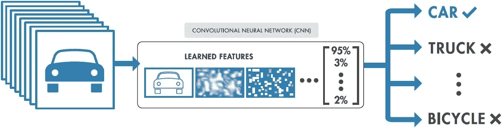

# 使用 Openshift 运行带有 Ceph 桶通知、TensorFlow 和 Flask 的自动化 ML 管道

> 原文：<https://levelup.gitconnected.com/run-an-automated-ml-pipeline-with-ceph-bucket-notifications-tensorflow-and-flask-using-openshift-2ca741c29701>



在当今世界，许多组织都在朝着机器学习的方向发展，因为他们理解快速获得可靠数据的强烈需求。我们被数据驱动的组织所包围，他们在寻找获取知识的最佳方式，以帮助他们做出正确的业务决策。这些组织中的大多数从成千上万的来源收集了大量的数据，但是收集原始数据本身并没有多大价值，除非我们对其进行处理和分析。当一个组织达到拥有大量数据的程度时，尽可能保持分析过程自动化以避免人工干预是非常重要的。为了使用这些自动化管道，我们需要找到合适的解决方案来帮助我们实现业务目标。

举一个简短的例子来说明我们如何创建这样一个自动 ML 管道，我们将使用一些开源解决方案来帮助我们对图像进行分类。图像分类是指计算机视觉中可以根据图像的视觉内容对图像进行分类的过程。例如，一个图像分类算法可以被设计成判断一个图像是否包含人体，另一个算法可以识别给定图像中的物体。虽然检测物体对人类来说是微不足道的，但鲁棒的图像分类仍然是计算机视觉应用中的一个挑战。

演示架构的简短说明:在本演示中，我们将使用 Openshift 容器平台来运行不同的容器化工作负载。在 Opensfhit 中，我们将使用 rook-ceph 作为对象存储，通知 Flask-Tensorflow 服务关于写入 S3 桶的图像。我们将使用 Ceph 桶通知来通知使用特定后缀创建的对象，因此每次 JPG 图像将被上传到 S3 桶时，Ceph 将向我们的 Flask REST API 抛出一个通知。当我们的 REST API 得到通知时，它将从 Ceph 获取 S3 对象并运行分类算法。长话短说，对于上传到我们桶中的每张图片，我们应该得到一个分类输出。

图像已上传(*。JPG) → S3 桶→JPG 图像创建通知→ HTTP 端点→ Flask REST 触发器→图像分类算法→推理结果

# 先决条件

*   Openshift 容器平台(4.3.8 版本)
*   暴露 S3 接口的 Rook-Ceph 集群(octopus 版本)
*   用于配置存储桶通知配置的通知工具(shonpaz123/notify:latest)
*   Flask-Tensorflow 图像分类应用程序(shonpaz 123/image-class ification:最新)

# 装置

我们将首先验证我们的 s3 服务是否按预期工作，为此，我们将公开由 rook-ceph 创建的 S3 服务，这样我们可以将其卷曲，并获得 XML:

```
oc expose svc rook-ceph-rgw-my-store -n rook-ceph oc get route | grep rgw
rook-ceph-rgw-my-store   rook-ceph-rgw-my-store-rook-ceph.apps-crc.testing          rook-ceph-rgw-my-store   http                 None
```

现在让我们转向我们的 S3 服务，看看我们是否得到想要的 XML，表明我们的 S3 服务工作正常:

```
curl [http://rook-ceph-rgw-my-store-rook-ceph.apps-crc.testing](http://rook-ceph-rgw-my-store-rook-ceph.apps-crc.testing)
<?xml version="1.0" encoding="UTF-8"?><ListAllMyBucketsResult ><Owner><ID>anonymous</ID><DisplayName></DisplayName></Owner><Buckets></Buckets></ListAllMyBucketsResult>
```

很好，现在我们已经运行了 S3 服务，让我们使用以下部署示例来运行影像分类应用程序:

```
apiVersion: apps/v1
kind: Deployment
metadata:
  name: image-classifcation 
  labels:
    app: image-classifciation 
spec:
  replicas: 1
  selector:
    matchLabels:
      app: image-classification 
  template:
    metadata:
      labels:
        app: image-classification 
    spec:
      containers:
      - name: image-classification 
        image: shonpaz123/image-classification
        ports:
        - containerPort: 5001
        env: 
        - name: AWS_ACCESS_KEY_ID 
          value: replaceme 
        - name: AWS_SECRET_ACCESS_KEY
          value: replaceme 
        - name: service_point 
          value: replaceme  
---
apiVersion: v1
kind: Service
metadata:
  name: image-classification-service 
spec:
  selector:
    app: image-classification 
  ports:
    - protocol: TCP
      port: 5001
      targetPort: 5001
```

如您所见，部署获得了 S3 凭证和端点 URL，并创建了一个监听 HTTP 请求的服务来开始对上传的图像进行分类。现在让我们运行这个部署:

```
oc create -f image-classification.yaml oc get pods | grep class
image-classification-6d557979cf-slvqf                           1/1     Running     0          2m
```

很好，现在我们已经启动并运行了分类服务，我们将必须创建一个存储桶，以便我们可以创建通知配置:

```
aws s3 mb s3://image-classification --endpoint-url [http://rook-ceph-rgw-my-store-rook-ceph.apps-crc.testing](http://rook-ceph-rgw-my-store-rook-ceph.apps-crc.testing)
```

现在，在我们创建了 S3 存储桶之后，让我们使用 Notify 工具来创建通知配置，该工具将帮助我们创建所需的配置:

```
git clone [https://github.com/shonpaz123/notify.git](https://github.com/shonpaz123/notify.git) && cd notify/openshift
```

在这里，我们将使用所需的变量编辑 notify.env 文件:

```
ACCESS_KEY=                # S3 access key 
SECRET_KEY=                # S3 secret key 
ENDPOINT_URL=              # S3 HTTP url 
BUCKET_NAME=               # Created S3 bucket name 
HTTP_ENDPOINT=             # The HTTP endpoint of our Flask service 
FILTER=                    # example: '{"Key": {"FilterRules": [{"Name": "suffix", "Value": ".jpg"}]}}'
FILTER_TYPE=suffix         # can contain prefix/suffix/regex/metadata/tags
```

在我们插入正确的值之后，我们将使用 Openshift 功能来处理模板输入。要创建作业，需要配置通知配置:

```
oc process -f notify.yaml --param-file notify.env | oc create -f -
```

让我们验证我们的作业是否已完成(作业 pod 名称将由 notify.env 文件中的 FILTER_TYPE 值创建):

```
oc get pods | grep suffixsuffix-qnp5k                                                   0/1     Completed   0          2m
```

现在，在我们设置好所有的基础设施之后，让我们试着上传一张比萨饼图片，看看我们是否会得到该图片的分类。上传的图像:


披萨图片上传到我们的 S3 桶

将图像上传到我们的 S3 桶:

```
aws s3 cp pepperoni-pizza-thinly-sliced-popular-topping-american-style-pizzerias-30402134.jpg s3://image-classification --endpoint-url [http://rook-ceph-rgw-my-store-rook-ceph.apps-crc.testing](http://rook-ceph-rgw-my-store-rook-ceph.apps-crc.testing)
```

现在让我们检查一下 Flask 服务日志，看看是否有结果:

```
oc logs image-classifcation-6d557979cf-slvqf
.
.
.
2020-04-04 19:47:14,020 - {'0.003111549': 'honeycomb', **'0.7704552': 'pizza, pizza pie'**, '0.0039080456': 'hognose snake, puff adder, sand viper', '0.0031275006': 'trifle', '0.0043221256': 'book jacket, dust cover, dust jacket, dust wrapper'}
2020-04-04 19:47:14,021 - 10.128.0.136 - - [04/Apr/2020 19:47:14] "POST / HTTP/1.1" 200 -
```

我们可以看到，我们得到的结果表明，给定的图像有 77%的可能性是一个比萨饼。

# 结论

正如我们所见，使用正确的软件解决方案运行 ML 管道非常容易。使用上述产品，我们可以创建一个自我管理的环境，使用 Openshift 的目标简化与基础设施的交互。有了这些，我们只需点击一个按钮，就可以创建一个智能的自我管理的数据驱动的环境。希望你喜欢这个演示，我们下次再见:)