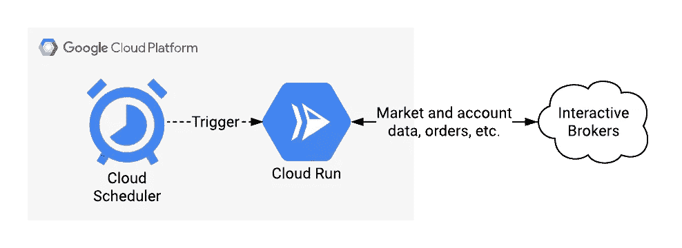
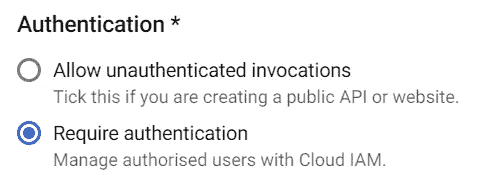
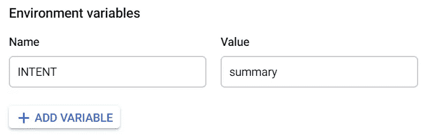
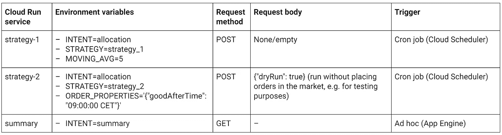
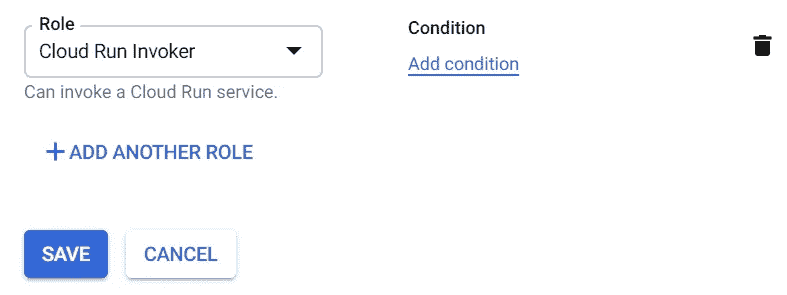
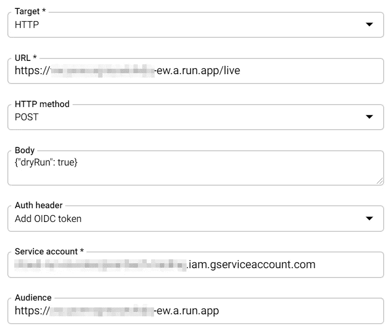
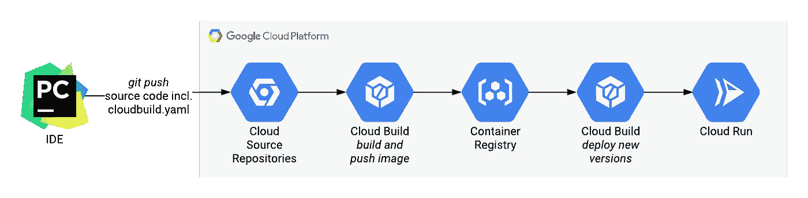
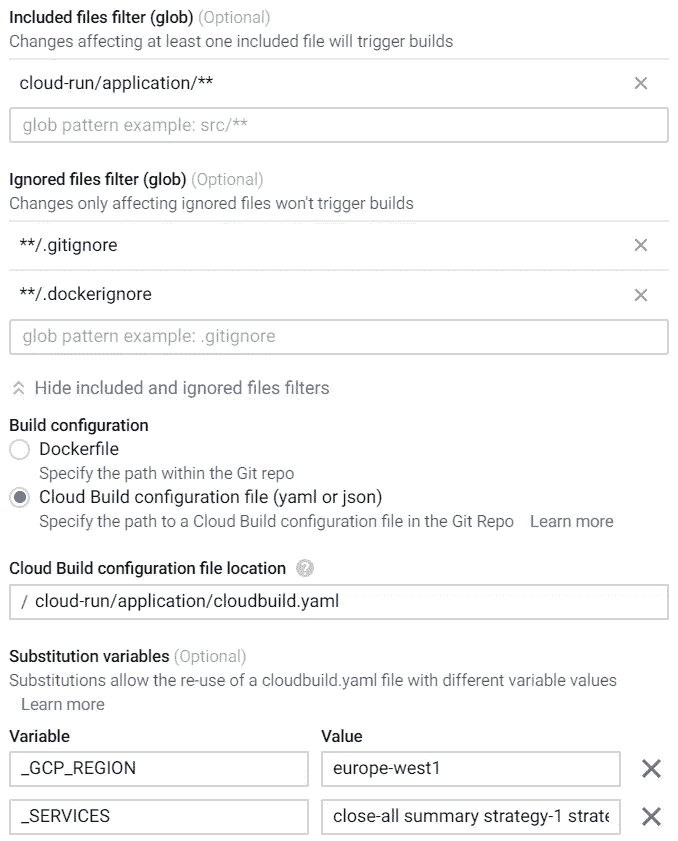
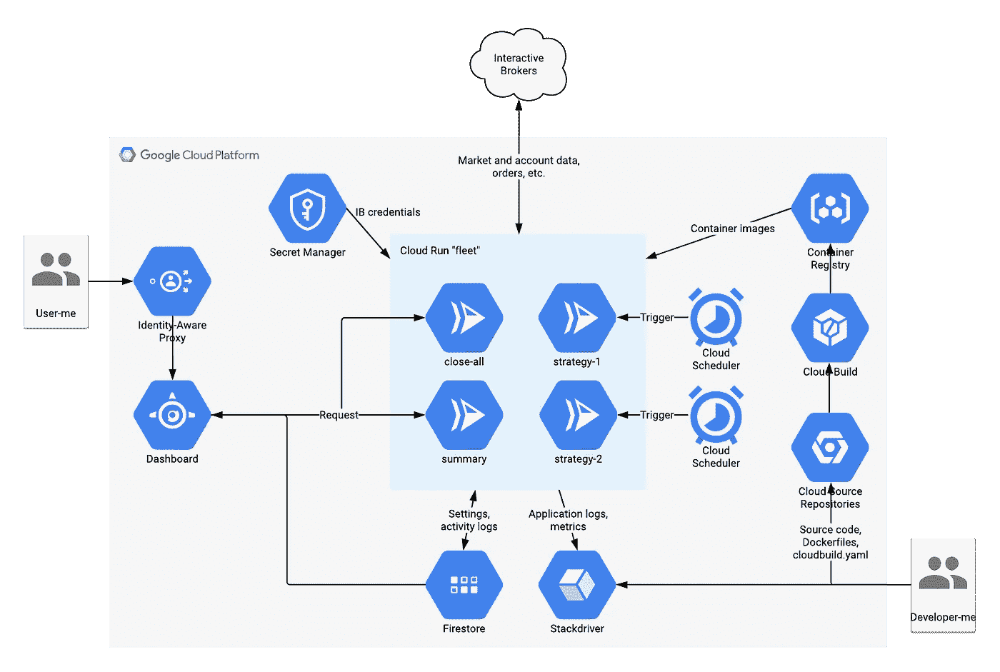

# 快跑，盖特威，快跑！—无服务器方式的算法交易

> 原文：<https://levelup.gitconnected.com/run-gateway-run-algorithmic-trading-the-serverless-way-71634dc1a37>

在我的[上一篇文章](https://medium.com/@juri.sarbach/building-my-own-cloud-based-robo-advisor-5588ec1b74d3)中，我展示了我在谷歌云平台(GCP)上的自动算法交易基础设施的解决方案。最初，我打算将应用程序部署为由 Cloud Scheduler 触发的小块无服务器云功能。我没有采用这种首选方法，而是选择构建一个基于 Kubernetes 的应用程序，因为我必须在计算实例或 Docker 容器中运行 Interactive Brokers (IB)网关软件。因此，无服务器的方式似乎从一开始就注定要失败。

## 运行时间！

然而，在开发 Kubernetes 应用程序时，我意识到这实际上是不正确的。确实有一种方法可以在 Google Cloud 上无服务器地运行容器化的工作负载。该产品被称为[云运行](https://cloud.google.com/run/)，并于最近正式发布(在本文的剩余部分，我指的是[完全托管平台](https://cloud.google.com/run/choosing-a-platform#cloud-run-fully-managed))。云运行允许您部署监听 HTTP 端口的无状态工作负载。该服务自动公开一个惟一的端点(URL ),您可以通过 HTTP 请求来调用它。并且它会自动上下伸缩，如果没有请求，它甚至会变为零。

这方面感觉很像云功能。只是您部署了整个 Docker 映像，而不仅仅是 Python、Node.js 或 Go 函数。这意味着您可以使用任何编程语言或运行任何您喜欢的二进制文件。像 IB 网关这样的二进制文件。因此，让我们将交易应用程序重新设计成无服务器的。

由于 Cloud Run 使用容器，我可以重用我的 Kubernetes 解决方案中的很多内容。然而，正如我们将看到的，云运行工作负载的短暂本质要求对应用程序逻辑进行一些更改。基本思路是把 Kubernetes 上的每一个微服务都变成一个无服务器的云运行服务。为了触发投资策略算法，我使用了[云调度器](https://cloud.google.com/scheduler/)。这是 GCP 的 cron job as a service 产品，并从 Kubernetes 中的 cron job 对象接管了该功能。因此，从高层次的角度来看，这就是新应用程序架构的样子:



简单的计划

让我们一步一步地进行设置。我从核心(应用本身)开始，然后接触云调度器的配置、认证、秘密管理，最后是持续部署。我将只强调代码的一些部分。如果你对更多细节感兴趣，你可以在 GitHub 上找到完整的源代码。

## 铺平道路

与 Kubernetes 解决方案相比，主要的变化来自于这样一个事实，即在 Cloud Run 版本中不再有一直运行的网关。在 Kubernetes 集群中，网关微服务始终处于运行状态，可用于应用程序的其他部分，如分配器或投资策略。虽然应用程序架构在云运行中仍然是请求驱动的，但我们现在必须为每个请求启动网关。因此，我们取消了分离，而是将它与每个服务捆绑在一起。

根据[云运行契约](https://cloud.google.com/run/docs/reference/container-contract#cpu-request)，计算仅限于请求的持续时间。与 Kubernetes 不同，Kubernetes 在 pod 创建期间使用 [IBC](https://github.com/IbcAlpha/IBC) 启动网关，这次我们将对每个请求启动网关，并在返回响应之前停止网关。像这样，它在容器进入挂起状态之前被正确终止。

和之前的 Kubernetes 版本一样，我使用 gunicorn 和 Falcon 作为 web 服务器。它提供入口点并处理 HTTP 请求，调用实际的应用程序，并产生响应:

```
# [main.py](https://github.com/jsarbach/ib-trading/blob/master/cloud-run/application/py/main.py)from datetime import datetime
import falcon
import json
import logging class Main: **def on_get**(self, request, response, trading_mode):
        self._on_request(request, response, trading_mode) **def on_post**(self, request, response, trading_mode):
        body = json.load(request.stream)\
           if request.content_length else {}
        self._on_request(request, response, trading_mode, **body) @staticmethod
    def _on_request(_, response, trading_mode, **body):
        if trading_mode in ['live', 'paper']:
            try:
                [start and connect to IB gateway...] [run application logic...] [disconnect from and terminate gateway...]
            except Exception as e:
                error_str = '{}: {}'.format(e.__class__.__name__, e)
                logging.error(error_str)
                retval = {'error': error_str}
                response.status = falcon.HTTP_500
        else:
            logging.warning('Trading mode unset or invalid')
            retval = {}
            response.status = falcon.HTTP_200 retval['utcTimestamp'] = datetime.utcnow().isoformat()
        response.content_type = falcon.MEDIA_JSON
        **response.body = json.dumps(retval)****api = falcon.API()
api.add_route('/{trading_mode}', Main())**
```

因此，一个先决条件是我们可以从应用程序内部控制网关，在我的例子中，应用程序是用 Python 编写的。幸运的是， [IB-insync](https://github.com/erdewit/ib_insync) 再次帮了大忙:通过它的 [IBC 类](https://ib-insync.readthedocs.io/api.html#ibc)，命令 IBC 启动和终止网关只需要一个函数调用。

为了进一步简化，我编写了一个继承自 IB-insync 的 IB 类的类，并添加了必要的 IBC 类功能。特别是，我将启动网关和连接到网关打包到一个方法中。它每秒尝试连接网关一次，直到连接成功或超时。启动网关通常需要大约 20 到 25 秒。

```
# [ibgw.py](https://github.com/jsarbach/ib-trading/blob/master/cloud-run/application/py/lib/ibgw.py)from ib_insync import IB, IBC
import logging class IBGW(IB): def __init__(self,
                 ibc_config,
                 ib_config={},
                 connection_timeout=60):
        self.ibc_config = ibc_config
        self.ib_config = {
            'host': '127.0.0.1',
            'port': 4001,
            'clientId': 1,
            **ib_config
        }
        self.connection_timeout = connection_timeout **self.ibc = IBC(**self.ibc_config)** super().__init__() def start_and_connect(self):
        logging.info('Starting IBC...')
        **self.ibc.start()** wait = self.connection_timeout try:
            while not self.isConnected():  
                # retry until connection is established or timeout
                # is reached
                IB.sleep(1)
                wait -= 1
                logging.info('Connecting to IB gateway...')
                try:
                    **self.connect(**self.ib_config)** except ConnectionRefusedError:
                    if not wait:
                        logging.warning('Timeout reached')
                        raise TimeoutError(
                            'Could not connect to IB gateway')
        except Exception as e:
            logging.error(e)
            raise e def stop_and_terminate(self, wait=0):
        [...]
```

准备好 web 服务器和网关后，我们就可以转向应用程序本身了。

## 一个图像来统治他们

交易应用程序有几个组件，运行投资策略是最明显的一个。但我也有一些辅助服务，比如显示未平仓头寸和账户摘要的*汇总*服务，或者是关闭所有未平仓头寸的*汇总*服务。这两者都是从我的部署在 App Engine 上的仪表板上临时触发的，App Engine 已经是 Kubernetes 解决方案的一部分。

虽然这些组件都有自己的云运行服务，可以单独触发，但应用程序 Docker 映像本身对于所有服务都是相同的。无论我是调用摘要服务还是某个策略服务，始终是由云运行启动的那一个应用映像。运行时实际执行的内容由环境变量控制，尤其是由意图变量控制。意图是定义请求将在容器内采用什么路由的开关。环境变量将由云运行服务注入，因此我们确实只需要一个 [Dockerfile](https://github.com/jsarbach/ib-trading/blob/master/cloud-run/application/Dockerfile) 和一个 Docker image 用于所有服务。

多亏了 Python 的`import_module()`功能，我们可以根据自己的意图动态导入自己需要的东西。例如，如果 INTENT 设置为“summary ”,则首先导入模块`intents.summary`,然后调用`summary.main()`。

```
# [main.py](https://github.com/jsarbach/ib-trading/blob/master/cloud-run/application/py/main.py)import falcon
from importlib import import_module
import json
from os import environ **INTENT = environ.get('INTENT')**[...]**intent = import_module('intents.' + INTENT)**[...] class Main: [...] @staticmethod
    def _on_request(_, response, trading_mode, **body):
        [...] ib_gw.start_and_connect()
        retval = **intent.main**(ib_gw, trading_mode, **body)response.status = falcon.HTTP_200 [...] response.content_type = falcon.MEDIA_JSON
        response.body = json.dumps(retval)
```

summary.py 中的`main()`函数现在执行实际工作并产生响应。

```
# [summary.py](https://github.com/jsarbach/ib-trading/blob/master/cloud-run/application/py/intents/summary.py)def main(ib_gw, trading_mode):
    [get account summary information…] response = {…} return response
```

将整个交易应用程序和网关打包到一个图像中，比为每个目的创建图像更容易维护。

## 准备运行

既然已经准备好部署映像，让我们创建云运行服务。首先，选择应用图像和 [GCP 地区](https://cloud.google.com/run/docs/locations)。接下来，激活认证，因为你可能不希望全世界都访问你的服务。请记住，托管平台上的云运行服务会获得一个可公开访问的 URL。如果需要身份验证，则只接受授权头中包含有效令牌的请求。



你不得通过(除非得到授权)

我选择以下非默认*修订*设置:

*   内存分配:在内存使用方面，IB 网关可能有点贪婪，所以为了安全起见，我很大方地给了它 2 GB 的内存。
*   每个容器的最大请求数:由于网关不允许同一个用户 ID 有多个并发会话，我通过将这个值改为 1 来防止并发。
*   服务帐户:预设是计算引擎的默认服务帐户，具有项目编辑器的角色。这是相当广泛的。因此，我为我的云运行服务创建了一个指定的服务帐户，并只赋予它真正需要的角色。这是一种很好的做法，并且遵循最小特权原则。
*   最大实例数:出于与上面相同的原因(不允许并发)，我不想要多个实例，因此，我再次将其设置为 1。
*   环境变量:设置意图和应用程序需要的任何其他变量。



没有意图就没有服务

以下是一些云运行服务的示例:



## 设置时钟

如果说 Cloud Run 是交易应用的心脏，那么 Cloud Scheduler 就是心脏起搏器。它触发云运行服务，根据预定义的时间表执行自动化投资，在我的例子中是每天一次。配置非常简单:用 cron job notation 定义频率，选择 HTTP 作为目标，并指定请求(云运行服务 URL、GET/POST 方法、请求体)。

唯一稍微高级的部分是认证。因为我们只允许对我们的云运行服务的认证请求，所以我们必须确保云调度器在触发服务时在授权头中添加一个可接受的 ID 令牌。我创建了一个新的服务帐户，并为其分配了*云运行调用者*角色。现在可以用它来认证所有调用我的云运行服务的东西，比如云调度器或应用引擎。



在 IAM 中创建服务帐户

创建调度程序作业时，选择*添加 OIDC 令牌*作为授权头，然后输入您刚刚创建的服务帐户以及受众(云运行服务 URL)。完成了。



带身份验证的云调度程序配置

## 我的特勤局

我特别喜欢 Kubernetes 的一点是你可以[管理秘密的方式](https://kubernetes.io/docs/concepts/configuration/secret/)。幸运的是，这在谷歌云平台上有一个等价的服务: [Secret Manager](https://cloud.google.com/secret-manager) (目前处于测试阶段)。这是一个存储敏感数据的地方，比如我的 IB 证书。我将用户 ID 和密码都存储在 Secret Manager 中，并在运行时启动 IB 网关之前检索它们的最新版本:

```
# [main.py](https://github.com/jsarbach/ib-trading/blob/master/cloud-run/application/py/main.py)from base64 import b64decode
from googleapiclient.discovery import build SECRET_RESOURCE = 'projects/[PROJECT_ID]/secrets/ib-credentials_{}_{}/versions/latest' **def get_secret**(trading_mode, name):
    [...] **response = secret_service.projects().secrets().versions()\
        .access(name=SECRET_RESOURCE.format(
            trading_mode, name)).execute()** [...] **return b64decode(response['payload']['data']).decode()** # build Secret Manager service
**secret_service = build('secretmanager',
                       'v1beta1',
                        cache_discovery=False)**[...]ib_credentials = {
    secret: **get_secret(trading_mode, secret)**
    for secret in ['userid', 'password']
}
config = {
    **ibc_config,
    'tradingMode': trading_mode,
    **ib_credentials
}
logging.info({**config, 'password': 'xxx'})ib_gw = IBGW(config)
```

请注意，您的云运行服务帐户需要*Secret Manager Secret Accessor*角色才能检索凭证。

使用 Secret Manager 的优点是凭证的存储和管理与应用程序本身是分离的。密码不是添加到容器映像中，而是保存在一个集中的保险库中。这不仅方便了密码轮换，而且还让您不必寻找如何安全地存储凭证并向容器添加凭证的巧妙方法。这在自动化部署时特别有用。

## 构建、部署、重复

部署应用程序的更新需要构建新的应用程序映像，将其推送到容器存储库，并更新所有云运行服务以使用新映像。幸运的是，这可以通过[云构建](https://cloud.google.com/cloud-build)实现自动化，这使得整个部署过程更加方便，同时也不容易出错。



云构建的自动化部署渠道

为此，将一个包含三个构建步骤的 [cloudbuild.yaml](https://github.com/jsarbach/ib-trading/blob/master/cloud-run/application/cloudbuild.yaml) 文件添加到您的代码库中:构建映像，将映像推送到容器注册表，并使用新映像更新云运行服务:

```
images:
- "eu.gcr.io/${PROJECT_ID}/cloud-run/application"
steps:
- name: "gcr.io/cloud-builders/docker"
  args: ["build", "-t", "eu.gcr.io/${PROJECT_ID}/cloud-run/application:${SHORT_SHA}", "cloud-run/application/"]
- name: "gcr.io/cloud-builders/docker"
  args: ["push", "eu.gcr.io/${PROJECT_ID}/cloud-run/application:${SHORT_SHA}"]
- name: "gcr.io/cloud-builders/gcloud-slim"
  entrypoint: "bash"
  args:
  - "-c"
  - |
    services=(${_SERVICES})
    for service in "${services[@]}"
    do
      gcloud run deploy ${service}-dev --image eu.gcr.io/${PROJECT_ID}/cloud-run/application:${SHORT_SHA} --region ${_GCP_REGION} --platform managed
    done
```

用 git commit hash ( `${SHORT_SHA}`)标记图像的好处是，您总是可以很容易地追溯其中的内容。

接下来，创建一个构建触发器，它将执行 yaml 文件中定义的构建步骤:



云构建触发器配置

请注意，我添加了两个替代变量，GCP 地区和服务。当执行构建时，它们将在 cloudbuild.yaml 中被替换为它们的值。像这样，我们不必硬编码 GCP 地区或云运行服务的名称。

参见[文档](https://cloud.google.com/run/docs/continuous-deployment-with-cloud-build)了解更多关于如何配置持续部署管道的细节，尤其是对于 IAM 设置。特别是，记住授予您的云构建服务帐户*云运行管理*角色，并将其作为具有*服务帐户用户*角色的成员添加到运行时服务帐户。

当然，您可以创建多个构建触发器来支持不同的发布阶段。例如，您可以创建一个与部署测试版本的开发分支相关联的，另一个与部署到生产的主分支相关联的。

我上面的管道部署到测试阶段，因此在服务名后面加上了`-dev`后缀。每当我认为一个映像足够稳定，可以在生产中使用时，我会手动将其标记为“稳定”,并运行一个 [bash 脚本](https://github.com/jsarbach/ib-trading/blob/master/cloud-run/application/deploy-to-production.sh),该脚本基本上执行最后一个构建步骤，即在所有服务上循环，以使用`application:stable`映像部署生产服务的新版本。

## 被宠坏的选择

就是这样！下面是完整的架构总结:



这就是我喜欢的方式:完全无服务器

与[的 Kubernetes](https://medium.com/@juri.sarbach/building-my-own-cloud-based-robo-advisor-5588ec1b74d3) 建筑相比，它看起来有些相同但又不同。当然，关键的区别是应用程序核心的无服务器性。然而，大部分环境保持不变。特别是，我使用相同的 Firestore 数据库来存储设置和记录应用程序活动，它是在 App Engine 上运行的相同的仪表板应用程序，现在直接向云运行发出经过身份验证的请求，而不是使用无服务器 VPC 访问来连接到 Kubernetes 集群。

那么，您应该选择 Kubernetes 还是 Cloud Run 实现呢？看你的要求了，真的。需要考虑的事项:

*   交易频率:你的交易频率越高，IB 网关持续运行就越有价值。然而，如果你的策略一天只交易一两次，甚至更少，云运行方式可能就足够了。
*   **并发性:**您是否运行需要同时访问网关的多个策略和分配器？那么您必须选择 Kubernetes 实现。由于每个 IB 帐户只能有一个打开的会话，因此在 Cloud Run 中同时运行多个网关实例是不可能的。
*   **延迟:**如前所述，启动网关需要 20 到 25 秒。如果你的交易策略需要对市场的实时观察，这当然是不能接受的。在这种情况下，您应该选择基于 Kubernetes 的解决方案。
*   **成本:**如果你对成本很敏感，那么[云运行](https://cloud.google.com/run/pricing#cloudrun-pricing)实施更有吸引力，因为基础设施在不使用时会缩减到零，不需要任何成本。

在我的案例中，云运行实现显然是一条正确的道路。我目前运行两种每日策略，即我每周需要 10 次网关，每次大约一分钟。因此，让群集全天候运行毫无意义。延迟不是问题，因为我依赖收盘价。此外，我的 GCP 账单内爆了大约三个数量级，从每月 70 美元到几乎为零。抱歉谷歌。；-)

